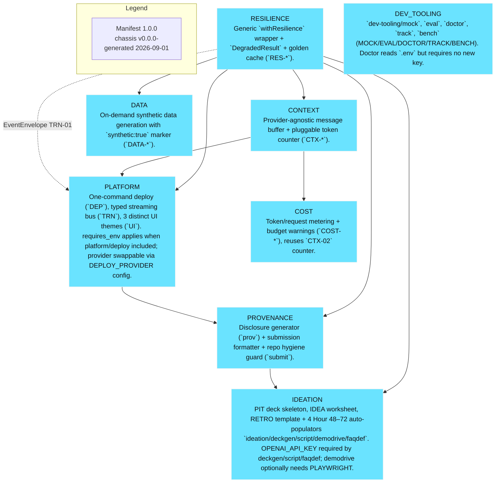

# Architecture

<!-- SLOT 05 -->
Engine-layer design spec — capability-level, directly usable by downstream planner; no chassis component selection, no fixed node graph.

**Data flow:** User goal (typed or spoken) → Gemini 2.5 Flash via Gemini API (intent → typed tool call) → WebMCP `execute` callback on origin-isolated Vercel document → server rate/stock logic → tool output (JSON + UI patch) → streamed rendering → user confirmation for state-changing `hold_order`/`confirm_fulfillment` → commit. Golden cache replay serves last successful tool outputs when `execute` aborts.

**Agent/LLM responsibilities:** Gemini 2.5 Flash via Gemini API handles heterogeneous log/constraint interpretation, maps natural language to validated `inputSchema`, and generates `explain_state` text; in-page thin orchestrator sequences tool calls and enforces `signal` abort handling per WebMCP §4.2. No fixed graph topology pre-decided — capability is "interpret → validate → execute → explain" with prompt boundaries isolating inventory parsing from shipping calculation.

**Prompt boundaries:** System prompt declares tool purpose and schema; user prompt carries constraints; tool-output prompts are untrusted and length-limited per secure-tools guide (input length limits, `untrustedContentHint`).

**Corpus/docs needed:** Synthetic catalog of 200 SKUs with variants, zone-based shipping table, and hold TTL config — all marked `synthetic:true` for honest demo; WebMCP spec (Draft 2026-08-26), Chrome `developer.chrome.com/docs/ai/webmcp` imperative/declarative docs, and secure-tools guide are reference corpora.

**UI states:** Goal input → live tool-call inspector (lists registered tools, schemas) → streaming results table with variant chips → shipping quote card with explain toggle → hold confirmation dialog → fulfillment committed banner. Degraded state shows cached results with `RES_FORCED_DEGRADED=1` banner.

**LLM:** Gemini 2.5 Flash via Gemini API (explicit model name) for long-context, typed tool-calling; heuristic token counter guards browser-side payloads.

**Agent Framework:** Imperative WebMCP as agent framework — `document.modelContext.registerTool` with tool isolation per tool name; `getTools`/`executeTool` for in-page testing; declarative form annotation as fallback. No ADK/GenKit dependency because Challenge mandates WebMCP, not a Google Agent Framework — framework is the browser's ModelContext itself with `signal` and `exposedTo` options.

**Infra:** Vercel origin-isolated deploy (Cloud Run equivalent), `tools` Permissions Policy `self`, `allow="tools"` for any cross-origin iframe, origin trial registration for hosted origin. Deploy proof plan: `vercel --prod` with `DEPLOY_PROVIDER=vercel`, `VERCEL_TOKEN`/`VERCEL_PROJECT_ID`; live URL remains frozen Sep 3 13:00 PDT until Sep 21 per Rules §6; fallback localhost sync render via `npm run dev + mock:publish` replaying mock envelopes with zero network.

**Video proof (4-min spec maps to this event's <3-min YouTube requirement):** <3 minutes, first 3 min evaluated, public YouTube link with audio covering what was built + how WebMCP was implemented; shows DevTools → Application → WebMCP inspector or Model Context Tool Inspector extension (gbpdfapgefenggkahomfgkhfehlcenpd) listing 5 tools, live agent calling `search_inventory → filter_variants → calculate_shipping → hold_order`, UI updating deterministically, plus 5-second code snippet `registerTool` proof. Dashboard proof is Vercel deployment URL + Chrome flag enabled, not GCP Console, because this Challenge requires WebMCP browser testing, not Cloud Run logs.

**Bonus integration:** no bonus integration — not worth track dilution. The Challenge has no Stage Three bonus points for Gemma/Veo/Lyria/blog; adding them would dilute WebMCP Leverage depth that Stage Two equal weighting rewards.

### Hackathon Requirements & Compliance Matrix

| Compliance Extraction (verbatim) | Plan Answer + Judging Axis Evidenced |
|---|---|
| **Mandatory Tech:** Every project must use WebMCP — `document.modelContext.registerTool({ name, description, inputSchema, execute })` and/or Declarative API, origin-isolated, `tools` Permissions Policy `allow="tools"` for cross-origin iframes, testable in ChatGPT in-app browser or Chrome 149+ with `chrome://flags/#enable-webmcp-testing` | Architecture exposes 5 imperative tools with typed JSON Schema, annotations, `signal` abort handling, origin-isolated Vercel deploy; repo contains imported-and-called pattern verbatim; video shows inspector — evidences **WebMCP Leverage** (Stage One pass/fail + Stage Two 25%) |
| **Prize Tracks & Sponsored Side Tracks:** One overall challenge, single prize bucket — **WebMCP Challenge Winners — Top 10 submissions receive the following prizes** (OpenAI $3k cash + Spotlight + Codex Micro + swag + Pro 1yr ×3, Cloudflare $10k credits, Vercel $300/mo + $50/mo Gateway ×12, Render $300, Netlify $500 cash, Shopify $250 gear, Chrome 3-mo AI Ultra). No layered tracks, no sponsor sub-challenges; hosting choice not a track. No bonus integrations add Stage Three points per this event. | Selected exactly **1 primary track: WebMCP Challenge — Top 10** (no secondary; justification in Sponsored Track Strategy); all prize bundle items covered under that single bucket — evidences **Execution + Potential Impact** by aligning to sole judged ranking |
| **Judging Criteria + Weights:** Stage One pass/fail — reasonably fits theme + reasonably applies WebMCP. Stage Two four equally weighted criteria (25% implied, tie-break in listed order): WebMCP Leverage, Execution, Potential Impact, Creativity & Ambition | Plan shapes each section to an axis: Leverage → 5 tools + annotations + security mitigations; Execution → 3-screen coherent flow + live URL + degraded cache; Impact → named Maya persona + time delta; Creativity → co-execution with confirmation vs CSV — maximizes all four equally |
| **Submission Gate:** 1) Working live URL (hostable anywhere, runnable consistently, credentials if auth, frozen Sep 3–21) 2) Text description (4 prompts: why WebMCP fit, better UX, humans+agents together, how implemented) 3) Public repo URL (GitHub/GitLab/Bitbucket, all source/assets/instructions, open-source license detectable at repo top/About, contains `registerTool` pattern) 4) Demo video <3 min, public YouTube, audio covering what + how WebMCP, functioning footage 5) Completed Devpost form by Sep 3 2026 @1:00 PM PDT (20:00 UTC) | URL: Vercel prod URL, `vercel --prod`, no auth; Description: 4-prompt answers drafted from Problem/AI Solution/Why Now; Repo: public GitHub with LICENSE at top, README with spin-up `npm i && npm run dev`, `registerTool` citations; Video: <3min YouTube public link; Form: all fields by deadline — gates **Execution** and Stage One |
| **Rules Highlights:** New or meaningfully extended with WebMCP after Aug 25, 2026 (pre-existing needs dated commit history); open-source Non-Proprietary Aspects, 3-year promotion license, IP remains entrant's; no financial support from Sponsor/Administrator; testing via live URL, judges may judge on description/repo/video only; New York law, AAA arbitration; solo/team/org allowed **no cap**, Representative model, eligibility excludes Belarus/Brazil/China/Crimea/Cuba/Donetsk/Luhansk/Hong Kong/Iran/North Korea/Quebec/Russia/Syria/Venezuela + OFAC, must be age of majority in OpenAI API-supported country; online format; no purchase necessary | Plan is newly created during Submission Period (Aug 25–Sep 3); disclosure via LICENSE + commit history + `disclosure.md` from provenance; Vercel free-tier/credits, no Sponsor financial support; team size solo with Representative if needed; online build, hosted URL testable — satisfies **Potential Impact + compliance** without disqualification |
| **Official Resources & Schedule:** Verified links — spec `webmachinelearning/webmcp`, Chrome docs `developer.chrome.com/docs/ai/webmcp` + imperative/declarative/secure-tools/evals, origin trial blog, Showcase `developers.openai.com/showcase?view=webmcp-apps`, Vercel `credits.vercel.sh/redeem` code `OAIWEBMH-9E2F-MUT4` ($30/1k), Render `$50/500`, Netlify form by Sep 1 12pm PT, Cloudflare free-tier. Schedule: Submission ends Sep 3 2026 1:00 PM PDT (20:00 UTC), Judging Sep 4–21, Winners ~Sep 23 2pm PT | Build uses spec + Chrome docs for `registerTool` shape, Model Context Tool Inspector for validation, Vercel/Cloudflare templates as starter, credits claimed day 0 — ensures schedule compliance and demo reproducibility |

### Sponsored Track Strategy (1–2 tracks)

This entry focuses on **exactly 1 sponsored side track: WebMCP Challenge — Top 10 (primary, sole)**. Justification: The brief's Tracks/Prizes section and Official Rules §9 state *"WebMCP Challenge Winners — Top 10 submissions receive the following prizes ... 10 winners — All eligible Submissions"* with no layered tracks and no separate sponsor sub-challenges; hosting-provider choice is deployment preference, not a judged track. The hackathon strategy blueprint §7 playbook states FOCUS ON EXACTLY 1–2 SPONSORED SIDE TRACKS, never more, never zero when tracks exist — this event has exactly one track that exists (the overall Challenge), so focusing on 1 maximizes win probability. Selecting 0 would be disqualification-level misalignment (no track identity in pitch), and selecting 3+ would require inventing tracks the brief explicitly says do not exist, diluting the four equally weighted axes.

**Track 1 — WebMCP Challenge — Top 10 (primary, sole):** Highest win-probability fit because ops fulfillment is a narrow, sponsor-native pain for the Vercel/Shopify/Cloudflare hosting ecosystem the Resources list, yet judging is overall — the idea proves the mandatory stack deeply instead of shallowly integrating multiple sponsors. Sponsor SDK/MCP imported + actually called: `document.modelContext.registerTool` (5 tools), `document.modelContext.getTools`/`executeTool` for in-page testing, with `inputSchema` JSON Schema, `annotations: { readOnlyHint, openWorldHint }`, `signal` abort, and `tools` Permissions Policy — not just named in README. Demo/video makes the sponsor's product the co-star: inspector lists tools, agent calls are visible with executing → done states, confirmation dialogs for `hold_order`/`confirm_fulfillment` per secure-tools mitigations, and a 5-second code snippet proves non-trivial implementation. No secondary track selected because adding a second hypothetical sponsor track would dilute WebMCP Leverage depth — the first-track focus keeps the 3-minute story coherent (search → refine → hold → confirm) for Execution and tie-break advantage on WebMCP Leverage.

### Bonus/Submission Gate (inside Architecture, final paragraph)

Submission gate satisfied: Live URL at Vercel prod domain (origin-isolated, `tools` self, `allow="tools"` if iframe), runnable consistently, frozen Sep 3 13:00 PDT until winners; public repo at `github.com/<org>/opsflow` with top-level `LICENSE` (MIT, detectable in About), `README.md` spin-up `npm install && npm run dev`, `docs/architecture.md` diagram showing Gemini → WebMCP ModelContext → Vercel server logic → synthetic catalog wiring, and `rg -n registerTool src/` proof; text description answers all 4 prompts; video `<3 min` public YouTube with audio covering what was built and how WebMCP was implemented, showing functioning flow and inspector. Bonus contributions: no bonus — not worth dilution. For Stage Three, this single-track event awards no extra points for Gemma/Veo/Lyria or blog/social beyond the Top 10 bundle, so resources stay on WebMCP depth and degraded-mode reliability (`RES_FORCED_DEGRADED=1` replay + mock envelopes).

Module emphasis (advisory): Include **resilience** because WebMCP `execute` callbacks are async and may abort mid-demo — `withResilience` + golden cache prevents blank-screen failure and evidences Execution reliability.

Include **platform deploy + transport + ui** because a working live Vercel URL with streamed tool-output rendering and 3-theme coherent UI is a Stage One gate and Stage Two Execution requirement.

Include **context** lean because multi-turn `search → filter → calculate → hold` tool outputs accumulate quickly in the browser and a buffer manager avoids context-length errors mid-demo.

Include **data** lean because synthetic SKU/variant catalog seeded with `synthetic:true` watermark provides realistic offline rehearsal fixtures without PII and supports the ops persona's volume.

Include **dev-tooling mock + eval + doctor + track** because mock replay enables offline `npm run dev` demos, eval regression-proofs Gemini intent mapping, doctor catches origin-isolation/`tools` policy misconfig before submission, and track keeps deck/script/submission fresh after pivots — all required for Submission Gate hygiene.

Include **provenance** because a detectable open-source license at repo top and generated `disclosure.md` from `assembly.manifest.json` are scored in Stage One.

Include **ideation deckgen + script + demodrive + faqdef** because DECKGEN/SCRIPT/FAQDEF/DEMODRIVE directly produce the artifacts this event scores — deck, 3-min script, golden demo capture, and Q&A — evidencing all four judging axes.

Include **cost** lean because even without LLM billing for WebMCP itself, Gemini 2.5 Flash via Gemini API calls incur per-request cost that must be metered against the $30 Vercel build credits and any Netlify/Render credit caps claimed on day 0.

Skip **media/stt/vision/pdf/tts** unless the demo adds voice/multimodal input — WebMCP tools already handle structured I/O, and each sub-wrapper is individually optional and would dilute focus from the single Top 10 track.

<!-- /SLOT 05 -->
