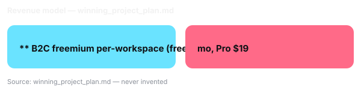

# Business Value

<!-- SLOT 06 -->
## Business Value

- Specific user: ** Freelance Operations Coordinator for a 20–40 orders/day Shopify store — solo operators and 2–3 person studios who cannot afford a WMS.
- TAM: ** estimate — validate via IDEA-03 gallery scan — narrow TAM is credible if co-task is specific and demonstrably improved; anchor to Shopify's 2M+ daily active merchants and ops-tooling vertical rather than inventing a dollar figure.
- Revenue model: ** B2C freemium per-workspace (free 50 holds/mo, Pro $19/mo unlimited + shipping rules) and B2B infrastructure wedge: agent-native fulfillment as distribution moat — stores with WebMCP convert higher and cut support tickets — licensed per-seat to small 3PLs.
- Why AI: ** Needs **Gemini 2.5 Flash via Gemini API + WebMCP `registerTool` with typed `inputSchema`** to parse heterogeneous constraints ("low-stock blue variants under $12 to zone 4, hold 15 min") and map to deterministic tool calls with validation; a form+DB without AI cannot interpret intent nor keep constraint context across searches, reverting to brittle scraping with hallucinated selectors.

<!-- /SLOT 06 -->
