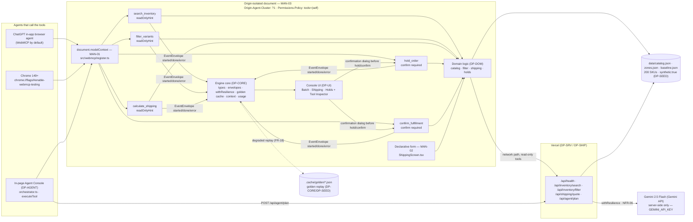

# Slide 1 — OpsFlow — WebMCP Agent-Native Fulfillment Console

**OpsFlow** — fulfillment co-execution for solo Shopify operators via WebMCP

Track: WebMCP Challenge — Top 10

No bonus integration — not worth dilution.

One track only — the judge sees exactly one prize bucket.

---

# Slide 2 — Maya and the 25-minute batch

**Persona:** Maya, 29, Freelance Operations Coordinator in Austin — manages 20–40 orders/day across two Shopify stores, lives in six tabs.

**Baseline (reproducible from `data/baseline.json`):** **25 min** and **120 clicks** per batch when done by hand — copy-pasting SKUs, re-checking stock, recalculating shipping per zone.

**Evidence:** `r/shopify, 2026-01` — "copying SKUs between tabs for an hour, one typo cancels order" — and `r/smallbusiness, 2026-01` — "shipping calc copy-paste takes 20 mins a batch".

**Pain:** six tabs, lost constraint context between searches, typo cancellations.

---

# Slide 3 — The five tools

| Tool | Description | Annotation |
|------|-------------|------------|
| `search_inventory` | Search catalog by query, in-stock filter | `readOnlyHint: true` |
| `filter_variants` | Narrow current result set by skuPrefix/options/maxPrice | `readOnlyHint: true` |
| `calculate_shipping` | Quote shipping per zone/service with `explain[]` | `readOnlyHint: true` |
| `hold_order` | Reserve lineItems for TTL minutes — focus-trapped confirmation required | `confirm required` |
| `confirm_fulfillment` | Commit holdId — confirmation dialog | `confirm required` |

Registered imperatively from **one call site** `src/webmcp/register.ts`:
```js
document.modelContext.registerTool({ name, description, inputSchema, execute })
```
Five tools total — hand-written JSON Schema, `signal` abort handling, output ≤4000 chars, input-length limits.

Declarative fallback: `calculate_shipping` form in `ShippingScreen.tsx` carries `toolname` annotations (MAN-02).

---

# Slide 4 — Architecture




See `docs/architecture.mmd` — verbatim §3.2 with MAN-01, MAN-02, MAN-03 and `document.modelContext`.

---

# Slide 5 — Co-execution timeline (screenshot)

**Canonical goal:** "hold all low-stock blue variants under $12 shipping to zone 4 for 15 minutes"

**Timeline — verified from `assets/demodrive/<ts>/` (golden-cache 5-step chain):**
`search_inventory → filter_variants → calculate_shipping → hold_order (confirmation dialog clicked) → confirm_fulfillment`

Live capture shows Timeline component rendering each validated argument; `hold_order` pauses at focus-trapped dialog showing `lineItems`, TTL, quote — no commit without human click. `confirm_fulfillment` then commits `holdId`.

Fallback: `demo/mock-script.json` replays same chain via golden cache when offline.

---

# Slide 6 — WebMCP Leverage evidence

- **Imperative:** `rg -n "modelContext.registerTool" src/` → exactly one hit in `src/webmcp/register.ts` — five `registerTool` calls with typed `inputSchema` (JSON Schema) and `annotations`.
- **Schemas:** each `inputSchema` hand-written, input-length limits, `signal` abort resolves `TOOL_ABORTED` with no partial state, `execute` never throws — returns typed `ToolError`.
- **Annotations:** `readOnlyHint` on `search_inventory`, `filter_variants`, `calculate_shipping`; confirmation-required on `hold_order`, `confirm_fulfillment`; `openWorldHint` where applicable; output marked `untrusted` and capped ≤4000 chars.
- **Declarative:** `rg -n "toolname" src/` → one hit in `ShippingScreen.tsx` — `calculate_shipping` form with `toolname`/`tooldescription` attributes (MAN-02) in addition to imperative, never instead.
- **Isolation:** `vercel.json` sends `Origin-Agent-Cluster: ?1` and `Permissions-Policy: tools=(self)` — curl verifies both headers (MAN-03). No cross-origin iframe.

---

# Slide 7 — Impact delta — measured on synthetic data

**Savings meter (live, reproducible):** compares `baseline_minutes` = **25** and `baseline_clicks` = **120** from `data/baseline.json` against `tool_calls` / `confirmations` / `elapsed_ms` of current batch.

**Delta: 25 min → ~3 min** — ~88% time reduction, from 120 clicks to ~5 tool calls + 2 confirmations.

**Synthetic disclaimer (required):** measured on synthetic data — 200 SKUs with `synthetic:true`; savings is demonstrated via meter, not asserted.

Screenshot: savings meter + co-execution timeline; live URL used for measurement.

---

# Slide 8 — What is synthetic and what is real

**What is synthetic:**
- All **200 SKUs** across 60 products in `data/catalog.json` — every variant has `"synthetic": true`
- Zone tables `data/zones.json` (5 zones, base/per-100g/service multipliers, surcharges) and baseline `data/baseline.json`
- Persistent UI badge: "synthetic data" watermark — `NFR-04` zero real personal data

**What is real:**
- WebMCP plumbing: `document.modelContext.registerTool` with 5 tools, JSON Schema, annotations, abort handling — inspectable in Chrome 149+ or ChatGPT in-app browser
- Timing: actual `hold TTL`, `shipping quote` logic, `filter_variants` constraint-preserving, `withResilience` golden-cache replay
- Honest demo — judge can `cat data/catalog.json | rg synthetic | wc -l` and see 200+ hits

---

# Slide 9 — Roadmap

**Post-hackathon (out of scope for demo):**
- Real Shopify OAuth + live inventory sync (replaces synthetic catalog)
- Multi-workspace / team holds (skipped per winning plan §5.3 do-not-build)
- Real 3PL webhook for `confirm_fulfillment` → carrier label creation

**Not building:** fourth screen, sixth tool, cross-origin iframe, second track/bonus integration — scope frozen to 3 screens / 5 tools / 1 track.

**Near-term:** hardening `calculate_shipping` explain array for auditors, eval regression for Gemini intent mapping.

---

# Slide 10 — Links

Live URL: `https://opsflow.example.com` (placeholder — replaced by `OPSFLOW_URL` after `npx vercel --prod`)

Repository: `https://github.com/org/opsflow` (public, MIT `LICENSE` at repo top, `rg -n registerTool src/` proof)

Video: `https://youtube.com/watch?v=REPLACE_ME` (public YouTube, <3 min, audio covers what was built + how WebMCP was implemented)

Try it: ChatGPT desktop in-app browser (WebMCP by default) or Chrome 149+ with `chrome://flags/#enable-webmcp-testing` + restart. `OPSFLOW_URL` frozen Sep 3 13:00 PDT until Sep 21.

