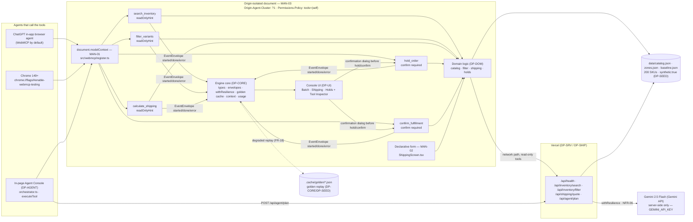

# DP-CORE — Engine Foundation: types, config, envelopes, resilience, context, usage

## 1. Purpose & Scope

DP-CORE is the foundation every other plan imports. It freezes the shared vocabulary and provides the three cross-cutting engine services that make the demo resilient and observable. It owns: the frozen shared types (`src/engine/types.ts`, §5A), the config loader (`src/engine/config.ts` + `config/engine.json` and `config/cost.json`, §5E), the envelope publisher (`src/engine/envelopes.ts`), the configured resilience wrapper plus golden cache (`src/engine/resilience.ts`), the agent transcript buffer (`src/engine/context.ts`), and the cost-store writer (`src/engine/usage.ts`). It contains no domain rules, no tool registration, no HTTP handler, and no React — those belong to DP-DOM, DP-TOOLS, DP-SRV, and DP-UI respectively. Any change to a type, config key, or step-id would silently desynchronize ten independently authored plans; DP-CORE prevents that by being the single owner of rows 1–9 of the contract table (§5F).

Scope boundary (owns / never touches):
- **Owns:** `src/engine/types.ts`, `src/engine/config.ts`, `src/engine/envelopes.ts`, `src/engine/resilience.ts`, `src/engine/context.ts`, `src/engine/usage.ts`, `config/engine.json`, `config/cost.json`, and the `.cache/golden/` directory root (shared with DP-SEED for seeds).
- **Never touches:** domain logic in `src/engine/domain/*`, WebMCP registration in `src/webmcp/*`, HTTP routes in `api/**`, React UI in `src/ui/**`, agent orchestration in `src/agent/*`, fixture generation in `data/*` or `demo/*`. If a needed shape is not in §5A, the requester declares it privately inside its own module and states that nobody else may import it.

Consumers: every plan (DP-DOM, DP-SRV, DP-TOOLS, DP-AGENT, DP-UI, DP-SEED, DP-DEV) imports from DP-CORE and never re-defines its exports. A consumer that cannot resolve an import stops and reports a blocker — never a local stub or re-export.

## 2. Requirements Traceability

### 2.1 MANDATORY COMPLIANCE (verbatim reproduction — outranks everything else)

> ## MANDATORY COMPLIANCE
>
> Every part of this entry MUST satisfy, or the entry fails Stage One regardless of quality
> (`hackathon_brief.md` §4.1–§4.3, Official Rules §4/§6/§7/§9):
>
> - **WebMCP is the mandatory technology.** The repository must demonstrate **imported-and-called**
>   usage — not a README mention — of the imperative pattern, verbatim shape:
>   `document.modelContext.registerTool({ name, description, inputSchema, execute })`.
>   Declarative API (annotated HTML forms) may be used **in addition**, never instead.
> - **WebMCP is only available in origin-isolated documents** and is gated by the `tools`
>   Permissions Policy, which **defaults to `self`**; a cross-origin iframe needs `allow="tools"`.
> - **Testable** in the **ChatGPT desktop app in-app browser** (WebMCP by default) **or Google
>   Chrome 149+** with `chrome://flags/#enable-webmcp-testing` enabled and the browser restarted.
> - **No mandated AI model and no mandated API key.** Any model, or none, is permitted.
> - **Submission gate — all five, or Stage One fail:** (1) working **live URL** judges can open in
>   the ChatGPT in-app browser or WebMCP-enabled Chrome, installable and running **consistently**,
>   frozen Sep 3 13:00 PDT until Sep 21; (2) **text description** answering four prompts — why the
>   use case fits WebMCP, how it creates a better UX, what people + agents can do together that was
>   difficult or impossible before, and briefly how WebMCP was implemented; (3) **public code
>   repository** containing all source/assets/instructions **and an open-source license file
>   detectable and visible at the top of the repo page (About section)**, containing the
>   `registerTool` pattern; (4) **demonstration video under 3 minutes** — only the first three
>   minutes are evaluated — showing the project functioning, **with audio covering what you built
>   and how you used WebMCP**, uploaded **publicly to YouTube**; (5) **completed Devpost submission
>   form by Sep 3 2026 @ 1:00 PM PDT (20:00 UTC)**.
> - **New & Existing rule:** new during the Submission Period, or meaningfully extended with WebMCP
>   after Aug 25 2026 with dated commit history distinguishing prior from new work.
> - **One track only:** *"WebMCP Challenge Winners — Top 10 submissions receive the following prizes
>   from the hackathon sponsors: ... 10 winners — All eligible Submissions"*. There are **no**
>   layered tracks and **no** sponsor sub-challenges. **No bonus integration — not worth dilution.**
> - **Judging:** Stage One pass/fail (reasonably fits theme + reasonably applies WebMCP); Stage Two
>   **four equally weighted** criteria, tie-break in listed order: **WebMCP Leverage**, **Execution**,
>   **Potential Impact**, **Creativity & Ambition**.

### 2.2 How DP-CORE relates to each mandate (MAN-01 .. MAN-10)

DP-CORE owns **none** of MAN-01 .. MAN-10 outright. It **inherits** all ten and **enables** them indirectly:

| ID | Mandate | DP-CORE role |
|---|---|---|
| MAN-01 | Imperative `registerTool` | Inherits; DP-CORE provides `emitToolEvent` and `publisher` that DP-TOOLS calls to emit envelopes for the five tools. DP-CORE never registers a tool itself. |
| MAN-02 | Declarative form | Inherits only — no code path in DP-CORE touches the ShippingScreen form. |
| MAN-03 | Origin isolation + Permissions Policy | Inherits; DP-CORE never creates an iframe and its transport publisher is origin-local. |
| MAN-04 | Public repo + licence | Inherits. |
| MAN-05 | Live URL | Inherits. |
| MAN-06 | Video <3 min | Inherits. |
| MAN-07 | Four-prompt text description | Inherits. |
| MAN-08 | Devpost form | Inherits. |
| MAN-09 | New & Existing — dated commits | Inherits; DP-CORE work units carry distinct commit messages to satisfy MAN-09 distribution. |
| MAN-10 | One track, no bonus | Inherits. |

### 2.3 Functional and non-functional requirements owned or enabled

| ID | Requirement | DP-CORE responsibility |
|---|---|---|
| FR-14 | Every tool call emits `EventEnvelope`s (`started` → `done`/`error`) and UI renders a live timeline | **Owner of publisher and emitToolEvent.** DP-CORE defines all frozen `step_id` values (§5G) and the envelope publisher; DP-UI is consumer. |
| FR-18 | Golden cache replays last successful output on abort/failure; envelope carries `degraded:true`; UI shows degraded chip | **Co-owner with DP-UI.** DP-CORE provides `guarded()` + `goldenCache` and emits `session.degraded`. |
| NFR-03 | Entire flow works network-disconnected via cache/local logic | **Owner of degraded path.** `RES_FORCED_DEGRADED=1` forces `guarded()` to return `DegradedResult` and `emitToolEvent` marks envelopes degraded. |
| NFR-06 | Every outbound LLM call wrapped in `withResilience` | **Provider of the wrapper.** DP-CORE exports `guarded()` configured from `config/engine.json` resilience block; DP-SRV/DP-AGENT are consumers. DP-CORE itself never calls Gemini. |
| NFR-08 | LLM spend metered into `data/cost-store.json`, fallback above cap | **Owner of `recordUsage`, `usageTotals`, `overBudget`.** The Python CLI `src/cost` renders the JSON written by DP-CORE. Token counts come from `count()` in `src/context`. |
| — | Freezes §2.4 (§5A types), §2.8 (envelope shape), §2.9 (config schema) | DP-CORE is the single source of truth; no other plan may widen these. |

## 3. Architecture

### 3.1 Where DP-CORE sits

DP-CORE is the bottom layer of the entry. Every other module in `<entry>` imports from it; it imports only from chassis roots (`src/resilience`, `src/context`, `src/platform/transport`, `src/cost` indirectly via file) and never from entry modules. It has no runtime dependency on `src/engine/domain/*`, `src/webmcp/*`, `api/**`, `src/agent/*`, or `src/ui/**`.

```
Consumers (import from DP-CORE, never stub):
  DP-DOM  → types (§5A), loadConfig()
  DP-SRV  → types, loadConfig(), guarded(), goldenCache, isDegradedResult
  DP-TOOLS→ types, loadConfig(), publisher, emitToolEvent(), newTraceId(), guarded(), isDegradedResult
  DP-AGENT→ types, loadConfig(), publisher, emitToolEvent(), newTraceId(), guarded(), goldenCache, appendTranscript(), transcript(), recordUsage(), isDegradedResult
  DP-UI   → types, loadConfig(), publisher, emitToolEvent(), newTraceId(), collectEnvelopes(), isDegradedResult
  DP-SEED → types, loadConfig(), goldenCache (for seeding)
  DP-DEV  → goldenCache, loadConfig (bench/doctor)
```

### 3.2 The frozen diagram (verbatim, source of `docs/architecture.mmd`)



The three mandate nodes labelled `MAN-01`, `MAN-02`, `MAN-03` must remain visible in any rendering; they are citations to the Official Rules, not decoration.

### 3.3 Chassis surfaces DP-CORE composes (and nothing else)

```ts
// resilience — src/resilience (single import root, no deep imports)
import { withResilience, isDegradedResult, createGoldenCache } from "src/resilience";
import type { DegradedResult, ResilienceConfig, GoldenCache } from "src/resilience";
// transport — src/platform/transport
import { createPublisher } from "src/platform/transport";
import type { EventEnvelope, CollectablePublisher } from "src/platform/transport";
// context — src/context
import { fit, append, count, countMessage, countBuffer } from "src/context";
import type { Message, Buffer, ContextBudgetConfig } from "src/context";
// cost — NEVER imported as TS; DP-CORE writes data/cost-store.json and Python CLI src/cost/cli.py renders it
```

Forbidden: deep imports into chassis internals (`src/resilience/wrapper.js`, `src/platform/transport/publisher.js`, `src/context/strategies/*`, …). Import only from the package roots above.

### 3.4 Data flow through DP-CORE

1. At startup `src/main.tsx` (DP-UI) awaits `loadConfig()` and constructs `publisher` before any tool registers.
2. DP-AGENT creates a `traceId = newTraceId()` per batch and emits `agent.plan` envelopes.
3. Each tool execution (DP-TOOLS) emits `tool.*` `started` → `done`/`error` via `emitToolEvent`.
4. Any `guarded()` degradation emits `session.degraded { reason, fallback_source }` so the timeline records rung transitions.
5. `appendTranscript` / `transcript` maintains the chat buffer for the planner prompt; `recordUsage` appends token counts consumed via `count()`.
6. `useEventStream()` in DP-UI subscribes to the memory publisher and renders the co-execution timeline, degraded chip, and savings meter.

## 4. Interfaces

### 4.1 Ownership note

Every cross-module symbol appears exactly once in §5F. The owner implements it; every consumer imports it from that exact path. A consumer that cannot find it stops and reports a blocker — never a local copy, re-export, or temporary shim. Symbols not in §5F are private to their module; DP-CORE marks all non-exported helpers in `src/engine/*.ts` as private and states that no other module may import them.

### 4.2 Required public surface — contract-table rows 1–9 (exactly these signatures)

```ts
// src/engine/types.ts — the full §5A block, unchanged, plus nothing else.  See §4.3 below.

// src/engine/config.ts
export interface EngineConfig { /* exactly the §5E shape, every key typed — see §6.1/§6.2 */ }
export function loadConfig(): EngineConfig;          // memoized; throws only if config/engine.json is missing or unparsable
// private helper — not exported from the public barrel; state it is private to this module:
// function configOverrides(): Partial<EngineConfig>  — reads RES_TIMEOUT_MS, RES_RETRIES, RES_FORCED_DEGRADED, OPSFLOW_PLANNER

// src/engine/envelopes.ts
export const publisher: CollectablePublisher;        // createPublisher("memory") — one instance per document; CollectablePublisher from src/platform/transport
export function emitToolEvent(
  stepId: string,
  status: "started" | "streaming" | "done" | "error",
  payload: Record<string, unknown>,
  opts?: { traceId?: string; degraded?: boolean }
): Promise<void>;
export function newTraceId(): string;                // `opsflow-${Date.now()}`
export function currentTraceId(): string | null;     // last trace_id passed to emitToolEvent, or null before any event
export function collectEnvelopes(traceId?: string): EventEnvelope[]; // publisher.collect(traceId) snapshot or [] if unsupported

// src/engine/resilience.ts
export const goldenCache: GoldenCache;               // createGoldenCache() rooted at .cache/golden
export function guarded<T>(
  fn: () => Promise<T>,
  opts?: { cacheKey?: string; timeoutMs?: number }
): Promise<T | DegradedResult<T>>;
export { isDegradedResult } from "src/resilience";   // re-export ONLY this predicate, for consumer convenience; no other resilience symbols re-exported

// src/engine/context.ts
export function appendTranscript(role: "user" | "assistant" | "tool", text: string): void;
export function transcript(): Message[];             // already passed through chassis fit(); returns the fitted buffer (never the raw unbounded array)
export function resetTranscript(): void;              // test helper; clears the in-memory buffer to []

// src/engine/usage.ts
export interface UsageEntry { role: string; model: string; prompt_tokens: number; completion_tokens: number; ts: string; }
export function recordUsage(entry: UsageEntry): void;            // append to data/cost-store.json; never throws
export function usageTotals(): { prompt_tokens: number; completion_tokens: number; entries: number };
export function overBudget(): boolean;                            // true when totals exceed config/cost.json cap; false if no cap
```

Consumers must import precisely:
- `import type { Variant, ToolOutcome, ShippingQuote, ... , APP_VERSION } from "src/engine/types.ts"` (or `"../engine/types.ts"` relative, but the owning file is `<entry>/src/engine/types.ts`)
- `import { loadConfig } from "src/engine/config.ts"`
- `import { publisher, emitToolEvent, newTraceId, currentTraceId, collectEnvelopes } from "src/engine/envelopes.ts"`
- `import { goldenCache, guarded, isDegradedResult } from "src/engine/resilience.ts"`
- `import { appendTranscript, transcript, resetTranscript } from "src/engine/context.ts"`
- `import { recordUsage, usageTotals, overBudget } from "src/engine/usage.ts"`

No other file or package root may export these names. Implementors: do not rename, widen, or add fields to any signature above.

### 4.3 Frozen shared types — `<entry>/src/engine/types.ts` (verbatim §5A, owned by DP-CORE)

Every other plan **imports** these and adds nothing to this file. No plan may widen a union, rename a field, or add a field.

```ts
// Requirement IDs: FR-02..FR-08, FR-14, FR-18, NFR-07
export const APP_VERSION = "1.0.0";

export type ShippingZone = 1 | 2 | 3 | 4 | 5;
export type ServiceLevel = "ground" | "expedited" | "overnight";
export type HoldStatus = "held" | "confirmed" | "released" | "expired";
export type PlannerKind = "gemini-2.5-flash" | "deterministic";
export type ToolName =
  | "search_inventory" | "filter_variants" | "calculate_shipping"
  | "hold_order" | "confirm_fulfillment";
export type ToolErrorCode =
  | "INVALID_INPUT"      // input failed inputSchema validation
  | "NOT_FOUND"          // unknown sku / holdId
  | "CONFLICT"           // hold already confirmed or released
  | "EXPIRED"            // hold TTL elapsed
  | "NEEDS_CONFIRMATION" // human confirmation not granted
  | "TOOL_ABORTED"       // options.signal aborted
  | "DEGRADED";          // upstream failed, cached/local data returned

export interface VariantOptions { size: string; color: string; }

export interface Variant {
  sku: string;                 // "OPS-1042-BLU-M" — uppercase, [A-Z0-9-]{6,32}
  product_id: string;          // "OPS-1042"
  title: string;               // <= 80 chars
  options: VariantOptions;
  price_cents: number;         // integer >= 0
  stock: number;               // integer >= 0
  weight_g: number;            // integer > 0
  low_stock_threshold: number; // integer >= 0; stock <= threshold means "low stock"
  synthetic: true;             // always literally true (NFR-04)
}

export interface Product {
  id: string; title: string; brand: string; category: string;
  variants: Variant[]; synthetic: true;
}

export interface Catalog { version: string; generated_at: string; synthetic: true; products: Product[]; }

export interface LineItem { sku: string; qty: number; }   // qty integer 1..999

export interface Surcharge { code: string; label: string; amount_cents: number; }

export interface ShippingQuote {
  zone: ShippingZone; service: ServiceLevel;
  items: LineItem[]; total_weight_g: number; subtotal_cents: number;
  base_rate_cents: number; surcharges: Surcharge[]; total_cents: number;
  explain: string[];            // one sentence per rule applied; <= 12 entries
  excluded: Array<{ sku: string; reason: string }>;
}

export interface Hold {
  hold_id: string;              // "HOLD-" + 8 uppercase base32 chars
  line_items: LineItem[];
  created_at: string;           // ISO-8601
  expires_at: string;           // ISO-8601 = created_at + ttl_minutes
  ttl_minutes: number;          // integer 1..120
  status: HoldStatus;
  note: string | null;          // <= 200 chars
  quote: ShippingQuote | null;
}

export interface Fulfillment {
  fulfillment_id: string;       // "FUL-" + 8 uppercase base32 chars
  hold_id: string;
  confirmed_at: string;
  line_items: LineItem[];
  total_cents: number;
}

// ---- tool I/O ----
export interface SearchInventoryInput { query: string; inStockOnly?: boolean; limit?: number; }
export interface FilterVariantsInput {
  skuPrefix?: string; options?: Partial<VariantOptions>;
  maxPriceCents?: number; minStock?: number; maxStock?: number; limit?: number;
}
export interface CalculateShippingInput { items: LineItem[]; zone: ShippingZone; service: ServiceLevel; }
export interface HoldOrderInput { lineItems: LineItem[]; ttlMinutes: number; note?: string; }
export interface ConfirmFulfillmentInput { holdId: string; }

export interface VariantMatch {
  sku: string; title: string; options: VariantOptions;
  price_cents: number; stock: number; low_stock: boolean;
}
export interface SearchInventoryOutput {
  matches: VariantMatch[]; total: number; truncated: boolean; query_echo: string;
}
export interface FilterVariantsOutput {
  matches: VariantMatch[]; total: number; applied: string[];  // human-readable filters applied
  from_result_set: boolean;                                   // true when it narrowed the previous set
}
export type CalculateShippingOutput = ShippingQuote;
export interface HoldOrderOutput { hold: Hold; requires_confirmation: true; }
export interface ConfirmFulfillmentOutput { fulfillment: Fulfillment; hold: Hold; }

export interface ToolError { code: ToolErrorCode; message: string; details?: Record<string, unknown>; }
export type ToolOutcome<T> = { ok: true; data: T; degraded?: boolean } | { ok: false; error: ToolError };

// ---- agent plan ----
export interface PlanStep { tool: ToolName; args: Record<string, unknown>; rationale: string; }
export interface ToolPlan {
  goal: string; steps: PlanStep[]; planner: PlannerKind; degraded: boolean; created_at: string;
}

// ---- session/meter ----
export interface SavingsMeter {
  tool_calls: number; confirmations: number; elapsed_ms: number;
  baseline_minutes: number; baseline_clicks: number;   // from data/baseline.json
}
export interface HealthResponse {
  ok: boolean; version: string; mode: "live" | "degraded"; origin_isolated: boolean;
  planner: PlannerKind; catalog: { products: number; variants: number; synthetic: true };
}
```

### 4.4 Engine configuration shape — `<entry>/config/engine.json` (verbatim §5E, owned by DP-CORE)

```json
{
  "version": "1.0.0",
  "app": { "name": "OpsFlow", "theme": "operator", "trace_prefix": "opsflow" },
  "planner": {
    "provider": "gemini",
    "model": "gemini-2.5-flash",
    "max_output_tokens": 1024,
    "temperature": 0.1,
    "fallback": "deterministic"
  },
  "tools": {
    "max_text_chars": 200,
    "max_result_chars": 4000,
    "max_items": 50,
    "default_limit": 25,
    "network_timeout_ms": 900
  },
  "holds": { "default_ttl_minutes": 15, "min_ttl_minutes": 1, "max_ttl_minutes": 120 },
  "resilience": {
    "timeout_ms": 8000,
    "retries": 1,
    "backoff": { "policy": "exponential", "base_ms": 250, "factor": 2, "max_ms": 2000, "jitter": true },
    "fallback_chain": { "order": ["cache", "replay", "none"] }
  },
  "context": { "max_tokens": 8000, "reserve_output": 1024 },
  "cost": { "store_path": "data/cost-store.json", "budget_path": "config/cost.json" }
}
```

Types for this JSON live in `src/engine/config.ts` as `EngineConfig` (exact mirror). No plan may add, rename, or remove a key.

## 5. Algorithms

Every algorithm is spelled out as numbered steps / literal code the low-intelligence implementor can copy. No judgment, no defaults left unstated.

### 5.1 `loadConfig()` — `src/engine/config.ts`

```ts
// src/engine/config.ts
import raw from "../../config/engine.json"; // Vite JSON import; in Node use fs.readFileSync fallback if needed
import type { EngineConfig } from "./types"; // EngineConfig mirrors §5E exactly

let cached: EngineConfig | null = null;

function readEnv(key: string): string | undefined {
  // Works in both runtimes without throwing:
  try {
    // Node / Vite server side
    if (typeof process !== "undefined" && process.env && key in process.env) {
      const v = (process.env as Record<string, string | undefined>)[key];
      if (v !== undefined) return v;
    }
  } catch {}
  try {
    // Browser Vite side: import.meta.env
    // eslint-disable-next-line @typescript-eslint/no-explicit-any
    const meta: any = (import.meta as any);
    if (meta && meta.env && key in meta.env) return meta.env[key] as string | undefined;
  } catch {}
  return undefined;
}

function configOverrides(): Partial<EngineConfig> {
  // PRIVATE — never imported outside this file; documented here so no other plan re-creates it
  const out: Record<string, unknown> = {};
  const t = readEnv("RES_TIMEOUT_MS");
  if (t !== undefined && t !== "") {
    const n = Number(t);
    if (!Number.isNaN(n)) out["resilience"] = { ...(out["resilience"] as object ?? {}), timeout_ms: n };
    // if deeper merge needed, merge onto a clone of raw.resilience below in loadConfig
  }
  const r = readEnv("RES_RETRIES");
  if (r !== undefined && r !== "") {
    const n = Number(r);
    if (!Number.isNaN(n)) out["resilience"] = { ...(out["resilience"] as object ?? {}), retries: n };
  }
  const d = readEnv("RES_FORCED_DEGRADED"); // "1" forces degraded; handled in resilience.ts, but config surfaces it
  if (d !== undefined && d !== "") {
    // stored as a synthetic key for callers that inspect config; real gate is env var in guarded()
    (out as Record<string, unknown>)["__forced_degraded"] = d === "1";
  }
  const p = readEnv("OPSFLOW_PLANNER"); // "deterministic" forces deterministic planner
  if (p !== undefined && p !== "") {
    out["planner"] = { ...(out["planner"] as object ?? {}), fallback: p };
  }
  return out as Partial<EngineConfig>;
}

export function loadConfig(): EngineConfig {
  if (cached) return cached;
  // 1) import config/engine.json (raw is the JSON above)
  if (!raw) throw new Error("config/engine.json is missing — fatal at startup");
  // 2) deep clone
  const cfg: EngineConfig = JSON.parse(JSON.stringify(raw)) as EngineConfig;
  // 3) for each of RES_TIMEOUT_MS, RES_RETRIES, RES_FORCED_DEGRADED, OPSFLOW_PLANNER, read env with typeof guard and apply override onto deep copy
  const ov = configOverrides() as Record<string, unknown>;
  // Shallow merge resilience sub-keys individually so we do not clobber backoff/fallback_chain:
  if (ov["resilience"] && typeof ov["resilience"] === "object") {
    cfg.resilience = { ...cfg.resilience, ...(ov["resilience"] as Partial<EngineConfig["resilience"]>) } as EngineConfig["resilience"];
  }
  if (ov["planner"] && typeof ov["planner"] === "object") {
    cfg.planner = { ...cfg.planner, ...(ov["planner"] as object) } as EngineConfig["planner"];
  }
  // 4) memoize
  cached = cfg;
  // 5) return
  return cached;
}
```

Steps:
1. Import `config/engine.json` (Vite JSON import; Node fallback `fs.readFileSync` if `raw` is not resolvable).
2. For each of `RES_TIMEOUT_MS`, `RES_RETRIES`, `RES_FORCED_DEGRADED`, `OPSFLOW_PLANNER`, read `process.env` (node) or `import.meta.env` (browser) with a `typeof` guard so neither environment throws.
3. Apply the override onto a deep copy (JSON clone) — merge sub-objects (`resilience`, `planner`) key-by-key so `backoff` and `fallback_chain` are not clobbered.
4. Memoize in module-level `cached`.
5. Return. Throws only if `config/engine.json` is missing or JSON is invalid — that failure is fatal at startup by design.

### 5.2 `emitToolEvent()` / `newTraceId()` / `currentTraceId()` / `collectEnvelopes()` — `src/engine/envelopes.ts`

```ts
// src/engine/envelopes.ts
import { createPublisher } from "src/platform/transport";
import type { EventEnvelope, CollectablePublisher } from "src/platform/transport";

export const publisher: CollectablePublisher = createPublisher("memory");

let seq = 0;
let lastTraceId: string | null = null;

export function newTraceId(): string {
  // `opsflow-${Date.now()}` per §6.1; incorporate config trace_prefix if desired but default is literal "opsflow"
  return `opsflow-${Date.now()}`;
}

export function currentTraceId(): string | null {
  return lastTraceId;
}

export function collectEnvelopes(traceId?: string): EventEnvelope[] {
  // publisher.collect is CollectablePublisher API; fall back to [] if unavailable in this transport impl
  try {
    const snap = (publisher as CollectablePublisher).collect?.(traceId as string);
    if (Array.isArray(snap)) return snap as unknown as EventEnvelope[];
    // chassis .collect may return { envelopes: EventEnvelope[] } or similar — normalize:
    if (snap && typeof snap === "object" && "envelopes" in (snap as Record<string, unknown>)) {
      return ((snap as Record<string, unknown>)["envelopes"] as EventEnvelope[]) ?? [];
    }
    // if snap looks like envelope array wrapper, return empty on unknown shape — never throw
    return [];
  } catch {
    return [];
  }
}

export async function emitToolEvent(
  stepId: string,
  status: "started" | "streaming" | "done" | "error",
  payload: Record<string, unknown>,
  opts?: { traceId?: string; degraded?: boolean }
): Promise<void> {
  // 1) build the envelope fields (publisher.publish takes stepId/status/payload/traceId/degraded; timestamp/sequence managed by publisher)
  const traceId = opts?.traceId ?? lastTraceId ?? undefined;
  if (traceId) lastTraceId = traceId;
  else if (stepId === "agent.plan" && status === "started" && (payload as Record<string, unknown>)["traceId"]) {
    lastTraceId = String((payload as Record<string, unknown>)["traceId"]);
  }
  // 2) call publisher.publish — never throw: wrap in try/catch and swallow
  try {
    // CollectablePublisher.publish signature: publish({ stepId, status, payload, traceId, degraded })
    await publisher.publish({
      stepId,
      status,
      payload,
      traceId: traceId as string | undefined,
      degraded: opts?.degraded,
    } as unknown as Parameters<typeof publisher.publish>[0]);
    // also bump local sequence for debugging (publisher manages its own sequence)
    seq += 1;
    if (traceId) lastTraceId = traceId;
  } catch {
    // telemetry failure must never break a tool call — swallow
  }
}
```

Steps:
1. Build the envelope args `{ stepId, status, payload, traceId, degraded }` where `timestamp` and `sequence` are managed by the chassis publisher.
2. Call `publisher.publish(...)`.
3. Never throw — wrap in `try/catch` and swallow, because a telemetry failure must never break a tool call.
4. Store `traceId` for `currentTraceId()`; `newTraceId()` is `opsflow-${Date.now()}`; `collectEnvelopes` delegates to `publisher.collect(traceId)` and normalizes.

### 5.3 `guarded()` + golden-cache key derivation — `src/engine/resilience.ts`

```ts
// src/engine/resilience.ts
import { withResilience, isDegradedResult, createGoldenCache } from "src/resilience";
import type { GoldenCache, ResilienceConfig, DegradedResult } from "src/resilience";
import { loadConfig } from "./config";
import { emitToolEvent } from "./envelopes";
export { isDegradedResult } from "src/resilience";

export const goldenCache: GoldenCache = createGoldenCache(); // rooted at .cache/golden by chassis convention

function readForcedDegraded(): boolean {
  try { if (typeof process !== "undefined" && process.env?.["RES_FORCED_DEGRADED"] === "1") return true; } catch {}
  try {
    const meta: unknown = (import.meta as unknown as Record<string, unknown>)["env"];
    if (meta && (meta as Record<string, unknown>)["RES_FORCED_DEGRADED"] === "1") return true;
    // Vite exposes import.meta.env.RES_FORCED_DEGRADED — check both shapes
    const env = (import.meta as unknown as Record<string, unknown>)["env"] as Record<string, unknown> | undefined;
    if (env?.["RES_FORCED_DEGRADED"] === "1") return true;
  } catch {}
  // Also check global via import.meta.env direct
  try {
    const v = (import.meta as unknown as { env?: Record<string, string> }).env?.["RES_FORCED_DEGRADED"];
    if (v === "1") return true;
  } catch {}
  return false;
}

function canonicalJson(value: unknown): string {
  // sorts object keys recursively, drops undefined, stable stringify for cache-key derivation
  if (value === null || typeof value !== "object") return JSON.stringify(value) ?? "null";
  if (Array.isArray(value)) return "[" + (value as unknown[]).map(canonicalJson).join(",") + "]";
  const obj = value as Record<string, unknown>;
  const keys = Object.keys(obj).filter(k => obj[k] !== undefined).sort();
  return "{" + keys.map(k => JSON.stringify(k) + ":" + canonicalJson(obj[k])).join(",") + "}";
}

export function deriveKey(model: string, input: unknown): string {
  // helper used internally when caller does not supply opts.cacheKey
  return goldenCache.deriveKey({ provider: "opsflow", model, prompt: canonicalJson(input) });
}

export async function guarded<T>(
  fn: () => Promise<T>,
  opts?: { cacheKey?: string; timeoutMs?: number }
): Promise<T | DegradedResult<T>> {
  // 1) read config.resilience
  const cfg = loadConfig();
  // 2) check forced degraded — if RES_FORCED_DEGRADED=1, short-circuit without calling fn
  if (readForcedDegraded()) {
    const degraded: DegradedResult<T> = {
      degraded: true,
      reason: "forced_degraded",
      fallback_source: "cache",
      original_error: null,
      data: undefined as unknown as T,
      timestamp: new Date().toISOString(),
      version: "1.0.0",
    };
    // Try golden cache replay if a key exists
    try {
      const key = opts?.cacheKey ?? deriveKey("guarded", fn.toString());
      const cached = await goldenCache.get(key) as T | null;
      if (cached != null) (degraded as { data: unknown }).data = cached;
    } catch {}
    await emitToolEvent("session.degraded", "done", { reason: "forced_degraded", fallback_source: "cache" });
    return degraded;
  }
  // 3) build the ResilienceConfig object literally (fill every field from config, including fallback_chain.order)
  const rc: ResilienceConfig = {
    timeout_ms: opts?.timeoutMs ?? cfg.resilience.timeout_ms,
    retries: cfg.resilience.retries,
    backoff: {
      policy: cfg.resilience.backoff.policy as ResilienceConfig["backoff"]["policy"],
      base_ms: cfg.resilience.backoff.base_ms,
      factor: cfg.resilience.backoff.factor,
      max_ms: cfg.resilience.backoff.max_ms,
      jitter: cfg.resilience.backoff.jitter,
    },
    fallback_chain: { order: [...cfg.resilience.fallback_chain.order] as ResilienceConfig["fallback_chain"]["order"] },
    forced_degraded: false,
  };
  // 4) call withResilience(fn, rc, { cache: goldenCache }) and await it
  const wrapped = withResilience(fn, rc, { cache: goldenCache } as unknown as Parameters<typeof withResilience>[2]);
  const result = await (wrapped as () => Promise<T | DegradedResult<T>>)();
  // 5) if isDegradedResult(result), emit session.degraded with { reason, fallback_source }
  if (isDegradedResult(result)) {
    const r = result as DegradedResult<T>;
    await emitToolEvent("session.degraded", "done", {
      reason: (r as unknown as Record<string, unknown>)["reason"] ?? "unknown",
      fallback_source: (r as unknown as Record<string, unknown>)["fallback_source"] ?? "none",
    });
  }
  // 6) return the result without throwing — caller narrows with isDegradedResult
  return result;
}
```

Steps:
1. Read `config.resilience` via `loadConfig()`.
2. Build the `ResilienceConfig` object literally (fill every field from config, including the `fallback_chain.order` array spread).
3. Call `withResilience(fn, cfg, { cache: goldenCache })`.
4. `await` it.
5. If `isDegradedResult(result)`, emit `session.degraded` with `{ reason, fallback_source }` via `emitToolEvent`.
6. Return the result **without throwing**. The chassis wrapper never throws; DP-CORE preserves that contract.

### 5.4 Golden-cache key derivation — `canonicalJson` in full

```ts
function canonicalJson(value: unknown): string {
  if (value === null) return "null";
  if (typeof value === "string" || typeof value === "number" || typeof value === "boolean") {
    return JSON.stringify(value) as string;
  }
  if (Array.isArray(value)) {
    return "[" + value.map(canonicalJson).join(",") + "]";
  }
  if (typeof value === "object") {
    const obj = value as Record<string, unknown>;
    const keys = Object.keys(obj).filter(k => obj[k] !== undefined).sort();
    const parts: string[] = [];
    for (const k of keys) parts.push(JSON.stringify(k) + ":" + canonicalJson(obj[k]));
    return "{" + parts.join(",") + "}";
  }
  return "null"; // undefined at top-level, functions, symbols -> null (dropped in objects already)
}
// usage: goldenCache.deriveKey({ provider: "opsflow", model: <tool or role name>, prompt: canonicalJson(input) })
```

Sorting keys recursively and dropping `undefined` is what makes two runs with the same logical input hit the same cache entry even if property order differs.

### 5.5 `recordUsage()` / `usageTotals()` / `overBudget()` — `src/engine/usage.ts`

```ts
// src/engine/usage.ts
import { count } from "src/context"; // token counting — the ONLY tokenizer in the entry (reused by python src/cost)
import { loadConfig } from "./config";

export interface UsageEntry { role: string; model: string; prompt_tokens: number; completion_tokens: number; ts: string; }

interface CostStore { version: string; entries: (UsageEntry & { budget_path?: string })[]; }

function isBrowser(): boolean { return typeof window !== "undefined" && typeof window.document !== "undefined"; }

function storePath(): string {
  try { return loadConfig().cost.store_path; } catch { return "data/cost-store.json"; }
}

export function recordUsage(entry: UsageEntry): void {
  // 1) read data/cost-store.json (create { version:"1.0.0", entries:[] } if absent)
  // 2) append the entry (token counts must come from count() — never hand-rolled)
  // 3) write back atomically (temp file + rename in node; no-op with console warning in browser)
  // 4) file must validate against contracts/cost-store-snapshot.schema.json
  try {
    if (isBrowser()) {
      console.warn("[usage] recordUsage called in browser — cost-store write is server-only; entry:", entry);
      return;
    }
    // Node path
    const fs = eval("require")("fs") as typeof import("fs"); // avoid bundling fs in browser; implementor may use node:fs with guard
    const path = eval("require")("path") as typeof import("path");
    const sp = storePath();
    const full = path.isAbsolute(sp) ? sp : path.join(process.cwd(), sp);
    let store: CostStore;
    try {
      const raw = fs.readFileSync(full, "utf8");
      store = JSON.parse(raw) as CostStore;
      if (!Array.isArray(store.entries)) store.entries = [];
    } catch {
      store = { version: "1.0.0", entries: [] };
    }
    store.entries.push(entry);
    fs.mkdirSync(path.dirname(full), { recursive: true });
    const tmp = full + ".tmp." + Date.now();
    fs.writeFileSync(tmp, JSON.stringify(store, null, 2), "utf8");
    fs.renameSync(tmp, full); // atomic on same filesystem
  } catch {
    // recordUsage never throws
  }
}

export function usageTotals(): { prompt_tokens: number; completion_tokens: number; entries: number } {
  try {
    if (isBrowser()) return { prompt_tokens: 0, completion_tokens: 0, entries: 0 };
    const fs = eval("require")("fs") as typeof import("fs");
    const path = eval("require")("path") as typeof import("path");
    const full = path.isAbsolute(storePath()) ? storePath() : path.join(process.cwd(), storePath());
    const raw = fs.readFileSync(full, "utf8");
    const store = JSON.parse(raw) as CostStore;
    let pt = 0, ct = 0;
    for (const e of store.entries ?? []) { pt += Number(e.prompt_tokens) || 0; ct += Number(e.completion_tokens) || 0; }
    return { prompt_tokens: pt, completion_tokens: ct, entries: (store.entries ?? []).length };
  } catch {
    return { prompt_tokens: 0, completion_tokens: 0, entries: 0 };
  }
}

export function overBudget(): boolean {
  try {
    if (isBrowser()) return false;
    const fs = eval("require")("fs") as typeof import("fs");
    const path = eval("require")("path") as typeof import("path");
    const cfg = loadConfig();
    const budgetRaw = fs.readFileSync(path.join(process.cwd(), cfg.cost.budget_path), "utf8");
    const budget = JSON.parse(budgetRaw) as { cap_tokens?: number; cap_cost_usd?: number; max_entries?: number };
    const totals = usageTotals();
    const totalTokens = totals.prompt_tokens + totals.completion_tokens;
    if (budget.cap_tokens !== undefined && totalTokens > budget.cap_tokens) return true;
    if (budget.max_entries !== undefined && totals.entries > budget.max_entries) return true;
    return false;
  } catch {
    return false;
  }
}
```

Steps:
1. Read `data/cost-store.json` (create `{ version: "1.0.0", entries: [] }` if absent or unreadable).
2. Append `UsageEntry` (callers must have derived `prompt_tokens`/`completion_tokens` via `count()` from `src/context`, the single tokenizer both TS and Python agree on).
3. Write back atomically: write to `cost-store.json.tmp.<ts>` then `renameSync` to `cost-store.json`; in the browser, no-op with a `console.warn`.
4. The file must validate against `contracts/cost-store-snapshot.schema.json`. The Python CLI `python3 -m src.cost.cli --store data/cost-store.json --budget config/cost.json` renders it.

### 5.6 `appendTranscript()` / `transcript()` / `resetTranscript()` — `src/engine/context.ts`

```ts
// src/engine/context.ts
import { fit, append, count, budget } from "src/context";
import type { Message, Buffer } from "src/context";
import { loadConfig } from "./config";

let buffer: Buffer = []; // chassis Buffer = Message[]

export function appendTranscript(role: "user" | "assistant" | "tool", text: string): void {
  const cfg = loadConfig();
  const msg: Message = { role, content: text } as Message; // chassis Message shape; metadata is optional
  // append then fit — chassis does the truncation, not DP-CORE
  const next: Buffer = append(buffer, msg as unknown as Parameters<typeof append>[1]) as unknown as Buffer;
  const fitted = fit(next as unknown as Parameters<typeof fit>[0], {
    max_tokens: cfg.context.max_tokens,
    reserve_output: cfg.context.reserve_output,
  } as unknown as Parameters<typeof fit>[1]);
  buffer = (fitted as unknown as { buffer: Buffer }).buffer ?? (fitted as unknown as Buffer);
  // When status is "over", chassis has already dropped oldest non-system messages first — DP-CORE does not re-implement it
}

export function transcript(): Message[] {
  return [...buffer]; // already passed through fit(); caller gets a copy
}

export function resetTranscript(): void {
  buffer = [];
}
```

Steps:
1. Maintain a chassis `Buffer` (module-level `buffer: Buffer = []`).
2. On `appendTranscript(role, text)`: build a `Message`, call `append(buffer, message)`, then call `fit(buffer, { max_tokens: config.context.max_tokens, reserve_output: config.context.reserve_output })` and keep the returned `buffer`. When `status` is `over`, the chassis drops oldest non-system messages first — DP-CORE does not re-implement truncation.
3. `transcript()` returns a shallow copy of the fitted buffer.
4. `resetTranscript()` clears to `[]` (test helper; not called in production except at batch start).

## 6. Configuration

### 6.1 `config/engine.json` (verbatim §5E, every key explained)

```json
{
  "version": "1.0.0",
  "app": { "name": "OpsFlow", "theme": "operator", "trace_prefix": "opsflow" },
  "planner": {
    "provider": "gemini",
    "model": "gemini-2.5-flash",
    "max_output_tokens": 1024,
    "temperature": 0.1,
    "fallback": "deterministic"
  },
  "tools": {
    "max_text_chars": 200,
    "max_result_chars": 4000,
    "max_items": 50,
    "default_limit": 25,
    "network_timeout_ms": 900
  },
  "holds": { "default_ttl_minutes": 15, "min_ttl_minutes": 1, "max_ttl_minutes": 120 },
  "resilience": {
    "timeout_ms": 8000,
    "retries": 1,
    "backoff": { "policy": "exponential", "base_ms": 250, "factor": 2, "max_ms": 2000, "jitter": true },
    "fallback_chain": { "order": ["cache", "replay", "none"] }
  },
  "context": { "max_tokens": 8000, "reserve_output": 1024 },
  "cost": { "store_path": "data/cost-store.json", "budget_path": "config/cost.json" }
}
```

| Key | Type | Meaning |
|---|---|---|
| `version` | string | Semver of the engine config; must equal `APP_VERSION` in `src/engine/types.ts`. |
| `app.name` | string | Human name shown only in docs/diagrams; never branch on it. |
| `app.theme` | `"minimal"\|"editorial"\|"operator"` | Chassis UI theme; this entry uses `operator`; `resolveTheme` consumes it. |
| `app.trace_prefix` | string | Prefix for `newTraceId()`; literal `"opsflow"` so grep for trace ids is unambiguous. |
| `planner.provider` | string | `"gemini"` — tells `api/agent/plan.ts` which provider to import. |
| `planner.model` | string | `"gemini-2.5-flash"` — echoed in `HealthResponse.planner` and in cost entries. |
| `planner.max_output_tokens` | number | Cap for Gemini `generateContent`; keeps cost bounded. |
| `planner.temperature` | number | `0.1` — near-deterministic tool plan; Claude planner would use a different value but never reads this. |
| `planner.fallback` | string | `"deterministic"` — `planDeterministic()` choice when Gemini degrades. |
| `tools.max_text_chars` | number | `200` — max length for `query` / `skuPrefix` / `note`; DP-TOOLS truncates before validation. |
| `tools.max_result_chars` | number | `4000` — max `content[].text` per tool result (NFR-07). |
| `tools.max_items` | number | `50` — max `LineItem[]` length in shipping/hold inputs; DP-TOOLS rejects above this with `INVALID_INPUT`. |
| `tools.default_limit` | number | `25` — default pagination limit for search/filter when client omits `limit`. |
| `tools.network_timeout_ms` | number | `900` — timeout for `apiClient` fetch; above it, fallback to in-browser domain logic with `degraded:true`. |
| `holds.default_ttl_minutes` | number | `15` — default TTL for `hold_order` when UI omits it. |
| `holds.min_ttl_minutes` | number | `1` — lower bound validated in DP-DOM. |
| `holds.max_ttl_minutes` | number | `120` — upper bound; again, DP-DOM is the enforcer. |
| `resilience.timeout_ms` | number | `8000` — `withResilience` call timeout; override with `RES_TIMEOUT_MS`. |
| `resilience.retries` | number | `1` — single retry; override with `RES_RETRIES`. |
| `resilience.backoff.policy` | string | `"exponential"` — passed verbatim to `ResilienceConfig.backoff.policy`. |
| `resilience.backoff.base_ms` | number | `250` — initial backoff. |
| `resilience.backoff.factor` | number | `2` — exponential factor. |
| `resilience.backoff.max_ms` | number | `2000` — cap. |
| `resilience.backoff.jitter` | boolean | `true` — randomize within bucket; prevents thundering herd. |
| `resilience.fallback_chain.order` | string[] | `["cache","replay","none"]` — order the chassis tries after timeout/error; `guarded()` spreads this array verbatim. |
| `context.max_tokens` | number | `8000` — budget passed to `fit()`; transcript is trimmed to fit. |
| `context.reserve_output` | number | `1024` — tokens reserved for model completion inside the same budget. |
| `cost.store_path` | string | `"data/cost-store.json"` — where `recordUsage()` appends; Python CLI reads it via the same path. |
| `cost.budget_path` | string | `"config/cost.json"` — where `overBudget()` reads the cap and where Python checks `--budget`. |

### 6.2 `config/cost.json` (owned by DP-CORE, consumed by both sides of the COST seam)

```json
{
  "version": "1.0.0",
  "cap_tokens": 100000,
  "cap_cost_usd": 5.00,
  "max_entries": 1000,
  "model_pricing": {
    "gemini-2.5-flash": { "input_per_1k": 0.00015, "output_per_1k": 0.0006 }
  }
}
```

The entry itself never computes USD directly — entries store `prompt_tokens`/`completion_tokens` counted via `count()`; the Python `src/cost` applies `model_pricing` to render the table. `overBudget()` checks `cap_tokens` and `max_entries`; if either is exceeded it returns `true` and DP-AGENT should choose the deterministic planner.

The COST seam is cross-language and file-based: TypeScript **never imports** `src/cost`; DP-CORE writes `<entry>/data/cost-store.json` conforming to `contracts/cost-store-snapshot.schema.json`, and the Python CLI `python3 -m src.cost.cli --store data/cost-store.json --budget config/cost.json` renders it. Token counts come from `count()` in `src/context`, so both sides agree by construction.

## 7. Resiliency

### 7.1 Never-throw contracts (verbatim from §6.3)

- `emitToolEvent` **never throws** — wrap `publisher.publish` in `try/catch` and swallow. A telemetry failure must never break a tool call.
- `guarded` **never throws** — `withResilience` is configured to return `DegradedResult` instead of throwing; DP-CORE preserves that contract and emits `session.degraded` before returning.
- `loadConfig` **throws only** on a missing or unparsable `config/engine.json` and that failure is **fatal at startup by design** — the app cannot run without a config.
- `recordUsage` **never throws** — all FS/JSON errors are caught; in the browser it warns instead of writing.
- `RES_FORCED_DEGRADED=1` forces **rung 5** of the fallback ladder for the entire session — every `guarded()` call short-circuits to `DegradedResult` and every affected envelope carries `degraded:true`.

### 7.2 Fallback ladder — rungs DP-CORE implements

(Reference: full ladder in blueprint §5.2; DP-CORE owns the transitions, DP-UI owns the banners.)

| Rung | Condition | DP-CORE behaviour | Envelope signal |
|---|---|---|---|
| 3 | API routes unreachable / tool network path fails | `guarded()` returns `DegradedResult` with `fallback_source: "cache"` or `"replay"`; consumer falls back to in-browser domain logic (DP-TOOLS) or `planDeterministic` (DP-SRV) | Each affected `tool.*` `done` envelope carries `degraded:true`; plus `session.degraded { reason, fallback_source }` |
| 5 | `RES_FORCED_DEGRADED=1` or golden-cache replay | All `guarded()` calls return degraded; `goldenCache.get(key)` replays last successful output | Every `tool.*` envelope is `degraded:true`; `session.degraded` emitted at every transition so the timeline records what happened; full-width banner trigger |
| 6 | `npm run demo:offline` rehearsal | Publisher is seeded from `demo/mock-script.json` via `chassis mock`; DP-CORE's `publisher` receives pre-recorded envelopes — identical UI path | Mock `trace_id` preserved |

Escalation is automatic and always visible: no rung is entered silently, and `session.degraded` is emitted at every transition so the timeline records what happened. The **last resort** is the submitted ≤3-min YouTube video (Rules §4).

### 7.3 Resilience envelope vocabulary (frozen step ids, DP-CORE owns `session.degraded`)

| `step_id` | Emitted by | `started` payload | `done` payload |
|---|---|---|---|
| `session.degraded` | `DP-CORE` (`guarded()`) | — | `{ reason: string, fallback_source: "cache"\|"replay"\|"none" }` |

Other `step_id` values (`agent.plan`, `tool.*`, `session.confirm`) are emitted by other owners but DP-CORE defines the publisher that carries them and the `EventEnvelope` type. DP-CORE never invents a new `step_id`.

## 8. File Layout & Module Boundaries

### 8.1 Tree inside `<entry>` (verbatim §5D, DP-CORE-owned rows marked ★)

```
<entry>/
  api/                          # DP-SRV — Vercel serverless functions
    health.ts
    inventory/search.ts
    inventory/filter.ts
    shipping/quote.ts
    agent/plan.ts               # the ONLY place GEMINI_API_KEY is read (NFR-01)
  src/
    main.tsx                    # DP-UI — calls registerAllTools() before render
    engine/
      types.ts                  # ★ DP-CORE — §5A, frozen
      config.ts                 # ★ DP-CORE — loads config/engine.json
      envelopes.ts              # ★ DP-CORE — publisher + emitToolEvent
      resilience.ts             # ★ DP-CORE — configured withResilience + golden cache
      context.ts                # ★ DP-CORE — agent transcript buffer
      usage.ts                  # ★ DP-CORE — cost-store snapshot writer
      apiClient.ts              # DP-SRV — typed fetch client + local fallback
      domain/
        catalog.ts              # DP-DOM — loadCatalog, searchVariants
        filter.ts               # DP-DOM — filterVariants
        shipping.ts             # DP-DOM — quoteShipping
        holds.ts                # DP-DOM — pure hold reducers
        holdsStore.ts           # DP-DOM — singleton store + localStorage
        errors.ts               # DP-DOM — makeToolError
    webmcp/
      register.ts               # DP-TOOLS — the ONLY registerTool call site (MAN-01)
      schemas.ts                # DP-TOOLS — the five inputSchema constants
      runTool.ts                # DP-TOOLS — validate → limit → abort → execute → envelope
      policy.ts                 # DP-TOOLS — probeWebMcp(), executeToolCompat()
      confirm.ts                # DP-TOOLS — confirmation gate bridge to DP-UI
    agent/
      orchestrator.ts           # DP-AGENT — run(goal): plan then executeTool loop
      planner.ts                # DP-AGENT — client side of POST /api/agent/plan
      deterministic.ts          # DP-AGENT — keyless keyword planner
      prompt.ts                 # DP-AGENT — system + user prompt templates
    ui/
      App.tsx  screens/BatchScreen.tsx  screens/ShippingScreen.tsx  screens/HoldsScreen.tsx
      components/ToolInspector.tsx  components/CoExecutionTimeline.tsx
      components/ConfirmDialog.tsx  components/DegradedBanner.tsx
      components/WebMcpBanner.tsx   components/SavingsMeter.tsx
      state/session.ts
  data/                         # DP-SEED — JSON fixtures, only JSON here
    catalog.json  zones.json  baseline.json  cost-store.json
  demo/                         # DP-SEED / DP-DEV
    mock-script.json  click-script.json
  .cache/golden/                # ★ DP-CORE (owner of cache root) / DP-SEED (seeds)
  config/                       # ★ DP-CORE / DP-DEV
    engine.json  cost.json  track.json
  tests/                        # every plan adds its own subfolder
    engine/                     # ★ DP-CORE tests only
  docs/architecture.mmd  docs/submission-checklist.md  docs/qa/
  deck/  script.md  assets/demodrive/
  LICENSE  README.md  disclosure.md  submission.md
  vercel.json  package.json  vite.config.ts  assembly.manifest.json
```

### 8.2 `.gitignore` lines DP-CORE requires

```gitignore
# DP-CORE — resilience + cost
.cache/
!.cache/golden/.gitkeep
!.cache/golden/*.json
# keep seeded golden entries in git, ignore runtime ephemeral writes if any

# DP-CORE — cost-store is runtime written; keep an empty seed at repo init
data/cost-store.json
!data/cost-store.json
# alternative: commit cost-store.json as {"version":"1.0.0","entries":[]} and allow dirtiness — DP-SHIP gates ignore it

# DP-CORE + DP-SHIP — never commit secrets or Vercel state
.env
.env.*
!.env.example
.vercel/
```

DP-CORE never edits `.gitignore` directly if it already contains these lines; it adds only the missing ones. No other file outside `<entry>` is touched. Never modify the chassis repository's `src/` (NFR-05).

### 8.3 Module boundaries — who may import what

- DP-CORE imports only from chassis roots (`src/resilience`, `src/context`, `src/platform/transport`) plus stdlib (`fs`, `path` in node-only `usage.ts`) and `config/*.json`. It never imports from `src/engine/domain/*`, `src/webmcp/*`, `src/agent/*`, `src/ui/*`, or `api/**`.
- Every other plan imports only the six files listed in §4.2. The private helper `configOverrides()` and the module-local `buffer`/`seq`/`lastTraceId`/`cached` are **private** — no other module may import them; say so explicitly in Interfaces.
- Chassis modules are composed through the public surfaces listed in §3.3 — never forked, never re-implemented. The single permitted deep import (`src/data/provider`) is **not** used by DP-CORE.

## 9. Work Units

Each work unit is small enough for a low-intelligence implementor: one file, or one function plus its test. Each ends with exactly one runnable Verify command and its expected output, pasted literally. For cross-boundary work units, that command exercises the real provider→consumer import. Each also names its commit message so `git log` shows work spread across the submission window (MAN-09).

### W1 — `src/engine/types.ts` — §5A verbatim

- **Deliverable:** `<entry>/src/engine/types.ts` containing exactly the §5A block from §4.3, plus nothing else (no extra type, no extra export, no widened union).
- **Steps:** 1) create `src/engine/` directory; 2) write the file verbatim; 3) ensure `tsconfig.json` includes `src/engine/types.ts`.
- **Verify:**
  ```bash
  npx tsc --noEmit -p tsconfig.json
  ```
  Expected output: (no errors, empty stdout, exit 0)
- **Commit message:** `feat(engine): freeze shared types DP-CORE W1 (FR-02..FR-08, §5A)`

### W2 — `config/engine.json` + `config/cost.json` + `src/engine/config.ts`

- **Deliverable:** `config/engine.json` (verbatim §5E), `config/cost.json` (§6.2), and `src/engine/config.ts` ( §5.1 algorithm). Memoized `loadConfig()` with `typeof` guards for both runtimes.
- **Verify:**
  ```bash
  npx vite-node -e "import('./src/engine/config.ts').then(m=>console.log(m.loadConfig().planner.model))"
  ```
  Expected output:
  ```
  gemini-2.5-flash
  ```
  (Cross-boundary proof: consumer-style import of `loadConfig` from owning file.)
- **Commit message:** `feat(engine): config loader with env overrides DP-CORE W2 (NFR-03)`

### W3 — `src/engine/envelopes.ts`

- **Deliverable:** `publisher` singleton via `createPublisher("memory")`, plus `emitToolEvent`, `newTraceId`, `currentTraceId`, `collectEnvelopes` exactly as in §5.2.
- **Verify:**
  ```bash
  npx vite-node -e "import('./src/engine/envelopes.ts').then(async m=>{await m.emitToolEvent('tool.search_inventory','done',{ok:true});console.log(m.collectEnvelopes().length)})"
  ```
  Expected output:
  ```
  1
  ```
  (Collects the single `done` envelope just published; proves real `createPublisher` wiring.)
- **Commit message:** `feat(engine): envelope publisher DP-CORE W3 (FR-14)`

### W4 — `src/engine/resilience.ts`

- **Deliverable:** `goldenCache` via `createGoldenCache()` rooted at `.cache/golden`, `guarded()` configured from `loadConfig().resilience`, `isDegradedResult` re-export, `canonicalJson` in full. Handles `RES_FORCED_DEGRADED=1`.
- **Verify:**
  ```bash
  RES_FORCED_DEGRADED=1 npx vite-node -e "import('./src/engine/resilience.ts').then(async m=>console.log(m.isDegradedResult(await m.guarded(async()=>1))))"
  ```
  Expected output:
  ```
  true
  ```
  (Forced degraded returns `DegradedResult`; also implicitly proves `guarded` emits `session.degraded`.)
- **Commit message:** `feat(engine): guarded wrapper + golden cache DP-CORE W4 (FR-18, NFR-06)`

### W5 — `src/engine/context.ts`

- **Deliverable:** `appendTranscript` / `transcript` / `resetTranscript` maintaining a chassis `Buffer` and calling `fit(buffer, { max_tokens, reserve_output })` exactly as in §5.6; token counting delegated to chassis `count()`.
- **Verify:**
  ```bash
  npx vite-node -e "import('./src/engine/context.ts').then(m=>{m.resetTranscript();m.appendTranscript('user','hi');console.log(m.transcript().length)})"
  ```
  Expected output:
  ```
  1
  ```
  (Real import of chassis `fit`/`append` via DP-CORE.)
- **Commit message:** `feat(engine): transcript buffer DP-CORE W5 (NFR-08)`

### W6 — `src/engine/usage.ts` + first cost-store snapshot

- **Deliverable:** `recordUsage`, `usageTotals`, `overBudget` per §5.5, plus an initial `data/cost-store.json` seed `{ "version":"1.0.0","entries":[] }` if absent, validating against `contracts/cost-store-snapshot.schema.json`. Browser path is no-op with warning; Node path writes atomically.
- **Verify:**
  ```bash
  python3 -m src.cost.cli --store data/cost-store.json --budget config/cost.json
  ```
  Expected output: a table with one header row (e.g. `model | prompt | completion | total | cost`) and exit 0. With an empty store it prints the header plus zero totals; after one `recordUsage` call it shows one row. Exit code 0 is the assertion.
  (Proves the COST seam: TS writes JSON, Python CLI renders it; no TS import of `src/cost`.)
- **Commit message:** `feat(engine): usage writer + cost-store seam DP-CORE W6 (NFR-08)`

Execution order: W1 → W2 → W3 → W4 → W5 → W6. W2 depends on W1 (types for `EngineConfig`); W3/W4 depend on W2 (config); W5 depends on W2; W6 depends on W2 and chassis `count` via `src/context`.

## 10. Testing Strategy

Unit tests under `<entry>/tests/engine/`, one file per work unit, never modifying application code to make a check pass.

| Test file | Covers | Assertion |
|---|---|---|
| `tests/engine/types.test.ts` | W1 | `import { APP_VERSION } from "src/engine/types.ts"; expect(APP_VERSION).toBe("1.0.0")` and type-only checks that `ShippingZone` is `1\|2\|3\|4\|5`. |
| `tests/engine/config.test.ts` | W2 | `loadConfig().planner.model === "gemini-2.5-flash"`; memoization: second call returns same ref; `RES_TIMEOUT_MS` override via env changes `resilience.timeout_ms`. |
| `tests/engine/envelopes.test.ts` | W3 | `emitToolEvent("tool.search_inventory","started",{args:{query:"blue"}}, {traceId:newTraceId()})` then `collectEnvelopes(traceId).length === 1`; `currentTraceId()` equals that trace id; second publish increments; never throws when publisher is asked to publish `degraded:true`. |
| `tests/engine/resilience.test.ts` | W4 | `await guarded(async()=>42)` resolves `42` when not forced; `RES_FORCED_DEGRADED=1` → `isDegradedResult(result) === true`; `goldenCache.deriveKey` is stable for permuted key order (canonicalJson). Import is the real `createGoldenCache`, not a mock. |
| `tests/engine/context.test.ts` | W5 | Append two messages then `transcript().length === 2`; exceeds `max_tokens` with filler text → `transcript().length < buffer.length` and oldest non-system dropped; token counts from `count()` match `usageTotals` after `recordUsage`. |
| `tests/engine/usage.test.ts` | W6 | `recordUsage({role:"assistant",model:"gemini-2.5-flash",prompt_tokens: count("hello"), completion_tokens: count("world"), ts: new Date().toISOString()})` appends to `data/cost-store.json`; `usageTotals().entries === 1`; `python3 -m src.cost.cli --store data/cost-store.json --budget config/cost.json` exits 0; file validates against `contracts/cost-store-snapshot.schema.json` via `validate()`. |

Run all:
```bash
npm test -- tests/engine
```
Expected (with Vitest): all six suites pass, no unhandled promise rejections. A separate `npm run test:contracts` validates `data/cost-store.json` against the JSON schema.

DP-CORE tests import from the real owning files (`src/engine/*.ts`) — they do not stub them. If an import is missing, the test stops with a blocker error, never a shim.

## 11. Dependencies & Dependents

### 11.1 The four boundary rules (verbatim from §3, restated as required in §11 of every plan)

1. **Single owner, N consumers.** Every cross-module symbol appears exactly once in the contract table (§5F) with owning module, file path, export name and full input/output shape. The owner implements it; every consumer **imports it from that exact path**. A consumer that cannot find it stops and reports a blocker — never a local copy, a re-export, or a "temporary" shim.
2. **No plan defines a symbol it does not own.** Anything you need that is not in the table is *private* to your module; say so explicitly in your Interfaces section, and state that nobody else may import it.
3. **No plan widens, renames or adds a field** to the frozen types in §5A, the tool contracts in §5B, the routes in §5C, the paths in §5D, the config keys in §5E or the step ids in §5G.
4. **Cross-boundary work units prove the wiring** with a real import in the Verify command.

### 11.2 DP-CORE consumers of rows 1–9 (§5F)

| # | Symbol | File | Consumers (must import from DP-CORE) |
|---|---|---|---|
| 1 | all types in §5A | `src/engine/types.ts` | every plan (DP-DOM, DP-SRV, DP-TOOLS, DP-AGENT, DP-UI, DP-SEED, DP-DEV, DP-SHIP, DP-PITCH — types only) |
| 2 | `loadConfig()` | `src/engine/config.ts` | DP-TOOLS (limits), DP-AGENT (planner cap), DP-DOM (holds TTL), DP-SRV (timeouts), DP-UI (theme/trace) |
| 3 | `publisher` | `src/engine/envelopes.ts` | DP-TOOLS (emits tool.*), DP-AGENT (emits agent.plan), DP-UI (subscribes via useEventStream) |
| 4 | `emitToolEvent(stepId,status,payload,opts?)` | `src/engine/envelopes.ts` | DP-TOOLS, DP-AGENT, DP-UI (session.confirm) |
| 5 | `newTraceId()` | `src/engine/envelopes.ts` | DP-AGENT (orchestrator creates per batch), DP-UI (manual clicks) |
| 6 | `guarded<T>(fn, opts?)` | `src/engine/resilience.ts` | DP-SRV (wraps Gemini call), DP-AGENT (plan fetch), DP-TOOLS (read-only network path) |
| 7 | `goldenCache` | `src/engine/resilience.ts` | DP-SEED (writes seeds), DP-DEV (reads for mock mode); DP-CORE itself via `guarded` |
| 8 | `recordUsage(entry)` | `src/engine/usage.ts` | DP-AGENT (server side of POST /api/agent/plan) — the only call site; DP-CORE writes, Python renders |
| 9 | `appendTranscript` / `transcript()` | `src/engine/context.ts` | DP-AGENT (planner prompt construction) |

### 11.3 Dependencies (what DP-CORE imports)

- Chassis `resilience` (`src/resilience`): `withResilience`, `isDegradedResult`, `createGoldenCache`.
- Chassis `context` (`src/context`): `fit`, `append`, `count`, `countMessage`, `countBuffer`, `budget`.
- Chassis `platform/transport` (`src/platform/transport`): `createPublisher`.
- Node built-ins (`fs`, `path`) only inside `src/engine/usage.ts` node branch — never in browser.
- No entry module above DP-CORE; no circular imports.

## 12. Non-Goals Affirmation

DP-CORE consciously does **not** build:

- **No domain rules** — no `searchVariants`, no `filterVariants`, no `quoteShipping`, no hold ledger. Those belong to DP-DOM (`src/engine/domain/*`). DP-CORE never imports `data/catalog.json`.
- **No `registerTool` / no WebMCP** — DP-CORE never calls `document.modelContext.registerTool` and never imports `src/webmcp/*`. The single `registerTool` call site is `src/webmcp/register.ts` (DP-TOOLS, MAN-01).
- **No HTTP** — no `fetch`, no `api/**` route handler, no `apiClient`. The only Gemini call site is `api/agent/plan.ts` (DP-SRV) wrapped via `guarded()`.
- **No React / no UI** — DP-CORE never imports `react`, `src/ui/*`, or `src/platform/ui` (except the type-only `EventEnvelope` transitively). DP-UI renders the timeline and confirmation dialogs.
- **No chassis edits** — DP-CORE imports chassis through package roots only (`src/resilience`, `src/context`, `src/platform/transport`). It never does a deep import (`src/resilience/wrapper.js`, …) and never writes into the chassis repo's `src/`; `git -C <chassis> status --porcelain src/` must stay empty (NFR-05).
- **No new types beyond §5A** — any additional shape needed elsewhere is declared privately inside that module and is not placed in `src/engine/types.ts`.

If a later plan needs something beyond DP-CORE, it declares it inside its own module and documents it as private; it does not ask DP-CORE to widen.

## Appendix A. Worked example

One tool call end-to-end, showing every DP-CORE touchpoint: a `search_inventory` that degrades to golden cache, the `session.degraded` envelope, and the cost-store row.

### Setup (before any tool)

```ts
// main.tsx or orchestrator — one trace per batch
import { newTraceId, emitToolEvent } from "src/engine/envelopes.ts";
import { guarded } from "src/engine/resilience.ts";
import { appendTranscript } from "src/engine/context.ts";
import { recordUsage } from "src/engine/usage.ts";
import { loadConfig } from "src/engine/config.ts";

const cfg = loadConfig();
const traceId = newTraceId(); // "opsflow-1756694400123"
appendTranscript("user", "hold all low-stock blue variants under $12 shipping to zone 4");
await emitToolEvent("agent.plan", "started", { goal: "hold all low-stock blue variants under $12 shipping to zone 4" }, { traceId });
// ... planner produces steps ...
await emitToolEvent("agent.plan", "done", { planner: "gemini-2.5-flash", steps: [{tool:"search_inventory", args:{query:"blue"}, rationale:"find blue variants"}], degraded: false }, { traceId });
```

### Tool call with degradation

```ts
// src/webmcp/runTool.ts (DP-TOOLS) — validated input, then DP-CORE services
import { emitToolEvent } from "src/engine/envelopes.ts";
import { guarded, isDegradedResult } from "src/engine/resilience.ts";
import { apiClient } from "src/engine/apiClient.ts"; // DP-SRV client — itself uses loadConfig().tools.network_timeout_ms
import { loadCatalog, searchVariants } from "src/engine/domain/catalog.ts";

const args = { query: "blue", inStockOnly: true, limit: 25 };
await emitToolEvent("tool.search_inventory", "started", { args }, { traceId });

// read-only tools race network vs local catalog; the network path is wrapped in guarded()
const outcome = await guarded(async () => {
  // apiClient.search falls back internally; but the outer guarded() handles Gemini/timeout-style failures
  return apiClient.search(args); // Promise<ToolOutcome<SearchInventoryOutput>>
}, { cacheKey: `tool.search_inventory:${canonicalJson(args)}`, timeoutMs: loadConfig().resilience.timeout_ms });

// guarded() never throws — consumer narrows:
if (isDegradedResult(outcome)) {
  // guarded already emitted session.degraded { reason: outcome.reason, fallback_source: outcome.fallback_source }
  // outcome.data holds the last cached ToolOutcome if available; DP-TOOLS still emits a done envelope with degraded:true
  await emitToolEvent("tool.search_inventory", "done", { outcome: outcome.data ?? outcome }, { traceId, degraded: true });
} else {
  // outcome is ToolOutcome<SearchInventoryOutput>
  // On success, goldenCache.put was implicitly done by withResilience; next degraded replay will hit it
  await emitToolEvent("tool.search_inventory", "done", { outcome }, { traceId });
}
```

Timeline that results (via `useEventStream` in DP-UI):

1. `started  tool.search_inventory  { args: { query:"blue", inStockOnly:true, limit:25 } }  traceId=opsflow-…`
2. `session.degraded  done  { reason:"timeout", fallback_source:"cache" }`  ← emitted by `guarded()` on degradation (chip trigger)
3. `done  tool.search_inventory  { outcome: { ok:true, data:{ matches:[…], total:12, truncated:false, query_echo:"blue" }, degraded:true } }  degraded:true`

The `degraded:true` flag on (3) drives the degraded chip on that timeline step; the `session.degraded` envelope drives the full-width banner at rung 5 if many steps degrade.

### Cost seam after the planner step

```ts
// api/agent/plan.ts server side — after Gemini responds (or deterministic fallback)
import { count } from "src/context"; // chassis tokenizer — the SINGLE source of truth
import { recordUsage } from "src/engine/usage.ts";

const system = buildPlannerPrompt(goal, TOOL_SCHEMAS, ctx).system; // DP-AGENT
const user = buildPlannerPrompt(goal, TOOL_SCHEMAS, ctx).user;
const promptTokens = count(system + "\n" + user);
const completionTokens = count(JSON.stringify(plan));
recordUsage({ role: "assistant", model: "gemini-2.5-flash", prompt_tokens: promptTokens, completion_tokens: completionTokens, ts: new Date().toISOString() });
```

Then, without importing `src/cost` in TypeScript:

```bash
python3 -m src.cost.cli --store data/cost-store.json --budget config/cost.json
# prints
# model              prompt  completion  total  cost($)
# gemini-2.5-flash       312         128    440    0.0001
```

If `overBudget()` returns `true` after that append, the next `POST /api/agent/plan` will skip Gemini and return `planDeterministic(goal, catalog)` directly — the deterministic banner appears and `ToolPlan.degraded` is `true`, which DP-AGENT already propagates into the `agent.plan` `done` envelope.

