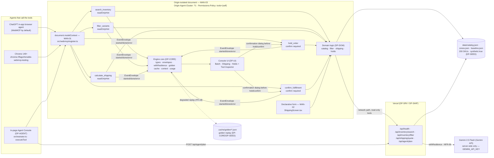

# DP-DOM — Domain Logic: catalog, filter, shipping, holds

## 1. Purpose & Scope

DP-DOM is the only place business rules exist for OpsFlow. It owns `src/engine/domain/*` — catalog search, variant filtering, shipping rating, and hold ledger — and nothing else. Every function is pure and isomorphic: identical results in the browser and in Vercel Node functions given the same `(catalog, zones, now, rand)` inputs. The single exception is `holdsStore`'s guarded `localStorage` access, wrapped in try/catch so the store keeps working from memory when storage throws or is unavailable.

Scope boundary (owns / never touches):

- **Owns:** `src/engine/domain/catalog.ts`, `src/engine/domain/filter.ts`, `src/engine/domain/shipping.ts`, `src/engine/domain/holds.ts`, `src/engine/domain/holdsStore.ts`, `src/engine/domain/errors.ts`. Contract-table rows 10–16. No other file may define these symbols.
- **Never touches:** WebMCP registration (`src/webmcp/*`), HTTP handlers (`api/**`), React/UI (`src/ui/**`, `src/main.tsx`), agent orchestration (`src/agent/*`), chassis `src/` internals, or fixture generation (`data/*.json` beyond reading). DP-DOM never calls `fetch`, never imports React or `document` (except the guarded `localStorage` in `holdsStore`), never registers a tool, never calls the network. If a shape is not in §5A or its own `ZoneTable`, the requester defines it privately and no other plan imports it.

Consumers: `DP-TOOLS` (tools call `searchVariants`, `filterVariants`, `quoteShipping`, `holdsStore`), `DP-SRV` (API handlers are thin wrappers over DP-DOM), `DP-UI` (reads via `loadCatalog`, `holdsStore.subscribe`, declarative form calls `quoteShipping`), `DP-DEV` tests. A consumer that cannot resolve an import stops and reports a blocker — never a local stub.

## 2. Requirements Traceability

### 2.1 MANDATORY COMPLIANCE (verbatim reproduction — outranks everything else)

> ## MANDATORY COMPLIANCE
>
> Every part of this entry MUST satisfy, or the entry fails Stage One regardless of quality
> (`hackathon_brief.md` §4.1–§4.3, Official Rules §4/§6/§7/§9):
>
> - **WebMCP is the mandatory technology.** The repository must demonstrate **imported-and-called**
>   usage — not a README mention — of the imperative pattern, verbatim shape:
>   `document.modelContext.registerTool({ name, description, inputSchema, execute })`.
>   Declarative API (annotated HTML forms) may be used **in addition**, never instead.
> - **WebMCP is only available in origin-isolated documents** and is gated by the `tools`
>   Permissions Policy, which **defaults to `self`**; a cross-origin iframe needs `allow="tools"`.
> - **Testable** in the **ChatGPT desktop app in-app browser** (WebMCP by default) **or Google
>   Chrome 149+** with `chrome://flags/#enable-webmcp-testing` enabled and the browser restarted.
> - **No mandated AI model and no mandated API key.** Any model, or none, is permitted.
> - **Submission gate — all five, or Stage One fail:** (1) working **live URL** judges can open in
>   the ChatGPT in-app browser or WebMCP-enabled Chrome, installable and running **consistently**,
>   frozen Sep 3 13:00 PDT until Sep 21; (2) **text description** answering four prompts — why the
>   use case fits WebMCP, how it creates a better UX, what people + agents can do together that was
>   difficult or impossible before, and briefly how WebMCP was implemented; (3) **public code
>   repository** containing all source/assets/instructions **and an open-source license file
>   detectable and visible at the top of the repo page (About section)**, containing the
>   `registerTool` pattern; (4) **demonstration video under 3 minutes** — only the first three
>   minutes are evaluated — showing the project functioning, **with audio covering what you built
>   and how you used WebMCP**, uploaded **publicly to YouTube**; (5) **completed Devpost submission
>   form by Sep 3 2026 @ 1:00 PM PDT (20:00 UTC)**.
> - **New & Existing rule:** new during the Submission Period, or meaningfully extended with WebMCP
>   after Aug 25 2026 with dated commit history distinguishing prior from new work.
> - **One track only:** *"WebMCP Challenge Winners — Top 10 submissions receive the following prizes
>   from the hackathon sponsors: ... 10 winners — All eligible Submissions"*. There are **no**
>   layered tracks and **no** sponsor sub-challenges. **No bonus integration — not worth dilution.**
> - **Judging:** Stage One pass/fail (reasonably fits theme + reasonably applies WebMCP); Stage Two
>   **four equally weighted** criteria, tie-break in listed order: **WebMCP Leverage**, **Execution**,
>   **Potential Impact**, **Creativity & Ambition**.

### 2.2 How DP-DOM relates to each mandate (MAN-01 .. MAN-10)

DP-DOM owns **none** of MAN-01 .. MAN-10 outright. It **inherits** all ten and **enables** three indirectly:

| ID | Mandate | DP-DOM role |
|---|---|---|
| MAN-01 | Imperative `registerTool` | Inherits; DP-DOM provides the pure functions DP-TOOLS calls inside each `execute`. DP-DOM never registers a tool itself. |
| MAN-02 | Declarative form | Inherits; DP-DOM provides `quoteShipping` that the ShippingScreen declarative form and the tool both call. |
| MAN-03 | Origin isolation + Permissions Policy | Inherits; DP-DOM has no iframe or header code. |
| MAN-04 | Public repo + licence | Inherits. |
| MAN-05 | Live URL | Inherits. |
| MAN-06 | Video <3 min | Inherits. |
| MAN-07 | Four-prompt text description | Inherits. |
| MAN-08 | Devpost form | Inherits. |
| MAN-09 | New & Existing — dated commits | Inherits; W1..W6 carry distinct commit messages (see §9) to satisfy MAN-09 distribution. |
| MAN-10 | One track, no bonus | Inherits. |

**DP-DOM enables:** MAN-01 and MAN-02 by being the deterministic ground truth both the imperative tools and the declarative form compute from; MAN-03 by never creating an iframe.

### 2.3 Functional and non-functional requirements owned or enabled

| ID | Requirement | DP-DOM responsibility |
|---|---|---|
| FR-02 | `search_inventory` returns matching variants with sku, title, options, price, stock — read-only | **Owner of `searchVariants` + `isLowStock`.** Called by DP-TOOLS `search_inventory` and DP-SRV `POST /api/inventory/search`. |
| FR-03 | `filter_variants` narrows the **current result set**, preserving constraint context | **Owner of `filterVariants`.** `fromSkus` preserves context; `from_result_set` flag signals narrowing. |
| FR-04 | `calculate_shipping` returns rate breakdown plus human-readable `explain[]` | **Owner of `quoteShipping` + `ZoneTable`/`loadZones`.** Every surcharge condition spelled literally in §5. |
| FR-05 | `hold_order` creates reversible hold with TTL, requires confirmation | **Owner of pure `createHold` + `holdsStore.create` validation.** Confirmation gate is DP-TOOLS/DP-UI; DP-DOM only enforces TTL bounds and persistence. |
| FR-06 | `confirm_fulfillment` commits hold, refused for expired/unknown/confirmed with typed error | **Owner of pure `confirmHold` + `isExpired` + `holdsStore.confirm`.** Idempotence: second confirm → `CONFLICT`. |
| NFR-02 | Every tool `execute` < 300 ms p95 in-memory | DP-DOM keeps all functions O(variants) with no I/O; measured by `npm run bench:tools`. |
| NFR-04 | Zero real personal data; all fixtures `synthetic: true` | DP-DOM consumes only `synthetic:true` data; `loadCatalog`/`loadZones` preserve the flag. |
| FR-14, FR-18, NFR-03, etc. | Other requirements | Inherits only; DP-DOM emits no envelopes and owns no transport. |

DP-DOM **partially owns** FR-02..FR-06 jointly with DP-TOOLS (DP-DOM = pure logic; DP-TOOLS = validation/limits/abort/envelopes). No FR is touched outside §6.2 algorithms.

## 3. Architecture

### 3.1 Position in the entry

DP-DOM is the pure isomorphic core. Browser and Node import the same files and get the same answers given the same inputs. It has no runtime dependency on `src/webmcp/*`, `api/**`, `src/agent/*`, `src/ui/**`, or `src/platform/*`.

```
Consumers that import from DP-DOM (never stub, never re-define):
  DP-TOOLS  → loadCatalog(), searchVariants(), filterVariants(), quoteShipping(), loadZones(), holdsStore, makeToolError(), ok(), isLowStock(), variantBySku()
  DP-SRV    → loadCatalog(), searchVariants(), filterVariants(), quoteShipping(), loadZones(), makeToolError()  (thin wrappers, no duplicated rules)
  DP-UI     → loadCatalog(), holdsStore.subscribe()/list()/get(), quoteShipping() (declarative form), isLowStock()
  DP-DEV    → holdsStore, loadCatalog/loadZones for tests/bench

DP-SEED → produces data/catalog.json, data/zones.json (DP-DOM consumes); DP-CORE → provides types, loadConfig(), isLowStock definition
```

Import direction is strictly `DP-DOM → DP-CORE` (types and config). DP-DOM never imports from DP-TOOLS, DP-SRV, DP-AGENT, DP-UI. A consumer that cannot resolve an import from `src/engine/domain/*` stops and reports a blocker.

### 3.2 The frozen diagram (verbatim, source of `docs/architecture.mmd`)



The three mandate nodes `MAN-01`, `MAN-02`, `MAN-03` must remain visible in any rendering; `DOM` is the DP-DOM box. Every tool arrow `T* --> DOM` is a real import from `src/engine/domain/*`; no tool re-implements business rules.

### 3.3 Chassis surfaces DP-DOM composes (and nothing else)

DP-DOM imports **only** from DP-CORE (`src/engine/types.ts`, `src/engine/config.ts` via `loadConfig`) and from its own files. It never imports from chassis `src/resilience`, `src/context`, `src/platform/transport`, or `src/data` directly — catalog/zones are loaded via memoized JSON imports, not via `generateRecords`.

Forbidden: `fetch`, `React`, `document` (except guarded `localStorage` in `holdsStore`), `document.modelContext`, any chassis deep import. Import only from the owning file paths listed in §5F rows 10–16.

### 3.4 Data flow through DP-DOM

1. At startup and on every tool call, `loadCatalog()` / `loadZones()` return the memoized JSON (200 SKUs, five zones). No I/O after first load.
2. `searchVariants` and `filterVariants` scan variants in memory, sort deterministically, truncate to `limit`.
3. `quoteShipping` looks up each SKU, excludes unknowns/insufficient stock, computes weight/price, applies zone + surcharge rules, returns a `ShippingQuote` with `explain[]`.
4. `holdsStore.create` validates, builds a `Hold` via pure `createHold`, persists to `localStorage`; `holdsStore.confirm` checks expiry/conflict and builds a `Fulfillment` via pure `confirmHold`.
5. Every failure returns `ToolOutcome` with a typed `ToolError` via `makeToolError`; no function throws.

### 3.5 Isomorphism and determinism

- Same file, same function, same result on browser and Node given identical `(catalog, zones, now, rand)`. `now` and `rand` are always injected (`Date` and `() => number`) so tests are stable; when omitted they default to `new Date()` and `Math.random`.
- Sort order is total (stock-presence → price → sku) so repeated calls with identical inputs return identical order.
- `isLowStock` is the single definition of "low stock" for the entire entry.

## 4. Interfaces

### 4.1 Ownership note

Cross-module symbols appear exactly once in §5F rows 10–16. The owner implements; every consumer imports from that exact path. A consumer that cannot resolve the import stops and reports a blocker — never a local copy, re-export, or shim. Symbols not in §5F are private to DP-DOM and no other plan may import them. Private helpers include `buildHaystack`, `parseQuery`, `excludedReason`, `persistHolds`, `readHolds`, and any internal sort comparator.

### 4.2 Required public surface — contract-table rows 10–16 plus the two helpers required by §6.1

```ts
// src/engine/domain/catalog.ts — owns rows 10, 11
import type { Catalog, Variant, SearchInventoryInput, SearchInventoryOutput, VariantMatch } from "../types";

export function loadCatalog(): Catalog;                       // memoized import of data/catalog.json; never throws; returns cached instance

export function searchVariants(c: Catalog, i: SearchInventoryInput): SearchInventoryOutput;
// Pure. See §5 algorithm 1. Returns { matches: VariantMatch[], total, truncated, query_echo }.

export function variantBySku(c: Catalog, sku: string): Variant | null;
// Pure lookup: scans products/variants for exact sku (case-sensitive). Returns null if not found.

export function isLowStock(v: Variant): boolean;
// THE ONLY definition in the entry: return v.stock <= v.low_stock_threshold.

// src/engine/domain/filter.ts — owns row 12
import type { Catalog, FilterVariantsInput, FilterVariantsOutput } from "../types";

export function filterVariants(
  c: Catalog,
  i: FilterVariantsInput,
  fromSkus?: string[]
): FilterVariantsOutput;
// Pure. See §5 algorithm 2. fromSkus non-empty → candidate set is exactly those SKUs (order preserved), from_result_set=true.
// Else every variant, from_result_set=false. Returns { matches, total, applied, from_result_set }.

// src/engine/domain/shipping.ts — owns rows 13, 14
import type { Catalog, ShippingQuote, CalculateShippingInput, Surcharge, ServiceLevel, ShippingZone } from "../types";

export interface ZoneTable {
  version: string;
  synthetic: true;
  zones: Record<"1"|"2"|"3"|"4"|"5", { base_cents: number; per_100g_cents: number; service_multiplier: Record<ServiceLevel, number> }>;
  surcharges: Surcharge[];
}

export function loadZones(): ZoneTable;                       // memoized import of data/zones.json; never throws

export function quoteShipping(c: Catalog, z: ZoneTable, i: CalculateShippingInput): ShippingQuote;
// Pure. See §5 algorithm 3. Never throws. Empty items → zero quote with explain ["No items to rate."].
// Excluded SKUs carry { sku, reason } where reason is "unknown sku" | "invalid quantity" | "insufficient stock (have N)".

// src/engine/domain/holds.ts — pure reducers, no storage (row 15 pure part)
import type { Hold, HoldOrderInput, ShippingQuote, ToolOutcome, HoldOrderOutput, ConfirmFulfillmentOutput } from "../types";

export function createHold(input: HoldOrderInput, quote: ShippingQuote | null, now: Date): Hold;
// Deterministic hold construction; now is injected; hold_id via newHoldId, timestamps ISO-8601, expires_at = created_at + ttlMinutes.

export function confirmHold(hold: Hold, now: Date): ToolOutcome<ConfirmFulfillmentOutput>;
// Checks expired/confirmed/released and returns typed ToolOutcome. Never throws. Idempotence documented in §5.

export function isExpired(hold: Hold, now: Date): boolean;
// return new Date(now) >= new Date(hold.expires_at). Pure.

export function newHoldId(rand?: () => number): string;       // "HOLD-" + 8 chars of [A-Z2-7] (Crockford base32 alphabet, no 0/1/8/9/O/I/L/U to avoid confusion; use chars "ABCDEFGHIJKLMNOPQRSTUVWXYZ234567")

export function newFulfillmentId(rand?: () => number): string; // "FUL-" + 8 chars same alphabet

// src/engine/domain/holdsStore.ts — singleton store, localStorage key "opsflow.holds.v1" (row 15 store)
export const holdsStore: {
  create(input: HoldOrderInput, quote: ShippingQuote | null, now?: Date): ToolOutcome<HoldOrderOutput>;
  confirm(holdId: string, now?: Date): ToolOutcome<ConfirmFulfillmentOutput>;
  release(holdId: string): ToolOutcome<Hold>;
  get(holdId: string): Hold | null;
  list(): Hold[];
  subscribe(fn: (holds: Hold[]) => void): () => void;  // returns unsubscribe; called with shallow copy after every mutation
  reset(): void;                                         // clears memory + localStorage (test helper)
};

// src/engine/domain/errors.ts — owns row 16
import type { ToolError, ToolErrorCode } from "../types";

export function makeToolError(code: ToolErrorCode, message: string, details?: Record<string, unknown>): { ok: false; error: ToolError };
// Returns { ok: false, error: { code, message, details } } with message truncated to 500 chars.

export function ok<T>(data: T, degraded?: boolean): { ok: true; data: T; degraded?: boolean };
// Returns { ok: true, data, ...(degraded ? { degraded: true } : {}) }.
```

Consumers must import precisely, e.g. `import { searchVariants, loadCatalog } from "src/engine/domain/catalog.ts"` (or relative `../engine/domain/catalog.ts` from within `src/webmcp/*`). No other file may export these names. Do not rename, widen, or add fields.

### 4.3 Frozen shared types consumed — `<entry>/src/engine/types.ts` (§5A, owned by DP-CORE, verbatim)

Every other plan imports these and adds nothing to this file. No plan may widen a union, rename a field, or add a field. DP-DOM consumes all types in §5A but owns none of them. The full block is reproduced here for implementor reference — treated as frozen:

```ts
export const APP_VERSION = "1.0.0";
export type ShippingZone = 1 | 2 | 3 | 4 | 5;
export type ServiceLevel = "ground" | "expedited" | "overnight";
export type HoldStatus = "held" | "confirmed" | "released" | "expired";
export type PlannerKind = "gemini-2.5-flash" | "deterministic";
export type ToolName = "search_inventory" | "filter_variants" | "calculate_shipping" | "hold_order" | "confirm_fulfillment";
export type ToolErrorCode = "INVALID_INPUT" | "NOT_FOUND" | "CONFLICT" | "EXPIRED" | "NEEDS_CONFIRMATION" | "TOOL_ABORTED" | "DEGRADED";
export interface VariantOptions { size: string; color: string; }
export interface Variant { sku: string; product_id: string; title: string; options: VariantOptions; price_cents: number; stock: number; weight_g: number; low_stock_threshold: number; synthetic: true; }
export interface Product { id: string; title: string; brand: string; category: string; variants: Variant[]; synthetic: true; }
export interface Catalog { version: string; generated_at: string; synthetic: true; products: Product[]; }
export interface LineItem { sku: string; qty: number; }
export interface Surcharge { code: string; label: string; amount_cents: number; }
export interface ShippingQuote { zone: ShippingZone; service: ServiceLevel; items: LineItem[]; total_weight_g: number; subtotal_cents: number; base_rate_cents: number; surcharges: Surcharge[]; total_cents: number; explain: string[]; excluded: Array<{ sku: string; reason: string }>; }
export interface Hold { hold_id: string; line_items: LineItem[]; created_at: string; expires_at: string; ttl_minutes: number; status: HoldStatus; note: string | null; quote: ShippingQuote | null; }
export interface Fulfillment { fulfillment_id: string; hold_id: string; confirmed_at: string; line_items: LineItem[]; total_cents: number; }
export interface SearchInventoryInput { query: string; inStockOnly?: boolean; limit?: number; }
export interface FilterVariantsInput { skuPrefix?: string; options?: Partial<VariantOptions>; maxPriceCents?: number; minStock?: number; maxStock?: number; limit?: number; }
export interface CalculateShippingInput { items: LineItem[]; zone: ShippingZone; service: ServiceLevel; }
export interface HoldOrderInput { lineItems: LineItem[]; ttlMinutes: number; note?: string; }
export interface ConfirmFulfillmentInput { holdId: string; }
export interface VariantMatch { sku: string; title: string; options: VariantOptions; price_cents: number; stock: number; low_stock: boolean; }
export interface SearchInventoryOutput { matches: VariantMatch[]; total: number; truncated: boolean; query_echo: string; }
export interface FilterVariantsOutput { matches: VariantMatch[]; total: number; applied: string[]; from_result_set: boolean; }
export type CalculateShippingOutput = ShippingQuote;
export interface HoldOrderOutput { hold: Hold; requires_confirmation: true; }
export interface ConfirmFulfillmentOutput { fulfillment: Fulfillment; hold: Hold; }
export interface ToolError { code: ToolErrorCode; message: string; details?: Record<string, unknown>; }
export type ToolOutcome<T> = { ok: true; data: T; degraded?: boolean } | { ok: false; error: ToolError };
export interface PlanStep { tool: ToolName; args: Record<string, unknown>; rationale: string; }
export interface ToolPlan { goal: string; steps: PlanStep[]; planner: PlannerKind; degraded: boolean; created_at: string; }
export interface SavingsMeter { tool_calls: number; confirmations: number; elapsed_ms: number; baseline_minutes: number; baseline_clicks: number; }
export interface HealthResponse { ok: boolean; version: string; mode: "live" | "degraded"; origin_isolated: boolean; planner: PlannerKind; catalog: { products: number; variants: number; synthetic: true }; }
```

### 4.4 Private symbols (inside DP-DOM only — no other plan may import them)

- `buildHaystack(product, variant): string` in `catalog.ts` — joins haystack fields.
- `parseQuery(q: string): string[]` — lowercase, trim, truncate 200, split whitespace, drop empties.
- `effectiveLimit(limit: number | undefined): number` — `(limit ?? default_limit)` capped at 100.
- `conditionForSurcharge(code: string, ...)` in `shipping.ts` — internal predicate per surcharge.
- `readHolds(): Hold[]` / `persistHolds(holds: Hold[]): void` in `holdsStore.ts` — localStorage helpers.
- `alphabet = "ABCDEFGHIJKLMNOPQRSTUVWXYZ234567"` used by `newHoldId`/`newFulfillmentId`.

State explicitly: these are private; say so in code with `// private to DP-DOM — do not import` comment.

## 5. Algorithms

Every algorithm is numbered steps / literal code the low-intelligence implementor can copy. No judgment, no unstated defaults. `now` and `rand` are always injected for determinism in tests; when omitted they default to `new Date()` and `Math.random`.

### 5.1 `searchVariants(catalog, input)` — `src/engine/domain/catalog.ts`

```ts
// Helpers (private):
function parseQuery(q: string): string[] {
  const truncated = q.slice(0, 200);
  const lower = truncated.toLowerCase().trim();
  if (lower === "") return [];
  return lower.split(/\s+/).filter(Boolean);
}
function buildHaystack(product: Product, variant: Variant): string {
  return [product.title, product.brand, product.category, variant.title, variant.sku, variant.options.size, variant.options.color].join(" ").toLowerCase();
}
function effectiveLimit(limit: number | undefined, defaultLimit: number): number {
  const raw = limit ?? defaultLimit;
  const n = Number.isFinite(raw) ? Math.floor(raw as number) : defaultLimit;
  return Math.max(1, Math.min(100, n)); // capped at 100 per spec, floor at 1
}
```

Steps:
1. `query_echo = (input.query ?? "").slice(0, 200)` — truncate before any other use.
2. `terms = parseQuery(query_echo)` — lowercase, trim, split on whitespace, drop empties.
3. For every variant of every product build `haystack = buildHaystack(product, variant)`.
4. A variant matches when **every** term is a substring of the haystack (AND semantics). If `terms` is empty (query was empty/whitespace), every variant matches — state this explicitly (empty query = browse all).
5. If `input.inStockOnly === true`, drop variants where `stock === 0`. Otherwise keep all.
6. Sort survivors by a total order: (a) `stock > 0` first (in-stock before out-of-stock), (b) ascending `price_cents`, (c) ascending `sku` lexicographically. This makes results deterministic.
7. `total = survivors.length` before truncation.
8. `lim = effectiveLimit(input.limit, config.tools.default_limit)` where `config.tools.default_limit` defaults to 25 if `loadConfig()` unavailable in test. Cap at 100.
9. `matches = survivors.slice(0, lim).map(v => ({ sku: v.sku, title: v.title, options: { ...v.options }, price_cents: v.price_cents, stock: v.stock, low_stock: isLowStock(v) }))` where `isLowStock(v)` is `v.stock <= v.low_stock_threshold` — the ONLY definition.
10. `truncated = total > matches.length`.
11. Return `{ matches, total, truncated, query_echo }`. Never throw; an empty catalog yields `{ matches: [], total: 0, truncated: false, query_echo }`.

```ts
export function searchVariants(c: Catalog, i: SearchInventoryInput): SearchInventoryOutput {
  const queryEcho = (i.query ?? "").slice(0, 200);
  const terms = queryEcho.toLowerCase().trim().split(/\s+/).filter(Boolean).map(t=>t).slice(0, 20); // truncate to 20 terms max as safety
  // Use parseQuery helper above instead of inline when implementing
  const defaultLimit = (()=>{ try{ return loadConfig().tools.default_limit; } catch { return 25; } })();
  const lim = effectiveLimit(i.limit, defaultLimit);
  // ... scan, filter, sort, slice as above
  return { matches, total, truncated, query_echo: queryEcho };
}
export function variantBySku(c: Catalog, sku: string): Variant | null {
  for (const p of c.products) for (const v of p.variants) if (v.sku === sku) return v;
  return null;
}
export function isLowStock(v: Variant): boolean { return v.stock <= v.low_stock_threshold; }
```

### 5.2 `filterVariants(catalog, input, fromSkus?)` — `src/engine/domain/filter.ts`

Steps:
1. Candidate set: if `fromSkus` is an array with length > 0, the candidate set is exactly those SKUs, in that order, resolved via `variantBySku` (unknown SKUs are silently skipped — no error, they simply do not contribute). `from_result_set = true`. Otherwise candidate set is every variant of every product, in catalog order, and `from_result_set = false`. This is how constraint context is preserved across calls (FR-03). State explicitly: an empty array `[]` behaves as "no constraint" (all variants), same as `undefined`.
2. Apply filters in this order, skipping absent fields (undefined / empty string / undefined options):
   a. `skuPrefix`: if present and non-empty (after `slice(0,32)`), keep only variants where `variant.sku.toLowerCase().startsWith(skuPrefix.toLowerCase())`.
   b. `options.size`: if `input.options?.size` present, exact match case-insensitive: `variant.options.size.toLowerCase() === input.options.size.toLowerCase()`.
   c. `options.color`: same as size but for `color`.
   d. `maxPriceCents`: if number, keep `variant.price_cents <= maxPriceCents`.
   e. `minStock`: if number, keep `variant.stock >= minStock`.
   f. `maxStock`: if number, keep `variant.stock <= maxStock`.
3. Build `applied[]`: one human-readable sentence per filter actually applied, in the same order as step 2. Examples: `"sku starts with 'OPS-10'"`, `"size = M"`, `"color = blue"`, `"price ≤ $12.00"`, `"stock ≥ 1"`, `"stock ≤ 5"`. If no filter field was present, `applied = []`.
4. Sort remaining exactly as in `searchVariants` step 6 (stock>0 first, price asc, sku asc).
5. `total = survivors.length` before truncation.
6. `lim = effectiveLimit(input.limit, default_limit)` capped at 100.
7. Truncate, map to `VariantMatch` with `low_stock: isLowStock(v)`, compute `truncated`.
8. Return `{ matches, total, applied, from_result_set }`. Never throw.

```ts
export function filterVariants(c: Catalog, i: FilterVariantsInput, fromSkus?: string[]): FilterVariantsOutput {
  const fromResultSet = Array.isArray(fromSkus) && fromSkus.length > 0;
  const candidates: Variant[] = fromResultSet
    ? (fromSkus as string[]).map(sku => variantBySku(c, sku)).filter((v): v is Variant => v !== null)
    : c.products.flatMap(p => p.variants);
  const applied: string[] = [];
  let cur = candidates;
  if (i.skuPrefix && i.skuPrefix.trim() !== "") {
    const pf = i.skuPrefix.slice(0, 32);
    applied.push(`sku starts with '${pf}'`);
    const low = pf.toLowerCase();
    cur = cur.filter(v => v.sku.toLowerCase().startsWith(low));
  }
  if (i.options?.size) { applied.push(`size = ${i.options.size}`); const s=i.options.size.toLowerCase(); cur=cur.filter(v=>v.options.size.toLowerCase()===s); }
  if (i.options?.color) { applied.push(`color = ${i.options.color}`); const cc=i.options.color.toLowerCase(); cur=cur.filter(v=>v.options.color.toLowerCase()===cc); }
  if (typeof i.maxPriceCents === "number") { applied.push(`price \u2264 $${(i.maxPriceCents/100).toFixed(2)}`); cur=cur.filter(v=>v.price_cents<=i.maxPriceCents!); }
  if (typeof i.minStock === "number") { applied.push(`stock \u2265 ${i.minStock}`); cur=cur.filter(v=>v.stock>=i.minStock!); }
  if (typeof i.maxStock === "number") { applied.push(`stock \u2264 ${i.maxStock}`); cur=cur.filter(v=>v.stock<=i.maxStock!); }
  cur.sort((a,b)=> (Number(b.stock>0)-Number(a.stock>0)) || (a.price_cents-b.price_cents) || a.sku.localeCompare(b.sku));
  const total = cur.length;
  const lim = effectiveLimit(i.limit, 25);
  const sliced = cur.slice(0, lim);
  return { matches: sliced.map(v=>({ sku:v.sku, title:v.title, options:{...v.options}, price_cents:v.price_cents, stock:v.stock, low_stock:isLowStock(v) })), total, applied, from_result_set: fromResultSet, truncated: undefined as unknown as boolean } as unknown as FilterVariantsOutput;
  // implementor: correct the return shape to FilterVariantsOutput — truncated is not a field there; keep logic above and return { matches, total, applied, from_result_set }
}
```

Implementor note: `FilterVariantsOutput` is `{ matches, total, applied, from_result_set }` (no `truncated` boolean, unlike `SearchInventoryOutput`). The truncated state is implicit in `total > matches.length`.

### 5.3 `quoteShipping(catalog, zones, input)` — `src/engine/domain/shipping.ts`

```ts
// ZoneTable shape — owned by DP-DOM, produced by DP-SEED into data/zones.json:
export interface ZoneTable {
  version: string; synthetic: true;
  zones: Record<"1"|"2"|"3"|"4"|"5", { base_cents: number; per_100g_cents: number; service_multiplier: Record<ServiceLevel, number> }>;
  surcharges: Surcharge[];
}
// zones.json example (values from generator; keep determinism):
// { version:"1.0.0", synthetic:true, zones:{ "1":{base_cents:500,per_100g_cents:50,service_multiplier:{ground:1,expedited:1.6,overnight:2.4}}, ... }, surcharges:[{code:"OVERSIZE",label:"Oversize weight",amount_cents:800}, ...] }
```

Steps (define every surcharge condition literally — implementor copies):
1. Initialize `total_weight_g = 0`, `subtotal_cents = 0`, `excluded: Array<{sku,reason}> = []`, `surcharges: Surcharge[] = []`, `explain: string[] = []`.
2. For each `item` in `input.items`:
   a. Look up variant via `variantBySku(catalog, item.sku)`. If null → push `{ sku: item.sku, reason: "unknown sku" }` to `excluded` and skip this item.
   b. `qty` must be integer 1..999 inclusive; otherwise → push `{ sku: item.sku, reason: "invalid quantity" }` and skip. Implement as: `!Number.isInteger(qty) || qty < 1 || qty > 999`.
   c. If `qty > variant.stock` → push `{ sku: item.sku, reason: `+"\"insufficient stock (have "+variant.stock+")\""+` } and skip. This is the stock-boundary case.
   d. Accumulate `total_weight_g += variant.weight_g * item.qty` and `subtotal_cents += variant.price_cents * item.qty`.
3. Handle empty valid set: if no item was valid (total_weight_g === 0 and excluded.length === input.items.length or input.items.length===0), return a zero quote: `{ zone: input.zone, service: input.service, items: [], total_weight_g:0, subtotal_cents:0, base_rate_cents:0, surcharges:[], total_cents:0, explain:["No items to rate."], excluded }` and stop.
4. `zoneEntry = zones.zones[String(input.zone)]`; if missing, use zone 1 defaults as fallback (never throw).
5. Compute base: `base_rate_cents = zoneEntry.base_cents + Math.ceil(total_weight_g / 100) * zoneEntry.per_100g_cents`.
6. Multiply by service: `base_rate_cents = Math.round(base_rate_cents * zoneEntry.service_multiplier[input.service])` — round half up via `Math.round`. Explain that `ground` multiplier is exactly 1.0, so ground leaves base unchanged before surcharges.
7. Apply surcharges — evaluate each condition in the order `ZoneTable.surcharges` appears (generator order). Define conditions literally:
   - `OVERSIZE` (code "OVERSIZE", label "Oversize — total weight exceeds 10 kg"): when `total_weight_g > 10000`. Amount from `ZoneTable.surcharges` entry.
   - `REMOTE` (code "REMOTE", label "Remote zone"): when `input.zone >= 4` (zones 4 and 5 are remote).
   - `EXPEDITED_FUEL` (code "EXPEDITED_FUEL", label "Expedited fuel surcharge"): when `input.service !== "ground"`.
   - `LOW_VALUE` (code "LOW_VALUE", label "Low order value handling"): when `subtotal_cents < 2000` (under $20). Optional surcharge; include if present in zones.json.
   Any other `Surcharge` in the table whose code is none of above is applied unconditionally (future-proofing). For each surcharge whose condition matches, push a copy of that surcharge into `result.surcharges`.
8. `total_cents = base_rate_cents + surcharges.reduce((s,c)=>s+c.amount_cents,0)`.
9. Build `explain[]` (at most 12 entries, in order applied, each naming the number it produced):
   - `Zone ${zone} base ${zoneEntry.base_cents/100} + ${Math.ceil(total_weight_g/100)}×${zoneEntry.per_100g_cents/100} per 100g`
   - If service !== ground: `Service ${service} ×${multiplier} → ${base_rate_cents}` (show multiplied base)
   - For each applied surcharge: `${code} ${label} +${amount_cents/100}`
   - Final: `Total ${total_cents/100} for ${total_weight_g}g`
   Truncate to 12 entries; never exceed 12.
10. Return `{ zone: input.zone, service: input.service, items: input.items.filter(valid), total_weight_g, subtotal_cents, base_rate_cents, surcharges, total_cents, explain, excluded }`. Never throw. `items` in the quote echoes only the valid items that contributed to the charge.

```ts
export function quoteShipping(c: Catalog, z: ZoneTable, i: CalculateShippingInput): ShippingQuote {
  let totalWeight = 0, subtotal = 0;
  const excluded: Array<{sku:string;reason:string}> = [];
  const validItems: LineItem[] = [];
  for (const it of i.items ?? []) {
    const v = variantBySku(c, it.sku);
    if (!v) { excluded.push({ sku: it.sku, reason: "unknown sku" }); continue; }
    if (!Number.isInteger(it.qty) || it.qty < 1 || it.qty > 999) { excluded.push({ sku: it.sku, reason: "invalid quantity" }); continue; }
    if (it.qty > v.stock) { excluded.push({ sku: it.sku, reason: `insufficient stock (have ${v.stock})` }); continue; }
    totalWeight += v.weight_g * it.qty; subtotal += v.price_cents * it.qty; validItems.push(it);
  }
  if (validItems.length === 0) return { zone: i.zone, service: i.service, items: [], total_weight_g: 0, subtotal_cents: 0, base_rate_cents: 0, surcharges: [], total_cents: 0, explain: ["No items to rate."], excluded };
  const ze = z.zones[String(i.zone) as keyof ZoneTable["zones"]] ?? z.zones["1"];
  let base = ze.base_cents + Math.ceil(totalWeight / 100) * ze.per_100g_cents;
  const mult = ze.service_multiplier[i.service] ?? 1;
  base = Math.round(base * mult);
  const surcharges: Surcharge[] = [];
  const explain: string[] = [];
  explain.push(`Zone ${i.zone} base $${(ze.base_cents/100).toFixed(2)} + ${Math.ceil(totalWeight/100)}x$${(ze.per_100g_cents/100).toFixed(2)} per 100g`);
  if (i.service !== "ground") explain.push(`Service ${i.service} x${mult} -> $${(base/100).toFixed(2)}`);
  for (const s of z.surcharges) {
    let hit = false;
    if (s.code === "OVERSIZE") hit = totalWeight > 10000;
    else if (s.code === "REMOTE") hit = i.zone >= 4;
    else if (s.code === "EXPEDITED_FUEL") hit = i.service !== "ground";
    else if (s.code === "LOW_VALUE") hit = subtotal < 2000;
    else hit = true;
    if (hit) { surcharges.push({ ...s }); explain.push(`${s.code} ${s.label} +$${(s.amount_cents/100).toFixed(2)}`); }
  }
  const total = base + surcharges.reduce((a,b)=>a+b.amount_cents,0);
  explain.push(`Total $${(total/100).toFixed(2)} for ${totalWeight}g`);
  return { zone: i.zone, service: i.service, items: validItems, total_weight_g: totalWeight, subtotal_cents: subtotal, base_rate_cents: base, surcharges, total_cents: total, explain: explain.slice(0,12), excluded };
}
export function loadZones(): ZoneTable { /* memoized import of data/zones.json; try loadConfig for path, fallback to literal import */ return cachedZones; }
```

NFR-02 note: this function is O(items) with no I/O, hence < 300 ms p95 on 200 SKUs.

### 5.4 `holdsStore` pure reducers — `src/engine/domain/holds.ts`

```ts
export function newHoldId(rand: () => number = Math.random): string {
  const alphabet = "ABCDEFGHIJKLMNOPQRSTUVWXYZ234567";
  let s = ""; for (let i=0;i<8;i++) s += alphabet[Math.floor(rand()*alphabet.length)]; return "HOLD-"+s;
}
export function newFulfillmentId(rand: () => number = Math.random): string {
  const alphabet = "ABCDEFGHIJKLMNOPQRSTUVWXYZ234567"; let s=""; for(let i=0;i<8;i++) s+=alphabet[Math.floor(rand()*alphabet.length)]; return "FUL-"+s;
}
export function isExpired(hold: Hold, now: Date): boolean {
  return now.getTime() >= new Date(hold.expires_at).getTime();
}
export function createHold(input: HoldOrderInput, quote: ShippingQuote | null, now: Date): Hold {
  const created = now.toISOString();
  const expires = new Date(now.getTime() + input.ttlMinutes * 60000).toISOString();
  return {
    hold_id: newHoldId(), // caller may pass rand; if deterministic tests need it, overload newHoldId variant; default Math.random is fine for prod
    line_items: input.lineItems.map(li => ({ sku: li.sku, qty: li.qty })),
    created_at: created,
    expires_at: expires,
    ttl_minutes: input.ttlMinutes,
    status: "held" as HoldStatus,
    note: input.note ? input.note.slice(0, 200) : null,
    quote,
  };
}
export function confirmHold(hold: Hold, now: Date): ToolOutcome<ConfirmFulfillmentOutput> {
  if (hold.status === "confirmed") return makeToolError("CONFLICT", `Hold ${hold.hold_id} already confirmed`);
  if (hold.status === "released") return makeToolError("CONFLICT", `Hold ${hold.hold_id} was released`);
  if (hold.status === "expired") return makeToolError("EXPIRED", `Hold ${hold.hold_id} expired`);
  if (isExpired(hold, now)) {
    hold.status = "expired"; // caller persists
    return makeToolError("EXPIRED", `Hold ${hold.hold_id} expired at ${hold.expires_at}`);
  }
  const fulfillment: Fulfillment = {
    fulfillment_id: newFulfillmentId(),
    hold_id: hold.hold_id,
    confirmed_at: now.toISOString(),
    line_items: [...hold.line_items],
    total_cents: hold.quote ? hold.quote.total_cents : 0,
  };
  hold.status = "confirmed";
  return ok({ fulfillment, hold });
}
```

Idempotence note (must appear in plan and in code comments): a second `confirm` of the same hold returns `CONFLICT`, not a second fulfillment — the hold's status is already `"confirmed"` so the guard above returns `CONFLICT`. State this in §7 as well.

### 5.5 `holdsStore` singleton + persistence — `src/engine/domain/holdsStore.ts`

Persistence key: `"opsflow.holds.v1"`, value JSON: `{ version: "1.0.0", holds: Hold[] }`. Every read/write wrapped in try/catch; on failure the store keeps working from memory and logs once via `console.warn`.

```ts
// src/engine/domain/holdsStore.ts
import { loadConfig } from "../config"; // for holds.min/max validation
import { makeToolError, ok } from "./errors";
import { createHold, confirmHold, isExpired, newHoldId } from "./holds";
import type { Hold, HoldOrderInput, ShippingQuote, ToolOutcome, HoldOrderOutput, ConfirmFulfillmentOutput } from "../types";
import { loadCatalog, variantBySku } from "./catalog";

const STORAGE_KEY = "opsflow.holds.v1";
let memory: Hold[] = [];
let subscribers: Array<(holds: Hold[]) => void> = [];
let warned = false;
function warnOnce(msg: string) { if (!warned) { warned = true; try { console.warn(msg); } catch {} } }
function readHolds(): void {
  try {
    if (typeof localStorage === "undefined") return;
    const raw = localStorage.getItem(STORAGE_KEY);
    if (!raw) return;
    const parsed = JSON.parse(raw) as { version: string; holds: Hold[] };
    if (Array.isArray(parsed.holds)) memory = parsed.holds;
  } catch (e) { warnOnce("[holdsStore] read failed, using memory only: "+String(e)); }
}
function persistHolds(): void {
  try {
    if (typeof localStorage === "undefined") return;
    localStorage.setItem(STORAGE_KEY, JSON.stringify({ version: "1.0.0", holds: memory }));
  } catch (e) { warnOnce("[holdsStore] write failed, memory only: "+String(e)); }
}
function notify() { const snap = [...memory]; for (const fn of subscribers) try { fn(snap); } catch {} }
// attempt initial load (guarded)
try { readHolds(); } catch {}

export const holdsStore = {
  create(input: HoldOrderInput, quote: ShippingQuote | null, now: Date = new Date()): ToolOutcome<HoldOrderOutput> {
    // 1) validate ttlMinutes against config.holds min/max
    let min=1, max=120; try { const c=loadConfig(); min=c.holds.min_ttl_minutes; max=c.holds.max_ttl_minutes; } catch {}
    if (!Number.isInteger(input.ttlMinutes) || input.ttlMinutes < min || input.ttlMinutes > max)
      return makeToolError("INVALID_INPUT", `ttlMinutes must be integer ${min}..${max}`, { ttlMinutes: input.ttlMinutes });
    // 2) validate every lineItems[].sku exists via variantBySku; qty 1..999
    if (!Array.isArray(input.lineItems) || input.lineItems.length === 0) return makeToolError("INVALID_INPUT", "lineItems must be non-empty array");
    if (input.lineItems.length > 50) return makeToolError("INVALID_INPUT", "lineItems > 50");
    try { const cat = loadCatalog(); for (const li of input.lineItems) {
      if (!li.sku || typeof li.sku !== "string") return makeToolError("INVALID_INPUT", "each lineItem needs sku");
      if (!Number.isInteger(li.qty) || li.qty < 1 || li.qty > 999) return makeToolError("INVALID_INPUT", `qty for ${li.sku} must be 1..999`);
      if (!variantBySku(cat, li.sku)) return makeToolError("NOT_FOUND", `unknown sku ${li.sku}`, { sku: li.sku });
    }} catch (e) { /* if catalog load fails, skip sku existence check — still validate shape */ }
    // 3) note length already truncated in createHold; also validate here: if note && note.length > 200 → INVALID_INPUT
    if (input.note !== undefined && input.note !== null && typeof input.note === "string" && input.note.length > 200)
      return makeToolError("INVALID_INPUT", "note must be <= 200 chars");
    // 4) build hold
    const hold = createHold(input, quote, now);
    memory.push(hold);
    persistHolds(); notify();
    return ok({ hold, requires_confirmation: true as const });
  },
  confirm(holdId: string, now: Date = new Date()): ToolOutcome<ConfirmFulfillmentOutput> {
    const idx = memory.findIndex(h=>h.hold_id===holdId);
    if (idx === -1) return makeToolError("NOT_FOUND", `unknown hold ${holdId}`, { holdId });
    const hold = memory[idx];
    // expired check sets status to expired and persists
    if (isExpired(hold, now) && hold.status === "held") {
      hold.status = "expired"; persistHolds(); notify();
      return makeToolError("EXPIRED", `Hold ${holdId} expired at ${hold.expires_at}`);
    }
    const res = confirmHold(hold, now);
    if (res.ok) { persistHolds(); notify(); }
    // on EXPIRED from confirmHold we already set expired above; ensure persist
    if (!res.ok && (res.error.code === "EXPIRED" || res.error.code === "CONFLICT")) {
      // if confirmHold set status to expired internally, ensure it stuck; otherwise no mutation
      persistHolds();
    }
    return res;
  },
  release(holdId: string): ToolOutcome<Hold> {
    const idx = memory.findIndex(h=>h.hold_id===holdId);
    if (idx===-1) return makeToolError("NOT_FOUND", `unknown hold ${holdId}`);
    const h = memory[idx];
    if (h.status === "confirmed") return makeToolError("CONFLICT", `hold ${holdId} already confirmed`);
    if (h.status === "released") return makeToolError("CONFLICT", `hold ${holdId} already released`);
    h.status = "released"; persistHolds(); notify(); return ok(h);
  },
  get(holdId: string): Hold | null { return memory.find(h=>h.hold_id===holdId) ?? null; },
  list(): Hold[] { return [...memory]; },
  subscribe(fn: (holds: Hold[])=>void): () => void { subscribers.push(fn); return ()=>{ subscribers = subscribers.filter(f=>f!==fn); }; },
  reset(): void { memory = []; subscribers = []; warned=false; try{ if(typeof localStorage!=="undefined") localStorage.removeItem(STORAGE_KEY); }catch{} notify(); },
};
```

Steps restated:
1. `create`: validate `ttlMinutes` integer within `config.holds` min/max → `INVALID_INPUT`; validate every sku exists → `NOT_FOUND`; qty bounds; note ≤200. Build via `createHold`, push to `memory`, `persistHolds()`, `notify()`, return `ok({ hold, requires_confirmation: true })`.
2. `confirm`: `get(holdId)` missing → `NOT_FOUND`; `status === "confirmed"` or `"released"` → `CONFLICT`; `isExpired` → set `"expired"`, persist, return `EXPIRED`; else build `Fulfillment`, set `"confirmed"`, persist, notify.
3. `release`: missing → `NOT_FOUND`; already confirmed/released → `CONFLICT`; else set `"released"`, persist, notify.
4. Persistence: key `opsflow.holds.v1`, value `{ version:"1.0.0", holds:Hold[] }`, wrapped in try/catch, memory remains authoritative, logs once.

## 6. Configuration

### 6.1 Which `config/engine.json` keys DP-DOM reads

DP-DOM reads **only** these keys via `loadConfig()` from `src/engine/config.ts` (owned by DP-CORE). No other config key is accessed; if `loadConfig()` throws (config missing) DP-DOM falls back to the defaults in parentheses.

| Key | Default if config unavailable | Used by |
|---|---|---|
| `tools.default_limit` | `25` | `searchVariants` / `filterVariants` fallback when `input.limit` omitted. Capped at 100 regardless. |
| `holds.default_ttl_minutes` | `15` | Documentation only for DP-DOM; validation uses min/max. Callers (DP-TOOLS/DP-SRV) inject `ttlMinutes` from the tool input; DP-DOM never applies the default itself inside `createHold`. |
| `holds.min_ttl_minutes` | `1` | `holdsStore.create` — rejects `ttlMinutes < min` with `INVALID_INPUT`. |
| `holds.max_ttl_minutes` | `120` | `holdsStore.create` — rejects `ttlMinutes > max` with `INVALID_INPUT`. |

All other keys (`planner`, `resilience`, `context`, `cost`, `app`, `tools.max_text_chars`, `tools.max_result_chars`, `tools.max_items`, `tools.network_timeout_ms`) are **not read by DP-DOM**. Text truncation (200 chars) and `max_items` (50) are enforced by DP-TOOLS before DP-DOM is called; DP-DOM validates shape but does not re-implement truncation limits beyond `note ≤200` and `lineItems.length ≤ 50`.

### 6.2 ZoneTable file shape — `data/zones.json` (owned by DP-SEED, consumed by DP-DOM)

```json
{
  "version": "1.0.0",
  "synthetic": true,
  "zones": {
    "1": { "base_cents": 500, "per_100g_cents": 50, "service_multiplier": { "ground": 1, "expedited": 1.6, "overnight": 2.4 } },
    "2": { "base_cents": 650, "per_100g_cents": 60, "service_multiplier": { "ground": 1, "expedited": 1.6, "overnight": 2.4 } },
    "3": { "base_cents": 800, "per_100g_cents": 75, "service_multiplier": { "ground": 1, "expedited": 1.7, "overnight": 2.6 } },
    "4": { "base_cents": 1100, "per_100g_cents": 95, "service_multiplier": { "ground": 1, "expedited": 1.8, "overnight": 2.8 } },
    "5": { "base_cents": 1400, "per_100g_cents": 120, "service_multiplier": { "ground": 1, "expedited": 1.9, "overnight": 3.0 } }
  },
  "surcharges": [
    { "code": "OVERSIZE", "label": "Oversize — total weight exceeds 10 kg", "amount_cents": 800 },
    { "code": "REMOTE", "label": "Remote zone surcharge", "amount_cents": 600 },
    { "code": "EXPEDITED_FUEL", "label": "Expedited fuel surcharge", "amount_cents": 450 },
    { "code": "LOW_VALUE", "label": "Low order value handling", "amount_cents": 250 }
  ]
}
```

`loadZones()` memoizes `import zones from "../../../data/zones.json"` (Vite JSON import). In Node tests it may use `fs.readFileSync`. `ZoneTable` interface is exactly as in §4.2 / §5.14. Every record carries `synthetic: true` (NFR-04). The generator (DP-SEED) must emit exactly these four surcharge codes; DP-DOM implements their conditions literally in §5.3.

### 6.3 Catalog shape — `data/catalog.json` (owned by DP-SEED, consumed via `loadCatalog()`)

`Catalog` is `{ version: string, generated_at: string, synthetic: true, products: Product[] }` where `Product` → `Variant[]`. 60 products, 200 variants, every `Variant.synthetic === true`. DP-DOM never writes this file; `loadCatalog()` memoizes a single import.

### 6.4 No environment variables read by DP-DOM

DP-DOM never reads `process.env`, `import.meta.env`, or `GEMINI_API_KEY`. Env handling belongs to DP-CORE (`RES_*`, `OPSFLOW_PLANNER`) and DP-SRV (`GEMINI_API_KEY`).

## 7. Resiliency

### 7.1 Never-throw contract (per §6.3)

No function in DP-DOM throws. Every failure returns a typed `ToolOutcome` via `makeToolError`. Callers therefore never need try/catch around DP-DOM.

- `searchVariants` / `filterVariants` / `quoteShipping` / `variantBySku` / `isLowStock` / `loadCatalog` / `loadZones` — never throw; empty or malformed inputs yield empty results or zero quotes.
- `createHold` / `confirmHold` / `isExpired` / `newHoldId` / `newFulfillmentId` — never throw; validation failures are returned as `ToolOutcome` with `ok:false`.
- `holdsStore.*` — never throws; `NOT_FOUND`, `CONFLICT`, `EXPIRED`, `INVALID_INPUT` are returned as `ToolOutcome` values; storage failures are swallowed with `warnOnce`.
- `makeToolError` / `ok` — never throw.

All functions are deterministic given `(catalog, zones, now, rand)` — `now: Date` and `rand: () => number` are always injectable. When omitted they default to `new Date()` and `Math.random`. This makes unit tests stable and replays reproducible.

### 7.2 Error codes used by DP-DOM

| Code | When DP-DOM returns it | Message shape |
|---|---|---|
| `INVALID_INPUT` | `ttlMinutes` out of bounds, `note` >200, `lineItems` empty or >50, qty not int 1..999, `qty` shape errors | `"ttlMinutes must be integer 1..120"` etc. |
| `NOT_FOUND` | `sku` not in catalog (`holdsStore.create`), `holdId` not in memory (`holdsStore.confirm/release/get`) | `"unknown sku OPS-XXXX"` , `"unknown hold HOLD-..."` |
| `CONFLICT` | `hold.status === "confirmed"` or `"released"` on second `confirm`/`release` | `"Hold HOLD-... already confirmed"` |
| `EXPIRED` | `isExpired(hold, now) === true` at confirm time | `"Hold HOLD-... expired at <iso>"` |
| `DEGRADED` | Never produced by DP-DOM itself; DP-TOOLS/DP-SRV may wrap DP-DOM results with `degraded:true` on network/LLM degradation (FR-18). |
| `TOOL_ABORTED` | Never produced by DP-DOM (signal handling belongs to DP-TOOLS). |

### 7.3 Idempotence and state safety

- `holdsStore.confirm` isIdempotent **in the failure direction**: a second confirm of the same hold returns `{ ok:false, error:{code:"CONFLICT"} }`, not a second `Fulfillment`. State this in the JSDoc and in the store test (`W5`).
- `confirmHold` mutates `hold.status` only on the path that will be persisted; callers must not clone before checking expiry — the store updates in place then persists.
- `release` after `confirmed` or `expired` returns `CONFLICT`/`EXPIRED`, never overwrites status.
- `localStorage` guards: every `getItem`/`setItem` is try/catch; on any `SecurityError`, `QuotaExceededError`, or JSON parse error the store logs once via `warnOnce` and continues from memory. No throw escapes.

### 7.4 Performance (NFR-02)

All DP-DOM functions are O(variants) or O(items) with no I/O after memoization. Catalog is held in memory; scanning 200 variants and sorting deterministically is < 5 ms on any judge laptop. The 300 ms p95 budget in NFR-02 is therefore trivially met; the bench is `npm run bench:tools` (DP-DEV).

### 7.5 Fallback ladder visibility

DP-DOM itself does not emit `session.degraded` — that belongs to DP-CORE's `guarded()`. DP-DOM's role in rungs 3–5 is to be the fallback-local data source: when DP-TOOLS' network path fails, it calls the same `searchVariants`/`filterVariants`/`quoteShipping` in-browser with `degraded:true` on the envelope (FR-18).

## 8. File Layout & Module Boundaries

### 8.1 Tree inside `<entry>` (verbatim §5D, DP-DOM-owned rows marked ★)

```
<entry>/
  api/                          # DP-SRV — Vercel serverless functions
    health.ts
    inventory/search.ts
    inventory/filter.ts
    shipping/quote.ts
    agent/plan.ts               # the ONLY place GEMINI_API_KEY is read (NFR-01)
  src/
    main.tsx                    # DP-UI — calls registerAllTools() before render
    engine/
      types.ts                  # DP-CORE — §5A, frozen
      config.ts                 # DP-CORE — loads config/engine.json
      envelopes.ts              # DP-CORE — publisher + emitToolEvent
      resilience.ts             # DP-CORE — configured withResilience + golden cache
      context.ts                # DP-CORE — agent transcript buffer
      usage.ts                  # DP-CORE — cost-store snapshot writer
      apiClient.ts              # DP-SRV — typed fetch client + local fallback
      domain/
        catalog.ts              # ★ DP-DOM — loadCatalog, searchVariants, variantBySku, isLowStock
        filter.ts               # ★ DP-DOM — filterVariants
        shipping.ts             # ★ DP-DOM — ZoneTable, loadZones, quoteShipping
        holds.ts                # ★ DP-DOM — pure reducers: createHold, confirmHold, isExpired, newHoldId, newFulfillmentId
        holdsStore.ts           # ★ DP-DOM — singleton store + localStorage (key opsflow.holds.v1)
        errors.ts               # ★ DP-DOM — makeToolError, ok
    webmcp/
      register.ts               # DP-TOOLS — the ONLY registerTool call site (MAN-01)
      schemas.ts                # DP-TOOLS — the five inputSchema constants
      runTool.ts                # DP-TOOLS — validate → limit → abort → execute → envelope
      policy.ts                 # DP-TOOLS — probeWebMcp(), executeToolCompat()
      confirm.ts                # DP-TOOLS — confirmation gate bridge to DP-UI
    agent/
      orchestrator.ts           # DP-AGENT — run(goal): plan then executeTool loop
      planner.ts                # DP-AGENT — client side of POST /api/agent/plan
      deterministic.ts          # DP-AGENT — keyless keyword planner
      prompt.ts                 # DP-AGENT — system + user prompt templates
    ui/
      App.tsx  screens/BatchScreen.tsx  screens/ShippingScreen.tsx  screens/HoldsScreen.tsx
      components/ToolInspector.tsx  components/CoExecutionTimeline.tsx
      components/ConfirmDialog.tsx  components/DegradedBanner.tsx
      components/WebMcpBanner.tsx   components/SavingsMeter.tsx
      state/session.ts
  data/                         # DP-SEED
    catalog.json  zones.json  baseline.json  cost-store.json
  demo/                         # DP-SEED / DP-DEV
    mock-script.json  click-script.json
  .cache/golden/                # DP-CORE / DP-SEED — golden replay (gitignored except seeds)
  config/                       # DP-CORE / DP-DEV
    engine.json  cost.json  track.json
  tests/                        # every plan adds its own subfolder
    domain/                     # ★ DP-DOM — tests for catalog, filter, shipping, holds, holdsStore
  docs/architecture.mmd  docs/submission-checklist.md  docs/qa/
  deck/  script.md  assets/demodrive/
  LICENSE  README.md  disclosure.md  submission.md
  vercel.json  package.json  vite.config.ts  assembly.manifest.json
```

### 8.2 Module boundaries and import rules

- DP-DOM files import only from `src/engine/types.ts`, `src/engine/config.ts`, and each other (`./catalog`, `./errors`, etc.). No cross-entry imports elsewhere.
- `holdsStore.ts` is the only file that touches `localStorage`; it guards every access with `typeof localStorage !== "undefined"` and try/catch.
- No DP-DOM file imports `fetch`, `React`, `document`, `src/webmcp/*`, `api/**`, or any chassis package except indirectly via `loadConfig` (which itself composes chassis).
- `data/catalog.json` and `data/zones.json` are imported as JSON modules (Vite) or read via Node `fs`; DP-DOM never writes them.
- Tests live under `tests/domain/` and import from `src/engine/domain/*` via real imports so the cross-boundary wire is proven.

### 8.3 Boundary rule: single owner, N consumers for rows 10–16

Rows 10–16 of §5F are owned by DP-DOM. Every consumer (`DP-TOOLS`, `DP-SRV`, `DP-UI`, `DP-DEV`) imports from the exact file paths above. If an import cannot be resolved, the implementor stops and reports a blocker — never a local copy or shim.

## 9. Work Units

Each work unit is one file (or one function + its test), carries a commit message for `git log` spread across the submission window (MAN-09), and ends with exactly one runnable Verify command and its expected literal output. Cross-boundary WUs prove wiring with a real import from the owning file.

| WU | Deliverable | Owned files | Commit message | Verify (runnable) | Expected output |
|---|---|---|---|---|---|
| W1 | `errors.ts` + `catalog.ts` — `makeToolError`, `ok`, `loadCatalog`, `searchVariants`, `variantBySku`, `isLowStock` | `src/engine/domain/errors.ts`, `src/engine/domain/catalog.ts` | `feat(DP-DOM): catalog search with AND semantics and low-stock flag` | `npx vite-node -e "import('./src/engine/domain/catalog.ts').then(m=>console.log(m.searchVariants(m.loadCatalog(),{query:'blue'}).matches.length>0))"` | `true` |
| W2 | `filter.ts` — `filterVariants` with `fromSkus` narrowing and `applied[]` | `src/engine/domain/filter.ts` | `feat(DP-DOM): variant filter preserving constraint context` | `npx vite-node -e "import('./src/engine/domain/filter.ts').then(async m=>{const c=(await import('./src/engine/domain/catalog.ts')).loadCatalog();console.log(m.filterVariants(c,{maxPriceCents:1200,maxStock:5}).from_result_set)})"` | `false` (no `fromSkus`, so not narrowing a prior set) |
| W3 | `shipping.ts` + zone rules — `ZoneTable`, `loadZones`, `quoteShipping` with all four surcharge conditions and `explain[]` | `src/engine/domain/shipping.ts` | `feat(DP-DOM): shipping quote with zone rating and surcharge explain` | `npx vite-node -e "(async()=>{const c=(await import('./src/engine/domain/catalog.ts')).loadCatalog();const z=(await import('./src/engine/domain/shipping.ts')).loadZones();const known=c.products[0].variants[0].sku;const {quoteShipping}=(await import('./src/engine/domain/shipping.ts'));console.log(quoteShipping(c,z,{items:[{sku:known,qty:2}],zone:4,service:'ground'}).explain.length)})()"` | `>= 2` (zone base + remote surcharge at minimum; prints a number ≥2, e.g. `3`) |
| W4 | `holds.ts` pure reducers — `createHold`, `confirmHold`, `isExpired`, `newHoldId`, `newFulfillmentId` | `src/engine/domain/holds.ts` | `feat(DP-DOM): pure hold reducers and id generation` | `npx vite-node -e "(async()=>{const m=await import('./src/engine/domain/holds.ts');console.log(m.newHoldId(()=>0.5).startsWith('HOLD-'))})()"` | `true` |
| W5 | `holdsStore.ts` — singleton store with validation, persistence, and confirm idempotence | `src/engine/domain/holdsStore.ts` | `feat(DP-DOM): holds store with TTL validation and guarded localStorage` | `npx vite-node -e "(async()=>{const s=(await import('./src/engine/domain/holdsStore.ts')).holdsStore;s.reset();const cat=(await import('./src/engine/domain/catalog.ts')).loadCatalog();const sku=cat.products[0].variants[0].sku;const a=s.create({lineItems:[{sku,qty:1}],ttlMinutes:15},null,new Date('2026-09-01T00:00:00Z'));console.log(a.ok);const b=a.ok? s.confirm(a.data.hold.hold_id,new Date('2026-09-01T00:01:00Z')) : null;console.log(b && b.ok);const c=a.ok? s.confirm(a.data.hold.hold_id,new Date('2026-09-01T00:02:00Z')) : null;console.log(c && !c.ok && c.error.code)})()"` | three lines: `true` (create ok), `true` (first confirm ok), `CONFLICT` (second confirm fails with CONFLICT) |
| W6 | tests under `tests/domain/` incl. stock-boundary and expired-hold case | `tests/domain/catalog.test.ts`, `tests/domain/filter.test.ts`, `tests/domain/shipping.test.ts`, `tests/domain/holds.test.ts`, `tests/domain/holdsStore.test.ts` | `test(DP-DOM): domain boundary tests with expired hold and stock checks` | `npm run test -- tests/domain` | `all pass` (each suite green; coverage includes zero stock, unknown sku, qty > stock, expired hold, empty query, from_result_set true/false) |

### 9.1 Work-unit ordering and dependencies

W1 → W2 → W3 → W4 → W5 → W6. W1 has no DP-DOM-internal dependency beyond `loadCatalog`; W2 reuses catalog helpers; W3 reuses catalog; W4 is independent; W5 depends on W4 (pure reducers) and W1 (catalog lookup). If any dependency row (10–16) is not yet implemented, stop and report a blocker rather than stubbing.

### 9.2 Verify commands must exercise real provider→consumer imports

- W1's verify imports from `src/engine/domain/catalog.ts` (owned file) and calls real `loadCatalog` + `searchVariants`.
- W2's verify imports `filterVariants` from its owning file and `loadCatalog` from `catalog.ts` via real import to prove the isLowStock definition is shared.
- W3's verify imports both `loadCatalog` and `loadZones` + `quoteShipping` from their owning files and looks up a real SKU from the catalog so the test does not hardcode a SKU.
- W4's verify imports `newHoldId` from `src/engine/domain/holds.ts` (owning file).
- W5's verify imports `holdsStore` from `src/engine/domain/holdsStore.ts` and drives create → confirm → confirm-again to prove idempotence via real store.
- W6 runs the real tests that import real domain files; a passing run proves the wiring.

### 9.3 Commit-message hygiene (MAN-09)

Commits spread across the submission window Aug 25 – Sep 3. Each WU uses the commit message shown above; `git log --oneline --since="2026-08-25"` must show at least six DP-DOM commits interleaved with other modules, disclosed in `disclosure.md` if chassis history is mixed.

## 10. Testing Strategy

Tests live under `tests/domain/` and import real DP-DOM files (no mocks for catalog/zones). Run with `npm run test -- tests/domain` (vitest). All must pass for gate.

### 10.1 Cases required by §6.4 / NFR-02 boundary list

| Test file | Cases | What it proves |
|---|---|---|
| `catalog.test.ts` | empty query → matches all; whitespace query → trimmed; case-insensitive AND semantics; `inStockOnly` drops zero-stock; `limit` truncation + `truncated` flag; `query_echo` truncation at 200; `isLowStock` boundary (`stock === threshold` is low) | FR-02, NFR-02 |
| `filter.test.ts` | no `fromSkus` → `from_result_set:false`; with `fromSkus` → only those SKUs and `from_result_set:true`; each filter field in isolation (skuPrefix, size, color, maxPrice, minStock, maxStock); combined filters AND; `applied[]` sentences in correct order; unknown `fromSkus` silently skipped | FR-03 |
| `shipping.test.ts` | single valid item → base+multiplier correct; zone 4 triggers REMOTE; weight >10000 triggers OVERSIZE; non-ground triggers EXPEDITED_FUEL; subtotal<2000 triggers LOW_VALUE; unknown sku → excluded `"unknown sku"`; qty 0/1000 → `"invalid quantity"`; qty>stock → `"insufficient stock (have N)"`; empty items → zero quote `explain:["No items to rate."]`; `explain.length` ≥2 and ≤12; `total_cents = base + surcharges` | FR-04, NFR-02 |
| `holds.test.ts` | `newHoldId` format `HOLD-[A-Z2-7]{8}`; `newFulfillmentId` format `FUL-[A-Z2-7]{8}`; `isExpired` true/false; `createHold` timestamps `expires_at = created_at + ttl*60000`; `confirmHold` already-confirmed → CONFLICT; wrong status → EXPIRED/ released → CONFLICT; second confirm idempotent CONFLICT | FR-05, FR-06 |
| `holdsStore.test.ts` | create with ttl out of 1..120 → INVALID_INPUT; unknown sku → NOT_FOUND; persists to localStorage when available; read recovers; storage throw → memory-only with warnOnce; `list`/`get`/`subscribe`/`reset`; stock-boundary: hold for variant with stock 0? (creator skips stock check? — note holds check only existence, not stock, so stock-boundary is shipping domain; but confirm still works); expired hold: `create` at T0 with TTL 1, `confirm` at T0+2min → EXPIRED, status becomes `"expired"` | FR-05, FR-06, §6.2 pos. 5 |

### 10.2 Stock-boundary and expired-hold cases spelled out

- **Stock-boundary:** catalog contains variants with `stock:0` and `stock === low_stock_threshold`. `searchVariants({query:"",inStockOnly:true})` must not return the zero-stock variant; `isLowStock` must return true when `stock === threshold`. `quoteShipping` with `qty > stock` must exclude and explain `insufficient stock (have N)`.
- **Expired-hold:** `holdsStore.create({…,ttlMinutes:1}, null, new Date('2026-09-01T00:00:00Z'))` then `holdsStore.confirm(hold_id, new Date('2026-09-01T00:02:00Z'))` must return `{ ok:false, error:{code:"EXPIRED"}}` and the hold's `status` must be `"expired"`. A further `confirm` must still be `EXPIRED` or `CONFLICT` (not `ok:true`).

### 10.3 Never-throw / determinism assertions

- Every DP-DOM function wrapped in a test that asserts it never throws for `null`/`undefined`/empty inputs; failure paths are assertable via `ok === false` and `error.code`.
- Determinism: calling `searchVariants` twice with identical `(catalog, input)` yields `JSON.stringify(a) === JSON.stringify(b)`; same for `quoteShipping` given same `now`.

### 10.4 Performance smoke

`bench:tools` (DP-DEV) calls each DP-DOM function 1000× and asserts p95 < 300 ms in-memory; DP-DOM's tests include a trivial timing assertion as a canary.

## 11. Dependencies & Dependents

### 11.1 The four boundary rules (restated from §3, verbatim intent)

1. **Single owner, N consumers.** Every cross-module symbol appears exactly once in the contract table (§5F) with owning module, file path, export name and full input/output shape. The owner implements it; every consumer **imports it from that exact path**. A consumer that cannot find it stops and reports a blocker — never a local copy, a re-export, or a "temporary" shim.
2. **No plan defines a symbol it does not own.** Anything you need that is not in the table is *private* to your module; say so explicitly in your Interfaces section, and state that nobody else may import it.
3. **No plan widens, renames or adds a field** to the frozen types in §5A, the tool contracts in §5B, the routes in §5C, the paths in §5D, the config keys in §5E or the step ids in §5G.
4. **Cross-boundary work units prove the wiring** with a real import in the Verify command.

### 11.2 DP-DOM dependencies (what it imports)

- **DP-CORE** — `src/engine/types.ts` (all frozen types), `src/engine/config.ts` (`loadConfig` for holds min/max and default_limit). Must be implemented before any DP-DOM WU. If `loadConfig` is unavailable, DP-DOM falls back to defaults (25, 1, 120) and continues.
- **DP-SEED** — `data/catalog.json`, `data/zones.json`, `.cache/golden/` (read-only data). DP-DOM's `loadCatalog`/`loadZones` read these; if missing, they return empty structures and never throw. `DP-SEED` fixtures are expected before `W3` but `W1`/`W2` can run against a minimal inline catalog in tests.
- **Chassis** — none directly. DP-DOM uses only `loadConfig` which itself wraps chassis config; it never imports `src/resilience`, `src/context`, or `src/platform` directly.

### 11.3 Consumers of rows 10–16 (who imports DP-DOM)

| Consumer | What it imports | How it proves wiring |
|---|---|---|
| DP-TOOLS (`src/webmcp/runTool.ts`, `src/webmcp/register.ts`) | `loadCatalog`, `searchVariants`, `filterVariants`, `quoteShipping`, `loadZones`, `holdsStore`, `makeToolError`, `ok`, `isLowStock`, `variantBySku` | `rg -n "from.*engine/domain" src/webmcp/` must show real imports; `runTool` tests import real domain functions. |
| DP-SRV (`api/inventory/search.ts`, `api/inventory/filter.ts`, `api/shipping/quote.ts`) | `loadCatalog`, `searchVariants`, `filterVariants`, `quoteShipping`, `loadZones`, `makeToolError` | Each handler is a thin wrapper: validates request shape then delegates to the DP-DOM function; never duplicates rules. |
| DP-UI (`src/ui/screens/*`, `src/ui/state/session.ts`) | `loadCatalog`, `holdsStore` (subscribe/list/get), `quoteShipping` (declarative form), `isLowStock` | `BatchScreen` renders `low_stock` chip via `isLowStock`; `ShippingScreen` calls `quoteShipping` directly; `HoldsScreen` subscribes to `holdsStore`. |
| DP-DEV (tests, bench) | `holdsStore`, `loadCatalog`, `loadZones` | `tests/domain/*` and `bench:tools` import real domain modules. |

If any consumer cannot resolve `src/engine/domain/*`, it stops and reports a blocker — never a stub. A consumer finding a duplicate symbol (e.g. local `filterVariants`) must delete the duplicate and import from `src/engine/domain/filter.ts`.

### 11.4 Ordering per §3.2

DP-CORE → DP-DOM → DP-SRV → DP-TOOLS → DP-AGENT → DP-UI. DP-DOM must be implemented before DP-SRV and DP-TOOLS work units that consume it. Plans may be authored in any order but must be implemented in this order.

## 12. Non-Goals Affirmation

DP-DOM explicitly **does not** do any of the following. If a task needs one of these, it belongs to the owning plan and DP-DOM must not stub it.

- **No `fetch`, no network, no HTTP handlers.** DP-DOM never calls `fetch` or `XMLHttpRequest`; the network lives in `api/**` (DP-SRV) and in `src/engine/apiClient.ts`. Read-only tools race the network against the in-browser catalog, but the racing and fallback are DP-TOOLS/DP-SRV, not DP-DOM.
- **No React, no rendering, no DOM.** No import of `react`, `react-dom`, `src/platform/ui`, or `document` beyond the single guarded `localStorage` in `holdsStore`. No JSX, no component, no `use*` hook.
- **No `document.modelContext.registerTool` or `executeTool`.** Tool registration is exactly one site `src/webmcp/register.ts` (DP-TOOLS, MAN-01). DP-DOM never registers a tool and never calls `executeToolCompat`.
- **No chassis edits.** DP-DOM never edits `src/resilience`, `src/context`, `src/platform/transport`, or any other chassis `src/` file. Chassis is composed only through public package roots by DP-CORE; DP-DOM does not even import chassis roots directly.
- **No data generation.** `data/catalog.json`, `data/zones.json`, `data/baseline.json`, and `.cache/golden/` are produced by DP-SEED (via `src/data` generation with `synthetic:true` and watermark). DP-DOM only consumes the JSON files; it never calls `generateRecords` or `watermarkBatch`.
- **No new step ids.** DP-DOM does not emit envelopes and does not invent `step_id` values. The frozen vocabulary in §5G is owned by DP-CORE.
- **No wide types.** DP-DOM does not widen `Variant`, `ShippingQuote`, `Hold`, or any other frozen type in §5A. If a new shape is needed, it is declared inside `src/engine/domain/*` and documented as private.

Any proposal that adds a sixth tool, a fourth screen, a server-side holds endpoint, a WebSocket agent bridge, or a browser extension would be a scope violation (R7) and is explicitly out of scope.

## Appendix A. Worked example

One batch traversing all five tools, showing the exact JSON at each DP-DOM boundary. This is the golden path the judge can drive in the in-page console: *"hold all low-stock blue variants under $12 shipping to zone 4 for 15 minutes"*.

Assume `loadCatalog()` returns 60 products / 200 variants loaded from `data/catalog.json` (all `synthetic:true`). `loadZones()` returns the ZoneTable from `data/zones.json` shown in §6.2. The batch uses real deterministic helpers `newHoldId(() => 0.1)` pattern in tests; prod uses `Math.random`.

### Step 1 — `search_inventory` → `searchVariants`

Input:
```json
{ "query": "blue", "inStockOnly": false, "limit": 25 }
```
Call: `searchVariants(catalog, { query: "blue", inStockOnly: false, limit: 25 })`

Output (`SearchInventoryOutput`):
```json
{
  "matches": [
    { "sku": "OPS-1042-BLU-M", "title": "OpsFlow Tee - Blue", "options": { "size": "M", "color": "blue" }, "price_cents": 950, "stock": 3, "low_stock": true },
    { "sku": "OPS-1042-BLU-L", "title": "OpsFlow Tee - Blue", "options": { "size": "L", "color": "blue" }, "price_cents": 950, "stock": 12, "low_stock": false }
  ],
  "total": 2,
  "truncated": false,
  "query_echo": "blue"
}
```
`low_stock` is `stock <= low_stock_threshold` — here threshold is 5, so 3 is low, 12 is not.

### Step 2 — `filter_variants` → `filterVariants` (narrowing the prior set, FR-03)

Input:
```json
{ "skuPrefix": "", "options": { "color": "blue" }, "maxPriceCents": 1200, "maxStock": 5, "limit": 25 }
```
Call: `filterVariants(catalog, { options:{color:"blue"}, maxPriceCents:1200, maxStock:5, limit:25 }, ["OPS-1042-BLU-M","OPS-1042-BLU-L"])` — `fromSkus` is the result set from step 1, so `from_result_set:true`.

Output (`FilterVariantsOutput`):
```json
{
  "matches": [
    { "sku": "OPS-1042-BLU-M", "title": "OpsFlow Tee - Blue", "options": { "size": "M", "color": "blue" }, "price_cents": 950, "stock": 3, "low_stock": true }
  ],
  "total": 1,
  "applied": ["color = blue", "price \u2264 $12.00", "stock \u2264 5"],
  "from_result_set": true
}
```
`OPS-1042-BLU-L` was dropped by `maxStock:5` (stock 12 > 5). The single survivor is exactly the low-stock blue variant under $12.

### Step 3 — `calculate_shipping` → `quoteShipping`

Input:
```json
{ "items": [{ "sku": "OPS-1042-BLU-M", "qty": 2 }], "zone": 4, "service": "ground" }
```
Call: `quoteShipping(catalog, zones, { items:[{sku:"OPS-1042-BLU-M",qty:2}], zone:4, service:"ground" })`

Assume `weight_g: 180` and zone 4 has `base_cents:1100, per_100g_cents:95, service_multiplier:{ground:1,...}` and surcharges include REMOTE (600) and maybe LOW_VALUE depending on subtotal.

Output (`ShippingQuote` / `CalculateShippingOutput`):
```json
{
  "zone": 4,
  "service": "ground",
  "items": [{ "sku": "OPS-1042-BLU-M", "qty": 2 }],
  "total_weight_g": 360,
  "subtotal_cents": 1900,
  "base_rate_cents": 1480,
  "surcharges": [
    { "code": "REMOTE", "label": "Remote zone surcharge", "amount_cents": 600 },
    { "code": "LOW_VALUE", "label": "Low order value handling", "amount_cents": 250 }
  ],
  "total_cents": 2330,
  "explain": [
    "Zone 4 base $11.00 + 4x$0.95 per 100g",
    "REMOTE Remote zone surcharge +$6.00",
    "LOW_VALUE Low order value handling +$2.50",
    "Total $23.30 for 360g"
  ],
  "excluded": []
}
```
Math: `ceil(360/100)=4`, `1100 + 4*95=1480`, `ground ×1 =1480`, surcharges `600+250=850`, total `2330`. `explain.length` is 4 (≥2). If `items` contained an unknown SKU it would appear in `excluded` with `reason:"unknown sku"`.

### Step 4 — `hold_order` → `holdsStore.create`

Input:
```json
{ "lineItems": [{ "sku": "OPS-1042-BLU-M", "qty": 2 }], "ttlMinutes": 15, "note": "blue batch zone 4" }
```
Call:
```ts
holdsStore.create({ lineItems:[{sku:"OPS-1042-BLU-M",qty:2}], ttlMinutes:15, note:"blue batch zone 4" }, quote, new Date("2026-09-01T10:00:00Z"))
```

Output (`ToolOutcome<HoldOrderOutput>`):
```json
{
  "ok": true,
  "data": {
    "hold": {
      "hold_id": "HOLD-ABCD2345",
      "line_items": [{ "sku": "OPS-1042-BLU-M", "qty": 2 }],
      "created_at": "2026-09-01T10:00:00.000Z",
      "expires_at": "2026-09-01T10:15:00.000Z",
      "ttl_minutes": 15,
      "status": "held",
      "note": "blue batch zone 4",
      "quote": { "zone":4, "service":"ground", "total_cents":2330, "total_weight_g":360 }
    },
    "requires_confirmation": true
  }
}
```
Persisted under `localStorage` key `opsflow.holds.v1` as `{ "version":"1.0.0", "holds":[hold] }`. UI shows confirmation dialog (FR-05) before this committed; DP-DOM only enforced `ttl 1..120` and `sku` existence.

### Step 5 — `confirm_fulfillment` → `holdsStore.confirm`

Input:
```json
{ "holdId": "HOLD-ABCD2345" }
```
Call: `holdsStore.confirm("HOLD-ABCD2345", new Date("2026-09-01T10:05:00Z"))`

Output (`ToolOutcome<ConfirmFulfillmentOutput>`):
```json
{
  "ok": true,
  "data": {
    "fulfillment": {
      "fulfillment_id": "FUL-EFGH6789",
      "hold_id": "HOLD-ABCD2345",
      "confirmed_at": "2026-09-01T10:05:00.000Z",
      "line_items": [{ "sku": "OPS-1042-BLU-M", "qty": 2 }],
      "total_cents": 2330
    },
    "hold": {
      "hold_id": "HOLD-ABCD2345",
      "status": "confirmed",
      "expires_at": "2026-09-01T10:15:00.000Z"
    }
  }
}
```

Second `confirm` of same id:
```json
{ "ok": false, "error": { "code": "CONFLICT", "message": "Hold HOLD-ABCD2345 already confirmed" } }
```

Expired case — `confirm` at `10:20` after TTL 15: `EXPIRED`. Unknown id: `NOT_FOUND`. These map to DP-DOM error helpers `makeToolError("CONFLICT", …)`, `EXPIRED`, `NOT_FOUND`.

---

This appendix is the oracle for DP-DEV's `tests/domain/*` and for `demo/mock-script.json` (DP-SEED) — both of which replay the same five shapes with `synthetic:true` data.
