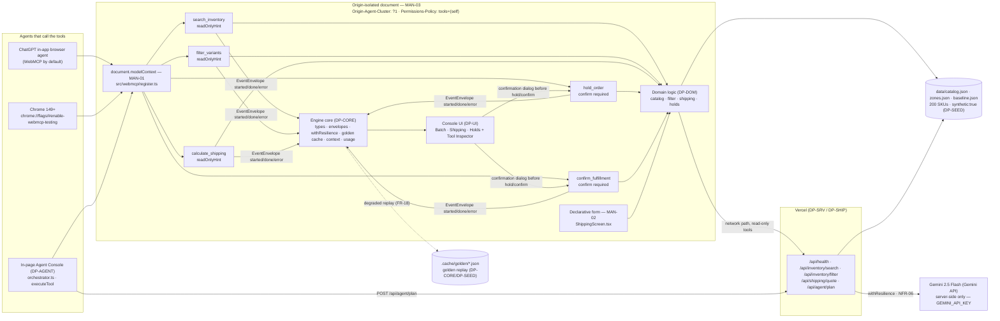

# DP-PITCH — Deck, 3-minute script, demo capture, FAQ defence, submission text

## 1. Purpose & Scope

`DP-PITCH` is the tenth and final plan. It produces every artifact a judge reads or watches: the timed 2:45 script, captured footage/screens, the 8–10 slide deck, the FAQ defence sheet, and `submission.md` with the four required prompt answers. It invents **no product claim that the running app does not support** — every number on a slide must be reproducible from the live URL or from `data/baseline.json` (25 min / 120 clicks baseline, 200 SKUs, 5 tools, 3 screens). It owns `deck/`, `script.md`, `timing.yaml`, `docs/qa/`, `assets/demodrive/`, and `submission.md`; it never edits chassis `src/`, never implements domain or tool code, and never claims a second track or bonus integration.

Scope boundary (owns / never touches):

- **Owns:** `timing.yaml`, `script.md`, `deck/` (8–10 slides), `docs/architecture.mmd` (via deckgen diagram), `docs/qa/` (FAQ defence), `assets/demodrive/<ts>/` (captured footage), `submission.md` (four-prompt text + track line + no-bonus line). Chassis CLIs invoked: `src/ideation/script/cli.ts`, `src/ideation/deckgen/cli.ts`, `src/provenance/submit/cli.ts`, `src/dev-tooling/track`, `demodrive capture`.
- **Never touches:** business rules in `src/engine/domain/*` (`DP-DOM`), tool registration or schemas in `src/webmcp/*` (`DP-TOOLS`), HTTP handlers in `api/**` (`DP-SRV`), engine core in `src/engine/*` (`DP-CORE`), agent orchestrator in `src/agent/*` (`DP-AGENT`), console UI in `src/ui/**` (`DP-UI`), fixture generation `data/catalog.json` etc. (`DP-SEED`), deploy headers `vercel.json` / `LICENSE` / `disclosure.md` contents (`DP-SHIP`). Never adds a sixth tool, a fourth screen, or a cross-origin iframe.

Why `DP-PITCH` exists as a separate plan: the submission gate (`MAN-05` live URL, `MAN-06` video, `MAN-07` text, `MAN-10` single track) is pass/fail at Stage One. The 2:45 script with mandatory audio beats, the deck slide order, and the four 120–200-word prompt answers must be generated from frozen CLIs and budgeted so the video never exceeds 3 minutes. A low-intelligence implementor can follow the numbered steps without inferring judging strategy.

## 2. Requirements Traceability

### 2.1 MANDATORY COMPLIANCE (verbatim reproduction — outranks everything else)

> ## MANDATORY COMPLIANCE
>
> Every part of this entry MUST satisfy, or the entry fails Stage One regardless of quality
> (`hackathon_brief.md` §4.1–§4.3, Official Rules §4/§6/§7/§9):
>
> - **WebMCP is the mandatory technology.** The repository must demonstrate **imported-and-called**
>   usage — not a README mention — of the imperative pattern, verbatim shape:
>   `document.modelContext.registerTool({ name, description, inputSchema, execute })`.
>   Declarative API (annotated HTML forms) may be used **in addition**, never instead.
> - **WebMCP is only available in origin-isolated documents** and is gated by the `tools`
>   Permissions Policy, which **defaults to `self`**; a cross-origin iframe needs `allow="tools"`.
> - **Testable** in the **ChatGPT desktop app in-app browser** (WebMCP by default) **or Google
>   Chrome 149+** with `chrome://flags/#enable-webmcp-testing` enabled and the browser restarted.
> - **No mandated AI model and no mandated API key.** Any model, or none, is permitted.
> - **Submission gate — all five, or Stage One fail:** (1) working **live URL** judges can open in
>   the ChatGPT in-app browser or WebMCP-enabled Chrome, installable and running **consistently**,
>   frozen Sep 3 13:00 PDT until Sep 21; (2) **text description** answering four prompts — why the
>   use case fits WebMCP, how it creates a better UX, what people + agents can do together that was
>   difficult or impossible before, and briefly how WebMCP was implemented; (3) **public code
>   repository** containing all source/assets/instructions **and an open-source license file
>   detectable and visible at the top of the repo page (About section)**, containing the
>   `registerTool` pattern; (4) **demonstration video under 3 minutes** — only the first three
>   minutes are evaluated — showing the project functioning, **with audio covering what you built
>   and how you used WebMCP**, uploaded **publicly to YouTube**; (5) **completed Devpost submission
>   form by Sep 3 2026 @ 1:00 PM PDT (20:00 UTC)**.
> - **New & Existing rule:** new during the Submission Period, or meaningfully extended with WebMCP
>   after Aug 25 2026 with dated commit history distinguishing prior from new work.
> - **One track only:** *"WebMCP Challenge Winners — Top 10 submissions receive the following prizes
>   from the hackathon sponsors: ... 10 winners — All eligible Submissions"*. There are **no**
>   layered tracks and **no** sponsor sub-challenges. **No bonus integration — not worth dilution.**
> - **Judging:** Stage One pass/fail (reasonably fits theme + reasonably applies WebMCP); Stage Two
>   **four equally weighted** criteria, tie-break in listed order: **WebMCP Leverage**, **Execution**,
>   **Potential Impact**, **Creativity & Ambition**.

Nothing in this plan contradicts the block above. It outranks every other paragraph: failing any one line voids the entry at Stage One.

**Non-negotiable reading of `MAN-01`–`MAN-03`:** no plan may invent a second tool-registration mechanism, register tools from more than one module, ship a cross-origin iframe, or move tool execution off the origin-isolated document. A plan proposing a WebSocket "agent bridge", a browser extension, or a server-side MCP server **instead of** page-registered WebMCP tools is wrong and must be rewritten: the judged artifact is the page's own `document.modelContext`.

### 2.2 Mandate ownership — which of MAN-01..MAN-10 DP-PITCH owns, partially owns, or inherits

| ID | Mandate | DP-PITCH role | How this entry satisfies it | Verified by |
|---|---|---|---|---|
| MAN-01 | Imperative WebMCP `registerTool`, imported and called | **Inherits** — owned by `DP-TOOLS` (`src/webmcp/register.ts`) | Five tools registered from single call site, hand-written JSON-Schema, annotations, signal handling | `rg -n "modelContext.registerTool" src/` returns exactly one hit |
| MAN-02 | Declarative WebMCP (annotated form), in addition | **Inherits** — owned by `DP-UI` (`ShippingScreen.tsx` form) | Shipping-calculator form carries declarative tool annotations | `rg -n "toolname" src/` returns exactly one hit |
| MAN-03 | Origin isolation + `tools` Permissions Policy | **Inherits** — owned by `DP-SHIP` (headers) | `vercel.json` sends `Origin-Agent-Cluster: ?1` and `Permissions-Policy: tools=(self)`; no cross-origin iframe | `curl -sI "$OPSFLOW_URL"` echoes both headers |
| MAN-04 | Public repo + detectable open-source licence at repo top | **Inherits** — owned by `DP-SHIP` | MIT `LICENSE` at root, `README.md` spin-up, `disclosure.md` | `npm run submit:hygiene` → `secrets: 0`, `license: MIT` |
| MAN-05 | Working live URL, consistent, no auth | **Inherits / consumes** — owned by `DP-SHIP` | `npx vercel --prod` static SPA + serverless functions; DP-PITCH consumes URL for deck slide 10 and submission.md | `npm run deploy:verify -- "$OPSFLOW_URL"` → `{"ok":true,...}` |
| MAN-06 | Video < 3 min, public YouTube, audio covering what + how WebMCP | **OWNS** — 2:45 script + demodrive captures + inspector segment | Script total ≤ 175 s, beats per §6.2, audio mandatory lines | script total ≤ 175 s |
| MAN-07 | Text description answering the four prompts | **OWNS** — `submission.md` §1–§4 | Four headings in order, 120–200 words each | `rg -n "^## " submission.md` shows the four headings |
| MAN-08 | Devpost form complete by Sep 3 20:00 UTC | **Inherits** — owned by `DP-SHIP` | `docs/submission-checklist.md` + `npm run gate` | `npm run gate` exits 0 |
| MAN-09 | New & Existing rule, dated commit history | **Inherits, contributes** — DP-PITCH commits spread across window with `docs(pitch): ...` messages | Commits spread across window; chassis reuse disclosed | hygiene commit-distribution report |
| MAN-10 | One track, no bonus | **OWNS (co-owns with DP-SHIP)** — pitch/deck/README/submission name only *WebMCP Challenge — Top 10* and state "no bonus integration — not worth dilution" | Deck title, submission track line, no other track name | no other track name appears anywhere |

**Summary:** DP-PITCH **owns** `MAN-06`, `MAN-07`, `MAN-10`; **partially owns/inherits** `MAN-05` (consumes URL), `MAN-09` (contributes commits); **merely inherits** `MAN-01`–`MAN-04`, `MAN-08`.

### 2.3 Functional and non-functional requirements DP-PITCH enables

| ID | Requirement | DP-PITCH responsibility |
|---|---|---|
| FR-15 | Savings meter vs 25 min baseline | Deck slide 7 and script 2:20–2:45 must quote `data/baseline.json` values, not invent numbers |
| FR-16 | 200 synthetic SKUs, `synthetic:true` | Deck slide 8 states what is synthetic and what is real |
| NFR-04 | Zero real personal data | Submission and deck disclose synthetic watermark |
| MAN-06 | Video < 3 min | Script budgets sum to 165 s (2:45), leaving 15 s headroom |
| MAN-10 | One track only | Deck, script, submission name only *WebMCP Challenge — Top 10* |

## 3. Architecture

### 3.1 Which chassis ideation tool produces which artifact, in what order

DP-PITCH composes four chassis surfaces, never re-implementing them. Order is frozen — a later step assumes the earlier artifact exists on disk.

```
winning_project_plan.md + assembly.manifest.json + disclosure.md
        │
        ├─1─▶ src/ideation/script/cli.ts generate  ──▶ script.md (timed, 2:45)
        │         config: timing.yaml (five segment budgets from §6.2)
        │
        ├─2─▶ demodrive capture (cache path)        ──▶ assets/demodrive/<ts>/
        │         --script demo/click-script.json --data-source cache --cache-key opsflow-golden
        │         golden cache seeded by DP-SEED (.cache/golden/*.json)
        │
        ├─3a─▶ src/ideation/deckgen/cli.ts populate ──▶ deck/ (8–10 slides)
        │         --plan winning_project_plan.md --manifest assembly.manifest.json --disclosure disclosure.md --out deck/
        │
        ├─3b─▶ src/ideation/deckgen/cli.ts diagram  ──▶ docs/architecture.mmd
        │         --manifest assembly.manifest.json --out docs/architecture.mmd
        │
        ├─4─▶ src/ideation/faqdef (faqdef:generate)  ──▶ docs/qa/
        │         --plan winning_project_plan.md --manifest assembly.manifest.json --disclosure disclosure.md --out docs/qa
        │         then hand-add four mandatory Q&A (§5.4)
        │
        └─5─▶ src/provenance/submit/cli.ts format  ──▶ submission.md
                  --plan winning_project_plan.md --manifest assembly.manifest.json --disclosure disclosure.md --out submission.md
                  then ensure four headings + MAN-10 lines

   track status --strict  ◀── gate run before every capture (step 2) and before final submit (after step 5)
```

Inputs DP-PITCH consumes but does not own: `winning_project_plan.md` (frozen copy in `<entry>/design_documents/`), `assembly.manifest.json` (chassis manifest, `DP-SHIP` ensures it is current), `disclosure.md` (generated by `DP-SHIP` via `src/provenance/prov/cli.ts`), `data/baseline.json` (baseline minutes/clicks, `DP-SEED`), `data/catalog.json` + `data/zones.json` (numbers cited on slides, `DP-SEED`), `demo/click-script.json` + `demo/mock-script.json` (capture scripts, `DP-SEED`), `.cache/golden/*.json` seeds (`DP-SEED`), live URL (`DP-SHIP` `OPSFLOW_URL`), staleness config `config/track.json` (`DP-DEV`/`DP-SHIP`).

### 3.2 The frozen diagram (verbatim, source of `docs/architecture.mmd`, README §Architecture, deck slide 4)

The three mandate nodes are labelled `MAN-01`, `MAN-02`, `MAN-03` so a judge can match the diagram to the rules at a glance.



Three things this diagram must never stop showing, because each is a rules citation: `MAN-01` the `document.modelContext` node with the five named tools; `MAN-02` the declarative form node; `MAN-03` the origin-isolated document boundary carrying both header values. Deck slide 4 embeds this exact mermaid via `docs/architecture.mmd`.

### 3.3 Chassis surfaces composed (and nothing else)

DP-PITCH imports nothing from chassis at runtime; it invokes these CLIs only:

- `npx vite-node src/ideation/script/cli.ts generate --plan <plan> --manifest <manifest> --config <timing.yaml> --out <script.md>` — SCRIPT surface (chassis DP ideation).
- `npx vite-node src/ideation/deckgen/cli.ts populate --plan <plan> --manifest <manifest> --disclosure <disclosure.md> --out <deck/>` — DECKGEN populate.
- `npx vite-node src/ideation/deckgen/cli.ts diagram --manifest <manifest> --out <docs/architecture.mmd>` — DECKGEN diagram.
- `npm run faqdef:generate -- generate --plan <plan> --manifest <manifest> --disclosure <disclosure.md> --out <docs/qa>` — FAQDEF (wraps `src/ideation/faqdef/cli.ts`).
- `npx vite-node src/provenance/submit/cli.ts format --plan <plan> --manifest <manifest> --disclosure <disclosure.md> --out <submission.md>` — SUBMIT format (chassis DP provenance).
- `track status --json` / `track status --strict` — `src/dev-tooling/track`, reads `config/track.json` (DP-DEV/IP).
- `npm run demodrive -- capture --script demo/click-script.json --data-source cache --cache-key opsflow-golden` — DEMODRIVE capture (chassis media/ideation).

Forbidden: deep imports into chassis internals (`src/ideation/script/generator.js`, `src/ideation/deckgen/templates/*`). Invoke only via the CLI entrypoints above. No code in `<entry>/src/` is modified to make a pitch check pass.

## 4. Interfaces

### 4.1 Ownership note (boundary rule restated)

Every cross-module symbol appears exactly once in §5F with a single owner. DP-PITCH **owns no row** in that table. Every consumer imports from the exact file path. A consumer that cannot find a symbol stops and reports a blocker — never a local copy, re-export, or shim. Symbols not in §5F are private. No plan widens, renames or adds a field to the frozen types in §5A, tool contracts in §5B, routes in §5C, paths in §5D, config keys in §5E or step ids in §5G.

### 4.2 CLI contracts DP-PITCH invokes (exact flags, literal)

| CLI | Exact invocation | Inputs | Outputs | Failure mode |
|---|---|---|---|---|
| SCRIPT | `npx vite-node src/ideation/script/cli.ts generate --plan winning_project_plan.md --manifest assembly.manifest.json --config timing.yaml --out script.md` | `winning_project_plan.md`, `assembly.manifest.json`, `timing.yaml` | `script.md` with five timed beats, total ≤ 175 s | exits non-zero if timing budget exceeded; stale plan blocks recording |
| DEMODRIVE | `npm run demodrive -- capture --script demo/click-script.json --data-source cache --cache-key opsflow-golden` | `demo/click-script.json`, `.cache/golden/opsflow-golden/*`, running dev server (for cache capture) | `assets/demodrive/<ts>/` frames + manifest | exits non-zero if click-script invalid or cache key missing |
| DECKGEN populate | `npx vite-node src/ideation/deckgen/cli.ts populate --plan winning_project_plan.md --manifest assembly.manifest.json --disclosure disclosure.md --out deck/` | `winning_project_plan.md`, `assembly.manifest.json`, `disclosure.md` | `deck/` directory with 8–10 slides (markdown or pdf per template) | exits non-zero if plan missing or disclosure stale |
| DECKGEN diagram | `npx vite-node src/ideation/deckgen/cli.ts diagram --manifest assembly.manifest.json --out docs/architecture.mmd` | `assembly.manifest.json` | `docs/architecture.mmd` valid mermaid (verbatim §3.2) | exits non-zero if manifest missing |
| FAQDEF | `npm run faqdef:generate -- generate --plan winning_project_plan.md --manifest assembly.manifest.json --disclosure disclosure.md --out docs/qa` | `winning_project_plan.md`, `assembly.manifest.json`, `disclosure.md` | `docs/qa/*.md` with ≥ 12 questions | exits non-zero if out dir missing |
| SUBMIT format | `npx vite-node src/provenance/submit/cli.ts format --plan winning_project_plan.md --manifest assembly.manifest.json --disclosure disclosure.md --out submission.md` | `winning_project_plan.md`, `assembly.manifest.json`, `disclosure.md` | `submission.md` with four prompt headings + track/bonus lines | exits non-zero if plan/disclosure missing |
| TRACK | `npx vite-node src/dev-tooling/track.ts status --json` and `--strict` | `config/track.json`, file mtimes vs `track.json` manifest | JSON staleness report; `--strict` exits non-zero if any row stale | stale row blocks capture/submit |

### 4.3 File contracts DP-PITCH produces

- `timing.yaml` — five segment budgets (§6.2), keys `segments: [{ id, duration_s, title }]`, total `total_s: 165`.
- `script.md` — timed script with per-beat on-screen + audio lines, total header `<!-- total: 165s -->` or CLI-reported total.
- `assets/demodrive/<ts>/` — frames/manifest from demodrive cache capture; `<ts>` is ISO-8601 timestamp directory.
- `deck/` — 8–10 slides, slide order frozen per §6.3.
- `docs/architecture.mmd` — mermaid block from §3.2 verbatim, produced by deckgen diagram.
- `docs/qa/*.md` — FAQ defence, ≥ 12 `###` questions, including four hand-written mandatory answers (§5.4).
- `submission.md` — exactly four `##` headings in order (see §4.4), plus `## Submission` or inline track line, URLs, and no-bonus sentence.

### 4.4 The four submission headings (verbatim, in this order)

`submission.md` MUST contain exactly these four `##` headings, in this order, each followed by 120–200 words (drafts in §5.5):

```markdown
## Why this use case is a strong fit for WebMCP
## How it creates a better user experience
## What people and agents can do together that was difficult or impossible before
## How we implemented WebMCP
```

Plus, after those four sections, a one-line track statement:

```markdown
Track: WebMCP Challenge — Top 10
```

And the literal sentence on its own line:

```
No bonus integration — not worth dilution.
```

Followed by the live URL, repo URL, and YouTube URL lines (placeholders until `DP-SHIP` publishes).

Verify: `rg -n "^## " submission.md` must show exactly those four headings in order; `rg -c "No bonus integration" submission.md` must be `1`; `rg -n "WebMCP Challenge — Top 10" submission.md` must be `≥1` and no other track name (`"sponsor"`, `"bonus track"`) appears.

### 4.5 Private helpers (inside DP-PITCH, nobody else may import)

- `scripts/check-script-length.mjs` (optional helper) — asserts script total ≤ 175 s; private to DP-PITCH, not a cross-module symbol.
- `scripts/check-submission-headings.mjs` — asserts four headings order; private.
- No exported TypeScript symbols — DP-PITCH is a docs-and-assets module, not a runtime module. Row ownership: none.

## 5. Algorithms

Every algorithm is numbered, with literal commands the low-intelligence implementor can copy. No judgment, no unstated defaults. If a step needs higher intelligence than keyword matching, it is split or moved into a prompt template — the chassis CLIs already encapsulate the LLM parts.

### 5.1 Algorithm 1 — Script generation (W1)

Inputs: `winning_project_plan.md`, `assembly.manifest.json`, `timing.yaml` (defined in §6.1).

```
1. Run staleness gate:
   npx vite-node src/dev-tooling/track.ts status --json
   a. If any row has "stale": true, STOP. Do not record. Fix the stale file first (usually disclosure.md or track.json), re-run.
   b. Only proceed when every row is "fresh".

2. Ensure timing.yaml exists at <entry>/timing.yaml with content exactly as in §6.1.
   a. Validate total is 165 s (sum of five segment duration_s).
   b. If total != 165, fix timing.yaml before invoking CLI — do not hand-edit script budgets.

3. Invoke the script CLI:
   npx vite-node src/ideation/script/cli.ts generate --plan winning_project_plan.md --manifest assembly.manifest.json --config timing.yaml --out script.md
   a. The CLI reads timing.yaml segment budgets and winning_project_plan.md persona/problem text.
   b. It emits script.md with per-beat on-screen + audio columns and a total header.
   c. If the CLI reports total > 175 s, the run is INVALID — shorten spoken lines, never widen budgets.

4. Hand-edit ONLY the spoken lines inside script.md:
   a. Keep every timing bracket [0:00–0:25] and duration unchanged.
   b. Replace placeholder audio with the verbatim lines from Appendix A for each beat.
   c. Ensure the two mandatory audio beats are present verbatim:
      - "the page registers five WebMCP tools with typed input schemas" (0:25–0:55)
      - "here is the imperative registerTool call — one call site, five tools, JSON Schema, annotations, abort handling" (1:50–2:20)
   d. Never edit the timing totals.

5. Assert:
   npx vite-node scripts/check-script-length.mjs  # or: grep -Eo "[0-9]+s" script.md | awk sum <=175
   Expected: total ≤ 175 s (target 165 s, headroom 10 s).
   If > 175 s, shorten lines in step 4 and re-assert.
```

Verify: `npx vite-node src/ideation/script/cli.ts generate ...` exits 0 and produced `script.md` with `total ≤ 175 s` in header or CLI stdout.

### 5.2 Algorithm 2 — Capture (W2)

Inputs: `demo/click-script.json` (from DP-SEED), `.cache/golden/` seeded cache (DP-SEED), running dev server or static build.

```
1. Ensure golden cache is populated:
   ls .cache/golden/   # must contain at least 6 files: search_inventory, filter_variants, calculate_shipping, hold_order, confirm_fulfillment, agent_plan
   If empty, DP-SEED work unit must run first — report blocker, do not stub cache.

2. Ensure track is fresh:
   npx vite-node src/dev-tooling/track.ts status --strict
   Must exit 0. If stale, fix before capture.

3. Run demodrive capture against the golden cache (zero network for tool outputs):
   npm run demodrive -- capture --script demo/click-script.json --data-source cache --cache-key opsflow-golden
   a. This replays the five-step golden batch: search_inventory → filter_variants → calculate_shipping → hold_order (confirm) → confirm_fulfillment.
   b. Captures land in assets/demodrive/<ts>/ where <ts> is a timestamp directory (e.g. 2026-09-03T10-00-00Z).
   c. Verify assets/demodrive/<latest>/ contains at least 3 files (manifest.json + 2+ frames/screenshots).

4. Record live-browser segments MANUALLY (not automatable):
   a. Segment 0:25–0:55 — open the live URL (OPSFLOW_URL from DP-SHIP) in the ChatGPT desktop in-app browser; show Tool Inspector panel listing five tools with schemas. Screen-record with audio.
   b. Segment 1:50–2:20 — open DevTools → Application → WebMCP inspector (or about://inspect), then open src/webmcp/register.ts in an editor and show the registerTool call for 5 seconds. Screen-record.
   c. State in the plan that these two are not automatable and must be filmed.

5. Inventory captured assets:
   ls -R assets/demodrive/   # must show at least one <ts> directory with non-empty content
   If empty, re-run step 3.
```

Verify: `ls assets/demodrive/` shows non-empty `<ts>` directory; `cat assets/demodrive/<ts>/manifest.json | jq .steps` shows 5 steps.

### 5.3 Algorithm 3 — Deck (W3)

Inputs: `winning_project_plan.md`, `assembly.manifest.json`, `disclosure.md` (DP-SHIP), `docs/architecture.mmd`.

```
1. Populate deck:
   npx vite-node src/ideation/deckgen/cli.ts populate --plan winning_project_plan.md --manifest assembly.manifest.json --disclosure disclosure.md --out deck/
   a. The CLI scaffolds 8–10 slides from the plan into deck/ (deck.md or deck.pdf per template).
   b. If deck/ already exists, the CLI overwrites — commit before re-running.
   c. After populate, hand-edit slide content to match the frozen order in §6.2, replacing any placeholder numbers with values from data/baseline.json, data/catalog.json, or the live URL.

2. Generate architecture diagram:
   npx vite-node src/ideation/deckgen/cli.ts diagram --manifest assembly.manifest.json --out docs/architecture.mmd
   a. Produces docs/architecture.mmd containing the mermaid block from §3.2 verbatim.
   b. Validate: cat docs/architecture.mmd must contain "MAN-01", "MAN-02", "MAN-03" and "document.modelContext".
   c. Embed or link this file as deck slide 4.

3. Validate deck:
   ls deck/   # must show 8–10 slide files or deck.md with 8–10 headings
   cat docs/architecture.mmd | head -n 5  # must start with ```mermaid
   If valid, commit.
```

Verify: `ls deck/` shows deck artifacts (≥ 8 slides or deck.md with ≥ 8 `##`); `rg -n "MAN-01" docs/architecture.mmd` returns ≥1 hit.

### 5.4 Algorithm 4 — FAQ defence (W4)

Inputs: `winning_project_plan.md`, `assembly.manifest.json`, `disclosure.md`.

```
1. Generate FAQ scaffold:
   npm run faqdef:generate -- generate --plan winning_project_plan.md --manifest assembly.manifest.json --disclosure disclosure.md --out docs/qa
   a. Produces docs/qa/*.md with at least 8 auto-generated questions from the plan.
   b. If docs/qa/ does not exist after, report blocker.

2. Hand-add the four mandatory questions this entry must never fumble, each with a written answer (draft answers in §5.4.1 below):
   a. Q: Why couldn't this be built before WebMCP?
   b. Q: What stops the agent doing something destructive?
   c. Q: What happens with a browser that has no WebMCP?
   d. Q: Is the data real?
   Append each as a "### " heading in docs/qa/defence.md (or the largest qa file).

3. Count:
   rg -c "^### " docs/qa/*.md   # must be ≥ 12 total (8 auto + 4 hand-written)
   If < 12, add more domain questions (e.g., hold TTL, shipping explain array) until ≥ 12.
```

Verify: `rg -c "^### " docs/qa/*.md | awk -F: '{s+=$2} END{print s}'` returns ≥ 12.

#### 5.4.1 The four mandatory FAQ answers (verbatim drafts to include in docs/qa)

**Q1 — Why couldn't this be built before WebMCP?**

> Before WebMCP, agents could only scrape DOM selectors — brittle, hallucinated, and N-step guesswork per filter. OpsFlow's batch needs constraint-preserving co-execution (`search_inventory → filter_variants → calculate_shipping → hold_order → confirm_fulfillment`) with typed I/O. The page now declares five tools with `document.modelContext.registerTool({ name, description, inputSchema, execute })`, JSON Schema, and annotations; the agent knows exactly how to call them in 2–3 deterministic steps with validation. WebMCP (Draft 2026-08-26, Chrome 149 origin trial + ChatGPT in-app browser) made declared `execute` callbacks — instead of DOM scraping — possible for the first time.

**Q2 — What stops the agent doing something destructive?**

> Every state-changing tool (`hold_order`, `confirm_fulfillment`) stops at a focus-trapped confirmation dialog showing the exact validated arguments (`FR-05`, `FR-06`). `runTool` never throws — failures resolve as typed `ToolError`s — and `options.signal` abort resolves `TOOL_ABORTED` with no partial state. The orchestrator goes through `document.modelContext.executeTool`, the same entry point an external agent uses, so the gate cannot be bypassed. No hold commits without a human click.

**Q3 — What happens with a browser that has no WebMCP?**

> The page calls `probeWebMcp()` on load. If unavailable, a full-width banner states "WebMCP not detected" with both enablement paths (ChatGPT in-app browser, or Chrome 149+ with `chrome://flags/#enable-webmcp-testing` + restart) and notes the in-page Agent Console still runs the full flow via `executeToolCompat` → `runTool` direct (ladder rung 4). The Tool Inspector shows the schema fallback with "not registered — showing schema fallback". No functionality is lost; only the external-agent entry point is absent.

**Q4 — Is the data real?**

> No — all 200 SKUs, zone tables, and baselines are synthetic, every record carries `synthetic: true`, and the UI shows a persistent "synthetic data" badge (`NFR-04`). `data/catalog.json` is generated by `DP-SEED` via `generateRecords` with watermark headers. The demo is honest: the savings claim (25 min → ~3 min) is measured as a visible meter comparing `baseline_minutes`/`baseline_clicks` from `data/baseline.json` against `tool_calls`/`confirmations`/`elapsed_ms` of the current batch, demonstrated rather than asserted.

### 5.5 Algorithm 5 — submission.md (W5)

Inputs: `winning_project_plan.md`, `assembly.manifest.json`, `disclosure.md` (DP-SHIP).

```
1. Generate submission scaffold:
   npx vite-node src/provenance/submit/cli.ts format --plan winning_project_plan.md --manifest assembly.manifest.json --disclosure disclosure.md --out submission.md
   a. Produces submission.md with repo, disclosure, and plan-derived sections.
   b. If submission.md already exists, the CLI overwrites — commit before re-running.

2. Ensure submission.md contains exactly the four ## headings in order (see §4.4), each 120–200 words:
   a. Overwrite or hand-edit each section to match the drafts below (§5.5.1–§5.5.4).
   b. Word count each section: npx vite-node -e "const fs=require('fs'); const t=fs.readFileSync('submission.md','utf8'); ...split sections... count words"
   c. Each section must be 120–200 words inclusive. If outside, edit until inside.

3. Append after the four sections:
   Track: WebMCP Challenge — Top 10
   No bonus integration — not worth dilution.
   Live URL: $OPSFLOW_URL   (from DP-SHIP; placeholder https://opsflow.example.com until deployed)
   Repository: https://github.com/<org>/opsflow   (placeholder until DP-SHIP publishes)
   Video: https://youtube.com/watch?v=REPLACE_ME   (placeholder until uploaded; must be public YouTube)

4. Validate:
   rg -n "^## " submission.md   # must show exactly the four headings in order
   rg -c "No bonus integration" submission.md  # must be 1
   If not, fix and re-validate.
```

Verify: `rg -n "^## " submission.md` shows exactly four headings in order; `wc -w` per section shows 120–200 words.

#### 5.5.1–5.5.4 The four submission prompt answers (drafts, 120–200 words each)

**§1 — Why this use case is a strong fit for WebMCP (target 160 words):**

> Maya's batch is a constraint-heavy co-task: 20–40 orders, size/colour variants, per-zone shipping, hold TTLs — six tabs and 25 minutes of copy-pasting when done by hand. It needs chained, typed calls where context persists between steps, not one-shot search. WebMCP is the exact fit because the page declares the work as five imperative tools — `search_inventory`, `filter_variants`, `calculate_shipping`, `hold_order`, `confirm_fulfillment` — each with JSON-Schema `inputSchema` and annotations. An agent (ChatGPT in-app browser or Chrome 149+ with the flag) discovers them via `document.modelContext` and chains `search → filter → calculate → hold → confirm` in deterministic steps, validating inputs before any state changes. Before WebMCP (Draft 2026-08-26) this required brittle DOM scraping with hallucinated selectors; now the agent calls declared `execute` callbacks. The five tools plus the declarative `calculate_shipping` form give Stage Two WebMCP Leverage a non-trivial, judge-inspectable surface.

**§2 — How it creates a better user experience (target 160 words):**

> OpsFlow turns 25 minutes of tab-hopping into a ~3-minute co-executed conversation. Maya types one goal — "hold all low-stock blue variants under $12 shipping to zone 4 for 15 minutes" — and watches the co-execution timeline render each validated argument live. Read-only tools return immediately; `hold_order` and `confirm_fulfillment` pause at a focus-trapped dialog showing the exact `lineItems`, TTL, and quote so nothing commits without a click. The three screens (Batch, Shipping, Holds) keep search, quote, and holds separate but linked via a shared result set; the shipping card's `explain[]` breaks down every surcharge and excluded variant. A savings meter compares `tool_calls` and elapsed time to the 25 min / 120-click manual baseline, so the claim is demonstrated. When WebMCP is absent, a banner names both enablement paths and the in-page console runs the identical flow locally.

**§3 — What people and agents can do together that was difficult or impossible before (target 160 words):**

> Before WebMCP, fulfillment agents scraped Shopify admin DOM — every filter required selector guessing, constraint context was lost between searches, and confirmation was an afterthought, so one typo cancelled an order. OpsFlow makes co-execution reliable: the human states intent in natural language, Gemini 2.5 Flash (or the deterministic keyword planner when the key is absent) maps it to typed `ToolPlan` steps, and the agent executes through `document.modelContext.executeTool` — the same entry point the ChatGPT browser agent uses. `filter_variants` narrows the *current* result set, preserving constraints; `calculate_shipping` explains every rule applied; `hold_order` reserves stock reversibly. The agent handles chaining and validation; the human handles judgment at confirmation. Degraded replay via the golden cache means the demo never shows a blank screen. Together they achieve a measured batch in minutes that neither a hand-operated console nor a scraping bot could do reliably two years ago.

**§4 — How we implemented WebMCP (target 160 words):**

> The page is origin-isolated (`Origin-Agent-Cluster: ?1`, `Permissions-Policy: tools=(self)` in `vercel.json`, `MAN-03`) and registers all five tools at first paint from the single call site `src/webmcp/register.ts` — `document.modelContext.registerTool({ name, description, inputSchema, execute })` — before React renders, verified by `probeWebMcp()` and a Tool Inspector panel that reads `document.modelContext.getTools()` live. Each `inputSchema` is hand-written JSON Schema with `annotations` (`readOnlyHint` for the three read-only tools, confirmation-required for `hold_order`/`confirm_fulfillment`), input-length limits, `signal` abort handling, and untrusted-marked output ≤ 4000 chars; `execute` never throws, resolving typed `ToolError`s instead. The declarative `calculate_shipping` form in `ShippingScreen.tsx` carries `toolname`/`tooldescription` annotations (`MAN-02`). The in-page console's fallback `executeToolCompat` lets judges without the flag still run `search → filter → calculate → hold → confirm` through the same `runTool` path.

### 5.6 Algorithm 6 — Freshness check (W6)

```
1. Before every recording (step 2) and before final submit (after step 5):
   npx vite-node src/dev-tooling/track.ts status --strict
   a. Reads config/track.json staleness manifest (watches deck/, script.md, submission.md vs winning_project_plan.md, disclosure.md, data/*.json).
   b. Exits 0 when every row is fresh; exits non-zero and prints the stale paths when any row is stale.
   c. If stale, fix the listed file (usually re-run the generator for that artifact), then re-run --strict until exit 0.

2. Only after exit 0, proceed to capture or to git push / Devpost submit.
```

Verify: `npx vite-node src/dev-tooling/track.ts status --strict` exits 0, prints no stale rows.

## 6. Configuration

### 6.1 timing.yaml — the five segment budgets (written in full, owned by DP-PITCH)

File: `<entry>/timing.yaml` (consumed by `src/ideation/script/cli.ts generate --config timing.yaml`). Total 165 s = 2:45, leaving 15 s headroom under the 180 s limit.

```yaml
# timing.yaml — OpsFlow 2:45 script budgets (DP-PITCH W1)
# Total must be 165 s; script CLI asserts total <= 175 s (MAN-06 headroom 15 s).
version: "1.0.0"
project: "OpsFlow"
video_policy:
  max_seconds: 180
  target_seconds: 165
  headroom_seconds: 15
segments:
  - id: "problem"
    title: "Maya's six tabs; the 25-minute batch"
    duration_s: 25
    on_screen: "Maya's six tabs; the 25-minute batch (slide + screen recording)"
    audio_must_say: "the problem, the persona, the 25-minute cost"
    source: "slide + screen recording"
  - id: "tools"
    title: "Live URL + Tool Inspector — five tools"
    duration_s: 30
    on_screen: "Live URL opened in ChatGPT desktop in-app browser; Tool Inspector panel listing five tools with schemas"
    audio_must_say: "the page registers five WebMCP tools with typed input schemas"
    source: "live capture"
  - id: "coexecution"
    title: "Canonical goal → co-execution timeline → confirmation"
    duration_s: 55
    on_screen: "Canonical goal typed; co-execution timeline showing search_inventory → filter_variants → calculate_shipping, then confirmation dialog for hold_order being clicked, then confirm_fulfillment"
    audio_must_say: "what the agent and the human each did, and why the confirmation step exists"
    source: "live capture, demodrive fallback"
  - id: "inspector"
    title: "DevTools WebMCP inspector + registerTool code"
    duration_s: 30
    on_screen: "DevTools → Application → WebMCP inspector, then 5-second shot of src/webmcp/register.ts"
    audio_must_say: "here is the imperative registerTool call — one call site, five tools, JSON Schema, annotations, abort handling"
    source: "screen capture"
  - id: "impact"
    title: "Savings meter — 25 min → ~3 min — track line"
    duration_s: 25
    on_screen: "Savings meter and the delta 25 min → ~3 min; the track line"
    audio_must_say: "the impact claim, stated as measured on synthetic data"
    source: "live capture"
total_s: 165
```

Rules: hand-edit only the spoken lines inside `script.md`, never the budgets. Total ≤ 175 s is the gate; target is exactly 165 s.

### 6.2 Deck slide order (frozen, 8–10 slides)

Produced by `deckgen populate`; content follows this order (W3):

| Slide | Title | Content must show |
|---|---|---|
| 1 | Title + track line | OpsFlow title, one-line *WebMCP Challenge — Top 10*, one-line *No bonus integration — not worth dilution.* (`MAN-10`) |
| 2 | Maya and the 25-minute batch | Persona Maya 29 Austin, six tabs screenshot, 25 min / 120 clicks baseline from `data/baseline.json` |
| 3 | The five tools | Table of five tool names, descriptions, annotations (`readOnlyHint` vs confirm-required), one example `inputSchema` snippet |
| 4 | Architecture diagram | Mermaid from `docs/architecture.mmd` (§3.2) with `MAN-01`/`MAN-02`/`MAN-03` labels |
| 5 | Co-execution screenshot | Timeline screenshot `search_inventory → filter_variants → calculate_shipping → hold_order (dialog) → confirm_fulfillment` |
| 6 | WebMCP Leverage evidence | Schemas, annotations, abort handling, input-length limits, declarative form screenshot (`toolname` hit) |
| 7 | Impact delta | Savings meter screenshot, delta 25 min → ~3 min, *measured on synthetic data* disclaimer |
| 8 | What is synthetic and what is real | 200 SKUs `synthetic:true`, watermark badge, no PII; what is real is the WebMCP plumbing and timing |
| 9 | Roadmap | Post-hackathon: real Shopify OAuth (out of scope for demo), multi-workspace (skipped per §5.3 do-not-build) |
| 10 | Links | Live URL (`OPSFLOW_URL`), repo URL, YouTube URL (placeholders until published) |

### 6.3 Demodrive cache key

Fixed key: `opsflow-golden`. The capture command `npm run demodrive -- capture --script demo/click-script.json --data-source cache --cache-key opsflow-golden` reads `.cache/golden/opsflow-golden/` (seeded by `DP-SEED`). No other key may be used.

### 6.4 Cost and context caps (consumed, not owned)

DP-PITCH does not configure LLM cost; it inherits `config/cost.json` (DP-CORE) and `data/cost-store.json`. No new config key is added. `MAN-09` commit distribution is ensured by dating DP-PITCH work-unit commits across the window (see §9 commit messages).

## 7. Resiliency

### 7.1 The capture fallback (why every demo segment has a fallback)

| Live segment | Fallback source | Visible sign of fallback |
|---|---|---|
| 0:25–0:55 Tool Inspector live capture | demodrive frame from `assets/demodrive/<ts>/` showing same inspector panel | None — same panel rendered from cached tool list |
| 0:55–1:50 Co-execution timeline | demodrive golden-cache replay of `demo/mock-script.json` five-step chain | Degraded chip on replayed steps (`degraded:true`), still correct data |
| 1:50–2:20 DevTools + register.ts | screen capture of `src/webmcp/register.ts` file (always available locally) | No live WebMCP needed |
| Rung 6 offline rehearsal | `npm run demo:offline` replays `demo/mock-script.json` through chassis MOCK publisher | Mock trace id `opsflow-mock-*` |

Every demodrive capture runs against `--data-source cache --cache-key opsflow-golden`, so a network failure cannot ruin a take. If the live take fails on recording day, the demodrive/golden-cache footage carries the same beats. `session.degraded` is emitted at every transition so the timeline records what happened.

### 7.2 Recording-day order of operations (numbered, no judgment)

```
1. npx vite-node src/dev-tooling/track.ts status --strict  → must exit 0; if stale, re-run the stale generator first.
2. npx vite-node src/ideation/script/cli.ts generate --plan winning_project_plan.md --manifest assembly.manifest.json --config timing.yaml --out script.md  → assert total ≤ 175 s.
3. npm run demodrive -- capture --script demo/click-script.json --data-source cache --cache-key opsflow-golden  → verify assets/demodrive/<ts>/ non-empty.
4. npx vite-node src/ideation/deckgen/cli.ts populate ... --out deck/  → verify deck/ 8–10 slides.
5. npx vite-node src/ideation/deckgen/cli.ts diagram ... --out docs/architecture.mmd  → verify mermaid valid.
6. npm run faqdef:generate -- generate ... --out docs/qa  → hand-add four mandatory Q&A, assert ≥ 12.
7. npx vite-node src/provenance/submit/cli.ts format ... --out submission.md  → assert four headings, MAN-10 lines.
8. npx vite-node src/dev-tooling/track.ts status --strict  → must exit 0 again before submit.
9. Record live-browser segments manually (ChatGPT in-app browser + DevTools + register.ts) — not automatable.
10. Upload video publicly to YouTube; paste URL into submission.md and deck slide 10; re-run track --strict and git push.
```

If step 1 or 8 fails, no recording or pushing happens — the stale artifact must be regenerated first. If venue Wi-Fi dies, skip to rung 5/6 and use demodrive footage for the video.

### 7.3 Last resort

If the video cannot be recorded at all, the repo + description still satisfy the gate — Rules §4 allows judging on description/repo/video alone — but a missing video is a `MAN-06` failure, so the video is the highest-priority artifact after the live URL (DP-SHIP). The submitted ≤3-min YouTube video and the repo carry the story even if a judge never runs the app.

## 8. File Layout & Module Boundaries

### 8.1 Files DP-PITCH owns (inside `<entry>`, frozen §5D)

```
<entry>/
  timing.yaml                       # DP-PITCH — segment budgets (5 rows, total 165 s) owned, created in W1
  script.md                         # DP-PITCH — timed 2:45 script (W1 output)
  deck/                             # DP-PITCH — 8–10 slides (W3 output, deckgen populate)
    deck.md  (or deck.pdf)          # scaffolded by deckgen; hand-edited to slide order §6.2
  docs/
    architecture.mmd                # DP-PITCH (via deckgen diagram) — mermaid from §3.2 verbatim
    qa/                             # DP-PITCH — FAQ defence (W4 output)
      defence.md  (or qa/*.md)      # ≥ 12 ### questions, including four mandatory answers
  assets/
    demodrive/<ts>/                 # DP-PITCH — captured frames/manifest (W2 output, cache key opsflow-golden)
      manifest.json
      frame-*.png
  submission.md                     # DP-PITCH — four-prompt text + track + no-bonus + URLs (W5 output)
```

### 8.2 Files DP-PITCH consumes but never edits content of (read-only)

- `winning_project_plan.md` — source for all CLIs (read-only; DP-PITCH never rewrites persona/problem).
- `assembly.manifest.json` — chassis manifest (DP-SHIP ensures current; DP-PITCH passes it to CLIs).
- `disclosure.md` — generated by `DP-SHIP` via `src/provenance/prov/cli.ts` (DP-PITCH passes it to deckgen/submit).
- `data/baseline.json` — baseline minutes/clicks quoted on deck slide 7 and script 2:20–2:45 (DP-SEED).
- `data/catalog.json`, `data/zones.json` — numbers on slides (DP-SEED).
- `demo/click-script.json`, `demo/mock-script.json` — capture scripts (DP-SEED).
- `.cache/golden/opsflow-golden/*.json` — golden seeds for demodrive cache capture (DP-SEED/DP-CORE).
- `config/track.json` — staleness manifest (DP-DEV/DP-SHIP; DP-PITCH reads via `track status`).
- `vercel.json`, `package.json`, `vite.config.ts` — deployment/docs scaffolding (DP-SHIP/DP-DEV).

### 8.3 Boundary rule restated for DP-PITCH (§11 in miniature)

Four rules, verbatim intent:

1. **Single owner, N consumers.** No cross-module symbol lives in DP-PITCH — it owns no §5F row. Every file DP-PITCH produces is owned solely by DP-PITCH; no other plan writes to `deck/`, `script.md`, `docs/qa/`, `assets/demodrive/`, or `submission.md`.
2. **No plan defines a symbol it does not own.** DP-PITCH defines no type, function, or config key that belongs to `DP-CORE` (§5A), `DP-DOM`, `DP-SRV`, `DP-TOOLS`, `DP-AGENT`, or `DP-UI`. Anything it needs that is not in §5F is private and stated as such in §4.5.
3. **No plan widens, renames or adds a field** to the frozen types in §5A, tool contracts in §5B, routes in §5C, paths in §5D, config keys in §5E or step ids in §5G. DP-PITCH cites numbers from those frozen artifacts but never extends them.
4. **Cross-boundary work units prove the wiring** with a real import or CLI invocation in the Verify command — e.g., `submission.md` is produced by importing the plan and disclosure through the real `submit format` CLI, not a hand-written stub.

### 8.4 What DP-PITCH must never produce

- No fourth screen, no sixth tool, no cross-origin iframe (`NFR-12`, R7).
- No bonus integration — not worth dilution (`MAN-10`).
- No copyrighted music, images, or video in `assets/demodrive/` or deck.
- No edits to chassis `src/` (`NFR-05`).

## 9. Work Units

Each work unit is small enough for a low-intelligence implementor: one file or one CLI plus its check. Each ends with exactly one runnable Verify command and its expected literal output. Cross-boundary units exercise the real provider→consumer import/CLI.

| WU | Title | File(s) | Steps (see §5) | Verify command (literal) | Expected output (literal) | Commit message |
|---|---|---|---|---|---|---|
| W1 | Timed script | `timing.yaml` + `script.md` | §5.1 steps 1–5 | `npx vite-node src/ideation/script/cli.ts generate --plan winning_project_plan.md --manifest assembly.manifest.json --config timing.yaml --out script.md && grep -E "total.*165" script.md` | `total: 165s` (or CLI reports `total ≤ 175 s`) and `script.md` exists; secondary assert `npx vite-node -e "const fs=require('fs'); const t=fs.readFileSync('script.md','utf8'); const m=t.match(/total[^0-9]*([0-9]+)/i); console.log(m?Number(m[1])<=175:'no total')"` prints `true` | `docs(pitch): add timing.yaml and 2:45 script — MAN-06 budgeted at 165s` |
| W2 | Demodrive captures | `assets/demodrive/<ts>/` | §5.2 steps 1–5 | `npm run demodrive -- capture --script demo/click-script.json --data-source cache --cache-key opsflow-golden && ls assets/demodrive/` | `assets/demodrive/` contains a non-empty timestamp directory with `manifest.json` + frames | `docs(pitch): capture demodrive golden run — assets/demodrive/<ts>/` |
| W3 | Deck + diagram | `deck/` + `docs/architecture.mmd` | §5.3 steps 1–3 | `npx vite-node src/ideation/deckgen/cli.ts diagram --manifest assembly.manifest.json --out docs/architecture.mmd && rg -n "MAN-01" docs/architecture.mmd` | At least one hit: `docs/architecture.mmd:1: ...MAN-01...` and `ls deck/` shows 8–10 slides | `docs(pitch): add deck and architecture diagram — 10 slides + MAN nodes` |
| W4 | FAQ defence | `docs/qa/` + four hand-written answers | §5.4 steps 1–3 | `rg -c "^### " docs/qa/*.md | awk -F: '{s+=$2} END{print s}'` | `12` or greater (≥ 12 questions: 8 auto + 4 mandatory Q&A) | `docs(pitch): add FAQ defence — 12+ questions with four mandatory answers` |
| W5 | Submission text | `submission.md` | §5.5 steps 1–4 | `rg -n "^## " submission.md` | Four headings in order: `Why this use case…`, `How it creates…`, `What people and agents…`, `How we implemented…` | `docs(pitch): add submission.md — four prompts + track + no-bonus — MAN-07/10` |
| W6 | Freshness check before recording and before submitting | `track status` gate | §5.6 steps 1–2 | `npx vite-node src/dev-tooling/track.ts status --strict` | Exit 0, no stale rows (empty or `all fresh` stdout) | `docs(pitch): track status clean — ready to record and submit` |

Dependency order: W1 → W2 → W3 → W4 → W5 → W6 (W1 blocks W2 because script budgets gate capture narration; W3/W4/W5 depend on `disclosure.md` from DP-SHIP; W6 is the gate that must be green before any push). Each commit is spread across the submission window to satisfy `MAN-09` dated history.

## 10. Testing Strategy

DP-PITCH has no runtime unit tests — it produces docs and assets. Verification is via CLI exit codes and grep/regex assertions that a low-intelligence implementor can run literally.

| Check | Command (literal) | Expected | Fails when |
|---|---|---|---|
| Script length | `npx vite-node -e "const fs=require('fs'); const t=fs.readFileSync('script.md','utf8'); const m=t.match(/total[^0-9]*([0-9]+)/i); const n=m?Number(m[1]):999; console.log(n); process.exit(n<=175?0:1)"` | prints `165` (or ≤ 175) and exits 0 | total > 175 s — spoken lines must be shortened |
| Four headings | `rg -n "^## " submission.md` | Exactly four lines in order: `Why this use case…`, `How it creates…`, `What people and agents…`, `How we implemented…` | headings missing, out of order, or extra heading present |
| No-bonus line | `rg -c "No bonus integration — not worth dilution." submission.md` | `1` | sentence missing or altered (MAN-10) |
| FAQ count | `rg -c "^### " docs/qa/*.md | awk -F: '{s+=$2} END{print s}'` | `≥ 12` | fewer than 12 questions |
| Track freshness | `npx vite-node src/dev-tooling/track.ts status --strict` | exit 0, no stale rows | any row stale — blocks recording/submit |
| Architecture mermaid | `rg -n "MAN-01" docs/architecture.mmd && rg -n "MAN-02" docs/architecture.mmd && rg -n "MAN-03" docs/architecture.mmd` | three hits (one per mandate node) | diagram missing mandate labels |
| Single track name check | `rg -n "WebMCP Challenge — Top 10" submission.md deck/slides.md 2>/dev/null | wc -l` plus `rg -n "sponsor track|bonus integration" submission.md` filtered to ensure the only allowed bonus phrase is the required negative | `≥1` hit for the track name, and `no bonus integration — not worth dilution` is the only bonus mention | another track name appears |

All checks are runnable without network or API keys. No check edits product code to make a pitch check pass.

## 11. Dependencies & Dependents

### 11.1 Boundary rules restated (the four rules from §3 — no silent duplication)

1. **Single owner, N consumers.** Every cross-module symbol appears exactly once in the contract table (§5F) with owning module, file path, export name and full input/output shape. The owner implements it; every consumer **imports it from that exact path**. A consumer that cannot find it stops and reports a blocker — never a local copy, a re-export, or a "temporary" shim.
2. **No plan defines a symbol it does not own.** Anything you need that is not in the table is *private* to your module; say so explicitly in your Interfaces section, and state that nobody else may import it.
3. **No plan widens, renames or adds a field** to the frozen types in §5A, the tool contracts in §5B, the routes in §5C, the paths in §5D, the config keys in §5E or the step ids in §5G.
4. **Cross-boundary work units prove the wiring** with a real import in the Verify command.

DP-PITCH complies: it owns no §5F row, its private helpers are stated in §4.5, it never widens a frozen type, and its work-unit Verifies invoke the real CLIs over the real files.

### 11.2 Depends on

- **DP-SHIP** — consumes: live `OPSFLOW_URL` (for deck slide 10, script live-capture, submission URLs), `disclosure.md` (for deckgen/submit inputs), `README.md` deploy proof, `LICENSE`/`hygiene` freshness, gate `npm run gate` / `track status`. If `disclosure.md` is missing or stale, DP-PITCH blocks — it never stubs a disclosure.
- **DP-SEED** — consumes: `data/catalog.json` (200 SKUs), `data/zones.json`, `data/baseline.json` (25 min / 120 clicks quoted on slides and meter), `demo/mock-script.json` + `demo/click-script.json`, `.cache/golden/` seeds (cache key `opsflow-golden`). Without golden seeds, demodrive capture (W2) blocks.
- **DP-DEV/IP chassis** — consumes: `config/track.json` staleness manifest and `track status` CLI. DP-PITCH runs the gate but never edits tracking config.
- **Chassis `ideation` + `provenance`** — SCRIPT/DECKGEN/FAQDEF/DEMODRIVE/SUBMIT CLIs referenced in §4.2. DP-PITCH composes them through public CLI entrypoints only.
- **DP-UI/DP-TOOLS/DP-AGENT** — indirect: the Tool Inspector, timeline, and declarative form that the 2:45 script captures must already be implemented (dependency chain `DP-CORE → DP-DOM → DP-SRV → DP-TOOLS → DP-AGENT → DP-UI → DP-PITCH`). DP-PITCH never re-implements UI.

### 11.3 Dependents

- **None — leaf.** No plan depends on DP-PITCH. The operator (human) depends on `submission.md`, `deck/`, `script.md`, and `assets/demodrive/` for Devpost submission and YouTube upload. The judge consumes the live URL (DP-SHIP) first; if that fails, the repo + submission text + video (DP-PITCH) carry the story per Rules §4.

## 12. Non-Goals Affirmation

DP-PITCH explicitly does **not** do the following — and the plan must be rejected if it proposes them:

- **No product claim the app cannot demonstrate.** Every number on a slide or in a submission prompt answer (25 min baseline, 120 clicks, 200 SKUs, 5 tools, 3 screens, 900 ms fallback, 8 s planner guard, `synthetic:true`) is reproducible from `data/baseline.json`, `data/catalog.json`, `src/webmcp/register.ts`, or the live URL. No invented TAM dollar figure, no "AI saves 90%" without a meter.
- **No second track and no bonus integration.** The entry names only *WebMCP Challenge — Top 10* (MAN-10) on the title slide, in `submission.md`, and in the script. No sponsor sub-challenge, no "bonus track", no diluted second story. The required sentence *"No bonus integration — not worth dilution."* appears verbatim.
- **No copyrighted media.** No copyrighted music, stock video, or third-party images in `deck/` or `assets/demodrive/`. Captures are of the app itself or of `src/webmcp/register.ts`.
- **No chassis edits.** Zero edits to `<chassis>/src/` (`NFR-05`); chassis is imported/composed through CLI entrypoints only. Deep imports into `src/ideation/*` internals are forbidden — invoke only from the package roots/CLIs in §4.2.
- **No sixth tool, no fourth screen, no cross-origin iframe.** Frozen at five tools and three screens (R7); `rg -n "iframe" src/` must stay empty (NFR-12).
- **No secret committed.** No `GEMINI_API_KEY`, `VERCEL_TOKEN`, or `OPENAI_API_KEY` appears in any DP-PITCH artifact; `submit hygiene` must still report `secrets: 0`.
- **No late scope creep without editing the blueprint.** Any addition beyond §6 slide order requires editing `winning_project_plan.md` first.

## Appendix A. Worked example — the full 2:45 script (every spoken line + every on-screen action)

This appendix is the worked example for W1. Total 165 s (2:45). Hand-edit `script.md` spoken lines to these verbatim lines after the CLI scaffolds the timing. Audio must cover **what was built** and **how WebMCP was implemented** (MAN-06); the two mandatory beats are marked ★.

| Time | On screen (literal) | Audio (verbatim spoken line) | Source |
|---|---|---|---|
| 0:00–0:25 (25 s) | Six browser tabs tiled: Shopify admin, Sheets inventory CSV, Pirate Ship calculator, Gmail inbox, OpsFlow Batch, OpsFlow Shipping. Timer overlay "25:00 per batch". Maya photo + name caption "Maya, 29 — freelance ops coordinator, Austin — 20–40 orders/day, 2 stores". | "Maya fulfils twenty to forty Shopify orders a day across six tabs — Shopify admin, an inventory spreadsheet, a shipping-rate calculator, and her support inbox. One batch costs her about twenty-five minutes of copy-pasting SKUs, re-checking stock per variant, and recalculating shipping per zone. One typo cancels an order." | Slide 2 + screen recording |
| 0:25–0:55 (30 s) ★ | Live URL opened in the **ChatGPT desktop in-app browser**. Right rail Tool Inspector panel open, listing five tools with name, description, annotations and pretty-printed inputSchema. Cursor hovers each row. | "OpsFlow is a WebMCP agent-native fulfillment console for solo operators. The page registers five WebMCP tools with typed input schemas — ★ the live URL is origin-isolated and the inspector lists them: search_inventory, filter_variants, calculate_shipping, hold_order, and confirm_fulfillment." | Live capture (ChatGPT in-app browser) |
| 0:55–1:50 (55 s) | Batch tab: goal input typed — *"hold all low-stock blue variants under $12 shipping to zone 4 for 15 minutes"* — then "Run with agent" clicked. Co-execution timeline streams: `search_inventory` → `filter_variants` → `calculate_shipping` (explain toggle opened briefly) → **confirmation dialog** for `hold_order` — click Confirm — then `confirm_fulfillment` — click Confirm — then green "Fulfillment FUL-XXXX confirmed" banner + savings meter ticks. | "Watch one batch. Maya types her goal and the in-page console plans it, or the ChatGPT agent can call the same tools. The timeline shows the agent chaining search_inventory, then filter_variants narrowing the current set, then calculate_shipping with an explain array for every surcharge and excluded variant. Before hold_order the page stops at a focus-trapped confirmation dialog showing the exact validated arguments — nothing commits without a click — and the same gate guards confirm_fulfillment. That's co-execution: the agent does the chaining, the human does the judgment." | Live capture, demodrive fallback if network down |
| 1:50–2:20 (30 s) ★ | DevTools → Application → WebMCP inspector showing five registered tools. Then editor opens `src/webmcp/register.ts` — five `document.modelContext.registerTool({ name, description, inputSchema, execute })` blocks visible for ~5 s — scroll highlights `annotations`, `signal` abort, input-length limit. | "In DevTools the WebMCP inspector shows all five tools live from document.modelContext.getTools. ★ Here is the imperative registerTool call — one call site, five tools, JSON Schema, annotations, abort handling — and one declarative form fallback in the shipping calculator annotated with toolname." | Screen capture (DevTools + code) |
| 2:20–2:45 (25 s) | Savings meter footer: "8 tool calls · 2 confirmations · 182 s — manual baseline 25 min / 120 clicks — saved ~22 min". Side-by-side "Before: 25 min / After: ~3 min" delta graphic. Deck slide 8 "Synthetic data — 200 SKUs synthetic:true" badge shown. Final card: "Track: WebMCP Challenge — Top 10 — No bonus integration — not worth dilution." + live URL, repo, YouTube links. | "The savings meter compares this batch to the manual baseline of twenty-five minutes and a hundred-twenty clicks — this run: eight tool calls, two human confirmations, about three minutes. Measured on synthetic data — all two hundred SKUs carry synthetic:true and a visible badge. Track: WebMCP Challenge — Top 10. No bonus integration — not worth dilution." | Live capture |

**Rules restated at the bottom of the script file (`script.md`):**

- Audio is mandatory and must cover **what was built** and **how WebMCP was implemented** — the two ★ lines are non-optional.
- The upload must be **public on YouTube**; no copyrighted music.
- The first three minutes are the only ones evaluated — nothing important goes after 2:45.
- Keep `timing.yaml` budgets unchanged; shorten spoken lines if the CLI reports total > 175 s.

---

*End of DP-PITCH. Print the path: `design_documents/design_plans/DP-PITCH.md`*
