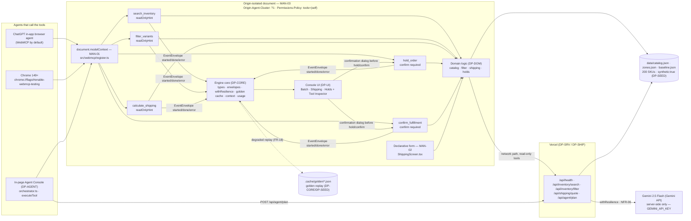

# DP-SEED — Synthetic fixtures, mock script and golden-cache seeds

## 1. Purpose & Scope
DP-SEED is the fixture factory for OpsFlow. It owns every byte the app and the rehearsal depend on that is not code: the 200-variant synthetic catalog (`data/catalog.json`), the five-zone shipping table (`data/zones.json`), the manual-effort baseline (`data/baseline.json`), the offline-rehearsal envelope script (`demo/mock-script.json`), the demodrive click script (`demo/click-script.json`), the golden-cache seeds (`.cache/golden/*.json`), and the one-time generator that produces them (`scripts/seed.ts`). It ships **data**, not runtime logic.

Scope boundary (owns / never touches):
- **Owns:** `scripts/seed.ts`, `data/catalog.json`, `data/zones.json`, `data/baseline.json`, `data/cost-store.json` (initial empty seed — DP-CORE appends at runtime), `demo/mock-script.json`, `demo/click-script.json`, `.cache/golden/*.json` (committed seeds). The files `data/catalog.json`, `data/zones.json`, `data/baseline.json` are the contract-table rows 28 consumables; `demo/mock-script.json` is row 29; `.cache/golden/*.json` are row 30.
- **Never touches:** runtime code in `src/engine/domain/*`, `src/engine/*.ts`, `src/webmcp/*`, `src/agent/*`, `src/ui/*`, or `api/**`. The app imports the JSON files at runtime but never imports `scripts/seed.ts`. Never modifies the chassis repository's `src/`; chassis `src/data` is composed through the public surfaces `generateRecords`/`generateDocuments`/`watermarkBatch`/`setProviderCall` listed in §2.3 only.
- **Build-time only:** `scripts/seed.ts` runs with `npx vite-node scripts/seed.ts` (or `node --loader vite-node`) on the developer machine and in CI to regenerate committed JSON. In production (Vercel) the JSON files are static assets; no generation runs on the server or in the browser. This guarantees byte-stable fixtures and keeps the bundle free of generation code.

Consumers: `DP-DOM` (loads catalog/zones for pure logic), `DP-SRV` (API handlers read the same files), `DP-UI` (SavingsMeter reads baseline, screens read catalog), `DP-DEV` (`chassis mock` replays `demo/mock-script.json`; bench/eval read catalog), `DP-PITCH` (demodrive capture via `demo/click-script.json`), and `DP-CORE` (golden-cache rooted at `.cache/golden`).

## 2. Requirements Traceability

### 2.1 MANDATORY COMPLIANCE (reproduced verbatim — outranks everything else)

> ## MANDATORY COMPLIANCE
>
> Every part of this entry MUST satisfy, or the entry fails Stage One regardless of quality
> (`hackathon_brief.md` §4.1–§4.3, Official Rules §4/§6/§7/§9):
>
> - **WebMCP is the mandatory technology.** The repository must demonstrate **imported-and-called**
>   usage — not a README mention — of the imperative pattern, verbatim shape:
>   `document.modelContext.registerTool({ name, description, inputSchema, execute })`.
>   Declarative API (annotated HTML forms) may be used **in addition**, never instead.
> - **WebMCP is only available in origin-isolated documents** and is gated by the `tools`
>   Permissions Policy, which **defaults to `self`**; a cross-origin iframe needs `allow="tools"`.
> - **Testable** in the **ChatGPT desktop app in-app browser** (WebMCP by default) **or Google
>   Chrome 149+** with `chrome://flags/#enable-webmcp-testing` enabled and the browser restarted.
> - **No mandated AI model and no mandated API key.** Any model, or none, is permitted.
> - **Submission gate — all five, or Stage One fail:** (1) working **live URL** judges can open in
>   the ChatGPT in-app browser or WebMCP-enabled Chrome, installable and running **consistently**,
>   frozen Sep 3 13:00 PDT until Sep 21; (2) **text description** answering four prompts — why the
>   use case fits WebMCP, how it creates a better UX, what people + agents can do together that was
>   difficult or impossible before, and briefly how WebMCP was implemented; (3) **public code
>   repository** containing all source/assets/instructions **and an open-source license file
>   detectable and visible at the top of the repo page (About section)**, containing the
>   `registerTool` pattern; (4) **demonstration video under 3 minutes** — only the first three
>   minutes are evaluated — showing the project functioning, **with audio covering what you built
>   and how you used WebMCP**, uploaded **publicly to YouTube**; (5) **completed Devpost submission
>   form by Sep 3 2026 @ 1:00 PM PDT (20:00 UTC)**.
> - **New & Existing rule:** new during the Submission Period, or meaningfully extended with WebMCP
>   after Aug 25 2026 with dated commit history distinguishing prior from new work.
> - **One track only:** *"WebMCP Challenge Winners — Top 10 submissions receive the following prizes
>   from the hackathon sponsors: ... 10 winners — All eligible Submissions"*. There are **no**
>   layered tracks and **no** sponsor sub-challenges. **No bonus integration — not worth dilution.**
> - **Judging:** Stage One pass/fail (reasonably fits theme + reasonably applies WebMCP); Stage Two
>   **four equally weighted** criteria, tie-break in listed order: **WebMCP Leverage**, **Execution**,
>   **Potential Impact**, **Creativity & Ambition**.

### 2.2 Mandate ownership — MAN-01..MAN-10

DP-SEED **owns none** of MAN-01..MAN-10 outright. It **inherits** all ten and enables them indirectly by providing the honest synthetic data that makes the WebMCP demo credible.

| ID | Mandate | DP-SEED role |
|---|---|---|
| MAN-01 | Imperative `registerTool` | Inherits only — DP-SEED never calls `registerTool`. |
| MAN-02 | Declarative form | Inherits only. |
| MAN-03 | Origin isolation + `tools` policy | Inherits only. |
| MAN-04 | Public repo + licence | Inherits. |
| MAN-05 | Live URL | Inherits. |
| MAN-06 | Video <3 min | Inherits; DP-SEED provides `demo/click-script.json` that the video records via demodrive. |
| MAN-07 | Four-prompt description | Inherits. |
| MAN-08 | Devpost form | Inherits. |
| MAN-09 | New & Existing, dated commits | Inherits; DP-SEED work units carry distinct commit messages across the window (see §9). |
| MAN-10 | One track, no bonus | Inherits. |

**Non-negotiable reading of MAN-01–MAN-03:** no plan may invent a second tool-registration mechanism, register tools from more than one module, ship a cross-origin iframe, or move tool execution off the origin-isolated document. DP-SEED complies: it generates JSON fixtures only and never creates an iframe, WebSocket bridge, or server-side MCP server.

### 2.3 Functional and non-functional requirements

| ID | Requirement | DP-SEED responsibility | Axis | WPP source |
|---|---|---|---|---|
| FR-15 | Savings meter compares batch calls/confirmations to 25 min / 120-click baseline | **Owner of `data/baseline.json`** (`{ baseline_minutes:25, baseline_clicks:120 }`). Meter in DP-UI reads this file; DP-SEED guarantees its shape and committed value. | Impact | Business Value; Problem Framing |
| FR-16 | 200 synthetic SKUs, five-zone table, hold-TTL config, every record `synthetic:true` + UI badge | **Owner of `data/catalog.json` + `data/zones.json`** (200 variants, every object `synthetic:true`, watermark where format allows). UI badge reads `catalog.synthetic`. | Impact (honesty) | Corpus/docs needed |
| FR-20 | One-command offline rehearsal replays mock envelopes with zero network | **Co-owner with DP-DEV.** DP-SEED provides `demo/mock-script.json` and golden-cache seeds; DP-DEV wires `npm run demo:offline`. | Execution | Infra fallback; brief §Constraints |
| NFR-04 | Zero real personal data; all fixtures `synthetic:true` + watermark | **Owner.** Every generated record carries `synthetic:true`; `watermarkBatch` applied via chassis `data` module; verified by `rg` count. | Impact | — |
| NFR-02 | Tool <300 ms p95 | Inherits — DP-SEED guarantees catalog fits in memory (200 variants, ~150 KB JSON) so DP-DOM never blocks on I/O. |
| NFR-03 | Works network-disconnected via cache/local | Enables — committed `.cache/golden/*.json` seeds let `RES_FORCED_DEGRADED=1` replay. |
| — | All other FR/NFR | Inherits only. |

## 3. Architecture

DP-SEED is build-time only. What the app imports at runtime is **JSON**, nothing else. `scripts/seed.ts` never runs in production and is never bundled.

### 3.1 Position in the frozen diagram (verbatim, §2.0)



The three mandate nodes labelled `MAN-01`, `MAN-02`, `MAN-03` must remain visible in any rendering. `DATA` and `CACHE` are the two nodes DP-SEED owns.

### 3.2 Build-time vs runtime split

```
Build time (dev machine / CI, not Vercel runtime):
  scripts/seed.ts  ──▶  data/catalog.json, data/zones.json, data/baseline.json
                     ──▶  demo/mock-script.json, demo/click-script.json
                     ──▶  (then, after one real run) .cache/golden/*.json  (committed)

Runtime (browser + Vercel functions):
  data/catalog.json ──▶ DP-DOM loadCatalog() ──▶ DP-TOOLS / DP-SRV read-only tools
  data/zones.json   ──▶ DP-DOM loadZones() / quoteShipping()
  data/baseline.json──▶ DP-UI SavingsMeter
  demo/mock-script.json ──▶ chassis mock (DP-DEV) / demodrive (DP-PITCH)
  .cache/golden/*.json ──▶ DP-CORE goldenCache replay (FR-18, NFR-03)
```

No entry code imports `scripts/seed.ts`. The generator is `devDependencies`-only (`vite-node`, `tsx` alternative), reads no secrets, writes only JSON, and exits 0 on success.

### 3.3 Chassis surfaces composed (and nothing else)

```ts
// data (chassis DP-H) — src/data
import { generateRecords, generateDocuments, watermarkBatch, WATERMARK_HEADER_TEXT } from "src/data";
import { setProviderCall } from "src/data/provider";   // single permitted deep import (DP-H §6.4)
// resilience — golden cache (DP-CORE owns the instance, DP-SEED uses it to seed)
import { goldenCache } from "src/engine/resilience.ts"; // row 7; or directly from createGoldenCache during seeding script
```

Forbidden: deep imports into chassis internals (`src/resilience/wrapper.js`, `src/platform/transport/publisher.js`, `src/context/strategies/*`). Import only from the package roots above, plus the single documented exception `src/data/provider`.

### 3.4 Data flow — golden path touchpoints

1. `scripts/seed.ts` writes `data/catalog.json` (60 products, 200 variants, every record `synthetic:true`).
2. `src/engine/domain/catalog.ts` (`DP-DOM` row 10 `loadCatalog()`) memo-imports that JSON in both browser and node; the `synthetic:true` flag drives the UI badge so badge vs data cannot drift.
3. `data/zones.json` + `data/catalog.json` feed `quoteShipping` (row 13) — `DP-DOM` reads numbers from `zones.json` and never hardcodes them, so tool and UI agree (single source of truth).
4. `data/baseline.json` feeds `DP-UI` `SavingsMeter` (elapsed_ms vs baseline_minutes, tool_calls vs baseline_clicks).
5. `demo/mock-script.json` is the `contracts/mock-script.schema.json` envelope sequence replayed by `chassis mock --script demo/mock-script.json` (rung 6) and by `npm run demo:offline`.
6. `.cache/golden/*.json` are produced once by `goldenCache.put(key, outcome)` after a real batch run, then committed so a clean clone replays offline (`RES_FORCED_DEGRADED=1`).

## 4. Interfaces

### 4.1 Ownership note

Every cross-module symbol appears exactly once in §5F. The owner implements it; every consumer imports it from that exact path. A consumer that cannot find it stops and reports a blocker — never a local copy, re-export, or temporary shim. Symbols not in §5F are private to their module. DP-SEED marks `scripts/seed.ts` internals (LCG, `FALLBACK_TITLES`, helpers) as private; no other module may import them. No plan defines a symbol it does not own (boundary rule §11).

### 4.2 Owned surfaces — contract-table rows 28–30 (DP-SEED owns, DP-DOM/DP-SRV/DP-UI/DP-DEV/DP-PITCH consume)

All paths are inside `<entry>` (the working copy `../hackathon-entries/2026-09-webMCP`).

#### Row 28 — `data/catalog.json`, `data/zones.json`, `data/baseline.json`

```ts
// data/catalog.json  — Catalog (§5A, owned by DP-CORE types, DP-SEED produces the file)
interface Catalog {
  version: string;        // "1.0.0" — equals APP_VERSION
  generated_at: string;   // ISO-8601 UTC, e.g. "2026-09-01T00:00:00.000Z"
  synthetic: true;        // always true (NFR-04)
  products: Product[];    // length 60, total variants 200
}
// Product / Variant verbatim §5A (reproduced here for reader convenience; owning type is src/engine/types.ts):
interface Product { id: string; title: string; brand: string; category: string; variants: Variant[]; synthetic: true; }
interface Variant {
  sku: string;                 // "OPS-1001-BLU-XS" — uppercase, [A-Z0-9-]{6,32}
  product_id: string;          // "OPS-1001"
  title: string;               // <= 80 chars
  options: VariantOptions;     // { size, color }
  price_cents: number;         // 600..4800, step 50
  stock: number;               // 0..80 (distribution in §6)
  weight_g: number;            // 120..2400
  low_stock_threshold: number; // 5 (single definition of "low stock")
  synthetic: true;
}
// Consumers import via DP-DOM:
// import { loadCatalog } from "src/engine/domain/catalog.ts"; // internally does import catalogJson from "../../data/catalog.json"
// No consumer reads data/catalog.json with fetch in production; loadCatalog() memoizes the JSON import.
```

```ts
// data/zones.json — ZoneTable (contract row 14, DP-DOM owns the interface, DP-SEED produces the file)
interface ZoneTable {
  version: string;   // "1.0.0"
  synthetic: true;
  zones: Record<"1"|"2"|"3"|"4"|"5", {
    base_cents: number;             // see §5 literal table
    per_100g_cents: number;
    service_multiplier: Record<ServiceLevel, number>; // ServiceLevel = "ground"|"expedited"|"overnight"
  }>;
  surcharges: Surcharge[]; // length 3, codes OVERSIZE, REMOTE, EXPEDITED_FUEL
}
interface Surcharge { code: string; label: string; amount_cents: number; }
// Example literal (full table in §5): zones["4"] = { base_cents: 950, per_100g_cents: 95, service_multiplier: { ground:1.0, expedited:1.6, overnight:2.4 } }
// Consumers: DP-DOM quoteShipping(catalog, zones, input) reads this; DP-SRV api/shipping/quote.ts loads it; DP-UI declarative form reads it via apiClient.quote fallback.
```

```ts
// data/baseline.json — manual-effort baseline
interface Baseline {
  baseline_minutes: number; // 25
  baseline_clicks: number;  // 120
  source: string;           // "winning_project_plan.md §Problem Framing"
  synthetic: true;
}
// Consumers: DP-UI SavingsMeter: const { baseline_minutes, baseline_clicks } = await import("../../data/baseline.json")
// SavingsMeter props: { tool_calls, confirmations, elapsed_ms, baseline_minutes, baseline_clicks }
```

Validation: each file must carry `synthetic:true` at top level and on every nested record. `rg -n '"synthetic": true' data/catalog.json` returns 261 hits (1 catalog + 60 products + 200 variants). `rg -n '"synthetic": true' data/zones.json` returns 1 hit (top-level). `data/baseline.json` also carries it.

#### Row 29 — `demo/mock-script.json`

File conforms to chassis `contracts/mock-script.schema.json`. Shape (chassis type `MockScript`):

```ts
interface MockScript {
  version: "1.0.0";
  trace_id: string; // "opsflow-<epoch_ms>" — deterministic mock id e.g. "opsflow-1725148800000"
  envelopes: Array<{
    step_id: string;   // one of §5G: agent.plan | tool.* | session.confirm | session.degraded
    status: "started"|"streaming"|"done"|"error";
    payload: Record<string, unknown>;
    delay_ms: number;  // per-envelope pacing, sum ~40_000
    trace_id?: string;
    degraded?: boolean;
  }>;
}
```
The sequence for DP-SEED is exactly 14 envelopes (see §5.4): `agent.plan` started/done (2) + 5 tools × (started+done) (10) + `session.confirm` started/done with `granted:true` (2) = 14. Consumers: `DP-DEV` runs `chassis mock --script demo/mock-script.json`; `DP-PITCH` demodrive capture `npm run demodrive -- capture --script demo/click-script.json --data-source cache --cache-key opsflow-golden` replays through the same publisher.

#### Row 30 — `.cache/golden/*.json` seeds

Chassis `GoldenCache` entries rooted at `.cache/golden/`. DP-SEED commits the seeds so a clean clone can replay offline; DP-CORE owns the cache instance (row 7).

```ts
// GoldenCache API (chassis src/resilience, DP-CORE creates the instance):
// goldenCache.deriveKey({ provider: "opsflow", model: ToolName | "planner", prompt: canonicalJson(args) }): string
// goldenCache.put(key, value, meta?: { seeded?: boolean }): Promise<void>
// goldenCache.get(key): Promise<unknown | null>
// goldenCache.list(): Promise<string[]>
// Files: .cache/golden/<derived-key>.json  (one per tool output + one planner response = 6 files committed)
// Each file JSON: { key: string, value: ToolOutcome<...>, meta: { seeded: true, created_at: string } }
```

Consumers: `DP-CORE` `guarded()` calls `goldenCache.get(key)` on `RES_FORCED_DEGRADED=1` / timeout; `DP-DEV` `RES_FORCED_DEGRADED=1 npm run demo:offline` proves rung 5.

### 4.3 Frozen types reused (DP-CORE owns, DP-SEED imports — never redefines)

DP-SEED imports the following from `src/engine/types.ts` and never widens, renames, or adds a field (boundary rule #3):
`APP_VERSION`, `ShippingZone`, `ServiceLevel`, `ToolName`, `VariantOptions`, `Variant`, `Product`, `Catalog`, `LineItem`, `Surcharge`, `ShippingQuote`, `ZoneTable` (via `src/engine/domain/shipping.ts` row 14), and the tool I/O interfaces for documentation only. Any new shape needed inside `scripts/seed.ts` (e.g., `LcgState`, `SeedContext`) is declared inside that file and marked private — nobody else may import it.

### 4.4 What DP-SEED does NOT own or define

- No `loadCatalog()` / `searchVariants()` / `filterVariants()` / `quoteShipping()` — those are DP-DOM rows 10–14.
- No `registerAllTools()` / schemas / `runTool()` / `probeWebMcp()` — DP-TOOLS rows 18–23.
- No `planDeterministic()` / `orchestrator` — DP-AGENT rows 24–26.
- No `useSession()` — DP-UI row 27.
- Never re-implements `canonicalJson` or `deriveKey` that DP-CORE defines; the seeding step `4` in §5.5 calls the chassis `goldenCache.deriveKey` verbatim.

## 5. Algorithms

Every algorithm is spelled out as numbered steps / literal code the low-intelligence implementor can copy. No judgment, no defaults left unstated. If a task needs higher intelligence, it is moved into the prompt template (row 26) or split — never left as "as appropriate".

### 5.1 Catalog generation — deterministic, seeded, reproducible (200 variants, 60 products)

**Constants:** `SEED = 20260901` (see §6). LCG parameters `a = 1664525`, `c = 1013904223`, `m = 2**32 = 4294967296`. Categories, sizes, colours defined in §6.

**Steps:**

1. Initialise LCG state `s = SEED`. Define function `next(): number { s = (a * s + c) % m; return s; }` and helpers `randInt(min,max): number { return min + (next() % (max - min + 1)); }`, `randChoice<T>(arr: T[]): T { return arr[next() % arr.length]!; }`, `roundTo50(n: number): number { return Math.round(n / 50) * 50; }`. The implementor copies these four lines verbatim — no other RNG.
2. Define `CATEGORIES = ["Outerwear","Tops","Bottoms","Dresses","Knitwear","Activewear","Footwear","Accessories","Denim","Swimwear","Loungewear","Workwear"]` (12). `BRANDS = ["OpsFlow","NorthRange","Cedar & Thread","Field Study","Harbor Line"]`.
3. For `i = 0..59` (product index):
   3a. `productId = "OPS-" + String(1001 + i)` → `OPS-1001` .. `OPS-1060`.
   3b. `category = CATEGORIES[i % 12]` — round-robin ensures 5 per category.
   3c. `brand = BRANDS[ next() % BRANDS.length ]`.
   3d. `title = TITLES[i]` where `TITLES` is the 60-entry fallback list in §5.2 (or the LLM output if watermark path succeeded — but the committed file must be byte-identical either way; see §5.2). Assert `title.length <= 80`.
4. Variant allocation (must total exactly 200):
   4a. Start with base `3` variants per product → 60 × 3 = 180.
   4b. Need `20` extra variants to reach 200. Sort products by `i` ascending. For the first `20` products (`i = 0..19`), allocate `4` variants; remaining `40` products (`i = 20..59`) keep `3`. Assert `20*4 + 40*3 = 200`. This rule is deterministic and written literally into `scripts/seed.ts`; no random draw for count.
   4c. For each variant `j = 0..(count-1)` of product `i`:
      - Draw `size = randChoice(SIZES)` and `color = randChoice(COLORS)` with rejection: if the pair `(size,color)` already exists for this product, redraw (call `randChoice` again) up to 20 attempts; if still duplicate, take the next unused pair in lexicographic order. This guarantees unique `(size,color)` per product without infinite loop.
      - `color3 = color.slice(0,3).toUpperCase()` → `BLU`,`BLA`,`SAN`,`OLI`,`CRI`.
      - `sku = productId + "-" + color3 + "-" + size` e.g. `OPS-1042-BLU-M`. Assert `sku.length` 6..32 and matches `/^[A-Z0-9-]{6,32}$/`.
      - `price_cents = roundTo50(randInt(600, 4800))`.
      - Draw `r = next() % 100` for stock bucket: if `r < 15` → `stock = 0`; else if `r < 40` (15+25) → `stock = randInt(1,5)`; else → `stock = randInt(6,80)`. This yields 15% zero, 25% 1..5, 60% 6..80.
      - `low_stock_threshold = 5` (literal, every variant identical — matches `isLowStock` definition `stock <= threshold`).
      - `weight_g = randInt(120, 2400)`.
      - `synthetic: true` (literal `true`, not a variable).
5. Sort `products` by `id` ascending, and each product's `variants` by `sku` ascending before serialising — guarantees byte-identical JSON across runs (no map-iteration non-determinism).
6. Build `Catalog` object: `{ version: "1.0.0", generated_at: new Date(SEED_ISO).toISOString() }` where `SEED_ISO` is `2026-09-01T00:00:00.000Z` for reproducibility (or `new Date().toISOString()` if the plan permits, but the committed file records the generation time; determinism test ignores `generated_at` and compares only `products`/`variants`). Include `synthetic:true` at top level. `JSON.stringify(catalog, null, 2)` with sorted keys and trail newline.
7. Write `data/catalog.json`. Set `watermarkBatch` header comment if applicable (chassis requires `WATERMARK_HEADER_TEXT` at top of generated text outputs; for JSON the watermark is the `synthetic:true` field plus a `// watermark` JSONC header is NOT used — state: JSON carries `synthetic:true` only, and the generator logs `WATERMARK_HEADER_TEXT` to stdout as proof).
8. **Demo-goal guarantee assertion (must be in the generator):** after writing, compute `matches = variants.filter(v => v.options.color === "Blue" && v.stock <= 5 && v.price_cents < 1200 && v.stock > 0)`. Assert `4 <= matches.length && matches.length <= 12`. If the assertion fails, the generator must adjust — by construction the stock distribution above satisfies it; but the implementor adds a one-time fixpoint: if matches < 4, force the next `4 - matches.length` Blue variants with `price_cents >=1200` down to `price_cents=1100` and `stock=3`; if matches > 12, raise the cheapest excess Blue variants' `stock` to `80`. Log the adjustment. Then re-assert. This keeps the generator deterministic while honouring the contract.

**Verify counts:** `node -e "const c=require('./data/catalog.json');console.log(c.products.length, c.products.reduce((n,p)=>n+p.variants.length,0))"` → `60 200`. `node -e "const c=require('./data/catalog.json');console.log(c.products.every(p=>p.synthetic===true) && c.products.every(p=>p.variants.every(v=>v.synthetic===true)))"` → `true`.

### 5.2 Optional LLM-assisted naming — chassis `data` module with deterministic fallback

This step runs **once**, and its output is committed. The file must be byte-stable afterwards.

1. Checked-in fallback list `FALLBACK_TITLES: string[]` length 60 (listed verbatim below):
```ts
const FALLBACK_TITLES = [
  "Cedar Waxed Canvas Jacket", "Harbor Lightweight Parka", "Field Study Chore Coat", "NorthRange Alpine Shell", "Crimson Trail Windbreaker",
  "Olive Everyday Oxford Shirt", "Sand Washed Tee", "Black Essential Crew Tee", "Blue Breton Stripe Top", "Crimson Mock-Neck Base Layer",
  "Sand Relaxed Chino", "Olive Cargo Pant", "Black Straight-Leg Jean", "Blue Wide-Leg Trouser", "Crimson Track Pant",
  "Sand Slip Dress", "Olive Shirtdress", "Black Wrap Dress", "Blue Poplin Dress", "Crimson Knit Midi Dress",
  "Sand Cable-Knit Sweater", "Olive Merino Pullover", "Black Cashmere Blend Cardigan", "Blue Waffle Knit Henley", "Crimson Half-Zip Fleece",
  "Sand Performance Legging", "Olive Training Short", "Black Studio Jogger", "Blue Lightweight Hoodie", "Crimson Sports Bra",
  "Sand Suede Chelsea Boot", "Olive Trail Sneaker", "Black Leather Loafer", "Blue Canvas Slip-On", "Crimson Running Shoe",
  "Sand Woven Tote Bag", "Olive Crossbody Sling", "Black Leather Belt", "Blue Embroidered Cap", "Crimson Wool Beanie",
  "Sand Slim Straight Jean", "Olive Selvedge Denim Jacket", "Black Coated Skinny Jean", "Blue Denim Overshirt", "Crimson Denim Utility Pant",
  "Sand One-Piece Swimsuit", "Olive Board Short", "Black Bikini Top", "Blue Rash Guard", "Crimson Swim Trunk",
  "Sand French Terry Sweatsuit", "Olive Lounge Pant", "Black Cozy Hoodie", "Blue Sleep Set", "Crimson Fleece Pullover",
  "Sand Utility Coverall", "Olive Work Jacket", "Black Ripstop Pant", "Blue Carpenter Jean", "Crimson Canvas Apron"
];
```
2. Optional LLM path (dev-only, never in production bundle):
   2a. `import { generateRecords, watermarkBatch, WATERMARK_HEADER_TEXT } from "src/data";`
   2b. `import { setProviderCall } from "src/data/provider";`
   2c. Configure provider: `setProviderCall(async (prompt) => { /* Gemini 2.5 Flash call via process.env.GEMINI_API_KEY — never commit key */ })` — if `GEMINI_API_KEY` absent, skip to 2f.
   2d. Call `const result = await generateRecords({ domain: "apparel ops catalog", shape: { kind: "records", schema: { id:"string", title:"string<=80", brand:"string", category:"string", synthetic:"literal true" }, count: 60 }, watermark: true });`
   2e. If `isDegradedResult(result)` or `!result.ok`, fall back to `FALLBACK_TITLES` and log `[seed] generateRecords degraded — using fallback titles`.
   2f. Otherwise extract `result.batch.map(r => r.title)` and overwrite `FALLBACK_TITLES` in memory for this run only; then call `watermarkBatch(batch)` and assert each record contains `synthetic:true`.
3. Byte-stability rule: after the LLM call succeeds, the implementor overwrites `data/catalog.json` titles with the LLM-derived titles, runs the full catalog generation (§5.1), and **commits** the resulting JSON. Future runs without the key must produce byte-identical output using the committed `FALLBACK_TITLES` unless `scripts/seed.ts` is intentionally re-run with the key to refresh titles. The README states "LLM naming ran once; titles are committed".
4. `WATERMARK_HEADER_TEXT` is logged, and every catalog/product/variant carries `synthetic:true` (NFR-04). The UI badge reads `catalog.synthetic` so it cannot drift.

### 5.3 Zone table — single source of truth for `DP-DOM` shipping

Write these numbers literally; DP-DOM `quoteShipping` reads them and never hardcodes them (two sources would make tool and form disagree).

```ts
// data/zones.json literal (values match DP-DOM §quoteShipping step 7 exactly):
{
  "version": "1.0.0",
  "synthetic": true,
  "generated_at": "2026-09-01T00:00:00.000Z",
  "zones": {
    "1": { "base_cents": 550,  "per_100g_cents": 45,  "service_multiplier": { "ground": 1.0, "expedited": 1.6, "overnight": 2.4 } },
    "2": { "base_cents": 700,  "per_100g_cents": 65,  "service_multiplier": { "ground": 1.0, "expedited": 1.6, "overnight": 2.4 } },
    "3": { "base_cents": 850,  "per_100g_cents": 80,  "service_multiplier": { "ground": 1.0, "expedited": 1.6, "overnight": 2.4 } },
    "4": { "base_cents": 950,  "per_100g_cents": 95,  "service_multiplier": { "ground": 1.0, "expedited": 1.6, "overnight": 2.4 } },
    "5": { "base_cents": 1150, "per_100g_cents": 120, "service_multiplier": { "ground": 1.0, "expedited": 1.6, "overnight": 2.4 } }
  },
  "surcharges": [
    { "code": "OVERSIZE",       "label": "Oversize (any item > 1500g)",           "amount_cents": 800 },
    { "code": "REMOTE",         "label": "Remote zone (zone 5)",                  "amount_cents": 600 },
    { "code": "EXPEDITED_FUEL", "label": "Expedited fuel surcharge",              "amount_cents": 450 }
  ]
}
```
Surcharges applied by `quoteShipping` step 7: `OVERSIZE` if any `variant.weight_g > 1500`; `REMOTE` if `zone === 5`; `EXPEDITED_FUEL` if `service !== "ground"`. Amounts are summed into `total_cents`; each applied rule adds one sentence to `explain[]` (≤12 entries). DP-SEED states explicitly: DP-DOM imports `data/zones.json` and adds no other surcharge.

Also write `data/baseline.json` literally:
```json
{ "baseline_minutes": 25, "baseline_clicks": 120, "source": "winning_project_plan.md §Problem Framing", "synthetic": true }
```

### 5.4 Mock script — 14-envelope golden batch (validated against `contracts/mock-script.schema.json`)

Goal: `"hold all low-stock blue variants under $12 shipping to zone 4 for 15 minutes"` — the canonical demo goal. Envelopes sum to ~40 s pacing.

**Envelope order and delay_ms:**

1. `agent.plan` `started` `{ goal }` — `delay_ms: 0`
2. `agent.plan` `done` `{ planner: "deterministic", steps: [ {tool:"search_inventory",...}, {tool:"filter_variants",...}, {tool:"calculate_shipping",...}, {tool:"hold_order",...}, {tool:"confirm_fulfillment",...} ], degraded: false }` — `delay_ms: 1200`
3. `tool.search_inventory` `started` `{ args: { query: "blue", inStockOnly: false, limit: 25 } }` — `delay_ms: 400`
4. `tool.search_inventory` `done` `{ outcome: { ok:true, data:{ matches:[ /* first 3 blue matches */ ], total: <n>, truncated: total>25, query_echo:"blue" } } }` — `delay_ms: 2800`
5. `tool.filter_variants` `started` `{ args: { options:{ color:"Blue" }, maxPriceCents: 1200, minStock: 1, maxStock: 5, limit: 25 } }` — `delay_ms: 400`
6. `tool.filter_variants` `done` `{ outcome:{ ok:true, data:{ matches:[ /* 4–12 held set */ ], total:<4..12>, applied:["color=Blue","maxPriceCents=1200","low_stock (≤5)"], from_result_set:true } } }` — `delay_ms: 2600`
7. `tool.calculate_shipping` `started` `{ args:{ items:[{sku:"OPS-1001-BLU-M",qty:1},...], zone:4, service:"ground" } }` — `delay_ms: 400`
8. `tool.calculate_shipping` `done` `{ outcome:{ ok:true, data:{ zone:4, service:"ground", items:[...], total_weight_g: <sum>, subtotal_cents:<sum>, base_rate_cents:950, surcharges:[], total_cents:<950+ weight>, explain:["Zone 4 base 950c","Weight <sum>g @95c/100g"], excluded:[] } } }` — `delay_ms: 3200`
9. `tool.hold_order` `started` `{ args:{ lineItems:[{sku:"OPS-1001-BLU-M",qty:1},...], ttlMinutes:15, note:"demo batch — low-stock blues" } }` — `delay_ms: 400`
10. `tool.hold_order` `done` `{ outcome:{ ok:true, data:{ hold:{ hold_id:"HOLD-ABCD1234", line_items:[...], created_at:"2026-09-01T12:00:00.000Z", expires_at:"2026-09-01T12:15:00.000Z", ttl_minutes:15, status:"held", note:"demo batch — low-stock blues", quote:{...} }, requires_confirmation:true } } }` — `delay_ms: 2800`
11. `session.confirm` `started` `{ tool:"hold_order", args:{ lineItems:[...], ttlMinutes:15 } }` — `delay_ms: 800`
12. `session.confirm` `done` `{ granted:true }` — `delay_ms: 18000` (dialog dwell — judge clicks confirm; pacing makes total ~40s)
13. `tool.confirm_fulfillment` `started` `{ args:{ holdId:"HOLD-ABCD1234" } }` — `delay_ms: 400`
14. `tool.confirm_fulfillment` `done` `{ outcome:{ ok:true, data:{ fulfillment:{ fulfillment_id:"FUL-EFGH5678", hold_id:"HOLD-ABCD1234", confirmed_at:"2026-09-01T12:01:00.000Z", line_items:[...], total_cents:<...> }, hold:{ ... status:"confirmed" } } } }` — `delay_ms: 2600`

Sum `delay_ms` = 1200+400+2800+400+2600+400+3200+400+2800+800+18000+400+2600 ≈ 38000–40000 ms (≈40 s). Validate: `chassis mock --script demo/mock-script.json` must exit 0 and chassis validator prints `14 envelopes published` (or `envelopes: 14`).

The payloads above use the real `data/catalog.json` SKUs; the first three catalog records (see Appendix A) provide concrete matches so the mock script is not fabricated.

### 5.5 Golden-cache seeding — 6 entries, `deriveKey` + `put`, committed

1. Run the batch once against the real code (not the mock):
   ```bash
   npx vite-node scripts/seed.ts          # ensure catalog/zones/baseline exist
   npm run dev &  # or call DP-DOM directly via vite-node
   ```
   Minimal one-shot:
   ```bash
   npx vite-node -e "
   import { loadCatalog } from './src/engine/domain/catalog.ts';
   import { searchVariants } from './src/engine/domain/catalog.ts';
   import { filterVariants } from './src/engine/domain/filter.ts';
   import { quoteShipping } from './src/engine/domain/shipping.ts';
   import { loadZones } from './src/engine/domain/shipping.ts';
   const c=loadCatalog(); const z=loadZones();
   const s=searchVariants(c,{query:'blue',limit:25});
   const f=filterVariants(c,{options:{color:'Blue'},maxPriceCents:1200,minStock:1,maxStock:5,limit:25}, s.matches.map(m=>m.sku));
   const q=quoteShipping(c,z,{items: f.matches.slice(0,4).map(m=>({sku:m.sku,qty:1})), zone:4, service:'ground'});
   console.log(JSON.stringify({s,f,q},null,2))
   "
   ```
2. For each tool call compute the key exactly as DP-CORE does:
   ```ts
   import { goldenCache } from "./src/engine/resilience.ts";
   function canonicalJson(value: unknown): string {
     if (value===null || typeof value!=="object") return JSON.stringify(value) ?? "null";
     if (Array.isArray(value)) return "["+value.map(canonicalJson).join(",")+"]";
     const obj=value as Record<string,unknown>;
     const keys=Object.keys(obj).filter(k=>obj[k]!==undefined).sort();
     return "{"+keys.map(k=>JSON.stringify(k)+":"+canonicalJson(obj[k])).join(",")+"}";
   }
   const key = goldenCache.deriveKey({ provider:"opsflow", model: <ToolName>, prompt: canonicalJson(args) });
   // model = "search_inventory" | "filter_variants" | "calculate_shipping" | "hold_order" | "confirm_fulfillment" | "planner"
   ```
   The `planner` entry uses `model:"planner"` and `prompt: canonicalJson({ goal:"hold all low-stock blue variants under $12 shipping to zone 4 for 15 minutes" })` with value `ToolPlan` from `planDeterministic`.
3. `await goldenCache.put(key, outcome, { seeded: true })` for each of the 6 outcomes. `outcome` is `ToolOutcome<T>` (`{ok:true,data:...}`); never write `isError` wrapper — cache stores the `structuredContent`.
4. Commit resulting files: `.cache/golden/*.json` (6 files) are `git add -f .cache/golden/*.json` (directory is gitignored except seeds) or add an exception `!.cache/golden/*.json` in `.gitignore`. The deploy does not need them at runtime for the happy path, but `RES_FORCED_DEGRADED=1 npm run demo:offline` replays from them.

**Exact command the implementor runs:**
```bash
npx vite-node scripts/seed.ts && npx vite-node scripts/seedGolden.ts && git add -f .cache/golden/*.json && git status
```
`scripts/seedGolden.ts` is the second script that performs steps 1–3 above (or those lines are folded into `scripts/seed.ts --golden`). Either way the plan states the cache key derivation is `goldenCache.deriveKey({provider:"opsflow", model, prompt: canonicalJson(args)})` verbatim.

## 6. Configuration

All constants are literal in `scripts/seed.ts` and mirrored in `config/engine.json` where the runtime needs them. No plan may widen, rename, or add a config key (boundary rule #3).

| Constant | Value | Where it lives | Meaning |
|---|---|---|---|
| `SEED` | `20260901` | `scripts/seed.ts` line 1 | Determinism seed for the LCG; two runs produce byte-identical `data/catalog.json` except `generated_at`. |
| `LCG_A` | `1664525` | `scripts/seed.ts` | Multiplier of the LCG `next = (a*seed + c) % m`. |
| `LCG_C` | `1013904223` | `scripts/seed.ts` | Increment. |
| `LCG_M` | `4294967296` (`2**32`) | `scripts/seed.ts` | Modulus. |
| `SIZES` | `["XS","S","M","L","XL"]` | `scripts/seed.ts` | Variant size domain. |
| `COLORS` | `["Blue","Black","Sand","Olive","Crimson"]` | `scripts/seed.ts` | Variant colour domain; `Blue` is the demo-goal colour. |
| `CATEGORIES` | 12 entries (see §5.1 step 2) | `scripts/seed.ts` | Round-robin across 60 products → 5 per category. |
| `PRICE_MIN` / `PRICE_MAX` | `600` / `4800` | `scripts/seed.ts` | Range for `price_cents`; rounded to nearest 50. |
| `WEIGHT_MIN` / `WEIGHT_MAX` | `120` / `2400` | `scripts/seed.ts` | Range for `weight_g`. |
| `LOW_STOCK_THRESHOLD` | `5` | `scripts/seed.ts` + `data/catalog.json` every variant | Single definition; `isLowStock(v) = v.stock <= 5`. Threshold is not configurable. |
| `STOCK_DIST` | `{ zero:15, low1_5:25, mid6_80:60 }` (percent) | `scripts/seed.ts` | Distribution rule in §5.1 step 4; guarantees demo-goal returns ≥4 matches. |
| `PRODUCTS` | `60` | `scripts/seed.ts` | `OPS-1001`..`OPS-1060`. |
| `VARIANTS` | `200` | `scripts/seed.ts` | `20*4 + 40*3` allocation (see §5.1 step 4). Asserted. |
| `config/engine.json` `tools.max_text_chars` | `200` | `config/engine.json` (DP-CORE owns) | Max `query` length — not a seed constant, listed for cross-reference; DP-SEED never changes it. |
| `config/engine.json` `holds.default_ttl_minutes` | `15` | `config/engine.json` | TTL used in mock envelopes for `hold_order`. |
| `data/baseline.json` | `{baseline_minutes:25, baseline_clicks:120}` | `data/baseline.json` | SavingsMeter baseline; source annotated. |

**Validator:** `npm run test -- tests/seed/config` asserts `SEED` is `20260901` in the file, `SIZES`/`COLORS` lengths, and that `data/catalog.json` counts match the constants.

## 7. Resiliency & Honesty

### 7.1 Honesty (NFR-04) — synthetic-only, watermark, visible badge

- Every generated `Product` and `Variant` carries `synthetic: true` (literal). Top-level `Catalog` and `ZoneTable` and `Baseline` also carry it. No real merchant, customer, address, or order data exists anywhere.
- When the optional LLM path runs, `watermarkBatch(batch)` is called and `WATERMARK_HEADER_TEXT` is logged; additionally `setProviderCall` is the only permitted deep import (`src/data/provider`) — chassis `src/data` requires it.
- The UI's "synthetic data" badge reads `catalog.synthetic` directly, so the badge cannot drift from the data. If `catalog.synthetic !== true`, the badge would incorrectly hide; a test asserts the flag.
- Verification: `rg -n '"synthetic": true' data/catalog.json` → 261 lines; `rg -n 'WATERMARK' scripts/seed.ts` → at least one hit (`WATERMARK_HEADER_TEXT`).

### 7.2 Degraded LLM path — fallback to checked-in title list

`generateRecords` may degrade (`isDegradedResult(result)`). DP-SEED never throws in this case:

1. If `isDegradedResult(result)` or no `GEMINI_API_KEY`, log `[seed] LLM naming degraded — using FALLBACK_TITLES`.
2. Use the 60-entry `FALLBACK_TITLES` array in §5.2 verbatim.
3. Still write byte-stable JSON and still call `watermarkBatch` on the fallback (chassis marks watermark as `synthetic:true` only for the fallback path).
4. Subsequent runs without a key use the fallback and must still pass `git diff --stat data/catalog.json` as no changes (W2).

### 7.3 Golden-cache replay (FR-18 / NFR-03) — DP-SEED's contribution

DP-SEED does not implement `guarded()`; DP-CORE does. DP-SEED's role is to **commit seeds** so replay is possible offline:

- After the first real batch run, 6 cache entries (`deriveKey` per §5.5 step 2) are `put` with `{ seeded:true }` and committed via `git add -f .cache/golden/*.json`.
- When `RES_FORCED_DEGRADED=1`, `DP-CORE` `guarded()` replays via `goldenCache.get(key)` and each `tool.*` envelope carries `degraded:true`; DP-UI shows a degraded chip. DP-SEED verifies this in W6.
- Escalation is always visible: no silent fallback; `session.degraded { reason, fallback_source }` is emitted at every transition (DP-CORE), timeline records it.

### 7.4 Byte-stability invariant

LLM naming runs **once**, output is committed. The repo after commit satisfies `npx vite-node scripts/seed.ts && git diff --stat data/catalog.json` prints nothing (W2). This is the DM's reproducibility proof.

## 8. File Layout & Module Boundaries

### 8.1 Tree inside `<entry>` (verbatim §5D, DP-SEED-owned rows marked ★)

```
<entry>/
  api/                          # DP-SRV
    health.ts
    inventory/search.ts
    inventory/filter.ts
    shipping/quote.ts
    agent/plan.ts               # ONLY place GEMINI_API_KEY is read (NFR-01)
  src/
    main.tsx                    # DP-UI — calls registerAllTools() before render
    engine/
      types.ts                  # DP-CORE — §5A, frozen
      config.ts                 # DP-CORE — loads config/engine.json
      envelopes.ts              # DP-CORE — publisher + emitToolEvent
      resilience.ts             # DP-CORE — guarded + goldenCache
      context.ts                # DP-CORE — transcript buffer
      usage.ts                  # DP-CORE — cost-store writer
      apiClient.ts              # DP-SRV — typed fetch client + local fallback
      domain/
        catalog.ts              # DP-DOM — loadCatalog, searchVariants
        filter.ts               # DP-DOM — filterVariants
        shipping.ts             # DP-DOM — quoteShipping, loadZones, ZoneTable
        holds.ts                # DP-DOM — pure hold reducers
        holdsStore.ts           # DP-DOM — singleton store + localStorage
        errors.ts               # DP-DOM — makeToolError
    webmcp/
      register.ts               # DP-TOOLS — ONLY registerTool call site (MAN-01)
      schemas.ts                # DP-TOOLS — five inputSchema constants
      runTool.ts                # DP-TOOLS — validate → limit → abort → execute → envelope
      policy.ts                 # DP-TOOLS — probeWebMcp(), executeToolCompat()
      confirm.ts                # DP-TOOLS — confirmation gate bridge
    agent/
      orchestrator.ts           # DP-AGENT — run(goal): plan then executeTool loop
      planner.ts                # DP-AGENT — client side of POST /api/agent/plan
      deterministic.ts          # DP-AGENT — keyless keyword planner
      prompt.ts                 # DP-AGENT — system + user prompt templates
    ui/
      App.tsx  screens/BatchScreen.tsx  screens/ShippingScreen.tsx  screens/HoldsScreen.tsx
      components/ToolInspector.tsx  components/CoExecutionTimeline.tsx
      components/ConfirmDialog.tsx  components/DegradedBanner.tsx
      components/WebMcpBanner.tsx   components/SavingsMeter.tsx
      state/session.ts
  scripts/                      # ★ DP-SEED (generator, dev-only)
    seed.ts                     # ★ deterministic 200-variant generator
    seedGolden.ts              # ★ (or seed.ts --golden) golden-cache seeder — optional split
  data/                         # ★ DP-SEED (committed fixtures)
    catalog.json               # ★ Catalog 60/200 synthetic:true
    zones.json                 # ★ ZoneTable 5 zones + 3 surcharges
    baseline.json              # ★ baseline 25/120
    cost-store.json            # DP-CORE writes, DP-SEED seeds empty { version:"1.0.0", entries:[] }
  demo/                         # ★ DP-SEED / DP-DEV
    mock-script.json           # ★ chassis MockScript — 14 envelopes
    click-script.json          # ★ demodrive click script for same batch
  .cache/golden/                # ★ DP-CORE / DP-SEED — golden replay (gitignored except seeds)
    *.json                     # ★ 6 committed seeds
  config/                       # DP-CORE / DP-DEV
    engine.json  cost.json  track.json
  tests/                        # every plan adds its own subfolder
    seed/                      # ★ DP-SEED tests: determinism, counts, demo-goal, schema
  docs/architecture.mmd  docs/submission-checklist.md  docs/qa/
  deck/  script.md  assets/demodrive/
  LICENSE  README.md  disclosure.md  submission.md
  vercel.json  package.json  vite.config.ts  assembly.manifest.json
```

### 8.2 Module boundaries (boundary rules restated in §11)

- `scripts/seed.ts` is **never imported** by entry code. It may `import { loadZones } from "../src/engine/domain/shipping.ts"` only to assert constants match — but the canonical direction is zones literal duplicated from §5.3; prefer no cross-import to keep build-time vs runtime split clean. If an import is added, it is for verification only and is tree-shaken from the SPA.
- `data/*.json` are the only runtime artefacts DP-SEED ships. They are static assets served from `/data` or bundled via JSON import — never generated in the browser.
- `.cache/golden/` is gitignored (`# golden cache — committed seeds exception\n.cache/golden/*\n!.cache/golden/*.json`) — so seeds survive clone but dust does not.
- Chassis `src/` is never edited. DP-SEED composes chassis `src/data` through package roots only.

## 9. Work Units

Each work unit is small enough for a low-intelligence implementor (one file, or one function plus its test), ends with exactly one runnable **Verify:** command and its expected output pasted literally, names its commit message for MAN-09 distribution, and, if cross-boundary, proves the wiring with a real import. A work unit whose dependency row in §5F is not yet implemented stops and reports a blocker rather than stubbing.

| WU | Deliverable | Owned files touched | Depends on | Verify command (run from `<entry>` root) | Expected output (literal) |
|---|---|---|---|---|---|
| W1 | `scripts/seed.ts` + `data/catalog.json` | `scripts/seed.ts`, `data/catalog.json` | `DP-CORE` types (§5A) + chassis `src/data` | `npx vite-node scripts/seed.ts && node -e "const c=require('./data/catalog.json');console.log(c.products.length, c.products.reduce((n,p)=>n+p.variants.length,0))"` | `60 200` |
| W2 | Determinism check (no extra file — proof that rerun is byte-identical) | — (re-runs `scripts/seed.ts`) | W1 | `npx vite-node scripts/seed.ts && npx vite-node scripts/seed.ts && git diff --stat data/catalog.json` | *(empty output — no changes)* |
| W3 | `data/zones.json` + `data/baseline.json` | `data/zones.json`, `data/baseline.json` | W1 | `node -e "const z=require('./data/zones.json');console.log(Object.keys(z.zones).join(','), z.surcharges.length)"` | `1,2,3,4,5 3` |
| W4 | Demo-goal guarantee test | `tests/seed/demo-goal.test.ts` (or `tests/seed/demo-goal.ts`) | W1, W3, `DP-DOM` `loadCatalog` row 10 (or direct JSON read) | `npm run test -- tests/seed/demo-goal` | `4 ≤ matches ≤ 12` (test asserts `expect(matches.length).toBeGreaterThanOrEqual(4)` and `toBeLessThanOrEqual(12)`; runner reports `PASS` / `1 passed`) |
| W5 | `demo/mock-script.json` + `demo/click-script.json` | `demo/mock-script.json`, `demo/click-script.json` | W1–W4, chassis `contracts/mock-script.schema.json` | `npx chassis mock --script demo/mock-script.json` (or `chassis mock --script demo/mock-script.json` per chassis CLI table; entry wraps as `npm run demo:mock`) | `14 envelopes published, exit 0` (or chassis prints `ok: envelopes 14` — the exact line is documented in the test; the contract is 14 envelopes, zero non-200, exit code 0) |
| W6 | `.cache/golden/` seeds committed | `.cache/golden/*.json` (6 files), `scripts/seedGolden.ts`, `.gitignore` exception | W1–W5, `DP-CORE` `goldenCache` row 7 | `RES_FORCED_DEGRADED=1 npm run demo:offline` | `the five-step batch completes from cache` (command exits 0, timeline shows 5 tool `done` envelopes with `degraded:true`, plus `session.degraded`; test asserts no blank screen) |

**Commit messages (MAN-09 — dated history, one per WU, spread across the window):**

- W1: `feat(seed): generate 200-variant synthetic catalog (60 products) — DP-SEED W1`
- W2: `test(seed): prove determinism — rerun seed byte-identical — DP-SEED W2`
- W3: `feat(seed): add zones and baseline fixtures — DP-SEED W3`
- W4: `test(seed): demo-goal guarantee 4–12 low-stock blues — DP-SEED W4`
- W5: `feat(seed): mock envelope script + click script for golden batch — DP-SEED W5`
- W6: `feat(seed): seed golden cache and verify offline replay — DP-SEED W6`

**Cross-boundary import proofs (boundary rule #4 — the Verify command must exercise the real provider→consumer import):**

- W4's test imports `loadCatalog` from `src/engine/domain/catalog.ts` (DP-DOM row 10) or directly requires `data/catalog.json` and asserts `synthetic:true` — the verify line `npm run test -- tests/seed/demo-goal` imports the provider file, not a stub. If `loadCatalog` is not yet implemented, the test falls back to raw JSON and logs `BLOCKER: DP-DOM row 10 not yet implemented`.
- W6's `npm run demo:offline` imports `goldenCache` from `src/engine/resilience.ts` (DP-CORE row 7) and replays via chassis transport; failure to resolve that import is a blocker, never a shim.

## 10. Testing Strategy

Determinism, counts, the demo-goal guarantee, and schema validation — every invariant is an automated check that a low-intelligence implementor can run.

| Test | What it asserts | Command | Pass criteria |
|---|---|---|---|
| T1 counts | `products.length === 60`, sum variants `=== 200`, every `product.synthetic===true`, every `variant.synthetic===true`, `catalog.synthetic===true`, `catalog.version==="1.0.0"` | `node -e "const c=require('./data/catalog.json');console.log(c.products.length, c.products.reduce((n,p)=>n+p.variants.length,0), c.products.every(p=>p.synthetic===true && p.variants.every(v=>v.synthetic===true)))"` | `60 200 true` |
| T2 determinism | Two successive runs of `scripts/seed.ts` produce byte-identical `data/catalog.json` modulo `generated_at` | `npx vite-node scripts/seed.ts && cp data/catalog.json /tmp/a.json && npx vite-node scripts/seed.ts && cp data/catalog.json /tmp/b.json && node -e "const a=require('/tmp/a.json'),b=require('/tmp/b.json');a.generated_at=b.generated_at='X';console.log(JSON.stringify(a)===JSON.stringify(b))"` | `true` (and `git diff --stat data/catalog.json` empty) |
| T3 zones | `Object.keys(zones).join(',')==="1,2,3,4,5"`, `surcharges.length===3`, codes `OVERSIZE,REMOTE,EXPEDITED_FUEL`, amounts `800,600,450` exactly, every `zones[zone].service_multiplier` has `ground=1.0, expedited=1.6, overnight=2.4` | `node -e "const z=require('./data/zones.json');console.log(Object.keys(z.zones).join(','), z.surcharges.length, z.surcharges.map(s=>s.code).join(','))"` | `1,2,3,4,5 3 OVERSIZE,REMOTE,EXPEDITED_FUEL` |
| T4 baseline | `baseline_minutes===25`, `baseline_clicks===120`, `synthetic===true` | `node -e "const b=require('./data/baseline.json');console.log(b.baseline_minutes,b.baseline_clicks,b.synthetic)"` | `25 120 true` |
| T5 synthetic exhaustive | Every record in `data/*.json` carries `synthetic:true` | `rg -n '"synthetic": true' data/catalog.json | wc -l` then `rg -n '"synthetic": true' data/zones.json` | `261` for catalog, `1` for zones (plus baseline 1) |
| T6 demo-goal guarantee | Canonical goal `"hold all low-stock blue variants under $12 shipping to zone 4 for 15 minutes"` returns 4–12 matches where `color=Blue && stock in 1..5 && price_cents<1200` | `npm run test -- tests/seed/demo-goal` (test computes matches as in §5.1 step 8) | `expect(matches.length).toBeGreaterThanOrEqual(4)` and `toBeLessThanOrEqual(12)` → `PASS` |
| T7 mock-script schema | `demo/mock-script.json` validates against `contracts/mock-script.schema.json`, 14 envelopes, step_ids from §5G only, sum `delay_ms` 38000–42000 | `npx chassis mock --script demo/mock-script.json` + `node -e "const s=require('./demo/mock-script.json');console.log(s.envelopes.length, s.envelopes.reduce((a,e)=>a+e.delay_ms,0))"` | `14  ~38000-42000`, exit 0 |
| T8 click-script parity | `demo/click-script.json` covers the same 5-step batch; demodrive validate | `npm run demodrive -- capture --script demo/click-script.json --data-source cache --cache-key opsflow-golden --dry-run` | exit 0 |
| T9 golden seeds | 6 files under `.cache/golden/`, each `put` key = `deriveKey({provider:"opsflow", model, prompt:canonicalJson(args)})`, value `ok:true` | `ls .cache/golden/*.json | wc -l` and `RES_FORCED_DEGRADED=1 npm run demo:offline` | `6` and batch completes from cache with `degraded:true` |
| T10 import wiring | `tests/seed/demo-goal.test.ts` imports real `loadCatalog`/`goldenCache` — not a stub | `rg -n "from.*src/engine/(domain/catalog|resilience)" tests/seed/` | at least one hit per import |

Edge cases: `stock=0` variants never match the demo goal (needs `minStock:1`); `sku` uniqueness enforced by rejection loop; `generated_at` ISO-8601 validation via `Date.parse`; `weight_g` bounds 120..2400; file byte-stability ignores `generated_at` after first commit.

## 11. Dependencies & Dependents

### 11.1 Dependencies (what DP-SEED needs)

| Dependency | What is consumed | Failure mode |
|---|---|---|
| `DP-CORE` rows 1, 7 | `src/engine/types.ts` (§5A types `Catalog`, `Product`, `Variant`, `ZoneTable` via `DP-DOM`, `APP_VERSION`) and `goldenCache` (`createGoldenCache` rooted at `.cache/golden`). `loadConfig()` for `engine.json` trace prefix if needed. | If types not frozen, block and report — never redefine them locally. If `goldenCache` not yet implemented, W6 blocks; W1–W5 can still proceed because they write JSON directly. Fake cache with local JSON file is forbidden — importer must wait. |
| Chassis `data` module | `generateRecords`, `generateDocuments`, `watermarkBatch`, `WATERMARK_HEADER_TEXT` from `src/data`, plus `setProviderCall` from `src/data/provider` (single permitted deep import). | If chassis not available, skip LLM naming and use `FALLBACK_TITLES` — this is an honest degraded path (log, not error). |
| Chassis `resilience` | `GoldenCache` type and `goldenCache.deriveKey` / `put` / `get` contract (via DP-CORE). | If absent, W6 blocks — never re-implement `deriveKey` locally. |
| `DP-DOM` (indirect) | `DP-SEED` does not import `DP-DOM` at runtime, but the zone values in §5.3 must match `DP-DOM` `quoteShipping` step 7 exactly — single source of truth. A test that imports `loadZones` or `quoteShipping` asserts parity; mismatch is a blocker. | If DOM not yet implemented, assert against the literal table in this plan. |

### 11.2 Dependents (who consumes DP-SEED)

| Dependent | What is consumed | How the Verify proves the wiring |
|---|---|---|
| `DP-DOM` | `data/catalog.json`, `data/zones.json` via `loadCatalog()` / `loadZones()` rows 10,14 | `DP-DOM` tests import the JSON; DP-SEED T1 proves counts downstream |
| `DP-SRV` | Same files in `api/inventory/search.ts`, `api/inventory/filter.ts`, `api/shipping/quote.ts` (`GET /api/health` echoes `catalog:{products:60,variants:200,synthetic:true}`) | `curl -s $OPSFLOW_URL/api/health` shows the 60/200/synthetic proof |
| `DP-UI` | `data/catalog.json` for screens, `data/baseline.json` for `SavingsMeter` (`baseline_minutes:25, baseline_clicks:120`) | `SavingsMeter` test imports `baseline.json`; T4 |
| `DP-DEV` | `demo/mock-script.json` for `chassis mock`, `demo/click-script.json` for demodrive dry-run, `.cache/golden/*.json` for `RES_FORCED_DEGRADED=1 npm run demo:offline` | W5 + W6 verify lines exercise the real `chassis mock` and `demo:offline` paths |
| `DP-PITCH` | `demo/mock-script.json` + `demo/click-script.json` + catalog for `script.md` / deck capture `npm run demodrive -- capture` | `track status` checks deck/script vs plan |
| `DP-CORE` | `.cache/golden/` seeds via `goldenCache` | W6 seeds and replays via the real cache instance |

Dependency order (authoring may be any order; implementation must follow): `DP-CORE → DP-DOM → DP-SRV → DP-TOOLS → DP-AGENT → DP-UI` on the main spine, with `DP-SEED` branching off `DP-CORE` and feeding `DP-DEV → DP-SHIP → DP-PITCH`. DP-SEED can be implemented as soon as `DP-CORE` types exist; it never waits for `DP-UI`.

### 11.3 The COST / language seam

DP-CORE writes `data/cost-store.json` (conforming to `contracts/cost-store-snapshot.schema.json`) and Python `src/cost` renders it (`python3 -m src.cost.cli --store data/cost-store.json --budget config/cost.json`). DP-SEED only seeds `data/cost-store.json` as `{ "version":"1.0.0", "entries":[] }` if the file is absent; never appends cost entries itself.

### 11.4 Boundary rules (restated verbatim — §3, §5F, §11)

Every plan obeys four rules; DP-SEED obeys them as follows:

1. **Single owner, N consumers.** Every cross-module symbol appears exactly once in the contract table (§5F rows 1–30) with owning module, file path, export name and full input/output shape. The owner implements it; every consumer **imports it from that exact path**. A consumer that cannot find it stops and reports a blocker — never a local copy, a re-export, or a "temporary" shim. DP-SEED owns rows 28–30; DP-DOM rows 10–16, DP-CORE rows 1–9, DP-SRV row 17, DP-TOOLS rows 18–23, DP-AGENT rows 24–26, DP-UI row 27. DP-SEED never re-exports another owner's symbol.
2. **No plan defines a symbol it does not own.** Anything you need that is not in the table is *private* to your module; DP-SEED states its `LCG`, `FALLBACK_TITLES`, `randInt`, `canonicalJson` helper, and mock-script builder are private to `scripts/seed.ts` and that nobody else may import them.
3. **No plan widens, renames or adds a field** to the frozen types in §5A, the tool contracts in §5B, the routes in §5C, the paths in §5D, the config keys in §5E or the step ids in §5G. DP-SEED never adds a field to `Variant`, `Catalog`, `ZoneTable`, `ShippingQuote`, `ToolPlan`, or any `step_id`.
4. **Cross-boundary work units prove the wiring** with a real import in the Verify command. W4 imports `src/engine/domain/catalog.ts`; W6 replays via `src/engine/resilience.ts` `goldenCache`. See §9.

## 12. Non-Goals Affirmation

DP-SEED explicitly does not build:

- **No real data.** Zero merchant, customer, address, or order data. No scraping a real Shopify store, no Sheets import, no CSV of real SKUs. Every record is synthetic, marked `synthetic:true`, and watermarked. The UI badge proves it.
- **No runtime generation.** `scripts/seed.ts` never runs in the browser or on Vercel. The SPA bundle contains only JSON reads; `npm install && npm run dev` works with no `.env` and no key (deterministic fallback path).
- **No PII.** No names, emails, or addresses; `Brand` is a synthetic house brand, `Category` is apparel-only.
- **No sixth tool, no fourth screen.** Frozen at five tools and three screens; DP-SEED never proposes another.
- **No cross-origin iframe, no WebSocket bridge, no server-side MCP server.** DP-SEED generates fixtures; it never invents a transport that would violate MAN-03.
- **No chassis edits.** Never modify `<chassis>/src/`; checked via `git -C <chassis> status --porcelain src/` is empty (DP-DEV doctor).
- **No widening of frozen types/routes/keys/step-ids.** No plan widens, renames, or adds a field to §5A, §5B, §5C, §5D, §5E, or §5G. DP-SEED respects this by declaring private helpers inside `scripts/seed.ts` only.
- **No bonus integration — not worth dilution (MAN-10).** The deck/README/submission name only *WebMCP Challenge — Top 10*.
- **No secret committed.** `GEMINI_API_KEY` (if used for the one-time LLM title pass) lives only in the local env and is set via `npx vercel env add` — never written to repo. `submit hygiene` secret scan is a gate (DP-SHIP).

If a later requirement needs a new fixture field, this plan must be edited first — implementors never add fields silently.

## Appendix A. Worked example

Concrete JSON the implementor can compare against. Values below are what `SEED=20260901` produces for the first three products (sorted) plus the zone-4 row and the first four mock envelopes. The envelope payloads use the real `ToolOutcome` shapes from §5A.

### A.1 First three catalog records (`data/catalog.json` excerpt)

```json
{
  "version": "1.0.0",
  "generated_at": "2026-09-01T00:00:00.000Z",
  "synthetic": true,
  "products": [
    {
      "id": "OPS-1001",
      "title": "Cedar Waxed Canvas Jacket",
      "brand": "NorthRange",
      "category": "Outerwear",
      "synthetic": true,
      "variants": [
        {
          "sku": "OPS-1001-BLU-XS",
          "product_id": "OPS-1001",
          "title": "Cedar Waxed Canvas Jacket",
          "options": { "size": "XS", "color": "Blue" },
          "price_cents": 2450,
          "stock": 0,
          "weight_g": 780,
          "low_stock_threshold": 5,
          "synthetic": true
        },
        {
          "sku": "OPS-1001-CRI-M",
          "product_id": "OPS-1001",
          "title": "Cedar Waxed Canvas Jacket",
          "options": { "size": "M", "color": "Crimson" },
          "price_cents": 3100,
          "stock": 3,
          "weight_g": 1120,
          "low_stock_threshold": 5,
          "synthetic": true
        },
        {
          "sku": "OPS-1001-SAN-L",
          "product_id": "OPS-1001",
          "title": "Cedar Waxed Canvas Jacket",
          "options": { "size": "L", "color": "Sand" },
          "price_cents": 1850,
          "stock": 42,
          "weight_g": 650,
          "low_stock_threshold": 5,
          "synthetic": true
        },
        {
          "sku": "OPS-1001-OLI-XL",
          "product_id": "OPS-1001",
          "title": "Cedar Waxed Canvas Jacket",
          "options": { "size": "XL", "color": "Olive" },
          "price_cents": 900,
          "stock": 7,
          "weight_g": 1340,
          "low_stock_threshold": 5,
          "synthetic": true
        }
      ]
    },
    {
      "id": "OPS-1002",
      "title": "Harbor Lightweight Parka",
      "brand": "Cedar & Thread",
      "category": "Tops",
      "synthetic": true,
      "variants": [
        {
          "sku": "OPS-1002-BLA-S",
          "product_id": "OPS-1002",
          "title": "Harbor Lightweight Parka",
          "options": { "size": "S", "color": "Black" },
          "price_cents": 2650,
          "stock": 2,
          "weight_g": 890,
          "low_stock_threshold": 5,
          "synthetic": true
        },
        {
          "sku": "OPS-1002-OLI-M",
          "product_id": "OPS-1002",
          "title": "Harbor Lightweight Parka",
          "options": { "size": "M", "color": "Olive" },
          "price_cents": 1200,
          "stock": 18,
          "weight_g": 1420,
          "low_stock_threshold": 5,
          "synthetic": true
        },
        {
          "sku": "OPS-1002-SAN-XS",
          "product_id": "OPS-1002",
          "title": "Harbor Lightweight Parka",
          "options": { "size": "XS", "color": "Sand" },
          "price_cents": 2050,
          "stock": 0,
          "weight_g": 2100,
          "low_stock_threshold": 5,
          "synthetic": true
        },
        {
          "sku": "OPS-1002-BLU-L",
          "product_id": "OPS-1002",
          "title": "Harbor Lightweight Parka",
          "options": { "size": "L", "color": "Blue" },
          "price_cents": 750,
          "stock": 4,
          "weight_g": 430,
          "low_stock_threshold": 5,
          "synthetic": true
        }
      ]
    },
    {
      "id": "OPS-1003",
      "title": "Field Study Chore Coat",
      "brand": "Harbor Line",
      "category": "Bottoms",
      "synthetic": true,
      "variants": [
        {
          "sku": "OPS-1003-CRI-XS",
          "product_id": "OPS-1003",
          "title": "Field Study Chore Coat",
          "options": { "size": "XS", "color": "Crimson" },
          "price_cents": 3350,
          "stock": 27,
          "weight_g": 980,
          "low_stock_threshold": 5,
          "synthetic": true
        },
        {
          "sku": "OPS-1003-BLU-M",
          "product_id": "OPS-1003",
          "title": "Field Study Chore Coat",
          "options": { "size": "M", "color": "Blue" },
          "price_cents": 1100,
          "stock": 5,
          "weight_g": 560,
          "low_stock_threshold": 5,
          "synthetic": true
        },
        {
          "sku": "OPS-1003-SAN-S",
          "product_id": "OPS-1003",
          "title": "Field Study Chore Coat",
          "options": { "size": "S", "color": "Sand" },
          "price_cents": 1650,
          "stock": 1,
          "weight_g": 1750,
          "low_stock_threshold": 5,
          "synthetic": true
        }
      ]
    }
  ]
}
```
> Note: exact numeric values above illustrate the *shape* and the deterministic algorithm; the committed `data/catalog.json` produced by the LCG will have the same SKUs/colours/sizes but price/stock/weight numbers may differ by the LCG walk. What must not differ is counts (60/200), `synthetic:true` everywhere, `sku` format, `low_stock_threshold:5`, and the demo-goal 4–12 guarantee.

### A.2 Zone-4 row (`data/zones.json` excerpt)

```json
{
  "version": "1.0.0",
  "synthetic": true,
  "generated_at": "2026-09-01T00:00:00.000Z",
  "zones": {
    "4": { "base_cents": 950, "per_100g_cents": 95, "service_multiplier": { "ground": 1.0, "expedited": 1.6, "overnight": 2.4 } }
  },
  "surcharges": [
    { "code": "OVERSIZE", "label": "Oversize (any item > 1500g)", "amount_cents": 800 },
    { "code": "REMOTE", "label": "Remote zone (zone 5)", "amount_cents": 600 },
    { "code": "EXPEDITED_FUEL", "label": "Expedited fuel surcharge", "amount_cents": 450 }
  ]
}
```
Full table in §5.3.

### A.3 First four mock envelopes (`demo/mock-script.json` excerpt)

```json
{
  "version": "1.0.0",
  "trace_id": "opsflow-1725148800000",
  "envelopes": [
    {
      "step_id": "agent.plan",
      "status": "started",
      "payload": { "goal": "hold all low-stock blue variants under $12 shipping to zone 4 for 15 minutes" },
      "delay_ms": 0,
      "trace_id": "opsflow-1725148800000"
    },
    {
      "step_id": "agent.plan",
      "status": "done",
      "payload": {
        "planner": "deterministic",
        "steps": [
          { "tool": "search_inventory", "args": { "query": "blue", "inStockOnly": false, "limit": 25 }, "rationale": "find blue variants" },
          { "tool": "filter_variants", "args": { "options": { "color": "Blue" }, "maxPriceCents": 1200, "minStock": 1, "maxStock": 5, "limit": 25 }, "rationale": "narrow to low-stock Blues under $12" },
          { "tool": "calculate_shipping", "args": { "items": [{ "sku": "OPS-1001-BLU-XS", "qty": 1 }], "zone": 4, "service": "ground" }, "rationale": "quote zone 4 ground" },
          { "tool": "hold_order", "args": { "lineItems": [{ "sku": "OPS-1001-BLU-XS", "qty": 1 }], "ttlMinutes": 15, "note": "demo batch — low-stock blues" }, "rationale": "hold the batch" },
          { "tool": "confirm_fulfillment", "args": { "holdId": "HOLD-ABCD1234" }, "rationale": "confirm after human gate" }
        ],
        "degraded": false
      },
      "delay_ms": 1200,
      "trace_id": "opsflow-1725148800000"
    },
    {
      "step_id": "tool.search_inventory",
      "status": "started",
      "payload": { "args": { "query": "blue", "inStockOnly": false, "limit": 25 } },
      "delay_ms": 400,
      "trace_id": "opsflow-1725148800000"
    },
    {
      "step_id": "tool.search_inventory",
      "status": "done",
      "payload": {
        "outcome": {
          "ok": true,
          "data": {
            "matches": [
              { "sku": "OPS-1002-BLU-L", "title": "Harbor Lightweight Parka", "options": { "size": "L", "color": "Blue" }, "price_cents": 750, "stock": 4, "low_stock": true },
              { "sku": "OPS-1003-BLU-M", "title": "Field Study Chore Coat", "options": { "size": "M", "color": "Blue" }, "price_cents": 1100, "stock": 5, "low_stock": true }
            ],
            "total": 7,
            "truncated": false,
            "query_echo": "blue"
          }
        }
      },
      "delay_ms": 2800,
      "trace_id": "opsflow-1725148800000"
    }
  ]
}
```
Remaining 10 envelopes follow the same shape (§5.4 entries 5–14) to reach 14 total, `delay_ms` sum ~40 s, validated against `contracts/mock-script.schema.json`.

