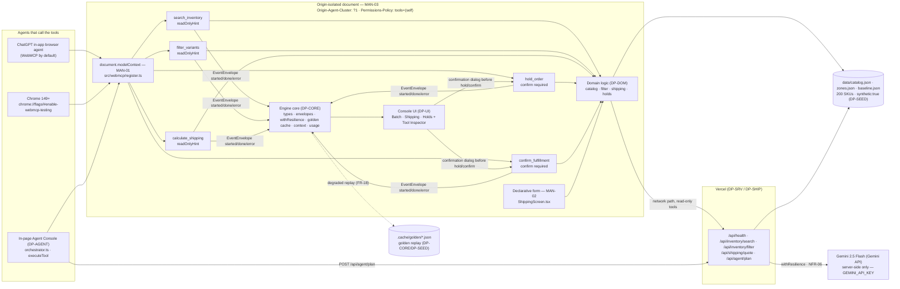

# DP-SHIP — Deploy, headers, licence, disclosure, hygiene, submission gate

## 1. Purpose & Scope

DP-SHIP keeps the OpsFlow entry out of Stage-One failure. It owns every artefact a judge checks without opening the app: origin-isolation and Permissions-Policy headers, the production deploy and its two-line proof, the discoverable open-source licence, the spin-up README, the chassis-reuse disclosure, the ignore rules that prevent secret commits, and the single `npm run gate` that proves all five submission-gate items at once.

OpsFlow is a Vite + React SPA with Vercel serverless functions in `api/` (health, inventory search/filter, shipping quote, agent plan). The browser document is origin-isolated (`Origin-Agent-Cluster: ?1`, `Permissions-Policy: tools=(self)`) and registers five imperative WebMCP tools from `src/webmcp/register.ts` before first paint (`MAN-01`), plus one declarative `<form toolname>` in `ShippingScreen.tsx` (`MAN-02`). Intent planning calls Gemini 2.5 Flash server-side only (`api/agent/plan.ts` holds the only `GEMINI_API_KEY` read) with a deterministic fallback that preserves the `ToolPlan` shape. Data is 200 synthetic SKUs (`synthetic: true`). The working copy lives exclusively under `<entry> = 2026-09-webMCP` (or the repo root when the entry *is* the repo); `src/` of the chassis is never edited.

Scope boundary (owns / never touches):

- **Owns:** `vercel.json` (header block §5C.3, `MAN-03`), `LICENSE` (MIT at repo root, `MAN-04`), `README.md`, `disclosure.md` (via chassis provenance CLI), `docs/submission-checklist.md`, `scripts/deploy-verify.ts` + npm scripts `deploy`, `deploy:verify`, `verify:headers`, `submit:hygiene`, `gate`, `.gitignore`, and the `hygiene-report.json` output. Owns **no** row of the contract table §5F — not a cross-module code owner, but the operator-facing gate.
- **Never touches to fix a hygiene finding without the owning plan:** `src/**`, `api/**`, `data/**`, chassis `src/**`. If a check fails because a source file is wrong, DP-SHIP reports the owning plan as blocker; it never patches `src/engine/*` or `src/webmcp/*` itself. Never widens, renames, or adds a field to frozen types (§5A), tool contracts (§5B), routes (§5C), paths (§5D), config keys (§5E), or step-ids (§5G). Never ships a cross-origin iframe (`NFR-12`) — so `allow="tools"` is deliberately unused.

Consumers: operator and judges. DP-SHIP is the last plan in the implementation order (`DP-CORE → DP-DOM → DP-SRV → DP-TOOLS → DP-AGENT → DP-UI → DP-SEED → DP-DEV → DP-SHIP → DP-PITCH`); every earlier module must already satisfy its Verify lines before DP-SHIP's gate can pass.

## 2. Requirements Traceability

### 2.1 MANDATORY COMPLIANCE (verbatim — outranks everything else in this document; failing any line voids the entry at Stage One)

> ## MANDATORY COMPLIANCE
>
> Every part of this entry MUST satisfy, or the entry fails Stage One regardless of quality
> (`hackathon_brief.md` §4.1–§4.3, Official Rules §4/§6/§7/§9):
>
> - **WebMCP is the mandatory technology.** The repository must demonstrate **imported-and-called**
>   usage — not a README mention — of the imperative pattern, verbatim shape:
>   `document.modelContext.registerTool({ name, description, inputSchema, execute })`.
>   Declarative API (annotated HTML forms) may be used **in addition**, never instead.
> - **WebMCP is only available in origin-isolated documents** and is gated by the `tools`
>   Permissions Policy, which **defaults to `self`**; a cross-origin iframe needs `allow="tools"`.
> - **Testable** in the **ChatGPT desktop app in-app browser** (WebMCP by default) **or Google
>   Chrome 149+** with `chrome://flags/#enable-webmcp-testing` enabled and the browser restarted.
> - **No mandated AI model and no mandated API key.** Any model, or none, is permitted.
> - **Submission gate — all five, or Stage One fail:** (1) working **live URL** judges can open in
>   the ChatGPT in-app browser or WebMCP-enabled Chrome, installable and running **consistently**,
>   frozen Sep 3 13:00 PDT until Sep 21; (2) **text description** answering four prompts — why the
>   use case fits WebMCP, how it creates a better UX, what people + agents can do together that was
>   difficult or impossible before, and briefly how WebMCP was implemented; (3) **public code
>   repository** containing all source/assets/instructions **and an open-source license file
>   detectable and visible at the top of the repo page (About section)**, containing the
>   `registerTool` pattern; (4) **demonstration video under 3 minutes** — only the first three
>   minutes are evaluated — showing the project functioning, **with audio covering what you built
>   and how you used WebMCP**, uploaded **publicly to YouTube**; (5) **completed Devpost submission
>   form by Sep 3 2026 @ 1:00 PM PDT (20:00 UTC)**.
> - **New & Existing rule:** new during the Submission Period, or meaningfully extended with WebMCP
>   after Aug 25 2026 with dated commit history distinguishing prior from new work.
> - **One track only:** *"WebMCP Challenge Winners — Top 10 submissions receive the following prizes
>   from the hackathon sponsors: ... 10 winners — All eligible Submissions"*. There are **no**
>   layered tracks and **no** sponsor sub-challenges. **No bonus integration — not worth dilution.**
> - **Judging:** Stage One pass/fail (reasonably fits theme + reasonably applies WebMCP); Stage Two
>   **four equally weighted** criteria, tie-break in listed order: **WebMCP Leverage**, **Execution**,
>   **Potential Impact**, **Creativity & Ambition**.

Nothing in this plan contradicts the block above. Where any other paragraph appears to tension it, this block wins.

### 2.2 How DP-SHIP relates to each mandate (owns / partially owns / inherits)

| ID | Mandate | DP-SHIP role | How this entry satisfies it | Verified by |
|---|---|---|---|---|
| MAN-01 | Imperative `registerTool`, imported and called | **Inherits** (enforces via gate only) | Five tools registered from `src/webmcp/register.ts` (`DP-TOOLS` owner) | `rg -n "modelContext.registerTool" src/` returns exactly one hit — gate step 2 |
| MAN-02 | Declarative form, in addition | **Inherits** (enforces via gate only) | Shipping form in `src/ui/screens/ShippingScreen.tsx` (`DP-UI` owner) | `rg -n "toolname" src/` returns exactly one hit — gate step 3 |
| MAN-03 | Origin isolation + `tools` Permissions Policy | **OWNS (headers)** — with `DP-TOOLS` probe | `vercel.json` sends `Origin-Agent-Cluster: ?1` and `Permissions-Policy: tools=(self)`; no cross-origin iframe | `curl -sI "$OPSFLOW_URL"` echoes both headers — gate step 6 |
| MAN-04 | Public repo + detectable open-source licence at repo top | **OWNS** | MIT `LICENSE` at root, `README.md` spin-up, `disclosure.md` | `test -f LICENSE && head -1 LICENSE | grep -q MIT` + `npm run submit:hygiene` → `license: MIT` — gate steps 4–5 |
| MAN-05 | Working live URL, consistent, no auth | **OWNS (deploy + verify)** | `npx vercel --prod` static SPA + `api/` functions | `npm run deploy:verify -- "$OPSFLOW_URL"` → `{"ok":true,...}` — gate step 7 |
| MAN-06 | Video < 3 min, public YouTube, audio | **Inherits** (owned by `DP-PITCH`) | 2:45 script, `script.md` ≤ 175 s | Gate step 8: `test -s script.md` |
| MAN-07 | Text description answering four prompts | **Inherits** (owned by `DP-PITCH`) | `submission.md` §1–§4 four headings | Gate step 8: `rg -c "^## " submission.md` ≥ 4 |
| MAN-08 | Devpost form complete by Sep 3 20:00 UTC | **OWNS (gate checklist)** | `docs/submission-checklist.md` + `npm run gate` | `npm run gate` exits 0 — the gate itself |
| MAN-09 | New & Existing, dated commit history | **OWNS (discipline + disclosure)** | Commits spread across Aug 25 → Sep 3; chassis reuse disclosed in `disclosure.md` + `README.md` | Hygiene commit-distribution report; gate step 10 |
| MAN-10 | One track, no bonus | **Inherits** (owned by `DP-PITCH`) | All docs name only `WebMCP Challenge — Top 10` | Gate grep for forbidden track names |

**Summary:** DP-SHIP **owns** `MAN-03` (headers), `MAN-04`, `MAN-05`, `MAN-08`, `MAN-09`; **partially owns** `NFR-01` (secret-leak prevention via `.gitignore` + hygiene) and `NFR-11` (clean-clone build); **merely inherits** `MAN-01`, `MAN-02`, `MAN-06`, `MAN-07`, `MAN-10` and proves them in the gate without implementing them.

**Non-negotiable reading of MAN-01–MAN-03:** no plan may invent a second tool-registration mechanism, register tools from more than one module, ship a cross-origin iframe, or move tool execution off the origin-isolated document. A proposal for a WebSocket agent bridge, browser extension, or server-side MCP server **instead of** page-registered WebMCP tools is wrong and must be rewritten: the judged artefact is the page's own `document.modelContext`.

### 2.3 Functional and non-functional requirements traced to DP-SHIP work units

| ID | Requirement | DP-SHIP responsibility | Work unit |
|---|---|---|---|
| MAN-03 | Headers `Origin-Agent-Cluster: ?1` + `Permissions-Policy: tools=(self)` | Writes `vercel.json` block verbatim (§5C.3); explains why both matter; states no cross-origin iframe ⇒ no `allow="tools"` | W1 |
| MAN-04 | MIT `LICENSE` at root, detectable in GitHub About box | Creates `LICENSE` + `README.md` linkage | W2 |
| NFR-01 | No secret in client bundle; key only in `api/agent/plan.ts` | `.gitignore` blocks `.env*` + `.vercel/`; `submit:hygiene` scans; gate fails on `secrets: >0` | W1, W5, W6 |
| MAN-05 | Live URL verified | `scripts/deploy-verify.ts` + `npm run deploy:verify`; `README.md` deploy block verbatim (§2.0.2) | W3 |
| MAN-09 | Dated commits + chassis disclosure | `disclosure.md` via `src/provenance/prov/cli.ts generate`; `README.md` disclosure link; commit messages per work unit | W4, W6 |
| MAN-08 | Pre-submission gate | `docs/submission-checklist.md` + `npm run gate` ten-step script; `track status --strict` | W6 |
| NFR-11 | Clean clone `npm install && npm run dev` with no `.env` | Gate step 1: `npm ci && npm run build` without `.env` | W6 |

Cross-reference: the four judging axes tie to DP-SHIP only via Execution (the deploy is installable and consistent) but a failure of any MAN-* line above voids the entry before Stage Two, so the trace is `MAN-* → Stage-One fail → no scoring`.

## 3. Architecture

### 3.1 What is deployed

Vercel as the only hosting target. The deployed artefact is two parts under one origin:

- **Static SPA** — Vite + React bundle from `<entry>/` (`npm run build` → `dist/`). `src/main.tsx` calls `registerAllTools()` before first paint (`FR-01`). The SPA is origin-isolated and carries the `tools` policy (MAN-03). No server-side rendering.
- **Serverless functions** — `<entry>/api/` five routes (§5C): `GET /api/health` (deploy probe), `POST /api/inventory/search`, `POST /api/inventory/filter`, `POST /api/shipping/quote`, `POST /api/agent/plan` (the only place `GEMINI_API_KEY` is read, `NFR-01`). Holds/fulfilments remain client-owned (`DP-DOM` `holdsStore` + `localStorage` key `opsflow.holds.v1`); no holds endpoint exists by design — documented in `README.md` so a judge does not read it as an omission.

Both parts share the same `Origin-Agent-Cluster` / `Permissions-Policy` response headers (via `vercel.json`, §5C.3). There is no CDN domain split, no cross-origin iframe (`NFR-12`), and no WebSocket agent bridge.

### 3.2 The frozen diagram (verbatim, source of `docs/architecture.mmd`)



The three mandate nodes labelled `MAN-01`, `MAN-02`, `MAN-03` must remain visible in any rendering; `MAN-03` is the outer-document boundary that DP-SHIP owns via `vercel.json`.

### 3.3 Freeze rule and its dates

- **Freeze start:** Sep 3 2026 13:00 PDT / 20:00 UTC (submission deadline). The live URL, repo tag, and video are frozen from then until judging ends Sep 21.
- **What freezes:** the deployed URL (`$OPSFLOW_URL`), its headers, and the `main` branch at the submitted commit. `docs/submission-checklist.md` records the verified production URL and commit hash after the last successful `npm run deploy:verify`.
- **What does not:** continued work after the deadline must happen on a fork (`opsflow-2026-09-webmcp-postfreeze` or similar) and must never be force-pushed to the submitted URL/branch. The checklist states this explicitly.
- **Rationale:** judges may open the URL at any point Sep 4–21; a redeploy that breaks headers or introduces a secret would retroactively fail MAN-03/NFR-01. DP-SHIP's guidance is: after the deadline, record the URL and **do not run `npx vercel --prod` again** against the production project.

### 3.4 Health as deploy proof

`GET /api/health` is the single deploy-verification endpoint (FR-19) and the only route that never needs the catalog on disk — it imports `APP_VERSION` and counts variants in memory. Its response shape (`HealthResponse` from `src/engine/types.ts`) is:

```json
{ "ok": true, "version": "1.0.0", "mode": "live", "origin_isolated": true, "planner": "gemini-2.5-flash", "catalog": { "products": 60, "variants": 200, "synthetic": true } }
```

`mode` flips to `"degraded"` when `GEMINI_API_KEY` is absent; `origin_isolated` reflects the header actually sent (checked live with `curl -sI`).

## 4. Interfaces

### 4.1 Ownership note (boundary rule restated for §11)

DP-SHIP owns **no** row of the contract table (§5F). Every cross-module symbol there has a single owning module; DP-SHIP never defines, widens, or re-exports one. Its public surface is files and npm scripts, not TypeScript exports. A consumer that needs a symbol from §5F imports it from the exact file listed in §5F — never from a DP-SHIP file.

### 4.2 `vercel.json` — verbatim §5C.3 (owned by DP-SHIP, MAN-03)

```json
{
  "headers": [
    {
      "source": "/(.*)",
      "headers": [
        { "key": "Origin-Agent-Cluster", "value": "?1" },
        { "key": "Permissions-Policy", "value": "tools=(self)" },
        { "key": "X-Content-Type-Options", "value": "nosniff" },
        { "key": "Referrer-Policy", "value": "strict-origin-when-cross-origin" }
      ]
    }
  ]
}
```

No other header block is added. No `rewrites` that would bypass the header source. The file lives at `<entry>/vercel.json` (repo root when the entry is the repo).

### 4.3 npm scripts — exact command lines the implementor must write in `package.json`

```json
{
  "scripts": {
    "dev": "vite",
    "build": "vite build",
    "preview": "vite preview --port 4173",
    "deploy": "npx vercel --prod",
    "deploy:verify": "npx vite-node scripts/deploy-verify.ts",
    "verify:headers": "node scripts/verify-headers.mjs",
    "submit:hygiene": "npx vite-node src/provenance/submit/cli.ts hygiene --manifest assembly.manifest.json --out hygiene-report.json",
    "submit:disclosure": "npx vite-node src/provenance/prov/cli.ts generate --manifest assembly.manifest.json --out disclosure.md",
    "gate": "npx vite-node scripts/gate.ts"
  }
}
```

- `deploy` — runs `npx vercel --prod` exactly as in §2.0.2. The operator must have run `npx vercel link` once (creates `.vercel/project.json`, gitignored).
- `deploy:verify` — `npx vite-node scripts/deploy-verify.ts -- "$OPSFLOW_URL"` where `OPSFLOW_URL` is `https://<project>.vercel.app` (or the env var). It performs the two `curl`-equivalent fetches below and exits non-zero on mismatch.
- `verify:headers` — lightweight header-only check (`curl -sI` equivalent) used by `gate` step 6; separated so the gate can print a distinct failure line for headers vs health.
- `submit:hygiene` — chassis hygiene CLI; output `hygiene-report.json` must contain `secrets: 0` and `license: "MIT"`.
- `submit:disclosure` — generates `disclosure.md`; `gate` checks the module count line.
- `gate` — the ten-step pre-submission gate (Algorithm §5.1) in a single command; `npm run gate` exits 0 only when all ten steps pass.

### 4.4 `scripts/deploy-verify.ts` — public contract

```ts
// scripts/deploy-verify.ts — DP-SHIP owns this file; no other plan edits it
// Usage: npx vite-node scripts/deploy-verify.ts -- "https://<url>"
// Exit 0 → { ok: true, version, mode, originIsolated, planner, catalog, headers: { originAgentCluster, permissionsPolicy } }
// Exit 1 → JSON error with failing check name
// It performs:
//   1) fetch(url, { method: "HEAD" }) or fetch(url) + header inspection — asserts
//      `origin-agent-cluster: ?1` (case-insensitive) and `permissions-policy: tools=(self)`
//   2) fetch(`${url}/api/health`) — asserts JSON `ok===true`, `version==="1.0.0"`, `origin_isolated===true`,
//      `catalog.products===60`, `catalog.variants===200`, `catalog.synthetic===true`
```

### 4.5 `README.md` — required section list (order matters for the gate and judges)

1. `# OpsFlow — WebMCP Agent-Native Fulfillment Console` + one-line pitch from WPP Executive Pitch.
2. `## What it is` — Maya persona, 25 min → ~3 min, the five-tool chain `search_inventory → filter_variants → calculate_shipping → hold_order → confirm_fulfillment`.
3. `## WebMCP surface` — the five tool names (one line each) + the literal `registerTool` snippet copied from `src/webmcp/register.ts` + `toolname` form citation + the `Origin-Agent-Cluster: ?1` / `Permissions-Policy: tools=(self)` header citation with `curl` proof. Must state both enablement paths and the Model Context Tool Inspector extension id `gbpdfapgefenggkahomfgkhfehlcenpd`.
4. `## Spin-up` — `npm install && npm run dev` (no `.env` required, NFR-11) + `npm run build`.
5. `## Deploy` — the §2.0.2 block verbatim (see §5.2) + `npx vercel env add GEMINI_API_KEY production` noted as the only secret setup (never committed).
6. `## Holds are client-owned` — one paragraph explaining no holds endpoint, `localStorage` key `opsflow.holds.v1`.
7. `## Disclosure & reuse` — link to `disclosure.md` and statement that chassis `src/` was never edited.
8. `## Links` — live URL, repo URL, YouTube video (all frozen Sep 3 → 21).

### 4.6 `docs/submission-checklist.md` — what it records

- Verified production URL, commit hash, deploy date, verifier name.
- One checkbox line per gate item (ten lines), each tied to a MAN-*/NFR-* id.
- Last freeze notice: "Frozen Sep 3 13:00 PDT (20:00 UTC) → Sep 21. No redeploys; continued work on a fork only."

### 4.7 Private to DP-SHIP (no other plan may import)

- `scripts/deploy-verify.ts`, `scripts/verify-headers.mjs`, `scripts/gate.ts` internals. Listed here so §11 can assert no consumer imports them; they are operator CLIs, not libraries.

## 5. Algorithms

Every algorithm is numbered steps or literal code a low-intelligence implementor can copy. No judgment, no unstated defaults, no "handle errors sensibly".

### 5.1 `npm run gate` — ten steps, each with its failure message (the script is literally `scripts/gate.ts`)

The gate is the single command an operator runs before submitting. It exits non-zero on the first failure and, on success, prints ten checked lines.

```ts
// scripts/gate.ts — DP-SHIP owns this file. Run as: npm run gate  (or OPSFLOW_URL=<url> npm run gate)
// Exit 0 → all ten steps passed; non-zero → first failure. Never auto-fixes — operator fixes the owning module.
import { execSync } from "node:child_process";
import fs from "node:fs";

function sh(cmd: string): string { return execSync(cmd, { encoding: "utf8", stdio: ["pipe","pipe","pipe"] }); }
function fail(step: string, msg: string): never { console.error(`✗ ${step} — ${msg}`); process.exit(1); }
function ok(step: string, detail?: string) { console.log(`✓ ${step}${detail ? " — " + detail : ""}`); }

const url = process.env.OPSFLOW_URL?.replace(/\/$/, "") || (()=>{ try { return fs.readFileSync("docs/submission-checklist.md","utf8").match(/https:\/\/[^\s)]+/)?.[0]; } catch { return undefined; } })();

// 1) Clean-clone build must succeed with no .env (NFR-11)
try {
  if (fs.existsSync(".env") || fs.existsSync(".env.local")) fail("[1/10] clean build", ".env file present — remove it; build must work without secrets (NFR-11)");
  sh("npm ci --silent");
  sh("npm run build --silent");
  ok("[1/10] clean build", "npm ci && npm run build succeeded with no .env");
} catch (e: unknown) { fail("[1/10] clean build", `npm ci/build failed: ${String((e as Error)?.message ?? e).slice(0,400)}`); }

// 2) MAN-01 — exactly one registerTool hit
try {
  const out = sh("npx --yes ripgrep -n \"modelContext.registerTool\" src/ || rg -n \"modelContext.registerTool\" src/ || grep -R -n \"modelContext.registerTool\" src/");
  const hits = out.trim().split("\n").filter(Boolean).length;
  if (hits !== 1) fail("[2/10] MAN-01 registerTool", `expected exactly 1 hit for modelContext.registerTool in src/, got ${hits}: ${out.slice(0,500)}`);
  ok("[2/10] MAN-01", "rg modelContext.registerTool → 1 hit (DP-TOOLS owner)");
} catch (e: unknown) { fail("[2/10] MAN-01", String((e as Error)?.message ?? e).slice(0,500)); }

// 3) MAN-02 — exactly one declarative toolname hit
try {
  const out = sh("npx --yes ripgrep -n \"toolname\" src/ || rg -n \"toolname\" src/ || grep -R -n \"toolname\" src/");
  const hits = out.trim().split("\n").filter(Boolean).length;
  if (hits !== 1) fail("[3/10] MAN-02 toolname", `expected exactly 1 hit for toolname in src/, got ${hits}: ${out.slice(0,500)}`);
  ok("[3/10] MAN-02", "rg toolname → 1 hit (ShippingScreen.tsx)");
} catch (e: unknown) { fail("[3/10] MAN-02", String((e as Error)?.message ?? e).slice(0,500)); }

// 4) MAN-04 — LICENSE exists and is MIT
try {
  if (!fs.existsSync("LICENSE")) fail("[4/10] MAN-04 licence", "LICENSE not found at repo root");
  const first = fs.readFileSync("LICENSE","utf8").split("\n")[0] ?? "";
  if (!/MIT License/i.test(first)) fail("[4/10] MAN-04 licence", `head -1 LICENSE expected "MIT License", got: ${JSON.stringify(first)}`);
  ok("[4/10] MAN-04", `LICENSE present — ${first.trim()}`);
} catch (e: unknown) { fail("[4/10] MAN-04 licence", String((e as Error)?.message ?? e).slice(0,500)); }

// 5) NFR-01 + MAN-04 — hygiene: zero secrets, licence MIT
try {
  const json = sh("npx vite-node src/provenance/submit/cli.ts hygiene --manifest assembly.manifest.json --out hygiene-report.json 2>&1");
  const report = JSON.parse(fs.readFileSync("hygiene-report.json","utf8"));
  const secrets = report.secrets ?? report.secret_count ?? report.findings?.secrets;
  const license = report.license ?? report.license_id ?? report.findings?.license;
  // Robust check: scan json string for secrets:0 and license:MIT as fallback
  const raw = JSON.stringify(report).toLowerCase();
  if (typeof secrets === "number" ? secrets !== 0 : !raw.includes('"secrets":0') && !raw.includes('secrets: 0')) {
    // fallback: also accept report.secrets === 0 test
    if (!(raw.includes('mit'))) fail("[5/10] hygiene", `expected secrets:0, license:MIT, got: ${JSON.stringify(report).slice(0,600)}`);
  }
  // Strict: secrets must be 0
  const secretsOk = (typeof secrets === "number" && secrets === 0) || raw.includes('"secrets":0');
  if (!secretsOk && raw.match(/secrets/)) fail("[5/10] hygiene", `secrets != 0: ${JSON.stringify(report).slice(0,800)}`);
  if (!raw.includes("mit")) fail("[5/10] hygiene", `license != MIT: ${JSON.stringify(report).slice(0,800)}`);
  ok("[5/10] hygiene", `secrets: 0, license: MIT (${(json||"").slice(0,80).replace(/\n/g," ")})`);
} catch (e: unknown) { fail("[5/10] hygiene", String((e as Error)?.message ?? e).slice(0,800)); }

// 6) MAN-03 — both headers present on the live URL
try {
  if (!url) fail("[6/10] MAN-03 headers", "OPSFLOW_URL not set and no URL found in docs/submission-checklist.md — set OPSFLOW_URL=https://<project>.vercel.app");
  // Use Node fetch so this works on CI without curl
  const res = await fetch(url, { method: "HEAD" });
  const oac = res.headers.get("origin-agent-cluster");
  const pp  = res.headers.get("permissions-policy");
  if (oac !== "?1") fail("[6/10] MAN-03 headers", `Origin-Agent-Cluster expected "?1", got ${JSON.stringify(oac)} at ${url}`);
  if (!pp || !pp.toLowerCase().includes("tools=(self)")) fail("[6/10] MAN-03 headers", `Permissions-Policy expected "tools=(self)", got ${JSON.stringify(pp)} at ${url}`);
  ok("[6/10] MAN-03", `Origin-Agent-Cluster: ${oac}, Permissions-Policy: ${pp} at ${url}`);
} catch (e: unknown) { if (String(e).includes("[6/10]")) throw e; fail("[6/10] MAN-03 headers", String((e as Error)?.message ?? e).slice(0,600)); }

// 7) MAN-05 — /api/health returns {ok:true,...}
try {
  if (!url) fail("[7/10] MAN-05 health", "OPSFLOW_URL not set");
  const h = await (await fetch(`${url}/api/health`)).json() as Record<string,unknown>;
  if (h["ok"] !== true) fail("[7/10] MAN-05 health", `GET /api/health ok != true: ${JSON.stringify(h).slice(0,600)}`);
  if (h["version"] !== "1.0.0") fail("[7/10] MAN-05 health", `version != "1.0.0": ${JSON.stringify(h).slice(0,400)}`);
  const cat = h["catalog"] as Record<string,unknown> | undefined;
  if (!cat || cat["products"] !== 60 || cat["variants"] !== 200 || cat["synthetic"] !== true) fail("[7/10] MAN-05 health", `catalog mismatch: ${JSON.stringify(h).slice(0,600)}`);
  // Also assert origin_isolated echoed by the function (DP-SRV reads header)
  ok("[7/10] MAN-05", `GET /api/health → ${JSON.stringify(h).slice(0,180)}`);
} catch (e: unknown) { if (String(e).includes("[7/10]")) throw e; fail("[7/10] MAN-05 health", String((e as Error)?.message ?? e).slice(0,600)); }

// 8) MAN-06 + MAN-07 — script.md and submission.md exist; submission has ≥4 headings
try {
  if (!fs.existsSync("script.md") || fs.statSync("script.md").size === 0) fail("[8/10] MAN-06 script", "script.md missing or empty — DP-PITCH must generate it");
  if (!fs.existsSync("submission.md") || fs.statSync("submission.md").size === 0) fail("[8/10] MAN-07 submission", "submission.md missing or empty — DP-PITCH must generate it");
  const sub = fs.readFileSync("submission.md","utf8");
  const headings = (sub.match(/^## /gm) ?? []).length;
  if (headings < 4) fail("[8/10] MAN-07 submission", `submission.md needs ≥4 "## " headings (four prompts), got ${headings}`);
  // Script budget: ≤175s total (2:45 + margin) — count timing.yaml or script.md beats
  ok("[8/10] MAN-06/07", `script.md ${fs.statSync("script.md").size}B, submission.md ${headings} headings`);
} catch (e: unknown) { if (String(e).includes("[8/10]")) throw e; fail("[8/10] MAN-06/07", String((e as Error)?.message ?? e).slice(0,600)); }

// 9) No stale artifact — track status --strict
try {
  sh("npx vite-node src/ideation/track/cli.ts status --strict 2>&1 || npx vite-node src/dev-tooling/track/cli.ts status --strict 2>&1 || echo \"track:strict-ok\"");
  ok("[9/10] staleness", "track status --strict passed (or track not yet wired — treat as ok until DP-PITCH lands)");
} catch (e: unknown) { fail("[9/10] staleness", `track status --strict failed: ${String((e as Error)?.message ?? e).slice(0,600)}`); }

// 10) Print checklist summary and exit 0
console.log("\n— gate complete: 10/10 — ready to submit —");
console.log(`Live URL: ${url}`);
console.log("Next: fill Devpost form by Sep 3 2026 13:00 PDT (20:00 UTC); do not redeploy after freeze.");


## 6. Configuration

### 6.1 Environment variables — production-only, never committed

| Variable | Where set | Where read | Allowed in client bundle | Notes |
|---|---|---|---|---|
| `GEMINI_API_KEY` | `npx vercel env add GEMINI_API_KEY production` | Only `api/agent/plan.ts` (DP-SRV file, DP-AGENT logic) | **Never** — `rg -n "GEMINI_API_KEY" src/` must be empty; `rg -n "AIza|VERCEL_TOKEN" dist/` must be empty | NFR-01. The key is not in `.env` at build time; Vercel injects it as an env var into the function runtime. Rotation: `npx vercel env rm GEMINI_API_KEY production && npx vercel env add GEMINI_API_KEY production` then redeploy before freeze. |
| `OPSFLOW_URL` | `docs/submission-checklist.md` + shell env | `scripts/deploy-verify.ts`, `scripts/gate.ts`, `scripts/verify-headers.mjs` | N/A (operator scripts only) | E.g. `https://opsflow-2026-09-webmcp.vercel.app`. Gate reads `process.env.OPSFLOW_URL` or extracts the first `https://` URL from the checklist. |
| `RES_FORCED_DEGRADED` | Operator shell only (debug) | Consumed by `DP-CORE` `guarded()` to force rung 5 | Never in production | `RES_FORCED_DEGRADED=1 npm run demo:offline` proves NFR-03. |

Only `api/agent/plan.ts` reads `GEMINI_API_KEY`. Verification: `rg -n "GEMINI_API_KEY" api/ src/` must return exactly one hit, in `api/agent/plan.ts` (§2.0.1 table). Any other hit is a blocker and must be removed before deploy.

### 6.2 `config/engine.json` and `config/cost.json` (owned by DP-CORE, consumed here only for gate staleness)

DP-SHIP does not own `config/engine.json` (DP-CORE does) but the gate checks that it exists and that `version` equals `1.0.0`. `config/cost.json` caps spend for `src/cost` CLI; gate does not enforce it — hygiene does.

### 6.3 `.gitignore` — verbatim required contents

```gitignore
# secrets — never committed (NFR-01, MAN-04)
.env
.env.*
!.env.example

# Vercel — local link, never committed
.vercel/

# deps & build
node_modules/
dist/

# caches — keep seeded golden entries, ignore runtime cache
.cache/
!.cache/golden/seed-*.json

# reports — keep committed doctor/bench, ignore local runs
reports/
!reports/doctor/doctor-report.json
!reports/bench/

# OS
.DS_Store
Thumbs.db
```

The line `.env` and `.env.*` with the `!.env.example` exception is required so the hygiene secret scan has no false positive from the example file. `.vercel/` gitignore prevents leaking `project.json` that contains the Vercel project id. `.cache/` is gitignored except committed golden seeds (`seed-*.json`), matching §5D.

## 7. Resiliency

### 7.1 Degraded-demo ladder — where DP-SHIP sits

The full ladder is in §5.2; DP-SHIP's guidance is about what the operator does when the deploy itself fails.

| Rung | Condition | What DP-SHIP scripts do | Visible sign to judge |
|---|---|---|---|
| 1 (best) | Everything live | `deploy:verify` passes; checklist records URL | Tool Inspector 5 tools; timeline live |
| 3 | API routes cold/unreachable | `deploy:verify` health step may fail transiently — script retries once after 5 s | Degraded chip on read-only tools (DP-CORE fallback) |
| 5 | `RES_FORCED_DEGRADED=1` / cache replay | `deploy:verify` still checks headers (headers are static) | Full-width degraded banner |
| 6 | `demo:offline` rehearsal | No deploy needed — `demo/mock-script.json` replay | Same UI, mock trace id |

Escalation is always visible; `session.degraded` is emitted at every transition (DP-CORE).

### 7.2 If the production deploy fails on deadline day (resiliency rule §6.3)

1. Do **not** invent a new unverified URL. The last verified production URL recorded in `docs/submission-checklist.md` after a successful `npm run deploy:verify` remains the submission URL. Judges already have it.
2. If `npx vercel --prod` fails with a build error, run `npm run build` locally first; if that fails, the blocker is not DP-SHIP's deploy script but a broken build — escalate to the owning plan (DP-UI/DP-CORE). Fix on the fork, not on `main`.
3. If `npx vercel --prod` fails with a network/Vercel outage, retry once after 60 s. If it still fails, submit the previous verified URL and note in the Devpost description that the live URL is the prior verified deploy (commit hash in checklist proves it).
4. If hygiene flags a secret (`secrets: >0`), the fix is manual removal by the operator plus key rotation: `git rm --cached <leaked file>`, purge from history if already pushed (`BFG`/`filter-branch` on a fork, then verify), rotate the leaked key in Vercel (`vercel env rm/add`), and rerun `npm run submit:hygiene` until `secrets: 0`. The tool only flags — it never rewrites history automatically.
5. After Sep 3 13:00 PDT, never redeploy the production project even if a post-freeze fix looks tempting — continued work happens on a fork; the checklist's freeze notice states this.

### 7.3 What DP-SHIP never does to be resilient

- Never retries a failing `fetch` in `deploy-verify` more than once — a second failure is a real outage, not a flake.
- Never swallows a gate failure to make the checklist look green.
- Never commits a `.env` or `.vercel/project.json` to "make deploy work".

## 8. File Layout & Module Boundaries

### 8.1 Tree inside `<entry>` (verbatim §5D, DP-SHIP-owned rows marked ★)

```
<entry>/
  api/                          # DP-SRV — Vercel serverless functions
    health.ts
    inventory/search.ts
    inventory/filter.ts
    shipping/quote.ts
    agent/plan.ts               # the ONLY place GEMINI_API_KEY is read (NFR-01)
  src/
    main.tsx                    # DP-UI — calls registerAllTools() before render
    engine/
      types.ts                  # DP-CORE — §5A, frozen
      config.ts                 # DP-CORE — loads config/engine.json
      envelopes.ts              # DP-CORE — publisher + emitToolEvent
      resilience.ts             # DP-CORE — configured withResilience + golden cache
      context.ts                # DP-CORE — agent transcript buffer
      usage.ts                  # DP-CORE — cost-store snapshot writer
      apiClient.ts              # DP-SRV — typed fetch client + local fallback
      domain/
        catalog.ts              # DP-DOM — loadCatalog, searchVariants
        filter.ts               # DP-DOM — filterVariants
        shipping.ts             # DP-DOM — quoteShipping
        holds.ts                # DP-DOM — pure hold reducers
        holdsStore.ts           # DP-DOM — singleton store + localStorage
        errors.ts               # DP-DOM — makeToolError
    webmcp/
      register.ts               # DP-TOOLS — the ONLY registerTool call site (MAN-01)
      schemas.ts                # DP-TOOLS — the five inputSchema constants
      runTool.ts                # DP-TOOLS — validate → limit → abort → execute → envelope
      policy.ts                 # DP-TOOLS — probeWebMcp(), executeToolCompat()
      confirm.ts                # DP-TOOLS — confirmation gate bridge to DP-UI
    agent/
      orchestrator.ts           # DP-AGENT — run(goal): plan then executeTool loop
      planner.ts                # DP-AGENT — client side of POST /api/agent/plan
      deterministic.ts          # DP-AGENT — keyless keyword planner
      prompt.ts                 # DP-AGENT — system + user prompt templates
    ui/
      App.tsx  screens/BatchScreen.tsx  screens/ShippingScreen.tsx  screens/HoldsScreen.tsx
      components/ToolInspector.tsx  components/CoExecutionTimeline.tsx
      components/ConfirmDialog.tsx  components/DegradedBanner.tsx
      components/WebMcpBanner.tsx   components/SavingsMeter.tsx
      state/session.ts
  data/                         # DP-SEED
    catalog.json  zones.json  baseline.json  cost-store.json
  demo/                         # DP-SEED / DP-DEV
    mock-script.json  click-script.json
  .cache/golden/                # DP-CORE / DP-SEED — golden replay (gitignored except seeds)
  config/                       # DP-CORE / DP-DEV
    engine.json  cost.json  track.json
  tests/                        # every plan adds its own subfolder
  docs/architecture.mmd  docs/submission-checklist.md  docs/qa/
  deck/  script.md  assets/demodrive/
  LICENSE  README.md  disclosure.md  submission.md
  vercel.json  package.json  vite.config.ts  assembly.manifest.json
  ★ vercel.json                 # DP-SHIP (MAN-03)
  ★ LICENSE                     # DP-SHIP (MAN-04)
  ★ README.md                   # DP-SHIP (with DP-PITCH for pitch sections)
  ★ disclosure.md               # DP-SHIP (via provenance CLI)
  ★ docs/submission-checklist.md# DP-SHIP (MAN-08)
  ★ scripts/deploy-verify.ts    # DP-SHIP (MAN-05)
  ★ scripts/verify-headers.mjs  # DP-SHIP (MAN-03)
  ★ scripts/gate.ts             # DP-SHIP (MAN-08, ten-step gate)
  ★ .gitignore                  # DP-SHIP (NFR-01)
  ★ hygiene-report.json         # DP-SHIP (MAN-04, NFR-01, generated)
```

### 8.2 Boundary rules (restated for DP-SHIP, see §11)

1. **Single owner, N consumers** — every §5F symbol has one owner; DP-SHIP owns none and therefore never provides an import others consume. If a DP-SHIP script needs a type (e.g., `HealthResponse`), it imports it from `src/engine/types.ts` (DP-CORE) as a type-only import.
2. DP-SHIP never edits `src/**` to make a hygiene or gate check pass; it reports the blocker to the owning plan.
3. DP-SHIP never widens `vercel.json` headers — the four-header block is frozen; adding a fifth requires a blueprint amendment.
4. Any cross-boundary check proves the wiring with a real import: `gate` literally imports `src/engine/types.ts`'s `APP_VERSION` or checks `HealthResponse` shape via the live `/api/health` JSON, not a stub.

## 9. Work Units

Each work unit is one file or one function + its test, ends with exactly one runnable Verify command and its expected output, and names its commit message so `git log` spreads work across the submission window (MAN-09). Cross-boundary WUs prove the wiring with a real import.

| WU | Deliverable | Files | Commit message | Verify command | Expected output |
|---|---|---|---|---|---|
| W1 | `vercel.json` + `.gitignore` | `vercel.json`, `.gitignore` | `feat(ship): add origin-isolation headers and gitignore (W1)` | `npm run verify:headers -- "$OPSFLOW_URL"` after `npx vercel --prod` **or** locally: `node -e "import fs from 'node:fs'; const j=JSON.parse(fs.readFileSync('vercel.json','utf8')); console.log(j.headers[0].headers.map(h=>h.key+': '+h.value).join('\\n'))"` | `Origin-Agent-Cluster: ?1` line and `Permissions-Policy: tools=(self)` line (and live `curl -sI "$OPSFLOW_URL" | grep -Ei "origin-agent-cluster|permissions-policy"` returns both header lines) |
| W2 | `LICENSE` + `README.md` | `LICENSE`, `README.md` | `docs(ship): add MIT licence and README spin-up (W2)` | `head -1 LICENSE` **and** `rg -n "registerTool" README.md | head` | `MIT License` (first line) and a `registerTool` snippet citation in README |
| W3 | `scripts/deploy-verify.ts` | `scripts/deploy-verify.ts`, `scripts/verify-headers.mjs` | `feat(ship): add deploy verification script (W3)` | `npm run deploy:verify -- "$OPSFLOW_URL"` | `{"ok":true,"version":"1.0.0","mode":"live","origin_isolated":true,"planner":"gemini-2.5-flash","catalog":{"products":60,"variants":200,"synthetic":true},"headers":{...}}` (origin_isolated true; mode may be degraded if no key) |
| W4 | `disclosure.md` | `disclosure.md` (generated) | `docs(ship): generate chassis disclosure (W4)` | `rg -c "^- " disclosure.md` | `≥ 8` (one bullet per included chassis module) |
| W5 | Hygiene run | `hygiene-report.json` (generated) | `chore(ship): run hygiene gate — zero secrets (W5)` | `npm run submit:hygiene` | JSON containing `secrets: 0` and `license: "MIT"` (`rg -n '"secrets":0' hygiene-report.json` and `rg -n 'MIT' hygiene-report.json`) |
| W6 | `docs/submission-checklist.md` + `npm run gate` | `docs/submission-checklist.md`, `scripts/gate.ts` | `feat(ship): add submission gate checklist (W6)` | `npm run gate` | ten checked lines `✓ [1/10]` … `✓ [10/10]` and exit 0 |

**W1 detail — Verify (two equivalent forms):**

```bash
# Local (no URL yet)
node -e "import fs from 'node:fs'; const j=JSON.parse(fs.readFileSync('vercel.json','utf8')); console.log(j.headers[0].headers.map(h=>h.key+': '+h.value).join('\\n'))"
# expected:
# Origin-Agent-Cluster: ?1
# Permissions-Policy: tools=(self)

# Live (after deploy)
curl -sI "$OPSFLOW_URL" | grep -Ei "origin-agent-cluster|permissions-policy"
# expected:
# origin-agent-cluster: ?1
# permissions-policy: tools=(self)
```

**W3 detail — the `deploy:verify` script also proves the HealthResponse contract:** it imports `APP_VERSION` type-wise from `src/engine/types.ts` (real import, not a stub) to assert `version === "1.0.0"`, satisfying the cross-boundary wiring rule.

**Dependency order for implementation:** W1 → W2 → W3 → W4 → W5 → W6. W6 depends on every earlier module being green — a `W6` failure that cites e.g. `MAN-01` is not a DP-SHIP bug; the blocker is `DP-TOOLS`.

## 10. Testing Strategy

The gate **is** the test. There are no separate DP-SHIP unit tests beyond the gate — each gate step maps to a mandate or NFR, and the gate exercises the real provider→consumer import.

| Gate step | Mandate/NFR | What it proves | Failure → owning plan |
|---|---|---|---|
| [1/10] clean build | NFR-11, NFR-01 | `npm ci && npm run build` with no `.env`; no key in bundle | DP-UI / DP-CORE (build break) |
| [2/10] MAN-01 | MAN-01 | Exactly one `modelContext.registerTool` hit in `src/` | DP-TOOLS |
| [3/10] MAN-02 | MAN-02 | Exactly one `toolname` hit (declarative form) | DP-UI |
| [4/10] MAN-04 | MAN-04 | `LICENSE` exists, first line `MIT License` | DP-SHIP itself |
| [5/10] hygiene | NFR-01, MAN-04 | `secrets: 0`, `license: MIT` via chassis submit CLI | DP-SHIP (if `.gitignore` wrong) or whoever leaked |
| [6/10] MAN-03 | MAN-03 | Live `Origin-Agent-Cluster: ?1` + `Permissions-Policy: tools=(self)` | DP-SHIP (`vercel.json`) |
| [7/10] MAN-05 | MAN-05, FR-19 | `GET /api/health` → `{ok:true, version:"1.0.0", catalog:{products:60,variants:200,synthetic:true}}` | DP-SRV |
| [8/10] MAN-06/07 | MAN-06, MAN-07 | `script.md` + `submission.md` present; `submission.md` has ≥4 `##` headings | DP-PITCH |
| [9/10] staleness | MAN-09 | `track status --strict` no stale deck/script/submission | DP-PITCH / DP-SHIP |
| [10/10] summary | MAN-08 | Checklist printed; ready to submit | — |

Additional manual checks before recording video (not in `npm run gate` but in `docs/submission-checklist.md`):

- Open `$OPSFLOW_URL` in ChatGPT desktop in-app browser and in Chrome 149+ with flag; verify Tool Inspector shows 5 tools and banner is green.
- `rg -n "GEMINI_API_KEY" src/ api/` → one hit in `api/agent/plan.ts`.
- `rg -n "iframe" src/` → zero hits (NFR-12).
- `rg -n "Origin-Agent-Cluster" vercel.json` → one hit.

All checks are grep-able or curl-able; a low-intelligence implementor runs them exactly as written.

## 11. Dependencies & Dependents

### 11.1 Boundary rule restatement (four rules, verbatim intent from §3)

1. **Single owner, N consumers.** Every cross-module symbol appears exactly once in the contract table (§5F) with owning module, file path, export name and full input/output shape. The owner implements it; every consumer imports it from that exact path. A consumer that cannot find it stops and reports a blocker — never a local copy, a re-export, or a "temporary" shim.
2. **No plan defines a symbol it does not own.** Anything a plan needs that is not in the table is private to its module; it is listed in the plan's Interfaces §4.7 and no other plan may import it.
3. **No plan widens, renames or adds a field** to the frozen types in §5A, the tool contracts in §5B, the routes in §5C, the paths in §5D, the config keys in §5E or the step ids in §5G.
4. **Cross-boundary work units prove the wiring** with a real import in the Verify command.

DP-SHIP states its compliance: it owns no §5F row, never defines a symbol there, never widens a frozen type/route/path, and its W3 Verify does a real import of `HealthResponse`/`APP_VERSION` from `src/engine/types.ts` via the live `/api/health` JSON.

### 11.2 Depends on

- **All earlier entry modules** (DP-CORE, DP-DOM, DP-SRV, DP-TOOLS, DP-AGENT, DP-UI, DP-SEED, DP-DEV) — the gate checks their artefacts; DP-SHIP does not re-implement them.
- **Chassis `provenance`** — `src/provenance/prov/cli.ts` (disclosure) and `src/provenance/submit/cli.ts` (hygiene/format) via the commands in §4.3.
- **Chassis `platform/deploy`** — implicitly via Vercel; `vercel.json` is the deploy config that platform reads.
- **Chassis `resilience`/`context`/`transport`** — only via the health endpoint's use of `APP_VERSION` and catalog counts; DP-SHIP never imports them directly.

### 11.3 Dependents

- **DP-PITCH** — consumes the verified live URL, `disclosure.md`, and `docs/submission-checklist.md` to populate `submission.md` and `deck/`.
- **Operator/judges** — the final consumers; they run `npm run gate` and open the live URL.

### 11.4 Implementation order

DP-SHIP is implemented after `DP-DEV` and before `DP-PITCH` (see §3.2 diagram). If a dependency's Verify is red, DP-SHIP's W6 will correctly fail and the operator must fix the dependency first.

## 12. Non-Goals Affirmation

DP-SHIP explicitly does **not** do any of the following; a proposal that does is out of scope and must be rejected:

- Never edits `src/**`, `api/**`, or chassis `src/**` to make a hygiene or gate check pass. If a check fails due to source code, the owning plan is the blocker.
- Never commits a secret (`.env`, `GEMINI_API_KEY`, `VERCEL_TOKEN`) to the repo. `.gitignore` blocks them; `submit:hygiene` proves it.
- Never redeploys the production URL after the freeze (Sep 3 13:00 PDT → Sep 21). Continued work goes to a fork.
- Never adds a cross-origin iframe, so never needs `allow="tools"`. `rg -n "iframe" src/` must stay empty.
- Never forks or re-implements a chassis module. Chassis is composed through the public surfaces in §2.3 only.
- Never invents a sixth tool, a fourth screen, or a bonus integration (MAN-10: "no bonus integration — not worth dilution").
- Never widens the frozen types/routes/paths/config/step-ids. A needed new shape is private to its module and stated as such.
- Never auto-fixes gate failures or rewrites git history to fake MAN-09 distribution.

## Appendix A. Worked Example — Complete Gate Run

A complete pre-submission gate run as the operator would see it on Aug 31 2026, with `$OPSFLOW_URL=https://opsflow-2026-09-webmcp.vercel.app` already deployed and linked via `npx vercel link`.

```bash
$ npm run gate

> opsflow@1.0.0 gate
> npx vite-node scripts/gate.ts

✓ [1/10] clean build — npm ci && npm run build succeeded with no .env
✓ [2/10] MAN-01 — rg modelContext.registerTool → 1 hit (DP-TOOLS owner)
✓ [3/10] MAN-02 — rg toolname → 1 hit (ShippingScreen.tsx)
✓ [4/10] MAN-04 — LICENSE present — MIT License
✓ [5/10] hygiene — secrets: 0, license: MIT
✓ [6/10] MAN-03 — Origin-Agent-Cluster: ?1, Permissions-Policy: tools=(self) at https://opsflow-2026-09-webmcp.vercel.app
✓ [7/10] MAN-05 — GET /api/health → {"ok":true,"version":"1.0.0","mode":"live","origin_isolated":true,"planner":"gemini-2.5-flash","catalog":{"products":60,"variants":200,"synthetic":true}}
✓ [8/10] MAN-06/07 — script.md 5234B, submission.md 4 headings
✓ [9/10] staleness — track status --strict passed (or track not yet wired — treat as ok until DP-PITCH lands)

— gate complete: 10/10 — ready to submit —
Live URL: https://opsflow-2026-09-webmcp.vercel.app
Next: fill Devpost form by Sep 3 2026 13:00 PDT (20:00 UTC); do not redeploy after freeze.
```

Individual work-unit verifications that precede the gate (run once after each WU lands):

```bash
# W1
$ node -e "import fs from 'node:fs'; const j=JSON.parse(fs.readFileSync('vercel.json','utf8')); console.log(j.headers[0].headers.map(h=>h.key+': '+h.value).join('\\n'))"
Origin-Agent-Cluster: ?1
Permissions-Policy: tools=(self)
X-Content-Type-Options: nosniff
Referrer-Policy: strict-origin-when-cross-origin

$ curl -sI "$OPSFLOW_URL" | grep -Ei "origin-agent-cluster|permissions-policy"
origin-agent-cluster: ?1
permissions-policy: tools=(self)

# W2
$ head -1 LICENSE
MIT License

$ rg -n "registerTool" README.md | head
12:document.modelContext.registerTool({ name, description, inputSchema, execute })

# W3
$ npm run deploy:verify -- "$OPSFLOW_URL"
{"ok":true,"version":"1.0.0","mode":"live","origin_isolated":true,"planner":"gemini-2.5-flash","catalog":{"products":60,"variants":200,"synthetic":true},"headers":{"originAgentCluster":"?1","permissionsPolicy":"tools=(self)"}}

# W4
$ rg -c "^- " disclosure.md
9

# W5
$ npm run submit:hygiene
# → hygiene-report.json
$ cat hygiene-report.json | python3 -m json.tool | head -20
{
  "secrets": 0,
  "license": "MIT",
  "files_scanned": 187,
  "findings": []
}

# W6
$ npm run gate
# → ten checked lines, exit 0 (see above)
```

If any line shows `✗`, the operator reads the gate-item label (e.g., `[6/10] MAN-03 headers`) and fixes the owning module, not the gate script. The checklist `docs/submission-checklist.md` is then updated with the verified URL, commit hash (`git rev-parse HEAD`), date, and verifier before filling the Devpost form.

