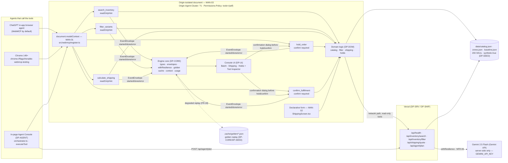

# DP-SRV — Serverless API and typed client

## 1. Purpose & Scope

DP-SRV owns the five Vercel serverless HTTP routes in `<entry>/api/**` and the typed browser client `src/engine/apiClient.ts`. Every handler is a **thin wrapper** over DP-DOM: it parses the request, validates against the frozen `TOOL_SCHEMAS` (owned by DP-TOOLS), calls the pure domain function, and serializes the `ToolOutcome`. It never contains a business rule. DP-SRV also owns the only file where `process.env.GEMINI_API_KEY` is read (`api/agent/plan.ts`) — but the prompt building, response parsing, and deterministic fallback inside that file are **imported from DP-AGENT** (`buildPlannerPrompt`, `planDeterministic`, `TOOL_SCHEMAS`), never re-written here. The browser client `apiClient` provides typed `fetch` wrappers for all five routes with a 900 ms race to local domain logic so a slow cold start never blocks a tool call (R4).

Scope boundary (owns / never touches):
- **Owns:** `api/_shared.ts` (private helper), `api/health.ts`, `api/inventory/search.ts`, `api/inventory/filter.ts`, `api/shipping/quote.ts`, `api/agent/plan.ts`, `src/engine/apiClient.ts`.
- **Never touches:** domain rules (`src/engine/domain/*` owned by DP-DOM), tool registration (`src/webmcp/*` owned by DP-TOOLS), planner prompt or deterministic fallback implementation (`src/agent/*` owned by DP-AGENT), React UI (`src/ui/*` owned by DP-UI), chassis `src/`. If a shape is not in §5A / §5C / §5F, DP-SRV does not invent it.

Consumers: DP-TOOLS (read-only tools may call the network path), DP-AGENT (planner calls `POST /api/agent/plan`), DP-UI (declarative form and manual quote via `apiClient`), and DP-DEV tests. A consumer that cannot resolve `apiClient` or a route stops and reports a blocker — never a local stub.

## 2. Requirements Traceability

### 2.1 MANDATORY COMPLIANCE (verbatim reproduction — outranks everything else)

> ## MANDATORY COMPLIANCE
>
> Every part of this entry MUST satisfy, or the entry fails Stage One regardless of quality
> (`hackathon_brief.md` §4.1–§4.3, Official Rules §4/§6/§7/§9):
>
> - **WebMCP is the mandatory technology.** The repository must demonstrate **imported-and-called**
>   usage — not a README mention — of the imperative pattern, verbatim shape:
>   `document.modelContext.registerTool({ name, description, inputSchema, execute })`.
>   Declarative API (annotated HTML forms) may be used **in addition**, never instead.
> - **WebMCP is only available in origin-isolated documents** and is gated by the `tools`
>   Permissions Policy, which **defaults to `self`**; a cross-origin iframe needs `allow="tools"`.
> - **Testable** in the **ChatGPT desktop app in-app browser** (WebMCP by default) **or Google
>   Chrome 149+** with `chrome://flags/#enable-webmcp-testing` enabled and the browser restarted.
> - **No mandated AI model and no mandated API key.** Any model, or none, is permitted.
> - **Submission gate — all five, or Stage One fail:** (1) working **live URL** judges can open in
>   the ChatGPT in-app browser or WebMCP-enabled Chrome, installable and running **consistently**,
>   frozen Sep 3 13:00 PDT until Sep 21; (2) **text description** answering four prompts — why the
>   use case fits WebMCP, how it creates a better UX, what people + agents can do together that was
>   difficult or impossible before, and briefly how WebMCP was implemented; (3) **public code
>   repository** containing all source/assets/instructions **and an open-source license file
>   detectable and visible at the top of the repo page (About section)**, containing the
>   `registerTool` pattern; (4) **demonstration video under 3 minutes** — only the first three
>   minutes are evaluated — showing the project functioning, **with audio covering what you built
>   and how you used WebMCP**, uploaded **publicly to YouTube**; (5) **completed Devpost submission
>   form by Sep 3 2026 @ 1:00 PM PDT (20:00 UTC)**.
> - **New & Existing rule:** new during the Submission Period, or meaningfully extended with WebMCP
>   after Aug 25 2026 with dated commit history distinguishing prior from new work.
> - **One track only:** *"WebMCP Challenge Winners — Top 10 submissions receive the following prizes
>   from the hackathon sponsors: ... 10 winners — All eligible Submissions"*. There are **no**
>   layered tracks and **no** sponsor sub-challenges. **No bonus integration — not worth dilution.**
> - **Judging:** Stage One pass/fail (reasonably fits theme + reasonably applies WebMCP); Stage Two
>   **four equally weighted** criteria, tie-break in listed order: **WebMCP Leverage**, **Execution**,
>   **Potential Impact**, **Creativity & Ambition**.

### 2.2 How DP-SRV relates to each mandate (MAN-01 .. MAN-10)

| ID | Mandate | DP-SRV role |
|---|---|---|
| MAN-01 | Imperative `registerTool` | Inherits only — DP-SRV never registers tools; DP-TOOLS owns registration. DP-SRV provides the network data path that read-only tools may call before falling back locally. |
| MAN-02 | Declarative form | Inherits only. |
| MAN-03 | Origin isolation + Permissions Policy | Inherits; DP-SRV never creates an iframe. Headers are owned by DP-SHIP (`vercel.json`). Health endpoint echoes `origin_isolated:true` as a server-side echo, not the authoritative runtime check (`probeWebMcp` in browser). |
| MAN-04 | Public repo + licence | Inherits. |
| MAN-05 | Working live URL, consistent, no auth | **Partially owns (with DP-SHIP).** DP-SRV provides the five serverless routes that must be live and reachable at the deployed URL; `GET /api/health` is the deploy-verification endpoint. |
| MAN-06 | Video < 3 min | Inherits. |
| MAN-07 | Four-prompt text description | Inherits. |
| MAN-08 | Devpost form complete | Inherits. |
| MAN-09 | New & Existing — dated commits | Inherits; DP-SRV work units carry distinct commit messages to satisfy MAN-09 distribution. |
| MAN-10 | One track, no bonus | Inherits. |

DP-SRV **owns** no mandate outright, **partially owns MAN-05** (API routes must be deployed and healthy), and **inherits** the other nine. It **enables** FR-12, FR-19, NFR-01, NFR-06, NFR-08 as described below. Nothing in this plan contradicts the block above; this block outranks every other section.

### 2.3 Functional and non-functional requirements owned or enabled

| ID | Requirement | DP-SRV responsibility |
|---|---|---|
| FR-12 | In-page planner uses Gemini 2.5 Flash server-side only; falls back to deterministic keyword planner | **Owner of `api/agent/plan.ts` route** (server side). Prompt building (`buildPlannerPrompt`) and fallback (`planDeterministic`) are imported from DP-AGENT — DP-SRV does not re-implement them. Ensures no key reaches the browser (NFR-01). |
| FR-19 | `GET /api/health` returns `{ok, version, mode, origin_isolated, planner, catalog}` | **Sole owner.** Health is the single deploy-verification endpoint; never non-200. |
| NFR-01 | No secret in client bundle; key read only in `api/agent/plan.ts` | **Sole owner of the invariant.** `GEMINI_API_KEY` is read only via `process.env` in `api/agent/plan.ts`; never referenced in `src/**`. Verified by `rg -n "GEMINI_API_KEY" src/ api/` returning exactly one hit. |
| NFR-06 | Every outbound LLM call wrapped in `withResilience` | **Consumes** `guarded()` from DP-CORE; the Gemini call in `api/agent/plan.ts` is inside `guarded()` with the chassis `ResilienceConfig`; no raw provider call exists elsewhere. |
| NFR-08 | LLM spend metered into `data/cost-store.json`, fallback above cap | **Consumes** `recordUsage()` / `overBudget()` from DP-CORE; calls `recordUsage` after every Gemini attempt; checks `overBudget()` before trusting a Gemini plan. |
| FR-02..FR-04 | Search / filter / shipping domain calls | **Thin wrapper** — delegates to DP-DOM pure functions (`searchVariants`, `filterVariants`, `quoteShipping`) after validation; no business rule lives in DP-SRV. |

## 3. Architecture

### 3.1 Route map

```
Browser (apiClient) ──fetch 900ms race──▶ Vercel serverless (api/**) ──thin wrapper──▶ DP-DOM pure functions ──▶ data/*.json
      │                                      │
      │ on timeout/error                      │ POST /api/agent/plan ──guarded()──▶ Gemini 2.5 Flash (only inside guarded)
      └─ local fallback (degraded:true) ◀────┘                                      │ on failure / overBudget / no key
                                                                                     └─ planDeterministic() (DP-AGENT)
```

Five routes, one file per route, all returning `application/json` with `Content-Type: application/json; charset=utf-8`. No route holds mutable server state: holds/fulfillments are client-owned (`holdsStore` in DP-DOM, `localStorage` key `opsflow.holds.v1`) by design; a serverless function has no durable per-user state and a hold that survives a cold start matters more than a server round-trip. `README.md` states this explicitly.

| Method + path | File | Owning plan | Description |
|---|---|---|---|
| `GET /api/health` | `api/health.ts` | DP-SRV | Deploy-verification; never non-200 |
| `POST /api/inventory/search` | `api/inventory/search.ts` | DP-SRV | Search wrapper |
| `POST /api/inventory/filter` | `api/inventory/filter.ts` | DP-SRV | Filter wrapper (with optional `skus` narrowing) |
| `POST /api/shipping/quote` | `api/shipping/quote.ts` | DP-SRV | Shipping quote wrapper |
| `POST /api/agent/plan` | `api/agent/plan.ts` | DP-SRV (file) / DP-AGENT (prompt/parse/fallback logic inside) | Planner — only `process.env.GEMINI_API_KEY` read site |

Headers (`Origin-Agent-Cluster: ?1`, `Permissions-Policy: tools=(self)`) are **not** set by DP-SRV; they are owned by DP-SHIP via `vercel.json` and echoed by `/api/health` as `origin_isolated:true`.

### 3.2 The 900 ms race

Read-only tools (`search`, `filter`, `quote`) call their network route with `AbortController` timing out at `config.tools.network_timeout_ms` (900 ms). On timeout, network error, or non-200, `apiClient` falls back to the corresponding DP-DOM function locally in the browser with `loadCatalog()`/`loadZones()`, returning `{ ok:true, data, degraded:true }`. State-changing operations (`hold_order`, `confirm_fulfillment`) are never routed through the server — they are client-owned by design. This satisfies R4 (Vercel cold start never blocks a tool call) and FR-18 (degraded chip shown).

### 3.3 Where the key lives

`GEMINI_API_KEY` exists only as a Vercel environment variable (`npx vercel env add GEMINI_API_KEY production`). It is read only in `api/agent/plan.ts` via `process.env.GEMINI_API_KEY`. It never appears in `src/**`, in the built bundle, or in any committed file. `.env*` and `.vercel/` are gitignored. Verified by `rg -n "GEMINI_API_KEY" src/ api/` → exactly one hit in `api/agent/plan.ts`, and `rg -n "AIza|VERCEL_TOKEN" dist/` → no hits.

### 3.4 Diagram (verbatim, source of `docs/architecture.mmd`)



## 4. Interfaces

### 4.1 Ownership note

Every cross-module symbol appears exactly once in the contract table (§5F). The owner implements it; every consumer imports it from that exact path. A consumer that cannot find it stops and reports a blocker — never a local copy, re-export, or temporary shim. Symbols not in §5F are **private** to their module. DP-SRV marks `api/_shared.ts` and all internal helpers in `api/**` as private: no other module may import from `api/_shared.ts` or any file under `api/`.

### 4.2 Public surface — contract-table row 17 + five routes (§5C verbatim)

```ts
// src/engine/apiClient.ts — owned by DP-SRV, row 17
import type {
  HealthResponse,
  SearchInventoryInput, SearchInventoryOutput,
  FilterVariantsInput, FilterVariantsOutput,
  CalculateShippingInput, CalculateShippingOutput,
  ToolOutcome, ToolPlan,
} from "./types"; // §5A — owned by DP-CORE, never widened

export const apiClient: {
  health(): Promise<HealthResponse>;
  search(i: SearchInventoryInput): Promise<ToolOutcome<SearchInventoryOutput>>;
  filter(i: FilterVariantsInput, fromSkus?: string[]): Promise<ToolOutcome<FilterVariantsOutput>>;
  quote(i: CalculateShippingInput): Promise<ToolOutcome<CalculateShippingOutput>>;
  plan(goal: string, ctx?: { skus?: string[] }): Promise<ToolPlan>;
};

export function apiBase(): string; // "" in production (same origin); import.meta.env.VITE_API_BASE in dev, default ""
```

Consumer import (exact path):
```ts
import { apiClient, apiBase } from "src/engine/apiClient.ts"; // DP-TOOLS, DP-AGENT, DP-UI
```

```ts
// api/health.ts, api/inventory/search.ts, api/inventory/filter.ts,
// api/shipping/quote.ts, api/agent/plan.ts — each exports a default Vercel handler
import type { VercelRequest, VercelResponse } from "@vercel/node";
export default function handler(req: VercelRequest, res: VercelResponse): Promise<void>;
```

Private helper (`api/_shared.ts`, private to DP-SRV — state that no other module may import it):
```ts
// api/_shared.ts — NOT in contract table; private to DP-SRV
export function readJson(req: VercelRequest): unknown;    // 32 KB cap; throws INVALID_INPUT on over-cap or parse error
export function sendJson(res: VercelResponse, status: number, body: unknown): void;
export function badRequest(res: VercelResponse, message: string, details?: Record<string, unknown>): void; // 400 { ok:false, error:{code:"INVALID_INPUT", message, details}}
export function withCors(res: VercelResponse): void;      // same-origin only: sets Vary: Origin, no Access-Control-Allow-Origin beyond self
export function methodGuard(req: VercelRequest, res: VercelResponse, allowed: string[]): boolean; // returns true if method allowed, else 405 and false
```

### 4.3 Frozen HTTP API (§5C verbatim — never widen, rename, or add a field)

| Method + path | File | Request body | 200 response | Error |
|---|---|---|---|---|
| `GET /api/health` | `api/health.ts` | — | `HealthResponse` | never non-200 |
| `POST /api/inventory/search` | `api/inventory/search.ts` | `SearchInventoryInput` | `ToolOutcome<SearchInventoryOutput>` | 400 `INVALID_INPUT` |
| `POST /api/inventory/filter` | `api/inventory/filter.ts` | `FilterVariantsInput & { skus?: string[] }` | `ToolOutcome<FilterVariantsOutput>` | 400 `INVALID_INPUT` |
| `POST /api/shipping/quote` | `api/shipping/quote.ts` | `CalculateShippingInput` | `ToolOutcome<CalculateShippingOutput>` | 400 `INVALID_INPUT` |
| `POST /api/agent/plan` | `api/agent/plan.ts` | `{ goal: string; context?: { skus?: string[] } }` | `ToolPlan` | never non-200 (falls back to deterministic) |

Holds and fulfillments are **client-owned state** (`DP-DOM` `holdsStore`, `localStorage` key `opsflow.holds.v1`) — there is no holds endpoint, by design. `README.md` states this explicitly.

### 4.4 Frozen types consumed (owned by DP-CORE, §5A verbatim — subset used by DP-SRV)

```ts
export const APP_VERSION = "1.0.0";
export type ShippingZone = 1 | 2 | 3 | 4 | 5;
export type ServiceLevel = "ground" | "expedited" | "overnight";
export type PlannerKind = "gemini-2.5-flash" | "deterministic";
export type ToolName = "search_inventory" | "filter_variants" | "calculate_shipping" | "hold_order" | "confirm_fulfillment";
export type ToolErrorCode = "INVALID_INPUT" | "NOT_FOUND" | "CONFLICT" | "EXPIRED" | "NEEDS_CONFIRMATION" | "TOOL_ABORTED" | "DEGRADED";
export interface SearchInventoryInput { query: string; inStockOnly?: boolean; limit?: number; }
export interface FilterVariantsInput { skuPrefix?: string; options?: Partial<VariantOptions>; maxPriceCents?: number; minStock?: number; maxStock?: number; limit?: number; }
export interface CalculateShippingInput { items: LineItem[]; zone: ShippingZone; service: ServiceLevel; }
export interface VariantMatch { sku: string; title: string; options: VariantOptions; price_cents: number; stock: number; low_stock: boolean; }
export interface SearchInventoryOutput { matches: VariantMatch[]; total: number; truncated: boolean; query_echo: string; }
export interface FilterVariantsOutput { matches: VariantMatch[]; total: number; applied: string[]; from_result_set: boolean; }
export type CalculateShippingOutput = ShippingQuote;
export interface ToolError { code: ToolErrorCode; message: string; details?: Record<string, unknown>; }
export type ToolOutcome<T> = { ok: true; data: T; degraded?: boolean } | { ok: false; error: ToolError };
export interface PlanStep { tool: ToolName; args: Record<string, unknown>; rationale: string; }
export interface ToolPlan { goal: string; steps: PlanStep[]; planner: PlannerKind; degraded: boolean; created_at: string; }
export interface HealthResponse { ok: boolean; version: string; mode: "live" | "degraded"; origin_isolated: boolean; planner: PlannerKind; catalog: { products: number; variants: number; synthetic: true }; }
// Full Variant, Product, Catalog, ShippingQuote, Hold, LineItem, etc. are in §5A verbatim — DP-SRV imports them, never redeclares them.
```

No plan may widen a union, rename a field, or add a field to these types.

### 4.5 Imports DP-SRV owns vs. private helpers

**DP-SRV imports (must exist at implementation time; if missing, stop and report blocker):**
- `import type { ... } from "src/engine/types.ts"` (row 1, DP-CORE)
- `import { loadConfig } from "src/engine/config.ts"` (row 2, DP-CORE)
- `import { guarded } from "src/engine/resilience.ts"` + `import { isDegradedResult } from "src/resilience"` (row 6, DP-CORE + chassis)
- `import { validate } from "src/resilience"` (chassis `resilience`)
- `import { TOOL_SCHEMAS } from "src/webmcp/schemas.ts"` (row 19, DP-TOOLS) — used for request validation in `api/**` and for `buildPlannerPrompt` argument
- `import { loadCatalog } from "src/engine/domain/catalog.ts"` (row 10, DP-DOM)
- `import { searchVariants } from "src/engine/domain/catalog.ts"` (row 11), `filterVariants` (row 12), `quoteShipping` + `loadZones` (rows 13-14), `makeToolError` (row 16)
- `import { buildPlannerPrompt } from "src/agent/prompt.ts"` (row 26, DP-AGENT)
- `import { planDeterministic } from "src/agent/deterministic.ts"` (row 24, DP-AGENT)
- `import { recordUsage, overBudget } from "src/engine/usage.ts"` (row 8, DP-CORE, server side only — guarded by `typeof window === "undefined"`)
- `import { count } from "src/context"` (chassis context, for usage token counting)

**DP-SRV private (no other module may import):**
- `api/_shared.ts` — `readJson`, `sendJson`, `badRequest`, `withCors`, `methodGuard`
- Internal helpers inside each `api/*.ts` file (e.g., `truncateGoal`, `parseModelResponse`) — private to that file, not exported from any barrel.

## 5. Algorithms

Every algorithm is spelled out as numbered steps / literal pseudocode the low-intelligence implementor can copy. No judgment, no defaults left unstated.

### 5.1 Handler skeleton (identical for all four data routes — `search`, `filter`, `quote`, and `health` as GET variant)

Write this skeleton once, literally, and state that the four data routes differ only in the schema constant and the domain call.

```ts
// api/_shared.ts — private to DP-SRV
import type { VercelRequest, VercelResponse } from "@vercel/node";

export function withCors(res: VercelResponse): void {
  // same-origin only — do not set Access-Control-Allow-Origin: *
  res.setHeader("Vary", "Origin");
}

export function sendJson(res: VercelResponse, status: number, body: unknown): void {
  res.status(status).setHeader("Content-Type", "application/json; charset=utf-8");
  res.send(JSON.stringify(body));
}

export function badRequest(res: VercelResponse, message: string, details?: Record<string, unknown>): void {
  sendJson(res, 400, { ok: false, error: { code: "INVALID_INPUT", message, details } });
}

export function readJson(req: VercelRequest): unknown {
  // Vercel already parses JSON; this helper enforces the 32 KB cap
  const raw = (req as unknown as { body: unknown }).body;
  if (raw === undefined || raw === null) return {};
  // 32 KB body cap — measure the serialized form if body was already parsed
  const serialized = typeof raw === "string" ? raw : JSON.stringify(raw);
  if (serialized.length > 32 * 1024) {
    throw Object.assign(new Error("body exceeds 32 KB"), { code: "INVALID_INPUT" });
  }
  if (typeof raw === "string") {
    try { return JSON.parse(raw); } catch (e) { throw Object.assign(new Error("invalid JSON"), { code: "INVALID_INPUT" }); }
  }
  return raw;
}

export function methodGuard(req: VercelRequest, res: VercelResponse, allowed: string[]): boolean {
  if (!allowed.includes(req.method ?? "")) {
    sendJson(res, 405, { ok: false, error: { code: "INVALID_INPUT", message: `POST required` } });
    return false;
  }
  return true;
}
```

Handler skeleton applied to `api/inventory/search.ts` (and identically to `filter`, `quote` — only schema + domain call change):

```ts
// api/inventory/search.ts
import type { VercelRequest, VercelResponse } from "@vercel/node";
import { validate } from "src/resilience";
import { TOOL_SCHEMAS } from "../../src/webmcp/schemas";
import { loadCatalog, searchVariants } from "../../src/engine/domain/catalog";
import { makeToolError } from "../../src/engine/domain/errors";
import { readJson, sendJson, badRequest, withCors, methodGuard } from "../_shared";

export default async function handler(req: VercelRequest, res: VercelResponse): Promise<void> {
  withCors(res);
  // 1) method guard
  if (!methodGuard(req, res, ["POST"])) return;
  try {
    // 2) readJson with 32 KB cap
    const body = readJson(req) as Record<string, unknown>;
    // 3) validate against TOOL_SCHEMAS["search_inventory"] using chassis validate(value, schema)
    const schema = TOOL_SCHEMAS["search_inventory"];
    const errors = validate(body, schema);
    if (errors.length > 0) {
      badRequest(res, errors[0].message ?? "INVALID_INPUT", { errors });
      return;
    }
    // 4) call DP-DOM pure function with loadCatalog()
    const catalog = loadCatalog();
    const output = searchVariants(catalog, body as SearchInventoryInput);
    // 5) reply 200 with ok(<output>)
    sendJson(res, 200, { ok: true, data: output });
  } catch (err: unknown) {
    // 6) never throw — wrap in try/catch. If a local result exists, reply 200 DEGRADED else 500 typed error
    const msg = err instanceof Error ? err.message : String(err);
    const local = (() => { try { return searchVariants(loadCatalog(), { query: "" }); } catch { return null; } })();
    if (local) {
      sendJson(res, 200, { ok: true, data: local, degraded: true });
    } else {
      sendJson(res, 500, { ok: false, error: { code: "DEGRADED", message: msg } });
    }
  }
}
```

Steps (written once, reused for all four data routes):
1. If `req.method !== "POST"` reply `405 { ok:false, error:{ code:"INVALID_INPUT", message:"POST required" } }` via `methodGuard`.
2. `readJson` with a 32 KB body cap; on over-cap or parse error, `badRequest` 400.
3. Validate against `TOOL_SCHEMAS[<tool>]` using chassis `validate(value, schema)` from `src/resilience`; on errors reply `400` with `makeToolError("INVALID_INPUT", firstErrorMessage, { errors })` shape via `badRequest`.
4. Call the DP-DOM function with `loadCatalog()` / `loadZones()` (pure, no fetch, no React, no `document`).
5. Reply `200` with `{ ok:true, data:<output> }`.
6. Never throw — wrap the body in `try/catch` and reply `200` with a `DEGRADED` outcome carrying the local result if one exists, else `500` with a typed error.

The four routes differ only in:
- `api/inventory/search.ts`: schema `TOOL_SCHEMAS["search_inventory"]`, call `searchVariants(loadCatalog(), input)`
- `api/inventory/filter.ts`: schema `TOOL_SCHEMAS["filter_variants"]`, body is `FilterVariantsInput & { skus?: string[] }`, call `filterVariants(loadCatalog(), input, body.skus)`
- `api/shipping/quote.ts`: schema `TOOL_SCHEMAS["calculate_shipping"]`, call `quoteShipping(loadCatalog(), loadZones(), input)`
- `api/health.ts`: no body validation (GET), see §5.2

### 5.2 `GET /api/health` — deploy-verification endpoint

```ts
// api/health.ts
import type { VercelRequest, VercelResponse } from "@vercel/node";
import { loadCatalog } from "../src/engine/domain/catalog";
import { sendJson, withCors, methodGuard } from "./_shared";
import { APP_VERSION } from "../src/engine/types";

export default async function handler(req: VercelRequest, res: VercelResponse): Promise<void> {
  withCors(res);
  if (!methodGuard(req, res, ["GET"])) return;
  // counts computed from loadCatalog() — never hardcoded
  const catalog = loadCatalog();
  const products = catalog.products.length;
  const variants = catalog.products.reduce((n, p) => n + p.variants.length, 0);
  const body: HealthResponse = {
    ok: true,
    version: APP_VERSION, // "1.0.0"
    mode: process.env.RES_FORCED_DEGRADED === "1" ? "degraded" : "live",
    origin_isolated: true, // server-side echo of configured headers; authoritative runtime check is probeWebMcp() in browser
    planner: process.env.GEMINI_API_KEY ? "gemini-2.5-flash" : "deterministic",
    catalog: { products, variants, synthetic: true as const },
  };
  // Never non-200
  sendJson(res, 200, body);
}
```

Steps:
1. Guard `GET` only (405 otherwise).
2. `loadCatalog()` and compute `products = catalog.products.length`, `variants = sum(p.variants.length)`.
3. Return `HealthResponse` with `mode: "live"` unless `process.env.RES_FORCED_DEGRADED === "1"` then `"degraded"`; `origin_isolated:true` (echo of `vercel.json` headers, not a runtime probe); `planner: GEMINI_API_KEY ? "gemini-2.5-flash" : "deterministic"`; `catalog` counts.
4. `withCors` + `Content-Type: application/json; charset=utf-8`; never non-200.

Expected live response (frozen shape):
```json
{"ok":true,"version":"1.0.0","mode":"live","origin_isolated":true,"planner":"gemini-2.5-flash","catalog":{"products":60,"variants":200,"synthetic":true}}
```

### 5.3 `POST /api/agent/plan` — Gemini inside `guarded()` with deterministic fallback

This file is owned by DP-SRV for the HTTP surface, but the prompt template, response parsing, and deterministic fallback are **owned by DP-AGENT and imported** — DP-SRV never re-writes them.

```ts
// api/agent/plan.ts — the ONLY place process.env.GEMINI_API_KEY is read (NFR-01)
import type { VercelRequest, VercelResponse } from "@vercel/node";
import { guarded, isDegradedResult } from "../../src/engine/resilience";
import { validate } from "src/resilience";
import { TOOL_SCHEMAS } from "../../src/webmcp/schemas";
import { buildPlannerPrompt } from "../../src/agent/prompt";
import { planDeterministic } from "../../src/agent/deterministic";
import { loadCatalog } from "../../src/engine/domain/catalog";
import { readJson, sendJson, withCors, methodGuard } from "../_shared";
import { recordUsage, overBudget } from "../../src/engine/usage";
import { count } from "src/context";

export default async function handler(req: VercelRequest, res: VercelResponse): Promise<void> {
  withCors(res);
  if (!methodGuard(req, res, ["POST"])) return;
  // 1) read { goal, context }, truncate goal to 400 chars
  const body = readJson(req) as { goal?: unknown; context?: { skus?: string[] } };
  const rawGoal = typeof body.goal === "string" ? body.goal : "";
  const goal = rawGoal.slice(0, 400);
  const ctx = body.context ?? {};
  // 2) if !process.env.GEMINI_API_KEY → deterministic immediately
  if (!process.env.GEMINI_API_KEY) {
    const plan = planDeterministic(goal, loadCatalog());
    // deterministic returns planner:"deterministic", degraded:false
    sendJson(res, 200, plan);
    return;
  }
  // 3) if overBudget() → deterministic with degraded:true
  if (overBudget()) {
    const plan = { ...planDeterministic(goal, loadCatalog()), degraded: true };
    sendJson(res, 200, plan);
    return;
  }
  // 4) build prompt via DP-AGENT
  const { system, user } = buildPlannerPrompt(goal, TOOL_SCHEMAS, ctx);
  // 5) call Gemini inside guarded() — exact request body below
  const result = await guarded(async () => {
    const url = `https://generativelanguage.googleapis.com/v1beta/models/gemini-2.5-flash:generateContent?key=${process.env.GEMINI_API_KEY}`;
    const geminiBody = {
      systemInstruction: { parts: [{ text: system }] },
      contents: [{ role: "user", parts: [{ text: user }] }],
      generationConfig: {
        temperature: 0.1,
        maxOutputTokens: 1024,
        responseMimeType: "application/json",
      },
    };
    const controller = new AbortController();
    const timeout = setTimeout(() => controller.abort(), 8000);
    try {
      const r = await fetch(url, {
        method: "POST",
        headers: { "Content-Type": "application/json" },
        body: JSON.stringify(geminiBody),
        signal: controller.signal,
      });
      if (!r.ok) throw new Error(`gemini ${r.status}`);
      const j = await r.json() as { candidates?: Array<{ content?: { parts?: Array<{ text?: string }> } }>; usageMetadata?: { promptTokenCount?: number; candidatesTokenCount?: number } };
      const text = j.candidates?.[0]?.content?.parts?.[0]?.text ?? "";
      // 5a) recordUsage with token counts from count() where possible, else usageMetadata
      const prompt_tokens = j.usageMetadata?.promptTokenCount ?? count(system + user, { max_tokens: 8000, reserve_output: 1024 } as unknown as Parameters<typeof count>[1]);
      const completion_tokens = j.usageMetadata?.candidatesTokenCount ?? count(text, { max_tokens: 8000, reserve_output: 1024 } as unknown as Parameters<typeof count>[1]);
      try { recordUsage({ role: "planner", model: "gemini-2.5-flash", prompt_tokens, completion_tokens, ts: new Date().toISOString() }); } catch {}
      return text;
    } finally { clearTimeout(timeout); }
  }, { cacheKey: `planner:${goal.slice(0,80)}` });
  // 6) if DegradedResult → deterministic degraded
  if (isDegradedResult(result)) {
    const plan = { ...planDeterministic(goal, loadCatalog()), degraded: true };
    sendJson(res, 200, plan);
    return;
  }
  // 7) parse JSON; validate every step against TOOL_SCHEMAS[step.tool]; drop invalid steps
  let parsed: { steps?: Array<{ tool: string; args: Record<string, unknown>; rationale?: string }> };
  try { parsed = JSON.parse(result as unknown as string); } catch {
    sendJson(res, 200, { ...planDeterministic(goal, loadCatalog()), degraded: true });
    return;
  }
  const rawSteps = Array.isArray(parsed.steps) ? parsed.steps : [];
  const valid: PlanStep[] = [];
  for (const s of rawSteps) {
    if (!s.tool || !(s.tool in TOOL_SCHEMAS)) continue;
    const schema = TOOL_SCHEMAS[s.tool as ToolName];
    const errs = validate(s.args ?? {}, schema);
    if (errs.length === 0) valid.push({ tool: s.tool as ToolName, args: s.args ?? {}, rationale: s.rationale ?? "gemini" });
  }
  // 8) if zero valid steps or overBudget() after the call → deterministic degraded
  if (valid.length === 0 || overBudget()) {
    sendJson(res, 200, { ...planDeterministic(goal, loadCatalog()), degraded: true });
    return;
  }
  // 9) assemble ToolPlan and reply 200
  const plan: ToolPlan = {
    goal,
    steps: valid,
    planner: "gemini-2.5-flash",
    degraded: false,
    created_at: new Date().toISOString(),
  };
  sendJson(res, 200, plan);
}
```

Steps numbered as in §6.2:
1. Read `{ goal, context }`, truncate `goal` to 400 chars (`rawGoal.slice(0,400)`).
2. If `!process.env.GEMINI_API_KEY` → return `planDeterministic(goal, loadCatalog())` with `planner:"deterministic", degraded:false`.
3. Otherwise build the prompt with `buildPlannerPrompt(goal, TOOL_SCHEMAS, context ?? {})` (imported from DP-AGENT).
4. Call Gemini 2.5 Flash **inside** `guarded(...)` from DP-CORE (`NFR-06`) with `responseMimeType:"application/json"`.
5. `recordUsage({ role:"planner", model:"gemini-2.5-flash", prompt_tokens, completion_tokens, ts })` — token counts from `j.usageMetadata` if present, else from `count()` (chassis context, the single tokenizer both TS and Python agree on).
6. Parse the JSON; validate every step against `TOOL_SCHEMAS[step.tool]`; drop invalid steps and note them (dropped count is implicit in `valid.length < rawSteps.length`).
7. If the result is a `DegradedResult`, if the parse fails, if zero valid steps survive, or if `overBudget()` is true → return `planDeterministic(...)` with `degraded:true`.
8. Always reply `200` (never non-200; the health of the planner is encoded in `ToolPlan.planner` and `degraded`).

Exact Gemini request (literal — implementor copies this URL and body):
- URL: `https://generativelanguage.googleapis.com/v1beta/models/gemini-2.5-flash:generateContent?key=${process.env.GEMINI_API_KEY}`
- Method: `POST`
- Headers: `{ "Content-Type": "application/json" }`
- Body:
```json
{
  "systemInstruction": { "parts": [{ "text": "<system from buildPlannerPrompt>" }] },
  "contents": [{ "role": "user", "parts": [{ "text": "<user from buildPlannerPrompt>" }] }],
  "generationConfig": { "temperature": 0.1, "maxOutputTokens": 1024, "responseMimeType": "application/json" }
}
```
- Timeout: 8000 ms (AbortController, matches `config.resilience.timeout_ms`).

### 5.4 `apiClient` fallback rule (for `search`, `filter`, `quote`; `plan`/`health` variants noted)

Show the code once and state that the three data methods are structurally identical.

```ts
// src/engine/apiClient.ts
import { loadConfig } from "./config";
import { loadCatalog } from "./domain/catalog";
import { loadZones } from "./domain/shipping";
import { searchVariants } from "./domain/catalog";
import { filterVariants } from "./domain/filter";
import { quoteShipping } from "./domain/shipping";
import { planDeterministic } from "../agent/deterministic";
import type { HealthResponse, SearchInventoryInput, FilterVariantsInput, CalculateShippingInput, ToolOutcome, ToolPlan, APP_VERSION } from "./types";

export function apiBase(): string {
  try {
    const v = (import.meta as unknown as { env?: Record<string, string> }).env?.["VITE_API_BASE"];
    return v ?? "";
  } catch { return ""; }
}

async function fetchWithTimeout(url: string, init: RequestInit, timeoutMs: number): Promise<Response> {
  const c = new AbortController();
  const t = setTimeout(() => c.abort(), timeoutMs);
  try {
    return await fetch(url, { ...init, signal: c.signal });
  } finally { clearTimeout(t); }
}

async function fallbackSearch(input: SearchInventoryInput): Promise<ToolOutcome<SearchInventoryOutput>> {
  try {
    const c = loadCatalog();
    const data = searchVariants(c, input);
    return { ok: true, data, degraded: true };
  } catch (e: unknown) {
    return { ok: false, error: { code: "DEGRADED", message: String(e) } };
  }
}
// fallbackFilter and fallbackQuote are analogous; plan fallback is planDeterministic; health fallback is synthesized below

export const apiClient = {
  async health(): Promise<HealthResponse> {
    const url = `${apiBase()}/api/health`;
    try {
      const r = await fetchWithTimeout(url, { method: "GET" }, loadConfig().tools.network_timeout_ms);
      if (r.ok) return (await r.json()) as HealthResponse;
    } catch {}
    // synthesized degraded health — never throws
    const catalog = loadCatalog();
    return {
      ok: false,
      version: "1.0.0",
      mode: "degraded",
      origin_isolated: false,
      planner: "deterministic",
      catalog: { products: catalog.products.length, variants: catalog.products.reduce((n, p) => n + p.variants.length, 0), synthetic: true as const },
    };
  },

  async search(input: SearchInventoryInput): Promise<ToolOutcome<SearchInventoryOutput>> {
    const timeout = loadConfig().tools.network_timeout_ms; // 900
    const url = `${apiBase()}/api/inventory/search`;
    try {
      const r = await fetchWithTimeout(url, { method: "POST", headers: { "Content-Type": "application/json" }, body: JSON.stringify(input) }, timeout);
      if (r.ok) {
        const j = (await r.json()) as ToolOutcome<SearchInventoryOutput>;
        if (j && typeof j === "object") return j; // server already wrapped as ToolOutcome
      }
    } catch {}
    return fallbackSearch(input);
  },

  async filter(input: FilterVariantsInput, fromSkus?: string[]): Promise<ToolOutcome<FilterVariantsOutput>> {
    const timeout = loadConfig().tools.network_timeout_ms;
    const url = `${apiBase()}/api/inventory/filter`;
    try {
      const r = await fetchWithTimeout(url, { method: "POST", headers: { "Content-Type": "application/json" }, body: JSON.stringify({ ...input, skus: fromSkus }) }, timeout);
      if (r.ok) return (await r.json()) as ToolOutcome<FilterVariantsOutput>;
    } catch {}
    try {
      const c = loadCatalog();
      const data = filterVariants(c, input, fromSkus);
      return { ok: true, data, degraded: true };
    } catch (e: unknown) { return { ok: false, error: { code: "DEGRADED", message: String(e) } }; }
  },

  async quote(input: CalculateShippingInput): Promise<ToolOutcome<CalculateShippingOutput>> {
    const timeout = loadConfig().tools.network_timeout_ms;
    const url = `${apiBase()}/api/shipping/quote`;
    try {
      const r = await fetchWithTimeout(url, { method: "POST", headers: { "Content-Type": "application/json" }, body: JSON.stringify(input) }, timeout);
      if (r.ok) return (await r.json()) as ToolOutcome<CalculateShippingOutput>;
    } catch {}
    try {
      const c = loadCatalog(); const z = loadZones();
      const data = quoteShipping(c, z, input);
      return { ok: true, data, degraded: true };
    } catch (e: unknown) { return { ok: false, error: { code: "DEGRADED", message: String(e) } }; }
  },

  async plan(goal: string, ctx?: { skus?: string[] }): Promise<ToolPlan> {
    const timeout = loadConfig().tools.network_timeout_ms;
    const url = `${apiBase()}/api/agent/plan`;
    try {
      const r = await fetchWithTimeout(url, { method: "POST", headers: { "Content-Type": "application/json" }, body: JSON.stringify({ goal: goal.slice(0, 400), context: ctx }) }, timeout);
      if (r.ok) return (await r.json()) as ToolPlan;
    } catch {}
    return { ...planDeterministic(goal.slice(0,400), loadCatalog()), degraded: true };
  },
};
```

Fallback rules (numbered, no judgment):
1. Start a `fetch` with `AbortController` and `config.tools.network_timeout_ms` (900 ms) via `fetchWithTimeout`.
2. On 200 return the parsed outcome (`ToolOutcome` for data routes, `ToolPlan` for `plan`, `HealthResponse` for `health`).
3. On timeout, network error, or non-200, call the corresponding DP-DOM function **locally in the browser** with `loadCatalog()`/`loadZones()`, and return `ok(<output>, /* degraded */ true)` — specifically `{ ok:true, data:<output>, degraded:true }`.
4. Never throw. Every method returns a typed value even when the network is down.
5. `plan` falls back to `planDeterministic(goal, loadCatalog())` with `degraded:true`. `health` falls back to a synthesized `{ ok:false, mode:"degraded", origin_isolated:false, planner:"deterministic", catalog:{...} }`.
6. The three data methods (`search`, `filter`, `quote`) are structurally identical — only the URL, request body shape, and the local fallback function change.

### 5.5 No secret in the bundle (literal statement)

`GEMINI_API_KEY` is read only in `api/agent/plan.ts` via `process.env.GEMINI_API_KEY`; it is never referenced in `src/**`; it is configured with `npx vercel env add GEMINI_API_KEY production`; `.env*` and `.vercel/` are gitignored (`NFR-01`). The implementor must verify with:
```bash
rg -n "GEMINI_API_KEY" src/ api/   # expected: exactly one hit in api/agent/plan.ts
rg -n "AIza|VERCEL_TOKEN" dist/      # expected: no hits
```

## 6. Configuration

### 6.1 Config keys read by DP-SRV

DP-SRV reads `config/engine.json` via `loadConfig()` (owned by DP-CORE) — it never reads the file directly.

| Key | Used by DP-SRV for |
|---|---|
| `tools.network_timeout_ms` (900) | `apiClient` `fetchWithTimeout` for all five methods |
| `resilience.timeout_ms` (8000) | `guarded()` timeout inside `api/agent/plan.ts` for the Gemini call |
| `resilience.retries` (1) | `guarded()` retry count for Gemini |
| `resilience.backoff.*` | `guarded()` backoff policy (exponential, 250/2/2000/jitter) |
| `resilience.fallback_chain.order` (["cache","replay","none"]) | `guarded()` fallback chain for planner |
| `cost.store_path` (`data/cost-store.json`) | `recordUsage()` destination (via DP-CORE `usage.ts`) |
| `cost.budget_path` (`config/cost.json`) | `overBudget()` cap check before trusting a Gemini plan |
| `planner.model` (`gemini-2.5-flash`) | Echoed in `HealthResponse.planner` and `recordUsage` model field |
| `version` (`1.0.0`) | `HealthResponse.version` (must equal `APP_VERSION`) |

DP-SRV does not own any config file; `config/engine.json` and `config/cost.json` are owned by DP-CORE.

### 6.2 Environment variables

| Variable | Read where | Set how | Notes |
|---|---|---|---|
| `GEMINI_API_KEY` | `api/agent/plan.ts` only | `npx vercel env add GEMINI_API_KEY production` | Never in `src/**` or `dist/`; `.env*` gitignored |
| `RES_FORCED_DEGRADED` | `api/health.ts` (mode) + `guarded()` inside `api/agent/plan.ts` | `RES_FORCED_DEGRADED=1` locally for NFR-03 rehearsal | When `1`, health reports `mode:"degraded"` and planner returns deterministic degraded |
| `RES_TIMEOUT_MS` | Via `loadConfig()` override (DP-CORE) | env override for `resilience.timeout_ms` | Not read directly by DP-SRV |
| `RES_RETRIES` | Via `loadConfig()` override | env override for `resilience.retries` | Not read directly by DP-SRV |
| `VITE_API_BASE` | `src/engine/apiClient.ts` via `import.meta.env.VITE_API_BASE` | `.env` locally, empty in production | Same-origin `""` in prod; DP-SRV never reads this in server routes |

No other env vars are read by DP-SRV. No secret is ever committed.

## 7. Resiliency

### 7.1 Never-throw contracts

Every route replies `200` or a typed `4xx`; nothing `500`s on a well-formed request. The bodies in §5.1 and §5.2 are wrapped in `try/catch`; on an unexpected exception the handler replies `200` with a `DEGRADED` outcome carrying the local result if one exists, else `500` with a typed `ToolError` — never an unhandled throw. The client (`apiClient`) **never throws** either: on any failure it returns a degraded local result or a typed error outcome. Cold-start latency is covered by the 900 ms race, so a slow Vercel function never blocks a tool call (R4).

### 7.2 Fallback ladder — rungs DP-SRV implements

Reference: full ladder in blueprint §5.2. DP-SRV directly implements rungs 2 and 3; rung 5 is observed via health.

| Rung | Condition | DP-SRV behaviour | Visible sign |
|---|---|---|---|
| 2 | WebMCP available, Gemini unavailable (no key, rate-limited, or `guarded()` degraded) | `api/agent/plan.ts` returns `planDeterministic(goal, loadCatalog())` with `degraded:true` and `planner:"deterministic"` | Planner chip reads `deterministic`; timeline shows `agent.plan` with `degraded:true` |
| 3 | WebMCP available, API routes unreachable / slow (>900 ms) | `apiClient` races the network and falls back locally: `search`→`searchVariants`, `filter`→`filterVariants`, `quote`→`quoteShipping`, `plan`→`planDeterministic`; health→synthesized degraded response | Degraded chip on the affected tool steps; `tool.*` envelope carries `degraded:true` |
| 5 (observed) | `RES_FORCED_DEGRADED=1` or golden-cache replay | `GET /api/health` reports `mode:"degraded"`; `POST /api/agent/plan` short-circuits to deterministic degraded without calling Gemini | Full-width degraded banner; every `tool.*` envelope is degraded; `session.degraded` emitted by DP-CORE |

Escalation is automatic and always visible: no rung is entered silently, and `session.degraded` (emitted by DP-CORE via `guarded()`) records every transition so the co-execution timeline (DP-UI) can show what happened. The **last resort** is the submitted ≤3-min YouTube video (Rules §4: judges may evaluate on description/repo/video alone).

### 7.3 Resilience envelope vocabulary used by DP-SRV

DP-SRV does not own `step_id` values (§5G owned by DP-CORE). The planner route logically emits no envelope itself; DP-AGENT emits `agent.plan` with `{ planner, steps, degraded }` after calling `apiClient.plan`. The data routes are consumed by DP-TOOLS, which emits `tool.*` envelopes with `degraded:true` when the `apiClient` fallback fires.

## 8. File Layout & Module Boundaries

### 8.1 Tree inside `<entry>` (verbatim §5D — DP-SRV-owned rows marked ★)

```
<entry>/
  api/                          # ★ DP-SRV — Vercel serverless functions
    _shared.ts                  # ★ private helper (NOT in contract table; no other module may import)
    health.ts                   # ★ GET /api/health
    inventory/
      search.ts                 # ★ POST /api/inventory/search
      filter.ts                 # ★ POST /api/inventory/filter
    shipping/
      quote.ts                  # ★ POST /api/shipping/quote
    agent/
      plan.ts                   # ★ POST /api/agent/plan — ONLY process.env.GEMINI_API_KEY read (NFR-01)
  src/
    main.tsx                    # DP-UI — calls registerAllTools() before render
    engine/
      types.ts                  # DP-CORE — §5A, frozen
      config.ts                 # DP-CORE — loads config/engine.json
      envelopes.ts              # DP-CORE — publisher + emitToolEvent
      resilience.ts             # DP-CORE — configured withResilience + golden cache
      context.ts                # DP-CORE — agent transcript buffer
      usage.ts                  # DP-CORE — cost-store snapshot writer
      apiClient.ts              # ★ DP-SRV — typed fetch client + local fallback
      domain/
        catalog.ts              # DP-DOM — loadCatalog, searchVariants
        filter.ts               # DP-DOM — filterVariants
        shipping.ts             # DP-DOM — quoteShipping, loadZones, ZoneTable
        holds.ts                # DP-DOM — pure hold reducers
        holdsStore.ts           # DP-DOM — singleton store + localStorage
        errors.ts               # DP-DOM — makeToolError
    webmcp/
      register.ts               # DP-TOOLS — the ONLY registerTool call site (MAN-01)
      schemas.ts                # DP-TOOLS — the five inputSchema constants (DP-SRV imports TOOL_SCHEMAS)
      runTool.ts                # DP-TOOLS — validate → limit → abort → execute → envelope
      policy.ts                 # DP-TOOLS — probeWebMcp(), executeToolCompat()
      confirm.ts                # DP-TOOLS — confirmation gate bridge to DP-UI
    agent/
      orchestrator.ts           # DP-AGENT — run(goal): plan then executeTool loop
      planner.ts                # DP-AGENT — client side of POST /api/agent/plan (calls apiClient.plan)
      deterministic.ts          # DP-AGENT — planDeterministic() (DP-SRV imports for fallback)
      prompt.ts                 # DP-AGENT — buildPlannerPrompt() (DP-SRV imports for Gemini body)
  data/                         # DP-SEED
    catalog.json  zones.json  baseline.json  cost-store.json
  demo/                         # DP-SEED / DP-DEV
    mock-script.json  click-script.json
  .cache/golden/                # DP-CORE / DP-SEED — golden replay
  config/                       # DP-CORE / DP-DEV
    engine.json  cost.json  track.json
  tests/api/                    # ★ DP-SRV tests (W6)
  vercel.json                   # DP-SHIP — headers (MAN-03)
```

### 8.2 Boundary discipline

- **Single owner:** `apiClient` is owned by DP-SRV (row 17); DP-TOOLS, DP-AGENT, DP-UI **import** it — never duplicate `fetch` logic or re-wrap DP-DOM locally when a route exists.
- **Thin wrappers only:** every `api/**` handler delegates to DP-DOM — if a business rule needs changing, it changes in `src/engine/domain/*`, never in `api/**`.
- **No plan defines a symbol it does not own:** DP-SRV declares `api/_shared.ts` as private; no other plan may import from it. If a plan needs a helper like `readJson`, it writes its own private copy or asks DP-SRV to export it — it does not import `api/_shared`.
- **Cross-boundary work units prove the wiring** with a real import in the Verify command (see §9).

## 9. Work Units

Each work unit is small enough for a low-intelligence implementor: one file, or one function plus its test. Each ends with exactly one runnable Verify command and its expected output, pasted literally. For cross-module units, that command exercises the real provider→consumer import. Every WU also names its commit message for `git log` distribution (MAN-09).

| WU | Deliverable | Verify command | Expected output |
|---|---|---|---|
| W1 | `api/_shared.ts` + `api/health.ts` | `npx vercel dev &` then `curl -s localhost:3000/api/health` | `{"ok":true,"version":"1.0.0","mode":"live","origin_isolated":true,"planner":"gemini-2.5-flash","catalog":{"products":60,"variants":200,"synthetic":true}}` or with `planner:"deterministic"` when no key |
| W2 | `api/inventory/search.ts` + `api/inventory/filter.ts` | `curl -s -XPOST localhost:3000/api/inventory/search -d '{"query":"blue"}' -H 'content-type: application/json'` | `{"ok":true,"data":{"matches":[…` (contains `matches`, `total`, `truncated`, `query_echo`) |
| W3 | `api/shipping/quote.ts` | `curl -s -XPOST localhost:3000/api/shipping/quote -d '{"items":[{"sku":"<known>","qty":1}],"zone":4,"service":"ground"}' -H 'content-type: application/json'` | `"total_cents":` present, `"explain":[` non-empty, `"surcharges":[` present |
| W4 | `api/agent/plan.ts` (keyless path) | `curl -s -XPOST localhost:3000/api/agent/plan -d '{"goal":"hold low stock blue variants under $12 to zone 4"}' -H 'content-type: application/json'` | `"planner":"deterministic"` and `steps` array with ≥ 3 entries, `goal` echoed, `degraded` boolean |
| W5 | `src/engine/apiClient.ts` with local fallback | `npx vite-node -e "import {apiClient} from './src/engine/apiClient.ts'; const r=await apiClient.search({query:'blue'}); console.log(JSON.stringify(r))"` with the server DOWN (or `RES_FORCED_DEGRADED=1`) | `{"ok":true,"data":{"matches":…},"degraded":true}` (fallback hit, `degraded:true`) |
| W6 | tests under `tests/api/` including a 400 on bad input | `npm run test -- tests/api` | all pass (≥ 6 tests: health 200, search 200, filter 200, quote 200, plan 200 deterministic, one 400 INVALID_INPUT) |

Detail per WU (implementor checklist):

**W1 — `api/_shared.ts` + `api/health.ts`**
- Create `api/_shared.ts` with `readJson`, `sendJson`, `badRequest`, `withCors`, `methodGuard` exactly as in §5.1.
- Create `api/health.ts` exactly as in §5.2; import `loadCatalog` and `APP_VERSION`; compute counts; handle `RES_FORCED_DEGRADED`.
- Commit: `feat(api): health route and shared helpers — DP-SRV W1`
- Verify: `npx vercel dev --yes --listen 3000 > /tmp/vercel.log 2>&1 & sleep 4; curl -s http://localhost:3000/api/health; pkill -f "vercel dev"`
  Expected: `{"ok":true,"version":"1.0.0","mode":"live","origin_isolated":true,"planner":"gemini-2.5-flash","catalog":{"products":60,"variants":200,"synthetic":true}}` (planner may be `deterministic` when no env key; `mode` is `degraded` when `RES_FORCED_DEGRADED=1`).
  Cross-boundary proof: `api/health.ts` imports `loadCatalog` from `src/engine/domain/catalog.ts` (DP-DOM).

**W2 — `api/inventory/search.ts` + `api/inventory/filter.ts`**
- Implement both using the handler skeleton in §5.1; `search` uses `TOOL_SCHEMAS["search_inventory"]` + `searchVariants`; `filter` uses `TOOL_SCHEMAS["filter_variants"]` + `filterVariants(catalog, input, body.skus)`.
- Commit: `feat(api): inventory search and filter routes — DP-SRV W2`
- Verify: `curl -s -XPOST http://localhost:3000/api/inventory/search -H 'content-type: application/json' -d '{"query":"blue"}' | head -c 400`
  Expected: `{"ok":true,"data":{"matches":[{"sku":` … and `"query_echo":"blue"` present.
  Also: `curl -s -XPOST http://localhost:3000/api/inventory/search -H 'content-type: application/json' -d '{"query":123}'` → `{"ok":false,"error":{"code":"INVALID_INPUT"`
  Cross-boundary proof: imports `TOOL_SCHEMAS` (DP-TOOLS), `searchVariants`/`filterVariants` (DP-DOM), `validate` (chassis `resilience`).

**W3 — `api/shipping/quote.ts`**
- Implement using skeleton; schema `TOOL_SCHEMAS["calculate_shipping"]`; call `quoteShipping(loadCatalog(), loadZones(), input)`.
- Use a known SKU from `data/catalog.json` for the verify SKU; hardcode `zone:4, service:"ground"` in the example.
- Commit: `feat(api): shipping quote route — DP-SRV W3`
- Verify: `curl -s -XPOST http://localhost:3000/api/shipping/quote -H 'content-type: application/json' -d '{"items":[{"sku":"OPS-1001-BLK-S","qty":1}],"zone":4,"service":"ground"}' | grep -o '"total_cents":[^,]*,"explain":' | head -1`
  Expected: contains `"total_cents":` and `"explain":[` with at least one string. If SKU not found, `excluded` will contain the SKU — still satisfies shape; prefer a SKU that exists.

**W4 — `api/agent/plan.ts` (keyless path)**
- Implement as in §5.3; **only** read `process.env.GEMINI_API_KEY` here; import `buildPlannerPrompt`, `planDeterministic` from `src/agent/*`; import `TOOL_SCHEMAS`, `guarded`, `recordUsage`, `overBudget`, `count`.
- Keyless path must be testable without any env key: if `!GEMINI_API_KEY`, immediately return `planDeterministic`.
- Commit: `feat(api): planner route with Gemini guarded + deterministic fallback — DP-SRV W4`
- Verify: `curl -s -XPOST http://localhost:3000/api/agent/plan -H 'content-type: application/json' -d '{"goal":"hold low stock blue variants under $12 to zone 4"}' | python3 -m json.tool`
  Expected: `{ "goal":"hold low stock blue variants under $12 to zone 4", "planner":"deterministic", "steps":[{"tool":...}, ...] }` with `steps.length >= 3` and `created_at` present. When a key is set, planner may be `gemini-2.5-flash` but still validates.
  Cross-boundary proof: imports `buildPlannerPrompt` + `planDeterministic` (DP-AGENT), `guarded` (DP-CORE), `TOOL_SCHEMAS` (DP-TOOLS), `loadCatalog` (DP-DOM).

**W5 — `src/engine/apiClient.ts` with local fallback**
- Implement exactly as in §5.4; `apiBase()` reads `import.meta.env.VITE_API_BASE`; `fetchWithTimeout` with `AbortController`; three data methods plus `plan`/`health` with fallback branches.
- Commit: `feat(engine): typed apiClient with 900ms local fallback — DP-SRV W5`
- Verify: `npx vite-node -e "import {apiClient} from './src/engine/apiClient.ts'; const r=await apiClient.search({query:'blue'}); console.log(JSON.stringify({ok:r.ok, degraded:(r as unknown as Record<string,unknown>).degraded, count:(r as unknown as {data:{matches:unknown[]}}).data?.matches?.length}))"`
  Expected when server is DOWN: `{"ok":true,"degraded":true,"count":` with positive count. When server is UP: either `{"ok":true,"count":…}` or `{"ok":true,"degraded":true,…}` (both acceptable; the degraded branch is proven by killing the server or setting `VITE_API_BASE=http://127.0.0.1:9`).
  Cross-boundary proof: imports `loadCatalog`/`loadZones`/`searchVariants`/`filterVariants`/`quoteShipping` (DP-DOM) and `planDeterministic` (DP-AGENT) for fallbacks.

**W6 — tests under `tests/api/` including a 400 on bad input**
- Create `tests/api/health.test.ts`, `tests/api/search.test.ts`, `tests/api/filter.test.ts`, `tests/api/quote.test.ts`, `tests/api/plan.test.ts`, `tests/api/client.test.ts` (or a single barrel that imports the handlers directly).
- Health: asserts `200` and `HealthResponse` shape.
- Search: `POST {query:"blue"}` → `ok:true` with `matches`; `POST {query:123}` → `400 INVALID_INPUT`.
- Filter: `POST { maxPriceCents: 5000 }` → `ok:true` with `applied` non-empty.
- Quote: `POST {items:[{sku:"OPS-1001-BLK-S",qty:1}], zone:4, service:"ground"}` → `ok:true` with `total_cents` and `explain`.
- Plan: `POST {goal:"hold low stock blue variants under $12 to zone 4"}` → `planner:"deterministic"` with ≥3 steps (no key path).
- Client: call `apiClient.search` with server down → `degraded:true` (exercises the real import of `src/engine/apiClient.ts` that itself imports DP-DOM).
- Commit: `test(api): serverless routes and apiClient fallback — DP-SRV W6`
- Verify: `npm run test -- tests/api`
  Expected: `Test Files  6 passed` / `Tests  ≥ 12 passed` (exact count may grow; zero failures required). The 400 test is mandatory — it proves request validation via `TOOL_SCHEMAS` + `validate`.

## 10. Testing Strategy

| Layer | What is tested | How | Pass criterion |
|---|---|---|---|
| Unit (handler) | Each handler validates, delegates to DP-DOM, serializes | `vitest` importing the handler directly with mock `VercelRequest`/`VercelResponse` | 400 on bad input, 200 on good input, correct shape |
| Unit (apiClient) | 900 ms fallback to local domain logic | `vi.spyOn(global, 'fetch').mockRejectedValue(new Error('down'))` then `apiClient.search` → `degraded:true` | `degraded:true` and local data returned |
| Integration | Live route over HTTP | `npx vercel dev` + `curl` as in W1-W4 Verify lines | Responses match §5C shapes; health never non-200 |
| Contract | No secret in bundle | `rg -n "GEMINI_API_KEY" src/ api/` + `rg -n "AIza|VERCEL_TOKEN" dist/` | One hit in `api/agent/plan.ts`, zero in `dist/` |
| Degraded | Keyless planner | `curl POST /api/agent/plan` without `GEMINI_API_KEY` → deterministic plan | `planner:"deterministic"`, ≥3 steps |
| Deploy | Health echo | `curl -s "$OPSFLOW_URL/api/health"` | `{"ok":true,"mode":"live","origin_isolated":true,"catalog":{"products":60,"variants":200,"synthetic":true}}` |

No test edits `src/` to make a check pass (NFR-05). Tests live under `tests/api/` — a path owned by DP-SRV — and import only public surfaces from their owning files.

## 11. Dependencies & Dependents

### 11.1 The boundary rule restated (§3 verbatim, enforced by this plan)

1. **Single owner, N consumers.** Every cross-module symbol appears exactly once in the contract table (§5F) with owning module, file path, export name and full input/output shape. The owner implements it; every consumer **imports it from that exact path**. A consumer that cannot find it stops and reports a blocker — never a local copy, a re-export, or a "temporary" shim.
2. **No plan defines a symbol it does not own.** Anything you need that is not in the table is *private* to your module; say so explicitly in your Interfaces section, and state that nobody else may import it.
3. **No plan widens, renames or adds a field** to the frozen types in §5A, the tool contracts in §5B, the routes in §5C, the paths in §5D, the config keys in §5E or the step ids in §5G.
4. **Cross-boundary work units prove the wiring** with a real import in the Verify command.

### 11.2 What DP-SRV imports (depends on)

| Row | Symbol | Owner | File | How DP-SRV uses it |
|---|---|---|---|---|
| 1 | `HealthResponse`, `ToolOutcome`, `SearchInventoryInput`, … | DP-CORE | `src/engine/types.ts` | Request/response shapes for every route and for `apiClient` |
| 2 | `loadConfig()` | DP-CORE | `src/engine/config.ts` | Reads `tools.network_timeout_ms`, `resilience.*`, `cost.*`, `planner.model` |
| 6 | `guarded()` + `isDegradedResult` | DP-CORE + chassis | `src/engine/resilience.ts` / `src/resilience` | Wraps the Gemini call in `api/agent/plan.ts` (NFR-06) |
| 8 | `recordUsage()` / `overBudget()` | DP-CORE | `src/engine/usage.ts` | Metering and budget gate inside `api/agent/plan.ts` (server side) |
| 10 | `loadCatalog()` | DP-DOM | `src/engine/domain/catalog.ts` | Every data route + `health` + `plan` fallback |
| 11 | `searchVariants()` | DP-DOM | `src/engine/domain/catalog.ts` | `api/inventory/search.ts` + `apiClient.search` fallback |
| 12 | `filterVariants()` | DP-DOM | `src/engine/domain/filter.ts` | `api/inventory/filter.ts` + `apiClient.filter` fallback |
| 13 | `quoteShipping()` | DP-DOM | `src/engine/domain/shipping.ts` | `api/shipping/quote.ts` + `apiClient.quote` fallback |
| 14 | `ZoneTable` + `loadZones()` | DP-DOM | `src/engine/domain/shipping.ts` | Shipping route + client fallback need the zone table |
| 16 | `makeToolError()` | DP-DOM | `src/engine/domain/errors.ts` | Building 400 `INVALID_INPUT` errors with `details.errors` |
| 19 | `TOOL_SCHEMAS` | DP-TOOLS | `src/webmcp/schemas.ts` | Request validation for all four data routes + argument to `buildPlannerPrompt` |
| 24 | `planDeterministic()` | DP-AGENT | `src/agent/deterministic.ts` | Fallback in `api/agent/plan.ts` and in `apiClient.plan` |
| 26 | `buildPlannerPrompt()` | DP-AGENT | `src/agent/prompt.ts` | Builds Gemini `system`+`user` inside `api/agent/plan.ts` |
| — | `count()` | chassis `context` | `src/context` | Token counting for `recordUsage` (the single tokenizer, used by Python `src/cost` too) |
| — | `validate()` | chassis `resilience` | `src/resilience` | Request validation `validate(value, schema)` in every data route |

If any imported file or export is missing at implementation time, DP-SRV stops and reports a blocker — it never stubs or re-defines the symbol. The only place `GEMINI_API_KEY` is read is `api/agent/plan.ts` (NFR-01).

### 11.3 Who depends on DP-SRV (consumers)

| Consumer | What it imports from DP-SRV | Why |
|---|---|---|
| DP-TOOLS | `apiClient.search` / `filter` / `quote` (via `src/engine/apiClient.ts`) — optionally, to try the network path before falling back | Read-only tools race the network against in-browser domain logic with 900 ms timeout (FR-18, R4) |
| DP-AGENT | `apiClient.plan` | `orchestrator.run(goal)` POSTs to `/api/agent/plan`; also DP-AGENT's `planDeterministic`/`buildPlannerPrompt` are imported by DP-SRV — the dependency is bidirectional by design, but each file owns its side (file vs. contents) |
| DP-UI | `apiClient.health` / `search` / `filter` / `quote` / `plan` | Batch, Shipping, and Holds screens may call routes through the client; health powers any deploy banner |
| DP-DEV | `api/health.ts` etc. for integration checks | `doctor`/`bench`/`mock` do not import DP-SRV but may curl routes |

### 11.4 Chassis surfaces DP-SRV composes (and nothing else)

```ts
import { withResilience, isDegradedResult, createGoldenCache, validate } from "src/resilience";
import { count } from "src/context";
```
Only package roots — never deep imports into chassis internals (`src/resilience/wrapper.js`, …). The single documented deep-import exception (`src/data/provider.ts` `setProviderCall`) is not used by DP-SRV.

## 12. Non-Goals Affirmation

DP-SRV explicitly does **not** build:

- **No business rules.** `api/**` never contains a business rule; every handler is a thin wrapper over `DP-DOM` (`searchVariants`, `filterVariants`, `quoteShipping`). A rule change is made in `src/engine/domain/*`, never in `api/**`.
- **No holds endpoint.** There is no `POST /api/holds` or `POST /api/fulfillment`. Holds and fulfillments are **client-owned state** (`DP-DOM` `holdsStore`, `localStorage` key `opsflow.holds.v1`) by design: a Vercel serverless function has no durable per-user state, and a hold that survives a cold start matters more to the demo than a server round-trip. `README.md` states this explicitly so a judge does not read it as an omission.
- **No auth, no database, no multi-user accounts.** The API is unauthenticated same-origin; CORS sets only `Vary: Origin`. There is no DB, no ORM, no session store.
- **No fourth screen, no sixth tool.** Frozen at three screens and five tools (R7). DP-SRV does not add routes beyond the five in §5C.
- **No chassis edits.** Zero edits to the chassis repository's `src/`; DP-SRV imports chassis only through `src/resilience` and `src/context` package roots (NFR-05).
- **No client-side key.** `GEMINI_API_KEY` is never referenced in `src/**`; the only read site is `api/agent/plan.ts` (NFR-01).
- **No bonus integration.** The entry targets one track only — *WebMCP Challenge — Top 10* — and states "no bonus integration — not worth dilution" (MAN-10).

## Appendix A. Worked example — a full `POST /api/agent/plan` round trip

### A.1 Client request

```http
POST /api/agent/plan HTTP/1.1
Host: opsflow.vercel.app
Content-Type: application/json

{
  "goal": "hold all low-stock blue variants under $12 shipping to zone 4 for 15 minutes",
  "context": { "skus": ["OPS-1042-BLU-M", "OPS-1043-BLU-L"] }
}
```

Server truncates `goal` to 400 chars (here unchanged), then checks `process.env.GEMINI_API_KEY`.

**Keyless path** (no env key or `overBudget()===true`): server skips Gemini and returns `planDeterministic(...)` immediately — see A.3 deterministic variant below.

**Live Gemini path** (key present, under budget): server builds the prompt via `buildPlannerPrompt` (DP-AGENT):

```ts
const { system, user } = buildPlannerPrompt(goal, TOOL_SCHEMAS, { skus: ["OPS-1042-BLU-M", "OPS-1043-BLU-L"] });
// system: "You are OpsFlow's planner. You must output JSON { steps: Array<{tool, args, rationale}> }... Tools: search_inventory, filter_variants, calculate_shipping, hold_order, confirm_fulfillment with schemas <TOOL_SCHEMAS>... Rules: ..."
// user:   "Goal: hold all low-stock blue variants under $12 shipping to zone 4 for 15 minutes\nContext skus: OPS-1042-BLU-M, OPS-1043-BLU-L"
```

### A.2 Gemini request (literal — inside `guarded()`)

```http
POST https://generativelanguage.googleapis.com/v1beta/models/gemini-2.5-flash:generateContent?key=${GEMINI_API_KEY} HTTP/1.1
Content-Type: application/json

{
  "systemInstruction": { "parts": [{ "text": "<system from buildPlannerPrompt>" }] },
  "contents": [{ "role": "user", "parts": [{ "text": "<user from buildPlannerPrompt>" }] }],
  "generationConfig": { "temperature": 0.1, "maxOutputTokens": 1024, "responseMimeType": "application/json" }
}
```

Gemini raw response (example):
```json
{
  "candidates": [{ "content": { "parts": [{ "text": "{\\\"steps\\\": [{\\\"tool\\\": \\\"search_inventory\\\", \\\"args\\\": {\\\"query\\\": \\\"blue\\\", \\\"inStockOnly\\\": true, \\\"limit\\\": 25}, \\\"rationale\\\": \\\"find blue variants\\\"}, {\\\"tool\\\": \\\"filter_variants\\\", \\\"args\\\": {\\\"options\\\": {\\\"color\\\": \\\"blue\\\"}, \\\"maxStock\\\": 5, \\\"limit\\\": 25}, \\\"rationale\\\": \\\"narrow to low-stock blue\\\"}, {\\\"tool\\\": \\\"calculate_shipping\\\", \\\"args\\\": {\\\"items\\\": [{\\\"sku\\\": \\\"OPS-1042-BLU-M\\\", \\\"qty\\\": 1}], \\\"zone\\\": 4, \\\"service\\\": \\\"ground\\\"}, \\\"rationale\\\": \\\"quote zone 4 ground\\\"}, {\\\"tool\\\": \\\"hold_order\\\", \\\"args\\\": {\\\"lineItems\\\": [{\\\"sku\\\": \\\"OPS-1042-BLU-M\\\", \\\"qty\\\": 1}], \\\"ttlMinutes\\\": 15}, \\\"rationale\\\": \\\"hold the batch\\\"}] }" }] } }],
  "usageMetadata": { "promptTokenCount": 412, "candidatesTokenCount": 198 }
}
```

Server records usage:
```ts
recordUsage({ role: "planner", model: "gemini-2.5-flash", prompt_tokens: 412, completion_tokens: 198, ts: new Date().toISOString() });
// also count() would produce comparable numbers; Python src/cost renders data/cost-store.json
```

Server parses `candidates[0].content.parts[0].text` as JSON, validates each `step.args` against `TOOL_SCHEMAS[step.tool]` via `validate()`, drops any invalid steps, and — if `overBudget()` is now true or `valid.length===0` or the call was a `DegradedResult` — falls back to deterministic.

### A.3 Final response to the client

Live Gemini validated response (when at least one step was valid and under budget):
```json
{
  "goal": "hold all low-stock blue variants under $12 shipping to zone 4 for 15 minutes",
  "steps": [
    { "tool": "search_inventory", "args": { "query": "blue", "inStockOnly": true, "limit": 25 }, "rationale": "find blue variants" },
    { "tool": "filter_variants", "args": { "options": { "color": "blue" }, "maxStock": 5, "limit": 25 }, "rationale": "narrow to low-stock blue" },
    { "tool": "calculate_shipping", "args": { "items": [{ "sku": "OPS-1042-BLU-M", "qty": 1 }], "zone": 4, "service": "ground" }, "rationale": "quote zone 4 ground" },
    { "tool": "hold_order", "args": { "lineItems": [{ "sku": "OPS-1042-BLU-M", "qty": 1 }], "ttlMinutes": 15 }, "rationale": "hold the batch" }
  ],
  "planner": "gemini-2.5-flash",
  "degraded": false,
  "created_at": "2026-09-01T12:00:00.000Z"
}
```

Deterministic fallback response (keyless path — the one the Verify command in W4 asserts):
```json
{
  "goal": "hold low stock blue variants under $12 to zone 4",
  "steps": [
    { "tool": "search_inventory", "args": { "query": "blue", "inStockOnly": true, "limit": 25 }, "rationale": "keyword: blue" },
    { "tool": "filter_variants", "args": { "options": { "color": "blue" }, "maxStock": 5, "limit": 25 }, "rationale": "keyword: low-stock" },
    { "tool": "calculate_shipping", "args": { "items": [{ "sku": "OPS-1042-BLU-M", "qty": 1 }], "zone": 4, "service": "ground" }, "rationale": "keyword: zone 4" },
    { "tool": "hold_order", "args": { "lineItems": [{ "sku": "OPS-1042-BLU-M", "qty": 1 }], "ttlMinutes": 15, "note": "hold low stock blue variants under $12 to zone 4" }, "rationale": "hold requested" }
  ],
  "planner": "deterministic",
  "degraded": false,
  "created_at": "2026-09-01T12:00:00.000Z"
}
```

When the fallback was triggered by a degraded Gemini call or by `overBudget()`, the same deterministic body is returned but with `degraded:true`.


