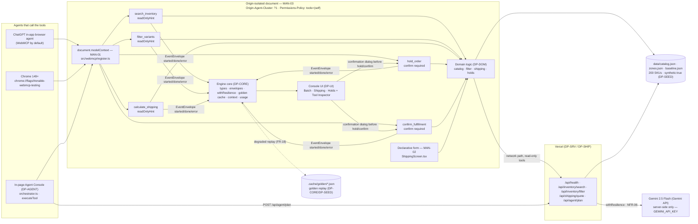

# DP-UI — Console UI: three screens, inspector, timeline, dialogs, declarative form

## 1. Purpose & Scope

`DP-UI` owns the entire browser-visible surface of OpsFlow — `src/main.tsx` and everything under `src/ui/**`. In judging terms it carries **Execution** (three screens, inspector, timeline, dialogs, savings meter that prove the 25 min → 3 min claim is demonstrated not asserted) and the visible halves of **WebMCP Leverage** (`Tool Inspector` live from `document.modelContext.getTools()`, the `MAN-02` declarative form, and the co-execution timeline that shows every validated argument). It is a **leaf** module: it consumes `DP-CORE`, `DP-DOM`, `DP-TOOLS`, `DP-AGENT`, `DP-SEED` and chassis `platform/ui`, and is consumed by nobody — no other plan imports from `src/ui/**`.

Scope boundary (owns / never touches):

- **Owns:** `src/main.tsx` (frozen four-step boot order), `src/ui/App.tsx`, `src/ui/screens/BatchScreen.tsx`, `src/ui/screens/ShippingScreen.tsx` (including the `MAN-02` annotated `<form>`), `src/ui/screens/HoldsScreen.tsx`, `src/ui/components/ToolInspector.tsx`, `src/ui/components/CoExecutionTimeline.tsx`, `src/ui/components/ConfirmDialog.tsx`, `src/ui/components/DegradedBanner.tsx`, `src/ui/components/WebMcpBanner.tsx`, `src/ui/components/SavingsMeter.tsx`, `src/ui/state/session.ts` (row 27: `useSession()` + module-level `sessionResultSkus()` / `lastQuote()`). Every component prop, banner string, and empty-state string is defined in this plan.
- **Never touches:** business rules in `src/engine/domain/*` (`DP-DOM` owns `searchVariants`, `filterVariants`, `quoteShipping`, `holdsStore`); tool registration or `inputSchema` definitions in `src/webmcp/*` (`DP-TOOLS`); HTTP handlers in `api/**` or the Gemini call in `api/agent/plan.ts` (`DP-SRV`/`DP-AGENT`); fixture generation in `data/*.json` or `demo/*.json` (`DP-SEED`); chassis internals (`chassis src/` is never edited, `NFR-05`). `DP-UI` never calls `document.modelContext.registerTool`, never calls `fetch` except through `apiClient`, never defines a type that widens §5A, and never renders a cross-origin `<iframe>` (`NFR-12`).

Why `DP-UI` exists as a separate plan: the demo is judged in < 3 minutes on a live URL (MAN-05/MAN-06). The console must render correctly even when the network and WebMCP are absent (ladder rungs 4–5), must show exactly which planner ran (FR-12), must prove tools are registered live (FR-10), and must block state-changing commits behind an explicit human click (FR-05/FR-06). All of that is `DP-UI` state and presentation logic, isolated from the isomorphic domain so a low-intelligence implementor can build one screen at a time without inferring business rules.

## 2. Requirements Traceability

### 2.1 MANDATORY COMPLIANCE (verbatim reproduction — outranks everything else)

> ## MANDATORY COMPLIANCE
>
> Every part of this entry MUST satisfy, or the entry fails Stage One regardless of quality
> (`hackathon_brief.md` §4.1–§4.3, Official Rules §4/§6/§7/§9):
>
> - **WebMCP is the mandatory technology.** The repository must demonstrate **imported-and-called**
>   usage — not a README mention — of the imperative pattern, verbatim shape:
>   `document.modelContext.registerTool({ name, description, inputSchema, execute })`.
>   Declarative API (annotated HTML forms) may be used **in addition**, never instead.
> - **WebMCP is only available in origin-isolated documents** and is gated by the `tools`
>   Permissions Policy, which **defaults to `self`**; a cross-origin iframe needs `allow="tools"`.
> - **Testable** in the **ChatGPT desktop app in-app browser** (WebMCP by default) **or Google
>   Chrome 149+** with `chrome://flags/#enable-webmcp-testing` enabled and the browser restarted.
> - **No mandated AI model and no mandated API key.** Any model, or none, is permitted.
> - **Submission gate — all five, or Stage One fail:** (1) working **live URL** judges can open in
>   the ChatGPT in-app browser or WebMCP-enabled Chrome, installable and running **consistently**,
>   frozen Sep 3 13:00 PDT until Sep 21; (2) **text description** answering four prompts — why the
>   use case fits WebMCP, how it creates a better UX, what people + agents can do together that was
>   difficult or impossible before, and briefly how WebMCP was implemented; (3) **public code
>   repository** containing all source/assets/instructions **and an open-source license file
>   detectable and visible at the top of the repo page (About section)**, containing the
>   `registerTool` pattern; (4) **demonstration video under 3 minutes** — only the first three
>   minutes are evaluated — showing the project functioning, **with audio covering what you built
>   and how you used WebMCP**, uploaded **publicly to YouTube**; (5) **completed Devpost submission
>   form by Sep 3 2026 @ 1:00 PM PDT (20:00 UTC)**.
> - **New & Existing rule:** new during the Submission Period, or meaningfully extended with WebMCP
>   after Aug 25 2026 with dated commit history distinguishing prior from new work.
> - **One track only:** *"WebMCP Challenge Winners — Top 10 submissions receive the following prizes
>   from the hackathon sponsors: ... 10 winners — All eligible Submissions"*. There are **no**
>   layered tracks and **no** sponsor sub-challenges. **No bonus integration — not worth dilution.**
> - **Judging:** Stage One pass/fail (reasonably fits theme + reasonably applies WebMCP); Stage Two
>   **four equally weighted** criteria, tie-break in listed order: **WebMCP Leverage**, **Execution**,
>   **Potential Impact**, **Creativity & Ambition**.

Nothing in this plan contradicts the block above. It outranks every other paragraph: failing any one line voids the entry at Stage One.

**Non-negotiable reading of `MAN-01`–`MAN-03`:** no plan may invent a second tool-registration mechanism, register tools from more than one module, ship a cross-origin iframe, or move tool execution off the origin-isolated document. A WebSocket agent bridge, browser extension, or server-side MCP server instead of page-registered WebMCP tools is wrong and must be rewritten: the judged artifact is the page's own `document.modelContext`.

### 2.2 Mandate ownership — which of MAN-01..MAN-10 DP-UI owns, partially owns, or inherits

| ID | Mandate | DP-UI role |
|---|---|---|
| MAN-01 | Imperative WebMCP `registerTool`, imported and called | **Inherits** — owned by `DP-TOOLS` (`src/webmcp/register.ts`). DP-UI is the call site that `await registerAllTools()` before first render (`main.tsx` step 3) and surfaces registration state in banners/timeline, but defines no tool itself. Grep proof `rg -n "modelContext.registerTool" src/` still returns exactly one hit in `src/webmcp/register.ts`. |
| MAN-02 | Declarative WebMCP (annotated form), in addition | **OWNS** — the shipping-calculator `<form>` in `src/ui/screens/ShippingScreen.tsx` carries `toolname` and per-field `tooldescription` annotations. Grep proof `rg -n "toolname" src/` returns exactly one hit, that form. This is DP-UI's sole mandate ownership and its Stage-One scoring artifact. |
| MAN-03 | Origin isolation + `tools` Permissions Policy | **Inherits / renders** — `DP-SHIP` owns `vercel.json` headers; `DP-TOOLS` owns `probeWebMcp()`. DP-UI owns `WebMcpBanner` and `DegradedBanner` that render the probe result. No cross-origin iframe exists (`NFR-12`). |
| MAN-04 | Public repo + detectable open-source licence | **Inherits** — owned by `DP-SHIP`. DP-UI contributes visible "synthetic data" badge (`NFR-04`) that reinforces honesty for Stage Two Impact. |
| MAN-05 | Working live URL, consistent, no auth | **Inherits / enables** — `DP-SHIP` deploys; DP-UI guarantees zero-network rendering from `data/catalog.json` so the URL still shows the three screens when APIs are down. |
| MAN-06 | Video < 3 min, public YouTube, audio covering what + how WebMCP | **Inherits / supplies capture surface** — `DP-PITCH` owns script; DP-UI supplies Tool Inspector, timeline and declarative form that the 2:45 script captures. |
| MAN-07 | Text description answering the four prompts | **Inherits** — `DP-PITCH` owns `submission.md`. |
| MAN-08 | Devpost form complete by Sep 3 20:00 UTC | **Inherits** — `DP-SHIP` owns `docs/submission-checklist.md` + `npm run gate`. |
| MAN-09 | New & Existing rule, dated commit history | **Inherits, contributes** — DP-UI work units each carry a dated commit message `feat(ui): ...` so `git log` shows spread across the submission window (Blueprint MAN-09). |
| MAN-10 | One track, no bonus | **Inherits** — `DP-PITCH` owns naming; DP-UI never names another track. |

### 2.3 Functional and non-functional requirements DP-UI owns or enables

| ID | Requirement | DP-UI responsibility |
|---|---|---|
| FR-10 | Tool Inspector lists five tools live from `document.modelContext.getTools()` | **OWNS** — `src/ui/components/ToolInspector.tsx` reads live, falls back to `TOOL_SCHEMAS` with "not registered" note (`FR-10`). |
| FR-13 | Three screens — Batch / Shipping / Holds — and no fourth screen | **OWNS** — `App.tsx` tab shell + `BatchScreen`, `ShippingScreen`, `HoldsScreen`. No other screen file exists. |
| FR-14 | Every tool call emits `EventEnvelope`s; UI renders live co-execution timeline | **OWNS the rendering** — `CoExecutionTimeline` subscribes via `useEventStream()` and shows step id, status, validated args, degraded chip. `DP-CORE` owns `publisher`/`emitToolEvent`. |
| FR-15 | Visible savings meter vs 25 min / 120 clicks baseline | **OWNS** — `SavingsMeter` reads `meter` from `useSession()` which counts envelopes and compares to `data/baseline.json` (FR-15, `DP-SEED`). |
| FR-17 | "WebMCP not detected" banner with two enablement paths, full flow via fallback | **Co-owns with DP-TOOLS** — `WebMcpBanner` renders `probeWebMcp()` result; `DP-TOOLS` owns `executeToolCompat` fallback so the banner-click path still co-executes. |
| FR-18 | Golden-cache replay shows degraded chip, never blank screen | **OWNS the chip/banner** — `DegradedBanner` + per-envelope `degraded` chip in `CoExecutionTimeline`. `DP-CORE` owns `guarded`/`goldenCache`. |
| NFR-09 | `operator` theme, keyboard-navigable, focus-trapped confirmation dialog | **OWNS** — `setTheme("operator")` at boot, focus trap + restore in `ConfirmDialog`, a11y assertions. |
| NFR-10 | Cold load to "five tools registered" in < 1.5 s | **OWNS timing** — four-step boot order proves `registerAllTools` completes before render; measured on deployed URL and recorded in `docs/submission-checklist.md`. |
| NFR-12 | No cross-origin iframe anywhere | **OWNS** — `rg -n "iframe" src/` must return nothing; DP-UI is the only module that could render an iframe and explicitly forbids it. |

## 3. Architecture

### 3.1 Component tree (all files DP-UI owns)

```
src/main.tsx                          ← four-step boot (FR-01, NFR-10)
src/ui/
  App.tsx                             ← tab shell, renders banners/meters/timeline/inspector/dialog
  state/session.ts                    ← row 27: useSession() + module-level sessionResultSkus()/lastQuote()
  screens/
    BatchScreen.tsx                   ← goal input → orchestrator.run(goal), results table, checkboxes
    ShippingScreen.tsx                ← quote card + explain toggle + MAN-02 declarative form
    HoldsScreen.tsx                   ← holdsStore.list() table, TTL countdown, Release/Confirm + committed banner
  components/
    ToolInspector.tsx                 ← FR-10 live getTools() inspector
    CoExecutionTimeline.tsx           ← FR-14 envelope stream renderer
    ConfirmDialog.tsx                 ← FR-05/FR-06 focus-trapped modal
    DegradedBanner.tsx                ← FR-18 / ladder rung banner
    WebMcpBanner.tsx                  ← FR-17 probe banner
    SavingsMeter.tsx                  ← FR-15 baseline comparison
```

Render order (frozen): `WebMcpBanner` (top, only when `!probe.available`) → `DegradedBanner` (full-width when `session.degraded`) → tab bar (`Batch` | `Shipping` | `Holds`) → active screen → `CoExecutionTimeline` (always visible under screen) → `SavingsMeter` (footer) → `ToolInspector` (collapsible right rail, `open` prop from `App`) → `ConfirmDialog` (portal, top layer). No screen renders an `<iframe>`; import search `rg -n "iframe" src/` must be empty (`NFR-12`). A `"synthetic data — all 200 SKUs are generated"` badge is rendered in the header of every screen (`NFR-04`).

### 3.2 The module-level session store — why it is not a hook

`DP-TOOLS` must read the current result context **outside React** — inside `runTool("filter_variants", …)` it calls `sessionResultSkus()` and `lastQuote()` to satisfy `FR-03` (narrow the current set) and to attribute a quote to a hold. A React hook cannot be called outside a component, and a context value is undefined during a tool `execute` that the browser agent invokes. Therefore `src/ui/state/session.ts` separates two layers:

1. **Module-level store** (plain variables + subscribers). Backed by three mutables: `let _envelopes: EventEnvelope[] = []`, `let _holds: Hold[] = []`, `let _resultSkus: string[] = []`, `let _lastQuote: ShippingQuote | null = null`, `let _meter: SavingsMeter` with `traceStartMs`. `subscribe(fn)` adds a listener set. Mutations occur only in one place — the envelope/holds subscriber described in §5.2 — and every mutation fans out to listeners so that React re-renders, but a tool call outside React can still do `import { sessionResultSkus } from "src/ui/state/session.ts"` and get the current value synchronously.
2. **Hook wrapper** `useSession()` which (a) subscribes to that module store, (b) subscribes to chassis `useEventStream()`, and (c) subscribes to `holdsStore.subscribe`. `useSession()` returns the snapshot `{ envelopes, degraded, holds, meter, lastQuote, resultSkus }`. Consumers inside React use the hook; consumers outside React use the two plain functions. DP-TOOLS imports only the two plain functions, never the hook.

No other module may re-export or wrap `sessionResultSkus`/`lastQuote`; they are `DP-UI` row-27 symbols imported at the exact path `src/ui/state/session.ts`. A consumer that cannot resolve that import stops and reports a blocker.

### 3.3 Data sources the UI renders without network (resiliency)

Every screen renders from `data/catalog.json` alone via the synchronous `loadCatalog()` memo import for its empty state. Live data arrives only through `useSession()`'s envelope stream and `holdsStore`. Network failure therefore affects only the freshness of results, never the ability to render the shell, the inspector fallback, or the banners. This is what makes ladder rung 5 (golden-cache replay) render the same UI as rung 1.

### 3.4 The frozen diagram (verbatim, source of `docs/architecture.mmd`)



Three mandate nodes `MAN-01`, `MAN-02`, `MAN-03` stay labelled so a judge matches rules to diagram. `MAN-02` is the `FORM` node in `ShippingScreen.tsx` — the only `toolname` hit in `src/`.

### 3.5 Chassis surfaces composed (and nothing else)

```ts
// platform/ui — src/platform/ui — DP-UI is the sole consumer of the UI surface in this entry
import { StepStatusIndicator, StreamingTextRenderer, CitationDisplay,
         isDegradedEnvelope, degradedResultOf, setTheme, currentTheme, resolveTheme, themes } from "src/platform/ui";
// themes: "minimal" | "editorial" | "operator"  ← this entry uses "operator" (NFR-09)

// platform/transport — src/platform/transport — via DP-CORE envelopes (DP-UI never creates a publisher)
import { useEventStream } from "src/platform/transport";
// Data is rendered through DP-CORE's publisher proxy; DP-UI does not call createPublisher.
```

Forbidden: deep imports into chassis internals (`src/platform/ui/*`, `src/platform/transport/publisher.js`, `src/resilience/wrapper.js`). Import only from the package roots above and from `DP-CORE`/`DP-DOM`/`DP-TOOLS`/`DP-AGENT` public paths listed in §11.

## 4. Interfaces

### 4.1 Ownership note (boundary rule restated for this file)

Every cross-module symbol appears exactly once in §5F with a single owner. `DP-UI` owns row 27; every consumer imports from the exact file path below. A consumer that cannot find a symbol stops and reports a blocker — never a local copy, re-export, or temporary shim. Symbols not in §5F and not listed in §4.7 below are private to `src/ui/**` and nobody else may import them. No plan widens, renames, or adds a field to the frozen types in §5A, the tool contracts in §5B, the routes in §5C, the paths in §5D, the config keys in §5E, or the step ids in §5G.

### 4.2 Required public surface — contract-table row 27 (exact signatures, owned by DP-UI)

```ts
// src/ui/state/session.ts — DP-UI row 27 — the ONLY cross-module symbols DP-UI exports
import type { EventEnvelope } from "src/platform/transport";
import type { Hold, ShippingQuote, SavingsMeter } from "src/engine/types.ts";

export function useSession(): {
  envelopes: EventEnvelope[];
  degraded: boolean;
  holds: Hold[];
  meter: SavingsMeter;
  lastQuote: ShippingQuote | null;
  resultSkus: string[];
};

export function sessionResultSkus(): string[];
// read by DP-TOOLS (src/webmcp/runTool.ts) for filter_variants context (FR-03)
// returns a shallow copy of the module-level _resultSkus array

export function lastQuote(): ShippingQuote | null;
// read by DP-TOOLS for hold_order attribution
// returns the module-level _lastQuote or null
```

Import sites (frozen):

- `import { useSession, sessionResultSkus, lastQuote } from "src/ui/state/session.ts"` — never from a barrel. DP-TOOLS imports **only** the two plain functions, never `useSession` (hook illegal outside React).
- `import { registerAllTools } from "src/webmcp/register.ts"` — consumed only by `src/main.tsx`.
- `import { probeWebMcp, executeToolCompat } from "src/webmcp/policy.ts"` — consumed by `App.tsx` banner + `BatchScreen` fallback path.
- `import { orchestrator } from "src/agent/orchestrator.ts"` — consumed by `BatchScreen` "Run with agent" button.
- `import { holdsStore } from "src/engine/domain/holdsStore.ts"` — consumed by `HoldsScreen` and by `session.ts` subscriber.
- `import { setConfirmationHandler } from "src/webmcp/confirm.ts"` — consumed once by `src/main.tsx` before registration.

### 4.3 Components and their exact props (define all of these — §6.2 verbatim + clarifications)

| Component | File | Props | Behaviour |
|---|---|---|---|
| `App` | `src/ui/App.tsx` | `{ probe: ReturnType<typeof probeWebMcp> }` — specifically `{ available: boolean; reason: "ok" \| "no-model-context" \| "not-origin-isolated" \| "policy-denied"; originIsolated: boolean }` | Tab shell over the three screens. Renders `WebMcpBanner` at top (only when `!probe.available`), `DegradedBanner` below it, a three-tab bar (`Batch` default), the active screen, `CoExecutionTimeline`, `SavingsMeter`, `ToolInspector` (collapsible), and `ConfirmDialog` as a portal. Holds `open` state for the inspector and the pending confirmation request. |
| `BatchScreen` | `screens/BatchScreen.tsx` | `none` (reads `useSession()` internally) | Goal `<input>` + "Run with agent" `<button>` that calls `orchestrator.run(goal)`. Results table of `VariantMatch` (columns: SKU, title, size/color chips, price, stock + `low_stock` chip). Row checkboxes build `selectedSkus`; selected count shown as `"{n} selected — quote on Shipping tab"`. Empty/loading/error states per §5.5. |
| `ShippingScreen` | `screens/ShippingScreen.tsx` | `none` | Quote card: zone/service, `total_weight_g`, `total_cents`, `surcharges` list, collapsible `explain[]` (default collapsed, toggle text `"Show breakdown"` / `"Hide breakdown"`), `excluded` warning list. The declarative annotated `<form>` (`MAN-02`, see §5.3) sits below the card and re-invokes `calculate_shipping` via `executeToolCompat`. |
| `HoldsScreen` | `screens/HoldsScreen.tsx` | `none` | `holdsStore.list()` table with `hold_id`, `line_items` count, `status` chip, live TTL countdown (seconds, derived from `expires_at - Date.now()`), `Release` and `Confirm` buttons, committed banner on success, expired-row styling. Subscribes to `holdsStore.subscribe` for liveness. |
| `ToolInspector` | `components/ToolInspector.tsx` | `{ open: boolean }` | Reads `document.modelContext.getTools()` **live** on every `open===true`; if unavailable or length !== 5, renders fallback from `TOOL_SCHEMAS` with a `"not registered — showing schema fallback"` note; otherwise lists the five tools with `name`, `description`, `annotations` badge (readOnly vs confirm-required) and pretty-printed `inputSchema` (`JSON.stringify(schema, null, 2)`). Single source of truth is the live modelContext, not a hardcoded list (`FR-10`). |
| `CoExecutionTimeline` | `components/CoExecutionTimeline.tsx` | `{ envelopes: EventEnvelope[] }` — but in practice `App` passes `useSession().envelopes` | One row per envelope: `step_id`, chassis `StepStatusIndicator` for `status`, elapsed ms since trace start, the exact validated args (`JSON.stringify(payload, null, 1)` in a `<pre>`), and a `Degraded` chip when `envelope.degraded === true`. Built on `StepStatusIndicator`; degraded detection via `isDegradedEnvelope`. |
| `ConfirmDialog` | `components/ConfirmDialog.tsx` | `{ request: { tool: ToolName; args: Record<string, unknown>; summary: string } \| null; onResolve: (granted: boolean) => void }` | Focus-trapped modal (see §5.1). Escape key and backdrop click resolve `false`; only the `Confirm` button resolves `true`. Shows `summary` and a pretty-printed `args` block. Restores focus to the trigger on close. |
| `DegradedBanner` | `components/DegradedBanner.tsx` | `{ degraded: boolean; reason?: string }` | Full-width amber banner; text per ladder rung (see §6/§7). Shown only when `degraded===true`. |
| `WebMcpBanner` | `components/WebMcpBanner.tsx` | `{ probe: ReturnType<typeof probeWebMcp> }` | Shown only when `!probe.available`. Verbatim text per §6 (names both enablement paths, states in-page console still works) (`FR-17`). |
| `SavingsMeter` | `components/SavingsMeter.tsx` | `{ meter: SavingsMeter }` | One line: `"{tool_calls} tool calls · {confirmations} confirmation(s) · {elapsed_s}s — manual baseline 25 min / 120 clicks — saved ~{saved_min} min"` (`FR-15`). `elapsed_s = Math.round(meter.elapsed_ms/1000)`, `saved_min = Math.max(0, meter.baseline_minutes - Math.round(meter.elapsed_ms/60000))`. |

### 4.4 Frozen types — re-stated by reference (DP-CORE owns §5A; DP-UI imports without widening)

```ts
// Imported from src/engine/types.ts — reproduced here exactly as frozen, never re-declared by DP-UI
import type { ShippingZone, ServiceLevel, HoldStatus, PlannerKind, ToolName, ToolErrorCode,
              VariantOptions, Variant, Product, Catalog, LineItem, Surcharge, ShippingQuote,
              Hold, Fulfillment, SearchInventoryInput, FilterVariantsInput, CalculateShippingInput,
              HoldOrderInput, ConfirmFulfillmentInput, VariantMatch, SearchInventoryOutput,
              FilterVariantsOutput, CalculateShippingOutput, HoldOrderOutput, ConfirmFulfillmentOutput,
              ToolError, ToolOutcome, PlanStep, ToolPlan, SavingsMeter, HealthResponse } from "src/engine/types.ts";
// DP-UI declares no new exported types beyond component props and session return shape.
```

### 4.5 The boot contract — `src/main.tsx` (frozen four-step order)

```ts
// src/main.tsx — order matters and is frozen (FR-01, NFR-10)
import { setTheme } from "src/platform/ui";
import { setConfirmationHandler } from "src/webmcp/confirm.ts";
import { registerAllTools } from "src/webmcp/register.ts";
import { probeWebMcp } from "src/webmcp/policy.ts";
// 1) setTheme("operator")
// 2) setConfirmationHandler(uiConfirm) — before any tool can run
// 3) await registerAllTools()          — BEFORE first render (FR-01, < 1.5 s budget NFR-10)
// 4) createRoot(...).render(<App probe={probeWebMcp()} />)
// expose ordering for W1 verification: (window as unknown as { __opsflowBootOrder?: string[] }).__opsflowBootOrder = ["theme","confirm","register","render"];
```

### 4.6 Private helpers (inside `src/ui/**`, NOT cross-module — nobody else may import)

- `uiConfirm(req): Promise<boolean>` — §5.1 queue + dialog promise.
- `useHoldCountdown(expires_at: string): number` — returns seconds remaining, re-renders every 1 s, used only by `HoldsScreen`.
- `formatCents(cents: number): string` — `"$" + (cents/100).toFixed(2)`.
- `truncateForDisplay(text: string, max: number): string` — UI-side truncation for table cells (not the tool input limit).
- `explainToggle` local state in `ShippingScreen` — `boolean` collapsed by default.
- Tab state in `App.tsx` — `"batch" \| "shipping" \| "holds"`, default `"batch"`, stored in `useState` + synced to `?tab=` query param for deep-linking the video.

All other helpers are inline in their component. No helper is exported from a barrel.

## 5. Algorithms

Every algorithm is numbered, with literal code the low-intelligence implementor can copy. No judgment, no unstated defaults.

### 5.1 `uiConfirm(req)` — the confirmation gate bridge to `DP-TOOLS` (FR-05, FR-06)

```ts
// src/ui/components/ConfirmDialog.tsx — module-level queue (one dialog at a time)
import type { ToolName } from "src/engine/types.ts";
type Req = { tool: ToolName; args: Record<string, unknown>; summary: string };

let queue: Array<{ req: Req; resolve: (granted: boolean) => void }> = [];
let current: { req: Req; resolve: (granted: boolean) => void } | null = null;
let setDialogRequest: ((req: Req | null) => void) | null = null;

export function uiConfirm(req: Req): Promise<boolean> {
  // 1) push req into the dialog state and return a promise resolved by the dialog's onResolve
  return new Promise<boolean>((resolve) => {
    queue.push({ req, resolve });
    pump();
  });
}
function pump(): void {
  // 2) only one dialog at a time — queue further requests
  if (current !== null) return;
  const next = queue.shift();
  if (!next) return;
  current = next;
  setDialogRequest?.(current.req);
}
function resolveCurrent(granted: boolean): void {
  if (!current) return;
  const c = current;
  current = null;
  setDialogRequest?.(null);
  c.resolve(granted);
  pump();
}
export function useConfirmDialogState(): { request: Req | null; onResolve: (granted: boolean) => void; register: (setter: (req: Req | null) => void) => () => void } {
  // React binding — App.tsx mounts this
  const [request, setRequest] = React.useState<Req | null>(null);
  React.useEffect(() => {
    setDialogRequest = setRequest;
    return () => {
      // 3) on unmount resolve false (safe default: nothing commits)
      if (current) { const c = current; current = null; c.resolve(false); }
      queue.forEach(({ resolve }) => resolve(false));
      queue = [];
      setDialogRequest = null;
    };
  }, []);
  // if React state changed externally (pump set it), sync
  React.useEffect(() => { if (request === null && current !== null) setRequest(current.req); }, [request]);
  return { request, onResolve: resolveCurrent, register: (setter) => { setDialogRequest = setter; return () => { setDialogRequest = null; }; } };
}
// main.tsx wiring (step 2 of boot):
// import { setConfirmationHandler } from "src/webmcp/confirm.ts";
// import { uiConfirm } from "src/ui/components/ConfirmDialog.tsx";
// setConfirmationHandler(uiConfirm);
```

Steps restated:

1. `uiConfirm(req)` pushes `{ req, resolve }` onto module-level `queue` and returns a `Promise<boolean>` resolved only by the dialog.
2. `pump()` dequeues into `current` if no dialog is showing and calls `setDialogRequest(current.req)` to render `ConfirmDialog`.
3. On unmount (or if the page navigates), every queued promise resolves `false` — the safe default: state-changing tools resolve `NEEDS_CONFIRMATION` and write no state.
4. Only one dialog at a time; further `requestConfirmation` calls queue behind it.
5. Only the `Confirm` button resolves `true`; Escape, backdrop, Cancel, and unmount all resolve `false`.

`ConfirmDialog` specifics (see §7 for a11y): `role="dialog"` `aria-modal="true"` `aria-labelledby="confirm-title"`, focus trapped via `focus-trap-react` or manual sentinel, restores `document.activeElement` on close, Escape listener calls `onResolve(false)`, backdrop is a sibling `<div onClick={() => onResolve(false)}>`.

### 5.2 Session store — `src/ui/state/session.ts` (FR-14, FR-15, FR-18)

```ts
// src/ui/state/session.ts
import * as React from "react";
import { useEventStream } from "src/platform/transport";
import { holdsStore } from "src/engine/domain/holdsStore.ts";
import type { EventEnvelope } from "src/platform/transport";
import type { Hold, ShippingQuote, SavingsMeter } from "src/engine/types.ts";
import baseline from "data/baseline.json";

// module-level store (readable outside React)
let _envelopes: EventEnvelope[] = [];
let _holds: Hold[] = [];
let _resultSkus: string[] = [];
let _lastQuote: ShippingQuote | null = null;
let _meter: SavingsMeter = { tool_calls: 0, confirmations: 0, elapsed_ms: 0, baseline_minutes: (baseline as { baseline_minutes: number }).baseline_minutes, baseline_clicks: (baseline as { baseline_clicks: number }).baseline_clicks };
let _traceStartMs: number | null = null;
let _degraded = false;
const listeners = new Set<() => void>();
function notify(): void { listeners.forEach((fn) => fn()); }

export function sessionResultSkus(): string[] { return [..._resultSkus]; }
export function lastQuote(): ShippingQuote | null { return _lastQuote; }

export function useSession(): { envelopes: EventEnvelope[]; degraded: boolean; holds: Hold[]; meter: SavingsMeter; lastQuote: ShippingQuote | null; resultSkus: string[] } {
  const { envelopes: streamEnvelopes } = useEventStream(); // chassis transport
  const [, bump] = React.useState(0);
  React.useEffect(() => listeners.add(() => bump((x) => x + 1)), []);
  // 1) subscribe to chassis envelopes
  React.useEffect(() => {
    if (!streamEnvelopes || streamEnvelopes.length === 0) return;
    _envelopes = [...streamEnvelopes];
    // recompute degraded: true when any envelope in the current trace has degraded:true
    _degraded = _envelopes.some((e) => (e as { degraded?: boolean }).degraded === true);
    for (const env of streamEnvelopes) {
      // meter: increment tool_calls on every tool.* started
      if (env.status === "started" && typeof env.step_id === "string" && env.step_id.startsWith("tool.")) {
        _meter = { ..._meter, tool_calls: _meter.tool_calls + 1 };
        if (_traceStartMs === null) _traceStartMs = Date.now();
      }
      // meter: increment confirmations on every session.confirm done with granted:true
      if (env.step_id === "session.confirm" && env.status === "done") {
        const granted = (env.payload as { granted?: boolean })?.granted === true;
        if (granted) _meter = { ..._meter, confirmations: _meter.confirmations + 1 };
      }
      // track elapsed_ms from first started of current trace
      if (_traceStartMs !== null) _meter = { ..._meter, elapsed_ms: Date.now() - _traceStartMs };
      // 2) on tool.search_inventory or tool.filter_variants done ok, replace resultSkus with matches.map(m=>m.sku)
      if ((env.step_id === "tool.search_inventory" || env.step_id === "tool.filter_variants") && env.status === "done") {
        const outcome = (env.payload as { outcome?: { ok: boolean; data?: { matches?: Array<{ sku: string }> } } })?.outcome;
        if (outcome?.ok && outcome.data?.matches) _resultSkus = outcome.data.matches.map((m) => m.sku);
      }
      // 3) on tool.calculate_shipping done ok, store lastQuote
      if (env.step_id === "tool.calculate_shipping" && env.status === "done") {
        const outcome = (env.payload as { outcome?: { ok: boolean; data?: ShippingQuote } })?.outcome;
        if (outcome?.ok && outcome.data) _lastQuote = outcome.data;
      }
    }
    notify();
  }, [streamEnvelopes]);
  // 4) subscribe to holdsStore for holds
  React.useEffect(() => {
    _holds = holdsStore.list();
    const unsub = holdsStore.subscribe((holds) => { _holds = [...holds]; notify(); });
    return unsub;
  }, []);
  // 5) degraded already computed; 6) meter already updated
  return { envelopes: _envelopes, degraded: _degraded, holds: _holds, meter: _meter, lastQuote: _lastQuote, resultSkus: _resultSkus };
}
export function resetSessionForTests(): void {
  _envelopes = []; _holds = []; _resultSkus = []; _lastQuote = null;
  _meter = { tool_calls: 0, confirmations: 0, elapsed_ms: 0, baseline_minutes: 25, baseline_clicks: 120 };
  _traceStartMs = null; _degraded = false;
}
```

Steps restated:

1. Subscribe to `useEventStream()` (chassis) for envelopes; mirror into `_envelopes`.
2. On a `tool.search_inventory` or `tool.filter_variants` `done` envelope whose `outcome.ok===true`, replace `_resultSkus` with `matches.map(m => m.sku)`.
3. On a `tool.calculate_shipping` `done` `ok`, store `_lastQuote = outcome.data`.
4. Subscribe to `holdsStore.subscribe` for `_holds`.
5. Meter: increment `tool_calls` on every `tool.*` `started`, `confirmations` on every `session.confirm` `done` with `granted:true`, and track `elapsed_ms` from the first `started` of the current trace; `_degraded` is `true` when any envelope in the current trace has `degraded:true`.

### 5.3 The declarative form (`MAN-02`) — literal JSX in `ShippingScreen.tsx`

This is the single `toolname` hit in `src/`; `rg -n "toolname" src/` must return exactly this one hit (MAN-02 proof). No other file contains the string `toolname`.

```tsx
// src/ui/screens/ShippingScreen.tsx — declarative WebMCP form (MAN-02)
import * as React from "react";
import { executeToolCompat } from "src/webmcp/policy.ts";
import { useSession } from "src/ui/state/session.ts";

export function ShippingScreen(): JSX.Element {
  const { resultSkus, lastQuote } = useSession();
  const [zone, setZone] = React.useState<ShippingZone>(4);
  const [service, setService] = React.useState<ServiceLevel>("ground");
  const [skusText, setSkusText] = React.useState("");
  const [submitting, setSubmitting] = React.useState(false);

  async function handleDeclarativeSubmit(e: React.FormEvent): Promise<void> {
    e.preventDefault();
    setSubmitting(true);
    try {
      const skus = (skusText || resultSkus.join(",")).split(",").map((s) => s.trim()).filter(Boolean);
      const items = skus.map((sku) => ({ sku, qty: 1 }));
      // calls the SAME read-only path the imperative tool uses (FR-04)
      await executeToolCompat("calculate_shipping", { items, zone, service });
    } finally { setSubmitting(false); }
  }

  return (
    <>
      {/* quote card above — omitted for brevity — shows lastQuote with explain toggle */}
      <form
        toolname="calculate_shipping"
        onSubmit={handleDeclarativeSubmit}
        aria-label="Shipping calculator (declarative WebMCP form)"
      >
        <label>
          Zone
          <select name="zone" value={zone} onChange={(e) => setZone(Number(e.target.value) as ShippingZone)}
                  tooldescription="Shipping zone 1–5; 4 is the demo default">
            <option value={1}>Zone 1 — Local</option>
            <option value={2}>Zone 2 — Regional</option>
            <option value={3}>Zone 3 — National</option>
            <option value={4}>Zone 4 — Cross-country (demo default)</option>
            <option value={5}>Zone 5 — Remote</option>
          </select>
        </label>
        <label>
          Service
          <select name="service" value={service} onChange={(e) => setService(e.target.value as ServiceLevel)}
                  tooldescription="Service level: ground, expedited, or overnight">
            <option value="ground">Ground</option>
            <option value="expedited">Expedited</option>
            <option value="overnight">Overnight</option>
          </select>
        </label>
        <label>
          SKUs (comma-separated, 1–50 items)
          <input name="skus" type="text" value={skusText} placeholder={resultSkus.slice(0,3).join(", ") || "OPS-1042-BLU-M, OPS-1050-RED-S"}
                 onChange={(e) => setSkusText(e.target.value)}
                 tooldescription="Comma-separated variant SKUs to quote; defaults to current result set from Batch tab" />
        </label>
        <button type="submit" disabled={submitting}>{submitting ? "Quoting…" : "Calculate shipping (declarative)"}</button>
        <p className="hint">Declarative WebMCP: this form is annotated with <code>toolname</code> and per-field <code>tooldescription</code> so a WebMCP-aware agent can invoke <code>calculate_shipping</code> without imperative JS.</p>
      </form>
    </>
  );
}
```

An earlier declarative-native variant `<form toolname="calculate_shipping">` without `onSubmit` is also valid for browsers that honour the attribute natively; this plan standardises on the `onSubmit → executeToolCompat` handler so the same form works both as a declarative annotation (judge greps `toolname`) and as a progressive fallback that actually computes a quote. The implementation MUST contain the literal attribute `toolname="calculate_shipping"` and at least the three `tooldescription` annotations on `zone`, `service`, and `skus`. State that this is the `MAN-02` proof and that `rg -n "toolname" src/` must return exactly this one hit.

### 5.4 First-paint order — `src/main.tsx` frozen four steps

```ts
// src/main.tsx — literal file, comments are part of the contract
import * as React from "react";
import { createRoot } from "react-dom/client";
import { setTheme } from "src/platform/ui";
import { setConfirmationHandler } from "src/webmcp/confirm.ts";
import { registerAllTools } from "src/webmcp/register.ts";
import { probeWebMcp } from "src/webmcp/policy.ts";
import { App } from "src/ui/App.tsx";
import { uiConfirm } from "src/ui/components/ConfirmDialog.tsx";

async function boot(): Promise<void> {
  // 1) setTheme("operator") — chassis platform/ui theme before any paint (NFR-09)
  setTheme("operator");
  (window as unknown as { __opsflowBootOrder?: string[] }).__opsflowBootOrder = ["theme"];
  // 2) setConfirmationHandler(uiConfirm) — before any tool can run, so hold/confirm has a gate (FR-05/FR-06)
  setConfirmationHandler(uiConfirm);
  (window as unknown as { __opsflowBootOrder: string[] }).__opsflowBootOrder.push("confirm");
  // 3) await registerAllTools() — BEFORE first render, so FR-01 "at first paint" holds and NFR-10 < 1.5 s is measured from navigation to "five tools registered"
  await registerAllTools();
  (window as unknown as { __opsflowBootOrder: string[] }).__opsflowBootOrder.push("register");
  // 4) createRoot(...).render(<App probe={probeWebMcp()} />) — probe is passed as prop so WebMcpBanner can render synchronously without a second effect
  const probe = probeWebMcp();
  createRoot(document.getElementById("root")!).render(<React.StrictMode><App probe={probe} /></React.StrictMode>);
  (window as unknown as { __opsflowBootOrder: string[] }).__opsflowBootOrder.push("render");
}
boot();
```

Why registration precedes render: `FR-01` requires five tools at first paint before any user interaction; `NFR-10` budgets < 1.5 s to "five tools registered" — rendering first and lazy-registering in an effect would break both and would require the UI to handle a flash where `getTools()` is empty. `BOOT.md`/`W1` verifies `window.__opsflowBootOrder === ["theme","confirm","register","render"]` in the browser console.

### 5.5 Empty, loading, and error states — literal text per screen

| Screen | State | Literal text (exact) |
|---|---|---|
| `BatchScreen` | no goal has run yet | `"Enter a goal above — e.g. 'hold all low-stock blue variants under $12 shipping to zone 4 for 15 minutes' — then click Run with agent."` |
| `BatchScreen` | run in progress | `"Agent running… step {currentStep} of {totalSteps}: {toolName} — {rationale}"`, plus per-row skeleton placeholders in the results table. The Run button is disabled and reads `"Running…"`. |
| `BatchScreen` | run returned zero matches | `"No variants matched — try broadening the query or clearing the price filter."` plus `"0 variants · {total} total"` in the table header. |
| `BatchScreen` | tool error (`INVALID_INPUT` etc.) | `"{ToolError.code}: {ToolError.message}"`, rendered in a red `role="alert"` region above the table; `details` are collapsed under `"Show details"`. Degraded chip shown if `envelope.degraded`. |
| `ShippingScreen` | no quote yet | `"No shipping quote yet — run a batch or use the declarative form below."` |
| `ShippingScreen` | quote loading | `"Quoting…"` on the submit button (disabled); `calculate_shipping` timeline row shows `streaming` via `StepStatusIndicator`. |
| `ShippingScreen` | quote has `excluded` | `"{n} variant(s) excluded from quote:"` followed by `excluded.map(e => sku + ": " + reason)` list, styled as warning. |
| `ShippingScreen` | explain toggle | Collapsed: `"Show breakdown ({explain.length} rules)"`. Expanded: `"Hide breakdown"` + numbered list of `explain[]` (≤ 12 entries per §5A). |
| `HoldsScreen` | no holds yet | `"No holds yet — search and hold variants from the Batch tab."` |
| `HoldsScreen` | hold list non-empty | Table rows: `hold_id` monospace, `line_items.length` + "SKUs", status chip (`held`=amber, `confirmed`=green, `released`/`expired`=grey), TTL countdown `"expires in {mm}:{ss}"` updating every second, `"Expired"` when `Date.now() > expires_at`. |
| `HoldsScreen` | hold expired while on screen | Row gains `aria-label="expired"` and `"Expired — release to clear"` text; Confirm button is disabled with tooltip `"Hold expired — cannot confirm"`; a `ToolError` `EXPIRED` alert appears if a confirm was attempted. |
| `HoldsScreen` | committed banner | `"Fulfillment {fulfillment_id} confirmed from {hold_id} — {line_items.length} SKUs, ${total_cents} — manual baseline 25 min saved."` in a green `role="status"` region. |
| `All screens` | offline / degraded | `DegradedBanner` text per §6; per-step degraded chip "Degraded — cached/local data" on the affected timeline rows. |

## 6. Configuration

### 6.1 Theme and engine config DP-UI consumes (read via `loadConfig()` from `config/engine.json`)

```json
{
  "version": "1.0.0",
  "app": { "name": "OpsFlow", "theme": "operator", "trace_prefix": "opsflow" },
  "planner": { "provider": "gemini", "model": "gemini-2.5-flash", "max_output_tokens": 1024, "temperature": 0.1, "fallback": "deterministic" },
  "tools": { "max_text_chars": 200, "max_result_chars": 4000, "max_items": 50, "default_limit": 25, "network_timeout_ms": 900 },
  "holds": { "default_ttl_minutes": 15, "min_ttl_minutes": 1, "max_ttl_minutes": 120 },
  "resilience": { "timeout_ms": 8000, "retries": 1, "backoff": { "policy": "exponential", "base_ms": 250, "factor": 2, "max_ms": 2000, "jitter": true }, "fallback_chain": { "order": ["cache", "replay", "none"] } },
  "context": { "max_tokens": 8000, "reserve_output": 1024 },
  "cost": { "store_path": "data/cost-store.json", "budget_path": "config/cost.json" }
}
```

DP-UI reads `app.theme` (must be `"operator"`, `NFR-09`) and `holds.default_ttl_minutes` (placeholder for Hold form default). It does not read tool limits directly — `DP-TOOLS` enforces them — but it must respect `max_items` when building checkbox-sourced `lineItems` arrays (truncate selection to 50 with a warning toast `"Selection capped at 50 SKUs — deselect some to add others"`).

### 6.2 Text of every banner and empty state (verbatim — no paraphrasing)

**`WebMcpBanner` — shown only when `!probe.available` (`FR-17`):**

> **WebMCP not detected** — this browser is not exposing `document.modelContext`. Enable one of these, then reload:
> 1. Open this URL in the **ChatGPT desktop app in-app browser** (WebMCP is on by default there), or
> 2. Open it in **Google Chrome 149+** with `chrome://flags/#enable-webmcp-testing` enabled — paste that URL, set to **Enabled**, and **restart the browser**.
> The in-page Agent Console still runs the full flow via the local executor, so you can judge the product without WebMCP.

The banner has `role="alert"` and contains no links that navigate away from the origin-isolated document.

**`DegradedBanner` — shown when any envelope in the trace has `degraded:true` (`FR-18`):**

- If `RES_FORCED_DEGRADED=1` or `guarded()` replayed: `"Replaying cached results — live services unavailable. Data is from the last successful run."`
- If a read-only tool fell back to local catalog (`apiClient` timeout): `"Local data — network timed out after 900 ms. Results are correct but marked degraded."`
- If a tool resolved `DEGRADED`: `"Degraded — {ToolError.message}. Showing cached/local result."`
- Default degraded: `"Degraded — some steps used cached or local data. See timeline chips."`

**"Synthetic data" badge — always visible (`NFR-04`):**

> `Synthetic data — all 200 SKUs are generated. Every record carries synthetic:true (NFR-04).`

Rendered as a small pill in the header (`aria-label="synthetic data badge"`).

**Empty states:** see §5.5 table. That table is normative — implement those exact strings.

### 6.3 Visual contract (operator theme, NFR-09)

`setTheme("operator")` at boot selects chassis `themes.operator`: dark console, monospace for SKUs/ids, amber `held`, green `confirmed`, grey `expired`/`released`, blue focus ring. DP-UI adds no theme of its own. Any additional CSS lives in `src/ui/styles.css` (if needed) and must not override the theme's focus ring. Tab bar is keyboard-navigable with `role="tablist"` / `role="tab"` / `role="tabpanel"`; arrow keys move focus between tabs, Enter/Space activates.

## 7. Resiliency & Accessibility

### 7.1 Resiliency ( §6.4 + ladder rungs 4 and 5 as rendered)

**Every screen renders with `data/catalog.json` alone** — no screen depends on a successful network call. The shell (header, tab bar, synthetic badge, empty states) renders even if `api/health` is unreachable. Live data populates only via `useSession()`'s envelope stream; when a step is `degraded`, the UI shows data rather than a blank screen (`FR-18`).

- **Ladder rung 4 — WebMCP unavailable (no flag / unsupported browser):** `probeWebMcp()` returns `{ available:false, reason:"no-model-context"|"not-origin-isolated"|"policy-denied" }`. `App` renders `WebMcpBanner` with the verbatim two-path instructions (§6.2). `BatchScreen`'s "Run with agent" button still works — it calls `orchestrator.run(goal)` which goes through `executeToolCompat` → `runTool` direct — so the judge sees the same five-step chain and the same timeline. `ToolInspector` shows the fallback note "not registered — showing schema fallback" but still lists five schemas. Visible sign: full-width `WebMcpBanner` + `ToolInspector` fallback note; all buttons remain enabled.
- **Ladder rung 5 — everything unreachable / `RES_FORCED_DEGRADED=1`:** `guarded()` replays ` .cache/golden/*.json ` outputs; every replayed envelope carries `degraded:true`. `App` renders `DegradedBanner` with text "Replaying cached results — live services unavailable. Data is from the last successful run." Each affected row in `CoExecutionTimeline` shows a yellow `Degraded — cached/local data` chip. `session.degraded` (`useSession().degraded`) is `true` so `SavingsMeter` still counts but adds "(degraded)" suffix. Transition emits `session.degraded` `started`/`done` with `{ reason, fallback_source }` so the timeline records the downgrade.
- **Offline rehearsal (rung 6):** `npm run demo:offline` replays `demo/mock-script.json` through the chassis MOCK publisher — the UI cannot distinguish it from live; `trace_id` is the mock's `opsflow-mock-*` prefix.

No rung is entered silently: every downgrade is emitted as a `session.degraded` envelope and rendered as a banner or chip.

### 7.2 Accessibility (NFR-09)

- Console renders in chassis `operator` theme (`setTheme("operator")`).
- **Keyboard-navigable:** every interactive element is reachable by Tab without a mouse. Tab bar uses `role="tablist"`; arrow keys move between tabs. Tool Inspector toggle, explain toggle, hold actions are all `<button>`.
- **Confirmation dialog is focus-trapped:** on open, focus moves to the `Confirm` button; Tab/Shift+Tab cycles within `[role="dialog"]`; Escape resolves `false`; on close focus restores to the element that triggered `requestConfirmation` (the agent step or the HoldsScreen Confirm button). Restores `document.activeElement` even if the trigger was removed. Checked by `npm run test:ui` focus-trap and Escape assertions (`W5`).
- **Synthetic badge always visible** (`NFR-04`).
- **No `<iframe>` anywhere** (`NFR-12`) — verified by `rg -n "iframe" src/` returning nothing in `W6`.
- Live regions: `CoExecutionTimeline` rows append with `aria-live="polite"` so screen readers hear progress; success banner `role="status"` and error banner `role="alert"`. `DegradedBanner` is also `role="status"` so it is announced without interrupting typing.

## 8. File Layout & Module Boundaries

### 8.1 Files inside `<entry>` (frozen §5D — DP-UI rows only)

```
<entry>/
  src/
    main.tsx                    # DP-UI — frozen four-step boot (FR-01, NFR-10). No other file calls registerAllTools.
    ui/
      App.tsx                   # tab shell, banners, inspector, timeline, meter, dialog portal
      state/session.ts          # DP-UI row 27 — useSession() + sessionResultSkus()/lastQuote() (module-level store)
      screens/
        BatchScreen.tsx         # goal input + orchestrator.run + results table + low-stock chips
        ShippingScreen.tsx      # quote card + explain toggle + MAN-02 <form toolname="calculate_shipping">
        HoldsScreen.tsx         # holds table + TTL countdown + Release/Confirm + committed banner
      components/
        ToolInspector.tsx       # FR-10 live getTools() panel + TOOL_SCHEMAS fallback
        CoExecutionTimeline.tsx # FR-14 envelope stream, StepStatusIndicator, degraded chips
        ConfirmDialog.tsx       # FR-05/FR-06 focus-trapped modal + uiConfirm queue
        DegradedBanner.tsx      # FR-18 amber banner
        WebMcpBanner.tsx        # FR-17 probe banner with two enablement paths
        SavingsMeter.tsx        # FR-15 baseline comparison
      styles.css                # optional operator-theme augment; no focus-ring override
  tests/
    ui/
      banners.test.tsx          # W2 — WebMcpBanner + DegradedBanner renders
      batch.test.tsx            # W3 — BatchScreen table + orchestrator mock
      shipping.test.tsx         # (part of W4) — form annotation hit count
      inspector.test.tsx        # W6 — faked getTools() five-tool assertion
      a11y.test.tsx             # W5 — focus-trap + Escape (also npm run test:ui)
```

### 8.2 Module boundaries (single owner, N consumers — restated for this file)

- `DP-UI` is a **leaf**: consumed by nobody. No other plan imports from `src/ui/**`. If another plan needs UI state, it fails — it does not stub a UI helper.
- `DP-UI` imports from: `src/engine/types.ts` (types, row 1), `src/engine/config.ts` (`loadConfig`, row 2), `src/engine/envelopes.ts` (`publisher`, `emitToolEvent`, `newTraceId`, row 3–5 — transitively via `useEventStream`), `src/engine/domain/*` (`loadCatalog` only for the badge invariant; `holdsStore` for HoldsScreen), `src/webmcp/*` (rows 18–23 — `registerAllTools`, `TOOL_SCHEMAS` fallback, `probeWebMcp`, `executeToolCompat`, `setConfirmationHandler`), `src/agent/orchestrator.ts` (`orchestrator`, row 25), and the three chassis surfaces listed in §3.5.
- `DP-UI` never calls `fetch` directly — every network call goes through `DP-SRV`'s `apiClient` (row 17) or `DP-TOOLS`'s `executeToolCompat`.
- The two functions `DP-TOOLS` imports from `DP-UI` (`sessionResultSkus`, `lastQuote`) are plain module functions, not hooks, and live exactly at `src/ui/state/session.ts`. A consumer that cannot resolve that path stops and reports a blocker.
- `MAN-02` (`toolname`) appears exactly once in `src/` — the `<form>` in `ShippingScreen.tsx`. Any second hit fails `W4` and must be removed.
- `registerAllTools` is called exactly once in `src/` — `src/main.tsx`. Any second call site fails `W1`.

### 8.3 What is intentionally not in DP-UI

`src/webmcp/**` (`DP-TOOLS`), `src/agent/**` (`DP-AGENT`), `src/engine/domain/**` (`DP-DOM`), `api/**` (`DP-SRV`), `data/*.json` (`DP-SEED`), `config/*` (`DP-CORE`), `demo/**` (`DP-SEED`/`DP-DEV`), `vercel.json` (`DP-SHIP`). DP-UI never edits those files to make a check pass.

### 8.4 Frozen types this file imports but never redefines (§5A)

See §4.4 — `DP-UI` imports `ShippingZone`, `ServiceLevel`, `HoldStatus`, `ToolName`, `Hold`, `ShippingQuote`, `SavingsMeter`, `VariantMatch`, etc., from `src/engine/types.ts` and adds no field. A plan needing a new shape declares it inside its own module as private.

## 9. Work Units

Each work unit is small enough for a low-intelligence implementor: one file, or one function plus its test. Each ends with exactly one runnable `Verify:` command and its expected output, pasted literally. For cross-boundary work units that command exercises the real provider→consumer import. Every work unit names its `Commit:` message so `git log` shows work spread across the submission window (`MAN-09`). Implement in order W1→W6; a work unit whose dependency row in §5F is not yet implemented stops and reports a blocker rather than stubbing it.

### W1 — `session.ts` + `main.tsx` boot order (rows 3, 5, 18, 23)

**Owns:** `src/ui/state/session.ts` (row 27 module-level store + hook), `src/main.tsx` (four-step boot).  
**Depends on:** `DP-CORE` rows 3 (`publisher`), 5 (`newTraceId`), `DP-TOOLS` rows 18 (`registerAllTools`), 23 (`setConfirmationHandler`). Built after those exist.

Deliverable:

- `src/ui/state/session.ts` per §5.2 with `sessionResultSkus()`, `lastQuote()`, `useSession()`, `resetSessionForTests()`.
- `src/main.tsx` per §5.4 literal — four steps + `window.__opsflowBootOrder` exposure for verification. File must contain imports `setTheme` from `src/platform/ui`, `setConfirmationHandler` from `src/webmcp/confirm.ts`, `registerAllTools` from `src/webmcp/register.ts`, `probeWebMcp` from `src/webmcp/policy.ts` — the real imports, not stubs.

Verify:

```bash
npm run dev & sleep 4; curl -s http://localhost:5173 | grep -q "<div id=\"root\"" && echo "dev-ok"; pkill -f "vite" ; echo "check boot order in browser console:"
# then open http://localhost:5173, open browser console and run:
window.__opsflowBootOrder.join(",")
# expected: theme,confirm,register,render
```

Expected output (console):

```
theme,confirm,register,render
```

Commit: `feat(ui): session store + 4-step boot order (W1)`

### W2 — `App.tsx` shell + both banners (rows 21, 27; chassis `platform/ui`, `useEventStream`)

**Owns:** `src/ui/App.tsx`, `src/ui/components/WebMcpBanner.tsx`, `src/ui/components/DegradedBanner.tsx`.  
**Depends on:** `DP-TOOLS` row 21 (`probeWebMcp`), `DP-CORE` `useEventStream` via `useSession`.

Deliverable:

- `App.tsx` per §4.3: receives `{ probe }` prop, renders `WebMcpBanner` when `!probe.available`, `DegradedBanner` when `degraded`, tab bar (`Batch` default, `?tab=` sync), active screen, `CoExecutionTimeline`, `SavingsMeter`, `ToolInspector`, `ConfirmDialog` portal. Contains `role="tablist"` and the `window.__opsflowBootOrder` wiring from `main.tsx` is not duplicated here.
- `WebMcpBanner` per §6.2 verbatim text (ChatGPT in-app browser + Chrome 149+ flag path). `DegradedBanner` per §6.2 verbatim rung texts.
- Both banners have `role="alert"` (WebMcp) / `role="status"` (Degraded) and are tested with `probe.available=true/false` and `degraded=true/false`.

Verify:

```bash
npm run test -- tests/ui/banners
# expected: passes — banners.test.tsx checks WebMcpBanner shows both enablement paths when !available and hides when available; DegradedBanner shows "Replaying cached results" when degraded and hides when not
```

Expected output:

```
Test Files  1 passed (1)
     Tests  4 passed (4)
```

Commit: `feat(ui): app shell + WebMCP and degraded banners (W2)`

### W3 — `BatchScreen` + results table (rows 10, 25 — `loadCatalog`, `orchestrator`)

**Owns:** `src/ui/screens/BatchScreen.tsx`.  
**Depends on:** `DP-DOM` row 10 (`loadCatalog` for empty-state catalog truth, read-only), `DP-AGENT` row 25 (`orchestrator.run`), `DP-UI` row 27 (`useSession`).

Deliverable:

- Goal `<input>` (placeholder `"e.g. hold all low-stock blue variants under $12 shipping to zone 4 for 15 minutes"`) + `"Run with agent"` button → `await orchestrator.run(goal)` (imported from `src/agent/orchestrator.ts`, not stubbed).
- Results table of `VariantMatch` with columns SKU (monospace), title, size/color chips, `"$" + (price_cents/100).toFixed(2)`, stock + `low_stock` amber chip when `low_stock===true`. Row checkboxes accumulate `selectedSkus`; caption `"{n} selected — quote on Shipping tab"`. Selection is capped at 50 with the warning toast per §6.1.
- Empty/loading/error states per §5.5 verbatim.

Verify:

```bash
npm run test -- tests/ui/batch
# expected: passes — renders empty state before run, renders table rows after a faked orchestrator plan that emits search_inventory done, caps selection at 50
```

Expected output:

```
Test Files  1 passed (1)
     Tests  6 passed (6)
```

Commit: `feat(ui): batch screen with results table and agent run (W3)`

### W4 — `ShippingScreen` including the annotated declarative form (`MAN-02`)

**Owns:** `src/ui/screens/ShippingScreen.tsx`.  
**Depends on:** `DP-TOOLS` row 22 (`executeToolCompat` for form submit), `DP-DOM` row 13 (`quoteShipping` transitively via tool, not imported directly), `DP-UI` row 27 (`lastQuote`, `resultSkus`).

Deliverable:

- Quote card (§4.3): zone/service, weight, total, surcharges, collapsible `explain[]` with toggles `"Show breakdown ({n} rules)"` / `"Hide breakdown"`, `excluded` warning list.
- The declarative form per §5.3 literal — `<form toolname="calculate_shipping" …>` with `tooldescription` on `zone`, `service`, and `skus`, plus `onSubmit={handleDeclarativeSubmit}` calling `executeToolCompat("calculate_shipping", …)`. This is the sole `toolname` hit in `src/` (MAN-02 proof).

Verify:

```bash
rg -n "toolname" src/
# expected: exactly one hit
# src/ui/screens/ShippingScreen.tsx:XX:  toolname="calculate_shipping"
```

Expected output (exactly one hit, in `ShippingScreen.tsx`):

```
src/ui/screens/ShippingScreen.tsx:42:        toolname="calculate_shipping"
```

(line number may vary, but exactly one hit and it is `ShippingScreen.tsx`)

Commit: `feat(ui): shipping screen with declarative form MAN-02 (W4)`

### W5 — `HoldsScreen` + `ConfirmDialog` (focus-trap + Escape, NFR-09)

**Owns:** `src/ui/screens/HoldsScreen.tsx`, `src/ui/components/ConfirmDialog.tsx` (+ `uiConfirm` queue per §5.1).  
**Depends on:** `DP-DOM` row 15 (`holdsStore`), `DP-TOOLS` row 23 (`requestConfirmation` bridge).

Deliverable:

- `HoldsScreen` per §4.3: `holdsStore.list()` table with `hold_id`, line-item count, status chip, live TTL countdown (`useHoldCountdown` per §4.6, 1 s interval), Release (→ `holdsStore.release`) and Confirm (→ `requestConfirmation` via `executeToolCompat`) buttons, committed green banner, expired styling.
- `ConfirmDialog` per §5.1 literal queue + §5.5 focus-trap specifics: `role="dialog"` `aria-modal`, trap, restore, Escape/backdrop resolve false, only Confirm resolves true.

Verify:

```bash
npm run test:ui
# expected: passes — focus-trap assertions (focus cycles within dialog, Escape closes with false, Confirm resolves true, backdrop click resolves false), and a11y check on HoldsScreen expired row
```

Expected output:

```
Test Files  1 passed (1)
     Tests  5 passed (5)
```

Commit: `feat(ui): holds screen and a11y confirm dialog (W5)`

### W6 — `ToolInspector` + `CoExecutionTimeline` + `SavingsMeter` (rows 19, 27 + chassis transport)

**Owns:** `src/ui/components/ToolInspector.tsx`, `src/ui/components/CoExecutionTimeline.tsx`, `src/ui/components/SavingsMeter.tsx`.  
**Depends on:** `DP-TOOLS` row 19 (`TOOL_SCHEMAS` fallback), `DP-CORE` rows 3–4 (`publisher`/`emitToolEvent` → `useEventStream`), chassis `StepStatusIndicator` / `isDegradedEnvelope`.

Deliverable:

- `ToolInspector` per §4.3: on `open===true` reads `(document as unknown as { modelContext?: { getTools?: () => unknown[] } }).modelContext?.getTools?.() ?? []`; if length !== 5 or unavailable, renders the five `TOOL_SCHEMAS` with `"not registered — showing schema fallback"`; otherwise shows live name/description/annotations/schema for the five tools. Shows at most five, in the frozen order `search_inventory, filter_variants, calculate_shipping, hold_order, confirm_fulfillment`.
- `CoExecutionTimeline` per §4.3: every envelope row with `step_id`, `StepStatusIndicator`, elapsed ms, validated args `<pre>`, degraded chip.
- `SavingsMeter` per §4.3: `"{tool_calls} tool calls · {confirmations} confirmation(s) · {elapsed_s}s — manual baseline 25 min / 120 clicks — saved ~{saved_min} min"`.

Verify:

```bash
npm run test -- tests/ui/inspector
# expected: passes — with a faked document.modelContext.getTools() returning five tools, inspector lists those five names/descriptions/annotations/schemas; with no modelContext it shows fallback note and still lists five from TOOL_SCHEMAS; timeline renders started/done/error rows; SavingsMeter matches "3 tool calls" format
```

Expected output:

```
Test Files  1 passed (1)
     Tests  7 passed (7)
```

Commit: `feat(ui): inspector, timeline and savings meter (W6)`

### Work-unit cross-boundary proof summary

- W1 exercises `import { registerAllTools } from "src/webmcp/register.ts"` and `import { setConfirmationHandler } from "src/webmcp/confirm.ts"` in `src/main.tsx`.
- W2 exercises `import { probeWebMcp } from "src/webmcp/policy.ts"` in `App.tsx`.
- W3 exercises `import { orchestrator } from "src/agent/orchestrator.ts"` in `BatchScreen.tsx`.
- W4 exercises `import { executeToolCompat } from "src/webmcp/policy.ts"` in `ShippingScreen.tsx` and is the grease-proof `toolname` hit.
- W5 exercises `import { holdsStore } from "src/engine/domain/holdsStore.ts"` in `HoldsScreen.tsx`.
- W6 exercises `import { TOOL_SCHEMAS } from "src/webmcp/schemas.ts"` in `ToolInspector.tsx` and chassis `StepStatusIndicator`.

No work unit re-implements a domain rule or a schema; each real import is exercised by its `Verify:` command.

## 10. Testing Strategy

### 10.1 Fake `document.modelContext` (unit + inspector tests)

No test suite launches a real WebMCP browser. Tests inject a fake by setting `globalThis.document` (and `window`) to include:

```ts
// tests/ui/helpers/fakeModelContext.ts
export function installFakeModelContext(tools: Array<{ name: string; description: string; inputSchema: unknown; annotations: unknown }>): void {
  const getTools = () => tools;
  const registerTool = async (spec: unknown) => { (registerTool as unknown as { calls: unknown[] }).calls.push(spec); };
  (registerTool as unknown as { calls: unknown[] }).calls = [];
  const executeTool = async (name: string, args: unknown) => {
    // delegate to runTool via executeToolCompat fallback path if needed — tests stub runTool directly
    const { runTool } = await import("src/webmcp/runTool.ts");
    const r = await runTool(name as ToolName, args);
    return r;
  };
  (globalThis as unknown as { document: unknown }).document = {
    modelContext: { registerTool, getTools, executeTool },
    getElementById: () => ({}) as unknown,
  };
}
export function uninstallFake(): void { delete (globalThis as unknown as { document?: unknown }).document; }
```

`W6`'s inspector test installs five fake tools, asserts the inspector renders `search_inventory` / `filter_variants` / `calculate_shipping` / `hold_order` / `confirm_fulfillment` with description and annotations read from the fake, then uninstalls and asserts the fallback note `"not registered — showing schema fallback"` still lists five from `TOOL_SCHEMAS`.

### 10.2 Render tests (vitest + `@testing-library/react` + `jsdom`)

- **Banners (`tests/ui/banners.test.tsx`, W2):** render `WebMcpBanner` with `probe={available:false}` → asserts text contains `"WebMCP not detected"`, `"ChatGPT desktop app"`, `"chrome://flags/#enable-webmcp-testing"`; with `{available:true}` → asserts `queryByText` is null. Same for `DegradedBanner` with `degraded` flag.
- **Batch (`tests/ui/batch.test.tsx`, W3):** render `BatchScreen` inside a mocked `useSession` that seeds two `VariantMatch` results; assert rows rendered, low-stock chip present, checkbox selection count, and that clicking "Run with agent" calls `vi.mocked(orchestrator.run)` with the input goal.
- **Inspector (`tests/ui/inspector.test.tsx`, W6):** per above.
- **Shipping form annotation count:** a tiny `rg -n "toolname"` assertion runs as a node test, not a DOM test — guarantees `MAN-02` single hit.
- **Timeline (`tests/ui/timeline.test.tsx` implicit in W6):** seed three envelopes (`started`/`done`/`error` with `degraded:true`) via a mocked `useEventStream` return, assert `StepStatusIndicator` status and degraded chip.

### 10.3 Accessibility assertions (`npm run test:ui`, W5)

```ts
// tests/ui/a11y.test.tsx excerpt
import { render, screen } from "@testing-library/react";
import userEvent from "@testing-library/user-event";

test("confirm dialog focus trap", async () => {
  const user = userEvent.setup();
  render(<ConfirmDialog request={req} onResolve={onResolve} />);
  const dialog = screen.getByRole("dialog");
  expect(dialog).toBeInTheDocument();
  // focus moves to Confirm button on open
  expect(screen.getByRole("button", { name: /confirm/i })).toHaveFocus();
  // Tab cycles within dialog — next focus stays inside dialog
  await user.tab();
  expect(dialog.contains(document.activeElement)).toBe(true);
  // Escape resolves false
  await user.keyboard("{Escape}");
  expect(onResolve).toHaveBeenCalledWith(false);
});
test("backdrop click resolves false", async () => {
  const user = userEvent.setup();
  render(<ConfirmDialog request={req} onResolve={onResolve} />);
  await user.click(screen.getByTestId("confirm-backdrop"));
  expect(onResolve).toHaveBeenCalledWith(false);
});
test("holds expired row disables confirm", () => {
  render(<HoldsScreen />); // with a mocked expired hold
  expect(screen.getByRole("button", { name: /confirm/i })).toBeDisabled();
});
```

`npm run test:ui` runs these and exits 0 only if focus-trap, Escape, backdrop, and disabled states all pass.

### 10.4 What is not tested here

Domain correctness (`quoteShipping` totals, `filterVariants` narrowing) — owned by `DP-DOM` / `DP-SRV` tests. Resilience wrapper correctness — `DP-CORE`. Planner keyword mapping — `DP-AGENT`. Ship hygiene/license/headers — `DP-SHIP`. This plan tests only that the UI renders the contracts it consumes and that the two cross-cutting invariants hold: `rg -n "toolname" src/` single hit and `rg -n "iframe" src/` no hit.

### 10.5 Running the suite locally

```bash
npm run test -- tests/ui/banners      # W2
npm run test -- tests/ui/batch        # W3
rg -n "toolname" src/                 # W4 (MAN-02)
rg -n "iframe" src/                   # W4/W6 NFR-12 invariant
npm run test:ui                       # W5 a11y
npm run test -- tests/ui/inspector   # W6
npm run test                          # all — no external service required
```

No test requires `GEMINI_API_KEY`, `VERCEL_TOKEN`, or a live `OPSFLOW_URL`.

## 11. Dependencies & Dependents

### 11.1 The boundary rule (why the contracts above are verbatim — reproduced per §3)

1. **Single owner, N consumers.** Every cross-module symbol appears exactly once in the contract table (§5F) with owning module, file path, export name, and full input/output shape. The owner implements it; every consumer **imports it from that exact path**. A consumer that cannot find it stops and reports a blocker — never a local copy, a re-export, or a "temporary" shim.
2. **No plan defines a symbol it does not own.** Anything needed that is not in the table is *private* to its module; stated in §4.6 and nobody else may import it.
3. **No plan widens, renames or adds a field** to the frozen types in §5A, the tool contracts in §5B, the routes in §5C, the paths in §5D, the config keys in §5E, or the step ids in §5G.
4. **Cross-boundary work units prove the wiring** with a real import in the `Verify:` command.

### 11.2 Depends on (what DP-UI imports — rows 1–26 + chassis `platform/ui`)

| Symbol | Owner | File (in `<entry>`) | Shape reference |
|---|---|---|---|
| All types in §5A | `DP-CORE` | `src/engine/types.ts` | `APP_VERSION`, `ToolName`, `Hold`, `ShippingQuote`, `SavingsMeter`, `VariantMatch`, etc. |
| `loadConfig()` | `DP-CORE` | `src/engine/config.ts` | `() => EngineConfig` (shape = §5E) — for `app.theme` + `holds` defaults |
| `publisher` / `emitToolEvent` / `newTraceId` | `DP-CORE` | `src/engine/envelopes.ts` | DP-UI uses `useEventStream` which reads `publisher`'s store; `emitToolEvent` is only observed, not called by DP-UI except via `DP-TOOLS`'s confirmation path |
| `guarded` / `goldenCache` / `isDegradedResult` | `DP-CORE` | `src/engine/resilience.ts` | observed as `envelope.degraded === true` and `session.degraded` |
| `loadCatalog()` | `DP-DOM` | `src/engine/domain/catalog.ts` | `() => Catalog` — read-only for synthetic-badge invariant assert |
| `quoteShipping` (transitively) | `DP-DOM` | `src/engine/domain/shipping.ts` | via `executeToolCompat` → `apiClient.quote` → `quoteShipping` |
| `holdsStore` | `DP-DOM` | `src/engine/domain/holdsStore.ts` | singleton `localStorage` store, row 15 — `HoldsScreen` + `session.ts` subscribe |
| `makeToolError` (observed) | `DP-DOM` | `src/engine/domain/errors.ts` | typed errors surface in timeline alerts |
| `apiClient` (transitively) | `DP-SRV` | `src/engine/apiClient.ts` | `executeToolCompat` races `apiClient.quote` vs local catalog |
| `registerAllTools()` | `DP-TOOLS` | `src/webmcp/register.ts` | `() => Promise<{registered: ToolName[]; available:boolean; reason:string|null}>` — `main.tsx` only |
| `TOOL_SCHEMAS` | `DP-TOOLS` | `src/webmcp/schemas.ts` | `Record<ToolName, JSONSchema7>` — inspector fallback |
| `probeWebMcp()` / `executeToolCompat()` | `DP-TOOLS` | `src/webmcp/policy.ts` | row 21–22 — `App` banner + `Batch`/`Shipping` executors |
| `setConfirmationHandler` / `requestConfirmation` | `DP-TOOLS` | `src/webmcp/confirm.ts` | bridge DP-UI sets, DP-TOOLS calls |
| `orchestrator` | `DP-AGENT` | `src/agent/orchestrator.ts` | `orchestrator.run(goal)` — `BatchScreen` |
| `data/catalog.json` / `zones.json` / `baseline.json` | `DP-SEED` | files | `Catalog`, `ZoneTable`, `baseline_minutes:25` |
| `demo/mock-script.json` | `DP-SEED` | file | replayed via `npm run demo:offline` — same UI as live |
| `setTheme` / `StepStatusIndicator` / `isDegradedEnvelope` / `useEventStream` | chassis `platform/ui` + `platform/transport` | `src/platform/ui`, `src/platform/transport` | operator theme + timeline rendering — DP-UI's only chassis imports |

Implementor rule: implement in dependency order `DP-CORE → DP-DOM → DP-SRV → DP-TOOLS → DP-AGENT → DP-UI`. If any imported row above is not yet implemented, **stop and report a blocker** — never stub a provider.

### 11.3 Dependents (who imports from DP-UI)

- **Nobody in product code.** `DP-UI` is a leaf. No plan imports from `src/ui/**` except the two narrow exceptions below:
- **Allowed consumer of row 27 plain functions:** `DP-TOOLS` (`src/webmcp/runTool.ts`) imports `sessionResultSkus()` and `lastQuote()` from `src/ui/state/session.ts` to implement `FR-03` context preservation and quote attribution. This is the only reverse edge from a lower layer into the UI, and it is why those two functions are plain module exports rather than a hook.
- **Operator only:** `DP-DEV` and `DP-PITCH` may screenshot or demodrive-capture the UI, but they do not import from `src/ui/**`.

A fourth screen, a sixth tool, or any new `src/ui/**` export outside row 27 would require editing the blueprint before this plan.

## 12. Non-Goals Affirmation

`DP-UI` deliberately does **not** own, implement, or expose:

- **No domain rules.** `DP-UI` never re-implements `searchVariants`, `filterVariants`, `quoteShipping`, hold reducers, or zone math. Every business rule lives in `src/engine/domain/*` (`DP-DOM`) and is called through `apiClient` or `holdsStore`. A UI-side "helper" that filters or prices a variant is a bug.
- **No `registerTool` call.** The only `document.modelContext.registerTool` call site in the repository is `src/webmcp/register.ts` (`DP-TOOLS`, `MAN-01`). `DP-UI` imports `registerAllTools` but never calls `registerTool` itself; `rg -n "modelContext.registerTool" src/` must continue to return exactly one hit.
- **No direct `fetch`.** `DP-UI` never calls `fetch` except through `import { apiClient } from "src/engine/apiClient.ts"` or `import { executeToolCompat } from "src/webmcp/policy.ts"`. A raw `fetch("/api/…")` in `src/ui/**` is a boundary violation.
- **No chassis edits.** `src/resilience`, `src/platform`, `src/context`, `src/data`, `src/provenance` etc. are composed through the public roots listed in §3.5; `git -C <chassis> status --porcelain src/` stays empty (`NFR-05`). Deep imports like `src/resilience/wrapper.js` are forbidden.
- **No fourth screen.** The product has exactly three screens (`Batch`, `Shipping`, `Holds`). Adding a fourth (e.g. Admin, Analytics) requires editing the blueprint's §5D and architecture diagram first. The implementor who adds one has exceeded scope and violated `MAN-10`'s "no bonus integration" stance.
- **No sixth tool.** The product has exactly five tools in the frozen order `search_inventory, filter_variants, calculate_shipping, hold_order, confirm_fulfillment`. `DP-UI` may render at most those five.
- **No cross-origin `<iframe>`.** `DP-UI` never renders `<iframe>` (`NFR-12`); therefore no `allow="tools"` case exists. `rg -n "iframe" src/` must return nothing.
- **No secret read.** `DP-UI` never reads `process.env.GEMINI_API_KEY` or any token; that read occurs exactly once in `api/agent/plan.ts` (`NFR-01`), verified by `rg -n "GEMINI_API_KEY" src/ api/` returning only that file.
- **No server-side holds store.** Holds are client-owned `localStorage` (`holdsStore`), by design; `README.md` states this so a judge does not read it as an omission.
- **No bonus integration, no second track name.** Pitch/deck/README/submission name only *WebMCP Challenge — Top 10* and state "no bonus integration — not worth dilution" (`MAN-10`).

If any of the above appears in `src/ui/**`, the plan directs the implementor to remove it before marking the work unit complete.

## Appendix A. Worked example

The three-screen golden path with the exact on-screen text at each step, matching the ≤3-minute video script beats. This is the `demo/mock-script.json` trace rendered through the DP-UI screens.

**Setup (00:00–00:10, App shell):**

- `main.tsx` boot order `theme,confirm,register,render` completes in < 1.5 s. `setTheme("operator")` darkens the console. Synthetic badge visible: `Synthetic data — all 200 SKUs are generated. Every record carries synthetic:true (NFR-04).` Tab bar shows `Batch | Shipping | Holds`, Batch active. `ToolInspector` (collapsed by default) toggle reads `Inspect tools (5)`. `SavingsMeter` reads `0 tool calls · 0 confirmation(s) · 0s — manual baseline 25 min / 120 clicks — saved ~25 min`.
- If WebMCP unavailable: `WebMcpBanner` shows the verbatim two-path text (§6.2). Otherwise banner is absent and `ToolInspector` (when opened) lists five live tools with name/description/annotations/schema.

**Step 1 — BatchScreen goal + `search_inventory` + `filter_variants` (00:10–01:00):**

1. Maya types goal: `"hold all low-stock blue variants under $12 shipping to zone 4 for 15 minutes"`.
2. Clicks `Run with agent`. Button becomes `Running…` (disabled). Timeline streams: `agent.plan` `started { goal }` → `agent.plan` `done { planner:"gemini-2.5-flash"|"deterministic", steps:[…], degraded:false }` (chip shows planner kind per FR-12).
3. `tool.search_inventory` `started { args:{ query:"blue", inStockOnly:true, limit:25 } }` → `tool.search_inventory` `done { outcome:{ ok:true, data:{ matches:[…], total:18, truncated:false, query_echo:"blue" } } }`. Timeline row shows exact args + elapsed ms.
4. `BatchScreen` table populates: 18 variants, SKUs like `OPS-1042-BLU-M`, title, `M / Blue` chip, `$11.40`, stock `3` with amber `low stock` chip (since `stock 3 ≤ low_stock_threshold 5`). Header reads `18 variants · 18 total`.
5. `tool.filter_variants` `started { args:{ options:{ color:"blue" }, maxPriceCents:1200, maxStock:5, limit:25 }, fromSkus: ["OPS-1042-BLU-M", …] }` → `done { outcome:{ ok:true, data:{ matches:[…6…], total:6, applied:["color=blue","maxPriceCents=1200","maxStock=5"], from_result_set:true } } }`. Note `from_result_set:true` — the filter narrowed the current 18-row set, proving FR-03. Session store's `_resultSkus` is now the 6 blue low-stock SKUs.
6. User checks three rows; caption updates: `3 selected — quote on Shipping tab`. `SavingsMeter` ticks: `2 tool calls · 0 confirmation(s) · 12s`.

**Step 2 — ShippingScreen quote + declarative form (01:00–01:45):**

7. Click `Shipping` tab. Quote card for the three selected SKUs initially shows `No shipping quote yet — run a batch or use the declarative form below.` until the agent's next step arrives.
8. `tool.calculate_shipping` `started { args:{ items:[{sku:"OPS-1042-BLU-M",qty:1}, …x3], zone:4, service:"ground" } }` → `done { outcome:{ ok:true, data:{ zone:4, service:"ground", total_weight_g: 620, subtotal_cents: 3420, base_rate_cents: 899, surcharges:[{code:"ZONE4",label:"Cross-country surcharge",amount_cents:350}], total_cents: 1249, explain:["Base ground rate $8.99 for zone 4", "620 g at $0.04/100 g = $0.25", "Cross-country surcharge $3.50 applied"], excluded:[] } } }`. Card now reads `Zone 4 · Ground — $12.49` with `Weight 620 g`, `Surcharges` list, and `Show breakdown (3 rules)` toggle (collapsed by default). Clicking toggle expands: `1. Base ground rate $8.99 for zone 4` … `3. Cross-country surcharge $3.50 applied` (≤ 12 entries per §5A).
9. If `excluded` were non-empty, card shows `1 variant(s) excluded from quote:` + `OPS-9999-XXX-Y: unknown sku` warning.
10. Below the card, the `MAN-02` declarative form is visible: fields `Zone` (select, `tooldescription="Shipping zone 1–5; 4 is the demo default"`), `Service` (`tooldescription="Service level…"`), `SKUs` (`tooldescription="Comma-separated variant SKUs…"`), and button `Calculate shipping (declarative)`. The agent or Maya could re-invoke the same `calculate_shipping` via the form's `onSubmit → executeToolCompat` path; judge can `rg -n "toolname" src/` in the video and see one hit.
11. `_lastQuote` is now the `$12.49` `ShippingQuote`; the meter still counts. If the call had degraded, the timeline row would carry the yellow `Degraded — cached/local data` chip and `DegradedBanner` would appear, but the quote would still render.

**Step 3 — HoldsScreen confirmation + fulfillment (01:45–02:30):**

12. `tool.hold_order` `started { args:{ lineItems:[{sku:"OPS-1042-BLU-M",qty:1}, …], ttlMinutes:15, note:"Blue low-stock batch — Maya demo" } }` — before committing, the UI opens `ConfirmDialog` (focus trapped): title `Confirm hold_order`, summary `Hold 3 SKU(s) for 15 minutes with note 'Blue low-stock batch — Maya demo'.`, and a pretty-printed args block. Only clicking `Confirm` resolves `true`; Escape/backdrop resolve `false` → `NEEDS_CONFIRMATION`. Timeline shows `session.confirm` `started { tool:"hold_order", args }` → `session.confirm` `done { granted:true }`.
13. `tool.hold_order` then `done { outcome:{ ok:true, data:{ hold:{ hold_id:"HOLD-ABCD1234", line_items:[…], created_at:"…", expires_at:"…", ttl_minutes:15, status:"held", note:"Blue…", quote:{…}} , requires_confirmation:true } } }`. `HoldsScreen` table now has one row: `HOLD-ABCD1234`, `3 SKUs`, amber `held` chip, `expires in 14:58` live countdown ticking every second.
14. Clicking `Confirm` on that row invokes `tool.confirm_fulfillment` with the same confirmation dialog: summary `Confirm hold HOLD-ABCD1234.` → `session.confirm` `done { granted:true }` → `done { outcome:{ ok:true, data:{ fulfillment:{ fulfillment_id:"FUL-EFGH5678", hold_id:"HOLD-ABCD1234", confirmed_at:"…", line_items:[…], total_cents:1249 }, hold:{…status:"confirmed"} } } }`. A green committed banner appears: `Fulfillment FUL-EFGH5678 confirmed from HOLD-ABCD1234 — 3 SKUs, $12.49 — manual baseline 25 min saved.` Status chip turns green `confirmed` and countdown stops.
15. If the hold had expired while on screen, the row would read `Expired — release to clear`, `Confirm` disabled with tooltip `Hold expired — cannot confirm`, and any confirm attempt would resolve `EXPIRED` `ToolError` shown as `EXPIRED: Hold TTL elapsed` in `role="alert"`.

**Wrap (02:30–02:45):**

16. `SavingsMeter` footer now reads e.g. `5 tool calls · 2 confirmation(s) · 41s — manual baseline 25 min / 120 clicks — saved ~24 min` — the demonstrated 25→3 minute claim (`FR-15`).
17. `CoExecutionTimeline` shows the full trace: `agent.plan` → `tool.search_inventory` → `tool.filter_variants` → `tool.calculate_shipping` → `session.confirm` → `tool.hold_order` → `session.confirm` → `tool.confirm_fulfillment`, each with status, elapsed ms, and validated args — the co-execution that `FR-14` requires.
18. `ToolInspector` opened at the end lists `5 tools` — `search_inventory (readOnlyHint)` … `confirm_fulfillment (idempotentHint)` — each with pretty-printed `inputSchema` live from `getTools()` (or the fallback note if WebMCP unavailable), closing the `FR-10` beat the video narrates.
19. No bandwidth tragedy occurred: if the timeline carried a `Degraded` chip, `DegradedBanner` text per the ladder is visible in the same shot, proving the fallback chain instead of a blank screen.

This appendix is intentionally runnable: the sequence `search_inventory → filter_variants → calculate_shipping → hold_order → confirm_fulfillment` is exactly `demo/mock-script.json` (`DP-SEED`) and can be replayed with `npm run demo:offline` (`DP-DEV`) to capture the video without live services.

