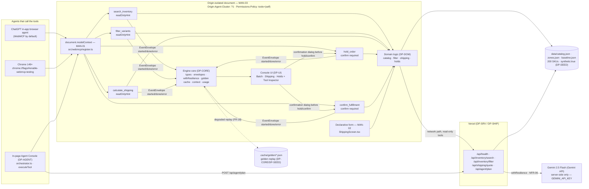

# Master Blueprint — OpsFlow (WebMCP Hackathon Entry Engine)

> **Entry:** OpsFlow — WebMCP Agent-Native Fulfillment Console for Solo Operators
> **Event:** The WebMCP Challenge (OpenAI × Devpost), submission window Aug 25 – **Sep 3 2026, 13:00 PDT / 20:00 UTC** (hard stop; repo + URL + video frozen until Sep 21)
> **Declared track (exactly one, the only one that exists):** **WebMCP Challenge — Top 10** (single prize bucket; no layered tracks, no sponsor sub-challenges; hosting choice is deployment preference, not a track)
> **Bonus integrations:** **none — no bonus integration, not worth dilution.** This event awards no Stage-Three points for Gemma/Veo/Lyria/blog/social beyond the Top 10 bundle.
> **Working copy:** `../hackathon-entries/2026-09-webMCP` (referred to below as `<entry>`)
> **Chassis manifest (from `hackathon-projects/2026-09-webMCP/proposal.json`):** included = `resilience`, `platform`, `ideation`, `context`, `dev-tooling`, `data`, `cost`, `provenance`; excluded = `media`, `assembly-advisory`, `pgm`, `profile`
> **Status:** Master Blueprint v1.0.0 — binding contract for the ten `DP-*` design plans listed in §3
> **Sources of truth:** `hackathon-projects/2026-09-webMCP/winning_project_plan.md` (WHAT), `hackathon-projects/2026-09-webMCP/hackathon_brief.md` §4 (verbatim rules), `design_documents/lablab_hackathon_strategy_blueprint.md` §5/§7 (process), `contracts/component-catalog.json` + chassis plans `DP-A/DP-B/DP-D1/DP-D2a/DP-D2b/DP-E/DP-F1/DP-F2/DP-H/DP-I/DP-J` (chassis behavior — composed, never redesigned)

---

## §0. How to read this document

### §0.1 Binding force

This blueprint is the **only** shared context between ten independent design-plan authoring
chats, and those plans are implemented by low-intelligence agents that never see each
other's plans. Every contract in §2 is frozen here and copied verbatim into each
`PROMPT-DP-*.md`. A design plan may **add** detail inside its own scope; it may **never**
redefine a §2.4 type, a §2.5 tool contract, a §2.6 HTTP route, a §2.7 file path, a §2.8
config key, or a §2.9 step id.

Hard rule inherited from the constraints: **engine code lives only inside `<entry>`** —
`engine/` stubs marked `TODO(ENGINE)` plus new files under `<entry>/src/`. Never edit the
chassis repository's `src/`. Chassis modules are composed through their documented public
surfaces (§2.3), never forked, never re-implemented.

### §0.2 The objective, stated honestly

The instruction is to maximize the probability of winning **WebMCP Challenge — Top 10**.
That is a single prize bucket: ten winners, all receiving the same bundle, chosen by four
**equally weighted** Stage-Two criteria with the tie-break being the criteria in listed
order. There is no second track to hedge into and no bonus lever to add points. The only
maximizer is therefore: **score high on all four axes, with the first-listed axis (WebMCP
Leverage) as the tie-break edge.**

| Axis (exact label, Rules §7) | Judge's question (quoted) | Owned by | The lever we actually pull |
|---|---|---|---|
| **WebMCP Leverage** | *"How thoroughly and skillfully does the project use WebMCP? Does the code reflect genuine effort and a working, non-trivial implementation?"* | `DP-TOOLS`, `DP-AGENT` | Five imperative `registerTool` calls with hand-written JSON Schema `inputSchema`, `annotations` (`readOnlyHint`/`destructiveHint`/`openWorldHint`), `signal`-based abort, per-tool input-length limits and untrusted-content handling per the secure-tools guide, **plus** a Declarative-API annotated form for the shipping calculator, **plus** in-page `getTools`/`executeTool` self-test. Tool chaining (`search → filter → calculate → hold → confirm`) is the non-trivial part judges screen for. |
| **Execution** | *"Does the project deliver a working or runnable project that has a complete, coherent product experience — not just a technical proof of concept?"* | `DP-UI`, `DP-SRV`, `DP-SHIP` | One coherent three-screen console on a public Vercel URL that runs consistently, is origin-isolated with `Permissions-Policy: tools=(self)`, degrades to cached replay instead of blanking, and still tells the whole story when opened in a browser with **no** WebMCP support. |
| **Potential Impact** | *"Does the project make a credible, specific case for solving a real problem for a real audience — and does the solution actually address that problem based on what's demonstrated?"* | `DP-DOM`, `DP-SEED`, `DP-PITCH` | Maya, the freelance ops coordinator, 20–40 orders/day, six tabs. The demo shows the measured delta: a 25-minute manual batch reduced to a ~3-minute co-executed batch, with the step/click counter visible on screen so the claim is *demonstrated*, not asserted. |
| **Creativity & Ambition** | *"How creative and novel is the concept and does the project differ from existing concepts?"* | `DP-TOOLS`, `DP-UI`, `DP-AGENT` | Visible human-agent **co-execution**: the agent proposes a typed tool call, the page shows the exact validated arguments, and state-changing tools stop at a confirmation dialog the human clicks. That is the opposite of a bulk CSV upload and the opposite of DOM-scraping automation. |

No plan may spend effort on a second track (none exists), on a bonus integration (none is
scored), or on features outside the three demoed screens.

### §0.3 Calendar (all times as published)

| When | What | Owner |
|---|---|---|
| **Sep 1 2026, 12:00 PT** | **Netlify 3,000-credit form deadline** (`https://forms.gle/xw75XGUQzCXEiALc7`) — claim or consciously skip | operator, day 0 |
| Day 0 | Redeem Vercel $30 build credits (`https://credits.vercel.sh/redeem`, code `OAIWEBMH-9E2F-MUT4`); claim Render $50; install **Model Context Tool Inspector** extension `gbpdfapgefenggkahomfgkhfehlcenpd`; enable `chrome://flags/#enable-webmcp-testing` on Chrome 149+ and restart | operator, before any build hour |
| Day 0 + 1h | `doctor` green, first `vercel --prod` deploy of a hello-world with the frozen headers, verified origin-isolated | `DP-SHIP` |
| **Sep 2 2026, 20:00 UTC** | **Internal submission target** (~24 h buffer) | `DP-SHIP` |
| **Sep 3 2026, 13:00 PDT / 20:00 UTC** | Official hard deadline. Late = disqualified | `DP-SHIP` |
| Sep 3 13:00 PDT → Sep 21 | **Freeze:** no edits to Devpost submission, repo, or live site. Fork to keep building | operator |
| Sep 4 – Sep 21 | Judging period — live URL must stay up and unchanged | — |

### §0.4 Vocabulary

* **Tool** — a WebMCP tool registered with `document.modelContext.registerTool`. There are exactly **five**, named in §2.5.
* **Agent** — whatever calls the tools. In judging this is **ChatGPT's in-app browser agent** (primary) or **Chrome 149+ with the WebMCP flag**. The page also ships its own **in-page agent console** (`DP-AGENT`) so the product is complete and demonstrable in a plain browser; the in-page console calls the *same* registered tools through `document.modelContext.executeTool`, never a private back door.
* **Degraded** — a `DegradedResult` from the chassis resilience layer, or a session running from the golden cache. Always visible in the UI, never silent.
* **`<entry>`** — `../hackathon-entries/2026-09-webMCP`.

---

## §1. Requirements

### §1.0 MANDATORY COMPLIANCE — copy this block verbatim into every design plan

> ## MANDATORY COMPLIANCE — reproduce verbatim in §2 Requirements Traceability of every design plan
>
> Every part of this entry MUST satisfy, or the entry fails Stage One regardless of quality
> (`hackathon_brief.md` §4.1–§4.3, Official Rules §4/§6/§7/§9):
>
> - **WebMCP is the mandatory technology.** The repository must demonstrate **imported-and-called**
>   usage — not a README mention — of the imperative pattern, verbatim shape:
>   `document.modelContext.registerTool({ name, description, inputSchema, execute })`.
>   Declarative API (annotated HTML forms) may be used **in addition**, never instead.
> - **WebMCP is only available in origin-isolated documents** and is gated by the `tools`
>   Permissions Policy, which **defaults to `self`**; a cross-origin iframe needs `allow="tools"`.
> - **Testable** in the **ChatGPT desktop app in-app browser** (WebMCP by default) **or Google
>   Chrome 149+** with `chrome://flags/#enable-webmcp-testing` enabled and the browser restarted.
> - **No mandated AI model and no mandated API key.** Any model, or none, is permitted.
> - **Submission gate — all five, or Stage One fail:** (1) working **live URL** judges can open in
>   the ChatGPT in-app browser or WebMCP-enabled Chrome, installable and running **consistently**,
>   frozen Sep 3 13:00 PDT until Sep 21; (2) **text description** answering four prompts — why the
>   use case fits WebMCP, how it creates a better UX, what people + agents can do together that was
>   difficult or impossible before, and briefly how WebMCP was implemented; (3) **public code
>   repository** containing all source/assets/instructions **and an open-source license file
>   detectable and visible at the top of the repo page (About section)**, containing the
>   `registerTool` pattern; (4) **demonstration video under 3 minutes** — only the first three
>   minutes are evaluated — showing the project functioning, **with audio covering what you built
>   and how you used WebMCP**, uploaded **publicly to YouTube**; (5) **completed Devpost submission
>   form by Sep 3 2026 @ 1:00 PM PDT (20:00 UTC)**.
> - **New & Existing rule:** new during the Submission Period, or meaningfully extended with WebMCP
>   after Aug 25 2026 with dated commit history distinguishing prior from new work.
> - **One track only:** *"WebMCP Challenge Winners — Top 10 submissions receive the following prizes
>   from the hackathon sponsors: ... 10 winners — All eligible Submissions"*. There are **no**
>   layered tracks and **no** sponsor sub-challenges. **No bonus integration — not worth dilution.**
> - **Judging:** Stage One pass/fail (reasonably fits theme + reasonably applies WebMCP); Stage Two
>   **four equally weighted** criteria, tie-break in listed order: **WebMCP Leverage**, **Execution**,
>   **Potential Impact**, **Creativity & Ambition**.

### §1.0.1 Rules mapping — the mandates as first-class requirements

| ID | Mandate (source) | How this entry satisfies it | Named artifact that proves it | Owning plan | Verified by |
|---|---|---|---|---|---|
| `MAN-01` | **Imperative WebMCP** — `registerTool({ name, description, inputSchema, execute })`, imported and called (brief §4.3, Rules §4) | Exactly **five** tools registered from one site: `search_inventory`, `filter_variants`, `calculate_shipping`, `hold_order`, `confirm_fulfillment`, each with hand-written JSON-Schema `inputSchema`, `annotations`, `signal` abort handling and input-length limits | `<entry>/src/webmcp/register.ts` (the only `registerTool` call site), `<entry>/src/webmcp/tools/*.ts`, `<entry>/src/webmcp/schemas.ts` | `DP-TOOLS` | `rg -n "document\.modelContext\.registerTool" src/` returns exactly one hit, in `src/webmcp/register.ts`; `npm run test:tools` passes |
| `MAN-02` | **Declarative WebMCP** — annotated HTML form (Chrome docs `/declarative-api`), used in addition to imperative | The shipping-calculator form carries the declarative tool annotations so the same capability exists for agents that read forms | `<entry>/src/ui/screens/ShippingScreen.tsx` (the annotated `<form>`), `README.md` §WebMCP surface | `DP-UI` | `rg -n "toolname" src/ui/screens/ShippingScreen.tsx` returns the annotated form; documented in README |
| `MAN-03` | **Origin isolation + `tools` Permissions Policy defaulting to `self`** (Chrome docs, Security & permissions) | Every response ships `Origin-Agent-Cluster: ?1` and `Permissions-Policy: tools=(self)`; the app renders **no cross-origin iframe**, so no `allow="tools"` is needed — and the README says so explicitly | `<entry>/vercel.json` (`headers` block, frozen in §2.6.3), `<entry>/src/webmcp/policy.ts` (runtime capability probe) | `DP-SHIP` (headers), `DP-TOOLS` (probe) | `npm run verify:headers -- <live-url>` prints `origin-agent-cluster: ?1` and `permissions-policy: tools=(self)`; `GET /api/health` echoes `"origin_isolated": true` |
| `MAN-04` | **Public repo, all source + instructions, open-source license detectable at repo top** (Rules §4) | Public GitHub repo, top-level `LICENSE` (MIT) so GitHub's About box shows "MIT license"; `README.md` with one-command spin-up; `disclosure.md` generated by the chassis provenance module | `<entry>/LICENSE`, `<entry>/README.md`, `<entry>/disclosure.md`, `<entry>/assembly.manifest.json` | `DP-SHIP` | `npm run submit:hygiene` reports zero secrets and `license: MIT`; `ls LICENSE` at repo root |
| `MAN-05` | **Working live URL, testable in ChatGPT in-app browser or Chrome 149+, running consistently** (Rules §4/§6) | `vercel --prod` static SPA + serverless functions; no auth, no login, no local dependency; a first-load self-test proves the five tools registered | Vercel production URL recorded in `<entry>/submission.md`, `<entry>/vercel.json` | `DP-SHIP` | `npm run deploy:verify -- <live-url>` returns `{"ok":true,...}` and the page's Tool Inspector panel lists five tools |
| `MAN-06` | **Video < 3 min, public YouTube, audio covering what + how WebMCP** (Rules §4) | 2:45 script: 0:00–0:25 Maya's six tabs; 0:25–2:00 live co-execution in the ChatGPT in-app browser with the WebMCP inspector visible; 2:00–2:30 `registerTool` code shot + DevTools → Application → WebMCP; 2:30–2:45 impact delta | `<entry>/script.md`, `<entry>/assets/demodrive/<ts>/`, YouTube link in `submission.md` | `DP-PITCH` | script CLI output totals ≤ 175 s; operator confirms the upload is Public |
| `MAN-07` | **Text description answering the four prompts** (Rules §4) | Four labelled sections drafted from the winning plan's Problem Framing / AI Solution / Why Now, then formatted by the chassis submit CLI | `<entry>/submission.md` §1–§4 | `DP-PITCH` | `submit format` produces all four sections; word count ≤ 1200 |
| `MAN-08` | **Devpost form complete by Sep 3 20:00 UTC** | Internal target Sep 2 20:00 UTC; a printed pre-submission gate with five checkboxes matching the five gate items | `<entry>/docs/submission-checklist.md` | `DP-SHIP` | `npm run gate` exits 0 |
| `MAN-09` | **New & Existing rule + dated commit history** (Rules §4) | The entry is created inside the Submission Period; commits are spread across the window; chassis reuse is disclosed rather than hidden | `git log` in `<entry>`, `<entry>/disclosure.md` §Chassis reuse | `DP-SHIP` | `npm run submit:hygiene` commit-distribution report shows no single dump commit |
| `MAN-10` | **One track, no bonus** (Rules §9; brief §4.2) | The pitch, deck, README and submission text name exactly one track — WebMCP Challenge — Top 10 — and state "no bonus integration — not worth dilution" | `<entry>/submission.md`, `deck/` slide 1, `README.md` header | `DP-PITCH` | `rg -n "Top 10" submission.md README.md` hits; no other track name appears anywhere |

**Non-negotiable reading of `MAN-01`–`MAN-03`:** no plan may invent a second tool-registration
mechanism, register tools from more than one module, ship a cross-origin iframe, or move tool
execution off the origin-isolated document. A plan that proposes a WebSocket "agent bridge",
a browser extension, or a server-side MCP server **instead of** page-registered WebMCP tools is
wrong and must be rewritten: the judged artifact is the page's own `document.modelContext`.

### §1.1 Functional requirements

Every row traces to a section of `winning_project_plan.md` (WPP) and to a judging axis.

| ID | Requirement | WPP source | Axis | Owner |
|---|---|---|---|---|
| `FR-01` | The page registers exactly five WebMCP tools at first paint, before any user interaction, and re-registers idempotently after hot reload | Executive Pitch; AI Solution | Leverage | `DP-TOOLS` |
| `FR-02` | `search_inventory({ query, inStockOnly?, limit? })` returns matching variants with sku, title, options, price, stock — read-only, `readOnlyHint: true` | AI Solution ¶1 | Leverage | `DP-TOOLS` + `DP-DOM` |
| `FR-03` | `filter_variants({ skuPrefix?, options?, maxPriceCents?, minStock?, maxStock?, limit? })` narrows the **current result set**, preserving constraint context between calls | AI Solution ¶1; Problem Framing ("lose constraint context between searches") | Leverage, Creativity | `DP-TOOLS` + `DP-DOM` |
| `FR-04` | `calculate_shipping({ items, zone, service })` returns a rate breakdown **plus** a human-readable `explain[]` array naming every surcharge and every excluded variant | AI Solution ¶2 | Leverage, Impact | `DP-TOOLS` + `DP-DOM` |
| `FR-05` | `hold_order({ lineItems, ttlMinutes, note? })` creates a **reversible** hold with a TTL and requires an explicit human confirmation click before it commits; `annotations.readOnlyHint: false` | AI Solution ¶3 | Creativity, Execution | `DP-TOOLS` + `DP-DOM` + `DP-UI` |
| `FR-06` | `confirm_fulfillment({ holdId })` commits a held batch, and is refused for expired/unknown/already-confirmed holds with a typed error; also requires human confirmation | AI Solution ¶3 | Creativity, Execution | `DP-TOOLS` + `DP-DOM` + `DP-UI` |
| `FR-07` | Every tool validates its input against its own `inputSchema` before executing and returns a typed `ToolError` (never throws) on violation | Architecture, Prompt boundaries | Leverage | `DP-TOOLS` |
| `FR-08` | Every tool honours `options.signal`: on abort it stops work, resolves with `TOOL_ABORTED`, and leaves no partial state | Architecture (WebMCP §4.2 signal) | Leverage | `DP-TOOLS` |
| `FR-09` | Every tool truncates and length-limits free-text inputs and marks tool output as untrusted content per the secure-tools guide | Architecture, Prompt boundaries | Leverage | `DP-TOOLS` |
| `FR-10` | A **Tool Inspector panel** in the page lists the five registered tools with name, description, annotations and pretty-printed `inputSchema`, read live from `document.modelContext.getTools()` — not a hardcoded list | UI states | Leverage, Execution | `DP-UI` + `DP-TOOLS` |
| `FR-11` | An **in-page agent console** turns one natural-language goal into a validated tool plan and executes it step by step through `document.modelContext.executeTool`, so the product is complete in a browser with no external agent | Architecture, Agent Framework | Execution, Creativity | `DP-AGENT` |
| `FR-12` | The in-page planner uses **Gemini 2.5 Flash via the Gemini API**, called only from the server function `POST /api/agent/plan` so no key ever reaches the browser; if no key is configured or the call degrades, a **deterministic keyword planner** produces a valid plan and the UI says which planner ran | LLM; Architecture | Execution, Impact | `DP-AGENT` |
| `FR-13` | Three screens — **Batch** (goal + results table + variant chips), **Shipping** (quote card with explain toggle + declarative form), **Holds** (hold list, confirmation dialog, committed banner) — and no fourth screen | UI states | Execution | `DP-UI` |
| `FR-14` | Every tool call emits `EventEnvelope`s (`started` → `done`/`error`) on the chassis transport, and the UI renders them as a live co-execution timeline showing the exact validated arguments | Architecture, data flow | Creativity, Leverage | `DP-CORE` + `DP-UI` |
| `FR-15` | A visible **savings meter** counts tool calls and confirmations for the batch and compares them to the 25-minute / 120-click manual baseline stored in `data/baseline.json` | Business Value; Problem Framing | Impact | `DP-UI` + `DP-SEED` |
| `FR-16` | The catalog is **200 synthetic SKUs** with variants, a five-zone shipping table and hold-TTL config, every record carrying `synthetic: true` and a visible "synthetic data" badge in the UI | Corpus/docs needed | Impact (honesty) | `DP-SEED` |
| `FR-17` | When WebMCP is unavailable (no flag, no ChatGPT browser), the page detects it, shows a **"WebMCP not detected"** banner with the two enablement paths, and still runs the full flow through the in-page fallback executor | Architecture; Infra | Execution | `DP-TOOLS` + `DP-UI` |
| `FR-18` | When a tool `execute` aborts or a network call fails, the golden cache replays the last successful output, the envelope carries `degraded: true`, and the UI shows a degraded chip on that step — never a blank screen | Architecture (golden cache replay) | Execution | `DP-CORE` + `DP-UI` |
| `FR-19` | `GET /api/health` returns `{ ok, version, mode, origin_isolated, planner, catalog }` and is the single deploy-verification endpoint | Infra, deploy proof | Execution | `DP-SRV` |
| `FR-20` | A one-command offline rehearsal (`npm run demo:offline`) replays a mock envelope script with zero network so the demo can be recorded without live services | Infra fallback; brief §Constraints | Execution | `DP-DEV` + `DP-SEED` |

### §1.2 Non-functional requirements

| ID | Requirement | Threshold / rule | Axis | Owner |
|---|---|---|---|---|
| `NFR-01` | No API key, secret or token is ever present in client code or the built bundle | `rg -n "AIza|VERCEL_TOKEN" dist/` returns nothing; key read only in `api/agent/plan.ts` | Execution | `DP-AGENT`, `DP-SHIP` |
| `NFR-02` | Every tool `execute` resolves in **< 300 ms p95** with the catalog in memory, and never blocks on the network for read-only tools | measured by `npm run bench:tools` | Leverage, Execution | `DP-DOM` |
| `NFR-03` | The entire flow works with the network disconnected, from cache/local domain logic, with a visible degraded banner | `RES_FORCED_DEGRADED=1 npm run demo:offline` completes the five-step chain | Execution | `DP-CORE`, `DP-DEV` |
| `NFR-04` | Zero real personal data; all fixtures carry `synthetic: true` and the watermark header | `rg -n "\"synthetic\": true" data/catalog.json` | Impact | `DP-SEED` |
| `NFR-05` | Zero edits to the chassis repository's `src/`; chassis is imported through package roots only | `git -C <chassis> status --porcelain src/` is empty | — | all plans |
| `NFR-06` | Every outbound LLM call is wrapped in `withResilience`; no raw provider call exists anywhere else | `rg -n "generateContent" src/ api/` hits only `api/agent/plan.ts`, inside the wrapper | Execution | `DP-AGENT` |
| `NFR-07` | Tool output text shown to the agent is length-limited (≤ 4000 chars per tool result) and marked untrusted | unit test `tests/tools/limits.test.ts` | Leverage | `DP-TOOLS` |
| `NFR-08` | LLM spend is metered into `data/cost-store.json` and the run falls back to the deterministic planner above the configured cap | `python3 -m src.cost.cli --store data/cost-store.json --budget config/cost.json` prints a table | — | `DP-CORE`, `DP-AGENT` |
| `NFR-09` | The console renders in the chassis `operator` theme, is keyboard-navigable, and every confirmation dialog is focus-trapped | `npm run test:ui` a11y assertions | Execution | `DP-UI` |
| `NFR-10` | Cold load to "five tools registered" in **< 1.5 s** on the deployed URL | timing recorded in `docs/submission-checklist.md` | Execution | `DP-UI`, `DP-SHIP` |
| `NFR-11` | The repository builds and runs from a clean clone with `npm install && npm run dev` and no `.env` file (deterministic planner path) | `DP-SHIP` gate step 1 | Execution | `DP-SHIP` |
| `NFR-12` | No cross-origin iframe is rendered anywhere in the app | `rg -n "iframe" src/` returns nothing | Leverage (`MAN-03`) | `DP-UI` |

---

## §2. Architecture

### §2.0 The diagram (source of `docs/architecture.mmd`, README §Architecture, deck slide 4)

The three mandate nodes are labelled `MAN-01`, `MAN-02`, `MAN-03` so a judge can match the
diagram to the rules at a glance.



Three things this diagram must never stop showing, because each is a rules citation:
`MAN-01` the `document.modelContext` node with the five named tools; `MAN-02` the declarative
form node; `MAN-03` the origin-isolated document boundary carrying both header values.

### §2.0.1 Where each mandate is proven in code

| Mandate | Single site in the repo | Grep-able proof |
|---|---|---|
| `MAN-01` | `src/webmcp/register.ts` — the only `document.modelContext.registerTool` call site | `rg -n "modelContext.registerTool" src/` returns exactly one hit |
| `MAN-02` | `src/ui/screens/ShippingScreen.tsx` — the annotated `<form toolname=...>` | `rg -n "toolname" src/` returns exactly one hit |
| `MAN-03` | `vercel.json` `headers` block | `rg -n "Origin-Agent-Cluster" vercel.json` returns one hit; live `curl -sI <url>` echoes it |
| `NFR-01` | `api/agent/plan.ts` — the only `process.env.GEMINI_API_KEY` read | `rg -n "GEMINI_API_KEY" src/ api/` returns exactly one hit, in `api/agent/plan.ts` |

### §2.0.2 The deploy proof (owned by `DP-SHIP`, frozen here)

`README.md` §Deploy must contain this block verbatim, and the video must show the resulting
live URL opened in the ChatGPT in-app browser (or WebMCP-enabled Chrome) with the inspector.

```bash
# 0. one-time
npm install
npx vercel link            # creates .vercel/project.json (gitignored)

# 1. deploy (MAN-05)
npx vercel --prod

# 2. prove it (MAN-03 + MAN-05 in two lines)
curl -sI "$OPSFLOW_URL" | grep -Ei "origin-agent-cluster|permissions-policy"
# expected: origin-agent-cluster: ?1
# expected: permissions-policy: tools=(self)
curl -s "$OPSFLOW_URL/api/health"
# expected: {"ok":true,"version":"1.0.0","mode":"live","origin_isolated":true,"planner":"gemini-2.5-flash","catalog":{"products":60,"variants":200,"synthetic":true}}
```

No secret is ever committed: `GEMINI_API_KEY` is set with `npx vercel env add GEMINI_API_KEY production`
and exists nowhere in the repository (`NFR-01`).

### §2.1 Component inventory

| # | Component | Plan | Runs where | One-line responsibility |
|---|---|---|---|---|
| 1 | Engine core | `DP-CORE` | browser + node | Frozen types, config loader, envelope publisher, configured resilience wrapper, golden cache, context buffer, usage/cost snapshot |
| 2 | Domain logic | `DP-DOM` | browser + node (isomorphic, pure) | Catalog search, variant filtering, shipping rating, hold ledger — the only place business rules exist |
| 3 | Serverless API | `DP-SRV` | Vercel functions | Five HTTP routes wrapping `DP-DOM` + the Gemini planner call; typed client with local fallback |
| 4 | WebMCP tool layer | `DP-TOOLS` | browser | The five `registerTool` calls, schemas, annotations, validation, abort, limits, capability probe, in-page executor fallback |
| 5 | Agent console | `DP-AGENT` | browser + one Vercel function | Goal → plan (Gemini or deterministic) → sequential `executeTool` with confirmation gates |
| 6 | Console UI | `DP-UI` | browser | Three screens, Tool Inspector, co-execution timeline, confirmation dialogs, banners, savings meter, declarative form |
| 7 | Fixtures | `DP-SEED` | build-time | 200 synthetic SKUs, zone table, baseline, golden cache seeds, mock envelope script |
| 8 | Local dev + verification | `DP-DEV` | node | `doctor`, `mock`, `eval`, `track` wiring; offline rehearsal; bench |
| 9 | Ship | `DP-SHIP` | node + Vercel | Headers, deploy, health verify, LICENSE/README/disclosure, hygiene, pre-submission gate |
| 10 | Pitch | `DP-PITCH` | node | Deck, ≤3-min script, demodrive capture, FAQ defense, four-prompt submission text |

### §2.2 Data flow (the golden path, step by step)

1. Judge opens the live URL in the ChatGPT in-app browser (or Chrome 149+ with the flag).
2. `src/main.tsx` calls `registerAllTools()` (`DP-TOOLS`) **before** first render. Five tools register.
   `probeWebMcp()` records `{ available, reason }` for the banner (`FR-17`).
3. The agent (ChatGPT, or the in-page console) issues a goal:
   *"hold all low-stock blue variants under $12 shipping to zone 4 for 15 minutes"*.
4. **In-page path only:** `orchestrator.run(goal)` posts the goal to `POST /api/agent/plan`, which
   calls Gemini 2.5 Flash inside `withResilience`; on any failure `planDeterministic(goal)` returns
   the same `ToolPlan` shape. Either way the plan is a list of `{ tool, args }` steps.
5. Each step runs through `document.modelContext.executeTool(name, args)` — the same entry point the
   external agent uses. Before each state-changing tool (`hold_order`, `confirm_fulfillment`) the UI
   opens a focus-trapped confirmation dialog showing the exact validated arguments; nothing commits
   without a click (`FR-05`, `FR-06`).
6. Inside `execute`, the tool: validates input against its `inputSchema`; truncates free text;
   checks `options.signal`; calls the `DP-DOM` function; publishes `started`/`done` envelopes;
   returns `{ content: [...], structuredContent: <typed output> }`.
7. Read-only tools try the network route (`DP-SRV`) first with a 900 ms timeout and fall back to the
   in-browser catalog; the fallback marks the envelope `degraded: true` but still returns real data.
8. `useEventStream()` (chassis transport) feeds the co-execution timeline, results table, quote card
   and savings meter. On any `DegradedResult`, the degraded chip and banner appear (`FR-18`).

### §2.3 Chassis surfaces you may compose (and nothing else)

```ts
// resilience (chassis DP-A) — src/resilience
import { withResilience, withResilienceSync, withValidation, isDegradedResult,
         makeDegradedResult, createGoldenCache, validate, repair, renderRepairPrompt } from "src/resilience";
import type { DegradedResult, ResilienceConfig, GoldenCache, ValidationError } from "src/resilience";
// withResilience<T>(fn: () => T | Promise<T>, config?: ResilienceConfig | null,
//                   deps?: { secondaryProvider?, cache?, repairLlm? }): () => Promise<T | DegradedResult<T>>
// The wrapper NEVER throws. isDegradedResult(x) narrows to DegradedResult.
// DegradedResult = { degraded: true; reason: string;
//                    fallback_source: "secondary_provider"|"cache"|"replay"|"none";
//                    original_error?: string|null; data?: unknown; timestamp: string; version: "1.0.0" }
// ResilienceConfig = { timeout_ms?, retries?, backoff?: {policy,base_ms,factor,max_ms,jitter},
//                      fallback_chain?: { order: Array<"secondary_provider"|"cache"|"replay"|"none"> },
//                      cache_key_strategy?, forced_degraded? }
// Env overrides: RES_FORCED_DEGRADED=1, RES_TIMEOUT_MS, RES_RETRIES
// GoldenCache: createGoldenCache() -> { deriveKey({provider,model,prompt}), get(key), put(key,value,meta), list() }
// validate(value, schema) -> ValidationError[] ; renderRepairPrompt(errors, original) -> string (RES-04)

// context (chassis DP-E) — src/context
import { fit, append, count, countMessage, countBuffer, budget, calcStatus, calcBudget } from "src/context";
import type { Message, Buffer, BufferStatus, FitResult, ContextBudgetConfig } from "src/context";
// count(text, profileOrConfig): number   // CTX-02 — the ONLY tokenizer in the entry
// fit(buffer, config): FitResult         // { buffer, status }

// transport (chassis DP-B) — src/platform/transport
import { createPublisher, createSubscriber, useEventStream, resolveTransport,
         fetchEventFallback } from "src/platform/transport";
import type { EventEnvelope, PublishOptions, CollectablePublisher } from "src/platform/transport";
// createPublisher("memory"|"sse"): CollectablePublisher
//   .publish({ stepId, status, payload?, traceId?, degraded? }): Promise<void>
//   .publishDelta(stepId, delta, index, traceId?): Promise<void>
//   .collect(traceId?): FallbackSnapshot | null
//   .close(): Promise<void>
// EventEnvelope = { step_id: string; status: "started"|"streaming"|"done"|"error";
//                   payload: Record<string, unknown>; timestamp: string; sequence: number;
//                   trace_id?: string; degraded?: boolean }
// useEventStream(opts?): { envelopes, status, error, degraded, reconnect }

// ui (chassis DP-B) — src/platform/ui
import { StepStatusIndicator, StreamingTextRenderer, CitationDisplay,
         isDegradedEnvelope, degradedResultOf, setTheme, currentTheme, resolveTheme, themes } from "src/platform/ui";
// themes: "minimal" | "editorial" | "operator"   ← this entry uses "operator"

// data (chassis DP-H) — src/data
import { generateRecords, generateDocuments, watermarkBatch, WATERMARK_HEADER_TEXT } from "src/data";
import { setProviderCall } from "src/data/provider";   // the ONE permitted deep import (DP-H §6.4)
// generateRecords({ domain, shape: { kind:"records", schema, count }, watermark?, cache? }): Promise<GenerateResult>
// GenerateResult = { ok: true; batch: Array<{synthetic:true, ...}>; bytes; count; synthetic:true } | DegradedResult
```

Chassis CLIs (run from `<entry>` root; never edited):

```bash
doctor --manifest assembly.manifest.json --json --output reports/doctor/doctor-report.json
chassis mock --script demo/mock-script.json                # MOCK — replay envelopes, zero network
eval --target src/agent/deterministic.ts#planDeterministic --cases tests/eval/plan-cases.json --json
track status --json                                         # staleness of deck/script/submission vs plan
bench run --dummy examples/dummy-fixtures/bench/sample_brief.md --manifest assembly.manifest.json
npx vite-node src/provenance/prov/cli.ts generate --manifest assembly.manifest.json --out disclosure.md
npx vite-node src/provenance/submit/cli.ts format --plan winning_project_plan.md --manifest assembly.manifest.json --disclosure disclosure.md --out submission.md
npx vite-node src/provenance/submit/cli.ts hygiene --manifest assembly.manifest.json --out hygiene-report.json
npx vite-node src/ideation/deckgen/cli.ts populate --plan winning_project_plan.md --manifest assembly.manifest.json --disclosure disclosure.md --out deck/
npx vite-node src/ideation/deckgen/cli.ts diagram --manifest assembly.manifest.json --out docs/architecture.mmd
npx vite-node src/ideation/script/cli.ts generate --plan winning_project_plan.md --manifest assembly.manifest.json --config timing.yaml --out script.md
npm run demodrive -- capture --script demo/click-script.json --data-source cache --cache-key opsflow-golden
npm run faqdef:generate -- generate --plan winning_project_plan.md --manifest assembly.manifest.json --disclosure disclosure.md --out docs/qa
python3 -m src.cost.cli --store data/cost-store.json --budget config/cost.json
```

**The COST seam is cross-language and file-based.** `src/cost` is Python; the entry is
TypeScript. The entry therefore **never imports** `src/cost`. `DP-CORE` writes
`<entry>/data/cost-store.json` conforming to `contracts/cost-store-snapshot.schema.json`, and the
Python CLI renders it. Token counts come from `count()` in `src/context`, the same counter the
Python module reuses, so the two sides agree by construction.

**Forbidden:** deep imports into chassis internals (`src/resilience/wrapper.js`,
`src/platform/transport/publisher.js`, `src/context/strategies/*`, …). Import only from the
package roots above. The single documented exception is `src/data/provider.ts`'s `setProviderCall`.

### §2.4 Frozen shared types — `<entry>/src/engine/types.ts` (owned by `DP-CORE`)

Every other plan **imports** these and adds nothing to this file. No plan may widen a union,
rename a field, or add a field. A plan needing a new shape declares it inside its own module and
says so in its Interfaces section.

```ts
// Requirement IDs: FR-02..FR-08, FR-14, FR-18, NFR-07
export const APP_VERSION = "1.0.0";

export type ShippingZone = 1 | 2 | 3 | 4 | 5;
export type ServiceLevel = "ground" | "expedited" | "overnight";
export type HoldStatus = "held" | "confirmed" | "released" | "expired";
export type PlannerKind = "gemini-2.5-flash" | "deterministic";
export type ToolName =
  | "search_inventory" | "filter_variants" | "calculate_shipping"
  | "hold_order" | "confirm_fulfillment";
export type ToolErrorCode =
  | "INVALID_INPUT"      // input failed inputSchema validation
  | "NOT_FOUND"          // unknown sku / holdId
  | "CONFLICT"           // hold already confirmed or released
  | "EXPIRED"            // hold TTL elapsed
  | "NEEDS_CONFIRMATION" // human confirmation not granted
  | "TOOL_ABORTED"       // options.signal aborted
  | "DEGRADED";          // upstream failed, cached/local data returned

export interface VariantOptions { size: string; color: string; }

export interface Variant {
  sku: string;                 // "OPS-1042-BLU-M" — uppercase, [A-Z0-9-]{6,32}
  product_id: string;          // "OPS-1042"
  title: string;               // <= 80 chars
  options: VariantOptions;
  price_cents: number;         // integer >= 0
  stock: number;               // integer >= 0
  weight_g: number;            // integer > 0
  low_stock_threshold: number; // integer >= 0; stock <= threshold means "low stock"
  synthetic: true;             // always literally true (NFR-04)
}

export interface Product {
  id: string; title: string; brand: string; category: string;
  variants: Variant[]; synthetic: true;
}

export interface Catalog { version: string; generated_at: string; synthetic: true; products: Product[]; }

export interface LineItem { sku: string; qty: number; }   // qty integer 1..999

export interface Surcharge { code: string; label: string; amount_cents: number; }

export interface ShippingQuote {
  zone: ShippingZone; service: ServiceLevel;
  items: LineItem[]; total_weight_g: number; subtotal_cents: number;
  base_rate_cents: number; surcharges: Surcharge[]; total_cents: number;
  explain: string[];            // one sentence per rule applied; <= 12 entries
  excluded: Array<{ sku: string; reason: string }>;
}

export interface Hold {
  hold_id: string;              // "HOLD-" + 8 uppercase base32 chars
  line_items: LineItem[];
  created_at: string;           // ISO-8601
  expires_at: string;           // ISO-8601 = created_at + ttl_minutes
  ttl_minutes: number;          // integer 1..120
  status: HoldStatus;
  note: string | null;          // <= 200 chars
  quote: ShippingQuote | null;
}

export interface Fulfillment {
  fulfillment_id: string;       // "FUL-" + 8 uppercase base32 chars
  hold_id: string;
  confirmed_at: string;
  line_items: LineItem[];
  total_cents: number;
}

// ---- tool I/O ----
export interface SearchInventoryInput { query: string; inStockOnly?: boolean; limit?: number; }
export interface FilterVariantsInput {
  skuPrefix?: string; options?: Partial<VariantOptions>;
  maxPriceCents?: number; minStock?: number; maxStock?: number; limit?: number;
}
export interface CalculateShippingInput { items: LineItem[]; zone: ShippingZone; service: ServiceLevel; }
export interface HoldOrderInput { lineItems: LineItem[]; ttlMinutes: number; note?: string; }
export interface ConfirmFulfillmentInput { holdId: string; }

export interface VariantMatch {
  sku: string; title: string; options: VariantOptions;
  price_cents: number; stock: number; low_stock: boolean;
}
export interface SearchInventoryOutput {
  matches: VariantMatch[]; total: number; truncated: boolean; query_echo: string;
}
export interface FilterVariantsOutput {
  matches: VariantMatch[]; total: number; applied: string[];  // human-readable filters applied
  from_result_set: boolean;                                   // true when it narrowed the previous set
}
export type CalculateShippingOutput = ShippingQuote;
export interface HoldOrderOutput { hold: Hold; requires_confirmation: true; }
export interface ConfirmFulfillmentOutput { fulfillment: Fulfillment; hold: Hold; }

export interface ToolError { code: ToolErrorCode; message: string; details?: Record<string, unknown>; }
export type ToolOutcome<T> = { ok: true; data: T; degraded?: boolean } | { ok: false; error: ToolError };

// ---- agent plan ----
export interface PlanStep { tool: ToolName; args: Record<string, unknown>; rationale: string; }
export interface ToolPlan {
  goal: string; steps: PlanStep[]; planner: PlannerKind; degraded: boolean; created_at: string;
}

// ---- session/meter ----
export interface SavingsMeter {
  tool_calls: number; confirmations: number; elapsed_ms: number;
  baseline_minutes: number; baseline_clicks: number;   // from data/baseline.json
}
export interface HealthResponse {
  ok: boolean; version: string; mode: "live" | "degraded"; origin_isolated: boolean;
  planner: PlannerKind; catalog: { products: number; variants: number; synthetic: true };
}
```

### §2.5 Frozen WebMCP tool contracts (owned by `DP-TOOLS`)

All five are registered in one place, `src/webmcp/register.ts`, with this exact shape — the
literal pattern the rules require in the repository:

```ts
document.modelContext.registerTool({
  name: "search_inventory",
  description: "Search the synthetic OpsFlow catalog for product variants by free-text query.",
  inputSchema: SEARCH_INVENTORY_SCHEMA,
  annotations: { readOnlyHint: true, openWorldHint: false },
  execute: async (input, options) => runTool("search_inventory", input, options),
});
```

| Tool | `annotations` | Input type | Output type | Confirmation | Max input text |
|---|---|---|---|---|---|
| `search_inventory` | `{ readOnlyHint: true, openWorldHint: false }` | `SearchInventoryInput` | `SearchInventoryOutput` | no | `query` ≤ 200 chars |
| `filter_variants` | `{ readOnlyHint: true, openWorldHint: false }` | `FilterVariantsInput` | `FilterVariantsOutput` | no | `skuPrefix` ≤ 32 chars |
| `calculate_shipping` | `{ readOnlyHint: true, openWorldHint: false }` | `CalculateShippingInput` | `CalculateShippingOutput` | no | ≤ 50 items |
| `hold_order` | `{ readOnlyHint: false, destructiveHint: false, idempotentHint: false, openWorldHint: false }` | `HoldOrderInput` | `HoldOrderOutput` | **yes** | `note` ≤ 200 chars, ≤ 50 items |
| `confirm_fulfillment` | `{ readOnlyHint: false, destructiveHint: false, idempotentHint: true, openWorldHint: false }` | `ConfirmFulfillmentInput` | `ConfirmFulfillmentOutput` | **yes** | `holdId` ≤ 32 chars |

Every `execute` returns the WebMCP result shape:

```ts
{
  content: [{ type: "text", text: string }],        // <= 4000 chars, untrusted-marked (NFR-07)
  structuredContent: ToolOutcome<TOutput>,          // the typed payload above
  isError?: boolean                                  // true iff ToolOutcome.ok === false
}
```

`execute` **never throws**: every failure path resolves with `isError: true` and a typed
`ToolError`. Abort (`options.signal.aborted`) resolves `TOOL_ABORTED` with no state written.

### §2.6 Frozen HTTP API — `<entry>/api/` (owned by `DP-SRV`)

Vercel serverless functions, one file per route, all returning `application/json`.

| Method + path | File | Request body | 200 response | Error |
|---|---|---|---|---|
| `GET /api/health` | `api/health.ts` | — | `HealthResponse` | never non-200 |
| `POST /api/inventory/search` | `api/inventory/search.ts` | `SearchInventoryInput` | `ToolOutcome<SearchInventoryOutput>` | 400 `INVALID_INPUT` |
| `POST /api/inventory/filter` | `api/inventory/filter.ts` | `FilterVariantsInput & { skus?: string[] }` | `ToolOutcome<FilterVariantsOutput>` | 400 `INVALID_INPUT` |
| `POST /api/shipping/quote` | `api/shipping/quote.ts` | `CalculateShippingInput` | `ToolOutcome<CalculateShippingOutput>` | 400 `INVALID_INPUT` |
| `POST /api/agent/plan` | `api/agent/plan.ts` | `{ goal: string; context?: { skus?: string[] } }` | `ToolPlan` | never non-200 (falls back to deterministic) |

Holds and fulfillments are **client-owned state** (`DP-DOM` `holdsStore`, persisted in
`localStorage`) — there is no holds endpoint, by design: a serverless function has no durable
per-user state, and a hold that survives a cold start matters more to the demo than a server
round trip. `README.md` states this explicitly so a judge does not read it as an omission.

#### §2.6.3 Frozen headers — `<entry>/vercel.json` (owned by `DP-SHIP`, `MAN-03`)

```json
{
  "headers": [
    {
      "source": "/(.*)",
      "headers": [
        { "key": "Origin-Agent-Cluster", "value": "?1" },
        { "key": "Permissions-Policy", "value": "tools=(self)" },
        { "key": "X-Content-Type-Options", "value": "nosniff" },
        { "key": "Referrer-Policy", "value": "strict-origin-when-cross-origin" }
      ]
    }
  ]
}
```

### §2.7 Frozen file layout inside `<entry>`

```
<entry>/
  api/                          # DP-SRV — Vercel serverless functions
    health.ts
    inventory/search.ts
    inventory/filter.ts
    shipping/quote.ts
    agent/plan.ts               # the ONLY place GEMINI_API_KEY is read (NFR-01)
  src/
    main.tsx                    # DP-UI — calls registerAllTools() before render
    engine/
      types.ts                  # DP-CORE — §2.4, frozen
      config.ts                 # DP-CORE — loads config/engine.json
      envelopes.ts              # DP-CORE — publisher + emitToolEvent
      resilience.ts             # DP-CORE — configured withResilience + golden cache
      context.ts                # DP-CORE — agent transcript buffer
      usage.ts                  # DP-CORE — cost-store snapshot writer
      apiClient.ts              # DP-SRV — typed fetch client + local fallback
      domain/
        catalog.ts              # DP-DOM — loadCatalog, searchVariants
        filter.ts               # DP-DOM — filterVariants
        shipping.ts             # DP-DOM — quoteShipping
        holds.ts                # DP-DOM — pure hold reducers
        holdsStore.ts           # DP-DOM — singleton store + localStorage
        errors.ts               # DP-DOM — makeToolError
    webmcp/
      register.ts               # DP-TOOLS — the ONLY registerTool call site (MAN-01)
      schemas.ts                # DP-TOOLS — the five inputSchema constants
      runTool.ts                # DP-TOOLS — validate → limit → abort → execute → envelope
      policy.ts                 # DP-TOOLS — probeWebMcp(), executeToolCompat()
      confirm.ts                # DP-TOOLS — confirmation gate bridge to DP-UI
    agent/
      orchestrator.ts           # DP-AGENT — run(goal): plan then executeTool loop
      planner.ts                # DP-AGENT — client side of POST /api/agent/plan
      deterministic.ts          # DP-AGENT — keyless keyword planner
      prompt.ts                 # DP-AGENT — system + user prompt templates
    ui/
      App.tsx  screens/BatchScreen.tsx  screens/ShippingScreen.tsx  screens/HoldsScreen.tsx
      components/ToolInspector.tsx  components/CoExecutionTimeline.tsx
      components/ConfirmDialog.tsx  components/DegradedBanner.tsx
      components/WebMcpBanner.tsx   components/SavingsMeter.tsx
      state/session.ts
  data/                         # DP-SEED
    catalog.json  zones.json  baseline.json  cost-store.json
  demo/                         # DP-SEED / DP-DEV
    mock-script.json  click-script.json
  .cache/golden/                # DP-CORE / DP-SEED — golden replay (gitignored except seeds)
  config/                       # DP-CORE / DP-DEV
    engine.json  cost.json  track.json
  tests/                        # every plan adds its own subfolder
  docs/architecture.mmd  docs/submission-checklist.md  docs/qa/
  deck/  script.md  assets/demodrive/
  LICENSE  README.md  disclosure.md  submission.md
  vercel.json  package.json  vite.config.ts  assembly.manifest.json
```

### §2.8 Engine configuration — `<entry>/config/engine.json` (owned by `DP-CORE`)

```json
{
  "version": "1.0.0",
  "app": { "name": "OpsFlow", "theme": "operator", "trace_prefix": "opsflow" },
  "planner": {
    "provider": "gemini",
    "model": "gemini-2.5-flash",
    "max_output_tokens": 1024,
    "temperature": 0.1,
    "fallback": "deterministic"
  },
  "tools": {
    "max_text_chars": 200,
    "max_result_chars": 4000,
    "max_items": 50,
    "default_limit": 25,
    "network_timeout_ms": 900
  },
  "holds": { "default_ttl_minutes": 15, "min_ttl_minutes": 1, "max_ttl_minutes": 120 },
  "resilience": {
    "timeout_ms": 8000,
    "retries": 1,
    "backoff": { "policy": "exponential", "base_ms": 250, "factor": 2, "max_ms": 2000, "jitter": true },
    "fallback_chain": { "order": ["cache", "replay", "none"] }
  },
  "context": { "max_tokens": 8000, "reserve_output": 1024 },
  "cost": { "store_path": "data/cost-store.json", "budget_path": "config/cost.json" }
}
```

### §2.9 Frozen step-id vocabulary (owned by `DP-CORE`, used by everyone)

Envelope `step_id` values — no plan may invent another:

| `step_id` | Emitted by | `started` payload | `done` payload |
|---|---|---|---|
| `agent.plan` | `DP-AGENT` | `{ goal }` | `{ planner, steps: PlanStep[], degraded }` |
| `tool.search_inventory` | `DP-TOOLS` | `{ args }` | `{ outcome: ToolOutcome<SearchInventoryOutput> }` |
| `tool.filter_variants` | `DP-TOOLS` | `{ args }` | `{ outcome: ToolOutcome<FilterVariantsOutput> }` |
| `tool.calculate_shipping` | `DP-TOOLS` | `{ args }` | `{ outcome: ToolOutcome<CalculateShippingOutput> }` |
| `tool.hold_order` | `DP-TOOLS` | `{ args }` | `{ outcome: ToolOutcome<HoldOrderOutput> }` |
| `tool.confirm_fulfillment` | `DP-TOOLS` | `{ args }` | `{ outcome: ToolOutcome<ConfirmFulfillmentOutput> }` |
| `session.confirm` | `DP-UI` | `{ tool, args }` | `{ granted: boolean }` |
| `session.degraded` | `DP-CORE` | — | `{ reason, fallback_source }` |

`status` is the chassis enum `started | streaming | done | error`. `trace_id` is
`opsflow-<epoch_ms>` per batch, created once by `DP-AGENT` (or by `DP-UI` for manual clicks).

### §2.10 Inter-module contract table — single owner, N consumers

Every cross-module symbol appears **exactly once** here. The owner implements it; every consumer
**imports it from that exact path**. A consumer that cannot find it stops and reports a blocker —
it never writes a local copy, a stub, a re-export, or a "temporary" shim.

| # | Symbol | Owner | File (in `<entry>`) | Signature / shape | Consumers |
|---|---|---|---|---|---|
| 1 | all types in §2.4 | `DP-CORE` | `src/engine/types.ts` | §2.4 verbatim | every plan |
| 2 | `loadConfig()` | `DP-CORE` | `src/engine/config.ts` | `() => EngineConfig` (shape = §2.8) | `DP-TOOLS`, `DP-AGENT`, `DP-DOM`, `DP-SRV`, `DP-UI` |
| 3 | `publisher` | `DP-CORE` | `src/engine/envelopes.ts` | `CollectablePublisher` singleton from `createPublisher("memory")` | `DP-TOOLS`, `DP-AGENT`, `DP-UI` |
| 4 | `emitToolEvent(stepId, status, payload, opts?)` | `DP-CORE` | `src/engine/envelopes.ts` | `(stepId: string, status: "started"\|"streaming"\|"done"\|"error", payload: Record<string, unknown>, opts?: { traceId?: string; degraded?: boolean }) => Promise<void>` | `DP-TOOLS`, `DP-AGENT`, `DP-UI` |
| 5 | `newTraceId()` | `DP-CORE` | `src/engine/envelopes.ts` | `() => string` → `opsflow-<epoch_ms>` | `DP-AGENT`, `DP-UI` |
| 6 | `guarded<T>(fn, opts?)` | `DP-CORE` | `src/engine/resilience.ts` | `(fn: () => Promise<T>, opts?: { cacheKey?: string; timeoutMs?: number }) => Promise<T \| DegradedResult<T>>` — configured `withResilience` + golden cache | `DP-SRV`, `DP-AGENT`, `DP-TOOLS` |
| 7 | `goldenCache` | `DP-CORE` | `src/engine/resilience.ts` | chassis `GoldenCache` instance rooted at `.cache/golden` | `DP-SEED`, `DP-DEV` |
| 8 | `recordUsage(entry)` | `DP-CORE` | `src/engine/usage.ts` | `(entry: { role: string; model: string; prompt_tokens: number; completion_tokens: number; ts: string }) => void` — appends to `data/cost-store.json` | `DP-AGENT` (server side) |
| 9 | `appendTranscript(role, text)` / `transcript()` | `DP-CORE` | `src/engine/context.ts` | `(role: "user"\|"assistant"\|"tool", text: string) => void` / `() => Message[]` — chassis buffer + `fit()` | `DP-AGENT` |
| 10 | `loadCatalog()` | `DP-DOM` | `src/engine/domain/catalog.ts` | `() => Catalog` (memoized import of `data/catalog.json`) | `DP-TOOLS`, `DP-SRV`, `DP-UI`, `DP-SEED` tests |
| 11 | `searchVariants(catalog, input)` | `DP-DOM` | `src/engine/domain/catalog.ts` | `(c: Catalog, i: SearchInventoryInput) => SearchInventoryOutput` — pure | `DP-TOOLS`, `DP-SRV` |
| 12 | `filterVariants(catalog, input, fromSkus?)` | `DP-DOM` | `src/engine/domain/filter.ts` | `(c: Catalog, i: FilterVariantsInput, fromSkus?: string[]) => FilterVariantsOutput` — pure | `DP-TOOLS`, `DP-SRV` |
| 13 | `quoteShipping(catalog, zones, input)` | `DP-DOM` | `src/engine/domain/shipping.ts` | `(c: Catalog, z: ZoneTable, i: CalculateShippingInput) => ShippingQuote` — pure | `DP-TOOLS`, `DP-SRV`, `DP-UI` (declarative form) |
| 14 | `ZoneTable` + `loadZones()` | `DP-DOM` | `src/engine/domain/shipping.ts` | `interface ZoneTable { version: string; synthetic: true; zones: Record<"1"\|"2"\|"3"\|"4"\|"5", { base_cents: number; per_100g_cents: number; service_multiplier: Record<ServiceLevel, number> }>; surcharges: Surcharge[] }` | `DP-SEED` (produces `data/zones.json`), `DP-SRV` |
| 15 | `holdsStore` | `DP-DOM` | `src/engine/domain/holdsStore.ts` | `{ create(input: HoldOrderInput, quote: ShippingQuote \| null, now?: Date): ToolOutcome<HoldOrderOutput>; confirm(holdId: string, now?: Date): ToolOutcome<ConfirmFulfillmentOutput>; release(holdId: string): ToolOutcome<Hold>; get(holdId: string): Hold \| null; list(): Hold[]; subscribe(fn: (holds: Hold[]) => void): () => void; reset(): void }` — singleton, `localStorage` key `opsflow.holds.v1` | `DP-TOOLS`, `DP-UI`, `DP-DEV` tests |
| 16 | `makeToolError(code, message, details?)` | `DP-DOM` | `src/engine/domain/errors.ts` | `(code: ToolErrorCode, message: string, details?: Record<string, unknown>) => { ok: false; error: ToolError }` | `DP-TOOLS`, `DP-SRV`, `DP-AGENT` |
| 17 | `apiClient` | `DP-SRV` | `src/engine/apiClient.ts` | `{ health(): Promise<HealthResponse>; search(i: SearchInventoryInput): Promise<ToolOutcome<SearchInventoryOutput>>; filter(i: FilterVariantsInput, fromSkus?: string[]): Promise<ToolOutcome<FilterVariantsOutput>>; quote(i: CalculateShippingInput): Promise<ToolOutcome<CalculateShippingOutput>>; plan(goal: string, ctx?: { skus?: string[] }): Promise<ToolPlan> }` — each method falls back to the local `DP-DOM` function on timeout/failure and sets `degraded: true` | `DP-TOOLS`, `DP-AGENT`, `DP-UI` |
| 18 | `registerAllTools()` | `DP-TOOLS` | `src/webmcp/register.ts` | `() => Promise<{ registered: ToolName[]; available: boolean; reason: string \| null }>` — idempotent | `DP-UI` (`main.tsx`) |
| 19 | `TOOL_SCHEMAS` | `DP-TOOLS` | `src/webmcp/schemas.ts` | `Record<ToolName, JSONSchema7>` — the five `inputSchema` objects | `DP-UI` (inspector fallback), `DP-AGENT` (plan validation), `DP-SRV` (request validation) |
| 20 | `runTool(name, input, options?)` | `DP-TOOLS` | `src/webmcp/runTool.ts` | `(name: ToolName, input: unknown, options?: { signal?: AbortSignal }) => Promise<{ content: Array<{ type: "text"; text: string }>; structuredContent: ToolOutcome<unknown>; isError?: boolean }>` | `src/webmcp/register.ts` only; exported for tests |
| 21 | `probeWebMcp()` | `DP-TOOLS` | `src/webmcp/policy.ts` | `() => { available: boolean; reason: "ok" \| "no-model-context" \| "not-origin-isolated" \| "policy-denied"; originIsolated: boolean }` | `DP-UI`, `DP-AGENT`, `DP-SRV` health echo |
| 22 | `executeToolCompat(name, args, options?)` | `DP-TOOLS` | `src/webmcp/policy.ts` | `(name: ToolName, args: Record<string, unknown>, options?: { signal?: AbortSignal }) => Promise<ToolOutcome<unknown>>` — calls `document.modelContext.executeTool` when available, otherwise `runTool` directly (`FR-17`) | `DP-AGENT`, `DP-UI` |
| 23 | `setConfirmationHandler(fn)` / `requestConfirmation(req)` | `DP-TOOLS` | `src/webmcp/confirm.ts` | `(fn: (req: { tool: ToolName; args: Record<string, unknown>; summary: string }) => Promise<boolean>) => void` / `(req) => Promise<boolean>` — default handler returns `false` | handler set by `DP-UI`; called by `DP-TOOLS` |
| 24 | `planDeterministic(goal, catalog)` | `DP-AGENT` | `src/agent/deterministic.ts` | `(goal: string, catalog: Catalog) => ToolPlan` — pure, keyless, never throws | `DP-SRV` (`api/agent/plan.ts` fallback), `DP-DEV` (eval target) |
| 25 | `orchestrator` | `DP-AGENT` | `src/agent/orchestrator.ts` | `{ run(goal: string, opts?: { signal?: AbortSignal }): Promise<{ plan: ToolPlan; results: Array<ToolOutcome<unknown>>; traceId: string }>; abort(): void }` | `DP-UI` |
| 26 | `buildPlannerPrompt(goal, toolSchemas, ctx)` | `DP-AGENT` | `src/agent/prompt.ts` | `(goal: string, toolSchemas: Record<ToolName, JSONSchema7>, ctx: { skus?: string[] }) => { system: string; user: string }` | `api/agent/plan.ts` |
| 27 | `useSession()` | `DP-UI` | `src/ui/state/session.ts` | `() => { envelopes: EventEnvelope[]; degraded: boolean; holds: Hold[]; meter: SavingsMeter; lastQuote: ShippingQuote \| null; resultSkus: string[] }` | `DP-UI` screens only (private to `DP-UI`; listed so no other plan re-invents session state) |
| 28 | `data/catalog.json`, `data/zones.json`, `data/baseline.json` | `DP-SEED` | files | `Catalog`, `ZoneTable`, `{ baseline_minutes: 25, baseline_clicks: 120, source: string, synthetic: true }` | `DP-DOM`, `DP-UI`, `DP-SRV` |
| 29 | `demo/mock-script.json` | `DP-SEED` | file | chassis `contracts/mock-script.schema.json` — the full five-step golden batch | `DP-DEV` (`chassis mock`), `DP-PITCH` (demodrive) |
| 30 | `.cache/golden/*.json` seeds | `DP-SEED` | files | chassis golden-cache entries for the five tool outputs and one planner response | `DP-CORE` (`guarded`), `DP-DEV` |

**Rules for this table.** (1) A symbol not in it is private to its module; say so in the plan's
Interfaces section. (2) No plan defines a symbol it does not own. (3) Cross-boundary work units
must prove the wiring with a real import in the verification command.

---

## §3. Design-plan map

Ten plans. Each is authored in its own fresh chat by executing
`design_documents/prompts/PROMPT-DP-<TOPIC>.md`, and lands at
`design_documents/design_plans/DP-<TOPIC>.md`.

### §3.1 The map

| ID | Title | Scope boundary (owns / never touches) | Interfaces it owns (§2.10 rows) | Consumers | Depends on | Requirements its work units must fulfil |
|---|---|---|---|---|---|---|
| `DP-CORE` | Engine Foundation — types, config, envelopes, resilience, context, usage | **Owns** `src/engine/types.ts`, `config.ts`, `envelopes.ts`, `resilience.ts`, `context.ts`, `usage.ts`, `config/engine.json`, `config/cost.json`. **Never** contains domain rules, tool registration, HTTP handlers, or React. | 1–9 | every plan | chassis `resilience`, `context`, `platform/transport`, `cost` | `FR-14`, `FR-18`, `NFR-03`, `NFR-06`, `NFR-08`; freezes §2.4/§2.8/§2.9 |
| `DP-DOM` | Domain Logic — catalog, filter, shipping, holds | **Owns** `src/engine/domain/*`. Pure and isomorphic: no `fetch`, no React, no `document`, except `holdsStore`'s guarded `localStorage` access. **Never** registers tools or calls the network. | 10–16 | `DP-TOOLS`, `DP-SRV`, `DP-UI`, `DP-DEV` | `DP-CORE` (types), `DP-SEED` (data files) | `FR-02`–`FR-06`, `NFR-02`, `NFR-04` |
| `DP-SRV` | Serverless API + typed client | **Owns** `api/**` (five routes) and `src/engine/apiClient.ts`. **Never** duplicates domain rules — every handler is a thin wrapper over `DP-DOM`. Owns the *only* server-side Gemini call site. | 17 | `DP-TOOLS`, `DP-AGENT`, `DP-UI` | `DP-CORE`, `DP-DOM`, `DP-AGENT` (prompt + deterministic fallback) | `FR-12`, `FR-19`, `NFR-01`, `NFR-06`, `NFR-08` |
| `DP-TOOLS` | WebMCP tool layer (`MAN-01`, `MAN-03`) | **Owns** `src/webmcp/*` — the only `registerTool` call site, the five schemas, validation/limits/abort, capability probe, confirmation bridge. **Never** implements business rules or renders UI. | 18–23 | `DP-UI`, `DP-AGENT`, `DP-DEV` | `DP-CORE`, `DP-DOM`, `DP-SRV` | `FR-01`–`FR-10`, `FR-17`, `NFR-07`, `MAN-01`, `MAN-03` |
| `DP-AGENT` | In-page agent console — planner, deterministic fallback, orchestrator | **Owns** `src/agent/*` and the *contents* of the Gemini call inside `api/agent/plan.ts` (the file is `DP-SRV`'s; the prompt, parsing, validation and fallback are `DP-AGENT`'s, imported). **Never** calls domain functions directly — it goes through `executeToolCompat`. | 24–26 | `DP-UI`, `DP-SRV`, `DP-DEV` | `DP-CORE`, `DP-TOOLS`, `DP-SRV` | `FR-11`, `FR-12`, `NFR-06`, `NFR-08` |
| `DP-UI` | Console UI — three screens, inspector, timeline, dialogs, declarative form (`MAN-02`) | **Owns** `src/main.tsx`, `src/ui/**`. **Never** re-implements domain rules, never calls `registerTool`, never calls the API except through `apiClient`. | 27 | — (leaf) | `DP-CORE`, `DP-TOOLS`, `DP-DOM`, `DP-AGENT`, chassis `platform/ui` | `FR-10`, `FR-13`–`FR-15`, `FR-17`, `FR-18`, `NFR-09`, `NFR-10`, `NFR-12`, `MAN-02` |
| `DP-SEED` | Synthetic fixtures + golden cache seeds | **Owns** `data/*.json`, `demo/mock-script.json`, `demo/click-script.json`, `.cache/golden/` seeds and the generator script that produces them. **Never** ships code the app imports at runtime other than the JSON files. | 28–30 | `DP-DOM`, `DP-UI`, `DP-SRV`, `DP-DEV`, `DP-PITCH` | chassis `data`, `DP-CORE` (`goldenCache`) | `FR-15`, `FR-16`, `FR-20`, `NFR-04` |
| `DP-DEV` | Local dev + verification — doctor, mock, eval, track, bench, offline rehearsal | **Owns** `config/track.json`, `tests/eval/*`, the `npm run` scripts for offline rehearsal and checks. **Never** modifies application code to make a check pass. | — (consumes only) | operator | chassis `dev-tooling`, `DP-SEED`, `DP-AGENT` | `FR-20`, `NFR-03`, `NFR-05`, plus a green `doctor` before deploy |
| `DP-SHIP` | Deploy, headers, repo hygiene, licence, disclosure, submission gate | **Owns** `vercel.json`, `README.md`, `LICENSE`, `disclosure.md`, `docs/submission-checklist.md`, deploy/verify scripts. **Never** edits `src/` to fix a hygiene finding without the owning plan. | — | operator | `DP-CORE`…`DP-DEV`, chassis `provenance`, `platform/deploy` | `MAN-03`–`MAN-05`, `MAN-08`, `MAN-09`, `NFR-01`, `NFR-11` |
| `DP-PITCH` | Deck, ≤3-min script, demo capture, FAQ, four-prompt submission text | **Owns** `deck/`, `script.md`, `docs/qa/`, `assets/demodrive/`, `submission.md`. **Never** invents product claims not backed by the running app. | — | operator | `DP-SHIP` (URL, disclosure), `DP-SEED` (capture data), chassis `ideation` | `MAN-06`, `MAN-07`, `MAN-10` |

### §3.2 Dependency order (authoring and implementation)

```
DP-CORE ──▶ DP-DOM ──▶ DP-SRV ──▶ DP-TOOLS ──▶ DP-AGENT ──▶ DP-UI
   │           │                      │                        │
   └──▶ DP-SEED ──────────────────────┴──▶ DP-DEV ──▶ DP-SHIP ──▶ DP-PITCH
```

Plans may be **authored** in any order (each prompt is self-contained). They must be
**implemented** in the order above; a work unit whose dependency row in §2.10 is not yet
implemented stops and reports a blocker rather than stubbing it.

### §3.3 Work-unit rules every plan must obey

1. Each work unit is small enough for a low-intelligence implementor: one file, or one function plus its test.
2. Each work unit ends with exactly one runnable **Verify:** command and its expected output, pasted literally.
3. Cross-module work units must exercise the real provider→consumer import in the Verify command
   (e.g. `npx vite-node -e "import('./src/webmcp/runTool.ts').then(async m => console.log((await m.runTool('search_inventory',{query:'blue'})).structuredContent.ok))"` → `true`).
4. Every algorithm is written as numbered steps or pseudocode. No "use judgment", no "as appropriate", no unstated defaults.
5. Each work unit names its commit message, so `git log` shows work spread across the window (`MAN-09`).

---

## §3a. Inter-module boundary rule (why §2 and §3 must be exhaustive)

This blueprint is the only shared context between ten independent authoring chats, and the
resulting plans are implemented by agents that never see each other's plans. If a boundary is
vague, the failure is not a compile error — it is **silent duplication**: `DP-TOOLS` writes its
own `filterVariants()` because it cannot find `DP-DOM`'s; both ship; the tool and the UI then
disagree about what "low stock" means; nothing crashes and the demo shows nonsense to a judge.

Therefore:

1. **Single owner, N consumers.** §2.10 names every cross-module symbol exactly once with owning
   module, file path, export name and full input/output shape.
2. **Consumers import, never re-define.** A consumer that cannot find a symbol stops and reports a
   blocker. It never writes a local copy, a re-export, or a "temporary" shim.
3. **No plan defines a symbol it does not own.** Anything else you need is private to your module,
   stated as private in your Interfaces section, and importable by nobody.
4. **Cross-boundary work units prove the wiring** with a real import in their Verify command.

---

## §4. Submission checklist mapping

| # | Gate item (Rules §4) | Concrete artifact | Producing plan | Verification command |
|---|---|---|---|---|
| 1 | **Working live URL**, testable in ChatGPT in-app browser / Chrome 149+, running consistently, frozen Sep 3 → Sep 21 | Vercel production URL, origin-isolated, no auth | `DP-SHIP` (deploy) with `DP-UI`/`DP-TOOLS`/`DP-SRV` content | `npm run deploy:verify -- "$OPSFLOW_URL"` → `{"ok":true,...,"origin_isolated":true}` and the header check in §2.0.2 |
| 2 | **Text description**, four prompts | `submission.md` §1 fit for WebMCP, §2 better UX, §3 what people+agents can now do, §4 how WebMCP was implemented | `DP-PITCH` | `rg -n "^## " submission.md` shows exactly the four prompt headings |
| 3 | **Public repo** with all source + instructions and a **detectable open-source licence at repo top** | `LICENSE` (MIT) at root, `README.md` with spin-up + `registerTool` citation, `disclosure.md`, `assembly.manifest.json` | `DP-SHIP` | `npm run submit:hygiene` → `secrets: 0`, `license: MIT`; `rg -n "modelContext.registerTool" src/` → one hit |
| 4 | **Video < 3 min**, public YouTube, audio covering what + how WebMCP, project functioning | `script.md` (2:45), `assets/demodrive/<ts>/` captures, recorded video, YouTube link recorded in `submission.md` | `DP-PITCH` | `track status --json` shows `script.md` fresh vs `winning_project_plan.md`; operator confirms upload visibility = Public |
| 5 | **Devpost form** complete by Sep 3 20:00 UTC | `docs/submission-checklist.md` with the five gate rows and the four form fields pre-written | `DP-SHIP` | `npm run gate` exits 0 (runs items 1–4 in sequence) |

Extra proof artifacts that exist because judges score `WebMCP Leverage` first:

| Artifact | Why | Plan |
|---|---|---|
| `docs/architecture.mmd` (= §2.0 diagram) | README + deck slide 4 + the video's 2:00–2:30 segment | `DP-PITCH` (generates), `DP-SHIP` (links) |
| Tool Inspector panel screenshot + DevTools → Application → WebMCP shot | shows five tools with schemas, live, not claimed | `DP-PITCH` |
| `docs/qa/` FAQ defence sheet | "why couldn't this be built before WebMCP", "what happens if the agent sends bad input" | `DP-PITCH` |
| `disclosure.md` | chassis reuse + AI-assistance transparency (`MAN-09`) | `DP-SHIP` |

---

## §5. Risks and the degraded-demo fallback ladder

### §5.1 Risk register

| # | Risk | Likelihood | Impact | Mitigation | Owner |
|---|---|---|---|---|---|
| R1 | Judge opens the URL in a browser **without** WebMCP; sees nothing agent-like | high | fatal to Leverage score | `FR-17` banner naming both enablement paths + the in-page agent console runs the identical flow through `executeToolCompat` | `DP-TOOLS`, `DP-UI` |
| R2 | `document.modelContext` exists but registration is denied (not origin-isolated, policy) | medium | fatal | `probeWebMcp()` reports the exact reason on screen; `vercel.json` headers are verified in the deploy gate before submission | `DP-TOOLS`, `DP-SHIP` |
| R3 | Gemini key missing, rate-limited, or the call is slow during the demo | medium | medium | `planDeterministic()` produces the same `ToolPlan` shape with zero network; UI labels which planner ran; `guarded()` caps latency at 8 s | `DP-AGENT` |
| R4 | Vercel function cold start makes a read-only tool feel slow | medium | low | read-only tools race the network against the in-browser catalog with a 900 ms timeout and fall back locally (`degraded: true`, still correct data) | `DP-SRV`, `DP-TOOLS` |
| R5 | Venue Wi-Fi dies while recording | medium | high | `npm run demo:offline` replays `demo/mock-script.json` through the chassis MOCK publisher — the UI cannot tell it from a live backend | `DP-DEV`, `DP-SEED` |
| R6 | A tool throws and kills the agent turn | low | high | `runTool` never throws; every failure resolves as a typed `ToolError` with `isError: true` | `DP-TOOLS` |
| R7 | Late scope creep (a fourth screen, a sixth tool) | high | medium | Frozen: three screens, five tools. Any addition requires editing this blueprint first | all |
| R8 | Secret committed to a public repo | low | fatal (`NFR-01`) | `.gitignore` blocks `.env*` and `.vercel/`; `submit hygiene` secret scan is a gate step | `DP-SHIP` |
| R9 | Deck/script/submission drift after a late product change | medium | medium | `track status` before every recording and before submitting | `DP-DEV`, `DP-PITCH` |
| R10 | Video exceeds 3 minutes or lacks the required audio content | medium | fatal (`MAN-06`) | Script is budgeted at 2:45 with the "what + how WebMCP" audio beats marked as mandatory lines | `DP-PITCH` |

### §5.2 The fallback ladder (rung 1 is best; never fall past rung 5 silently)

| Rung | Condition | Behaviour | Visible sign |
|---|---|---|---|
| 1 | Everything live: ChatGPT in-app browser / Chrome 149+, network up, Gemini reachable | External agent calls the five tools; live data; Gemini plans | Tool Inspector lists 5 tools; timeline shows real args |
| 2 | WebMCP available, Gemini unavailable | `planDeterministic()` plans; tools unchanged | Planner chip reads `deterministic` |
| 3 | WebMCP available, API routes unreachable | Tools compute in-browser from `data/catalog.json` | Degraded chip on the affected steps |
| 4 | WebMCP unavailable (no flag / unsupported browser) | In-page console runs the same tool functions via `executeToolCompat` | "WebMCP not detected" banner with both enablement paths |
| 5 | Everything unreachable, or `RES_FORCED_DEGRADED=1` | Golden cache replays the last successful outputs | Full-width degraded banner: "Replaying cached results" |
| 6 | Local rehearsal / recording | `npm run demo:offline` replays `demo/mock-script.json`, zero network | Same UI, mock trace id |
| — | **Last resort** | The submitted ≤3-min YouTube video and the repo carry the story even if a judge never runs the app (Rules §4: judges may evaluate on description/repo/video alone) | — |

Escalation is automatic and always visible: no rung is entered silently, and `session.degraded`
is emitted at every transition so the timeline records what happened.

### §5.3 What we consciously do not build

* No login, no multi-user accounts, no real Shopify OAuth — out of scope for a 3-minute demo and irrelevant to all four axes.
* No sixth tool, no fourth screen (R7).
* No bonus integration — **not worth dilution** (`MAN-10`).
* No cross-origin iframe (`NFR-12`), so no `allow="tools"` case to get wrong.
* No server-side holds store — client-owned by design, documented in the README so it reads as a decision, not an omission.
